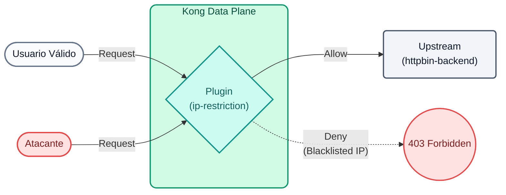
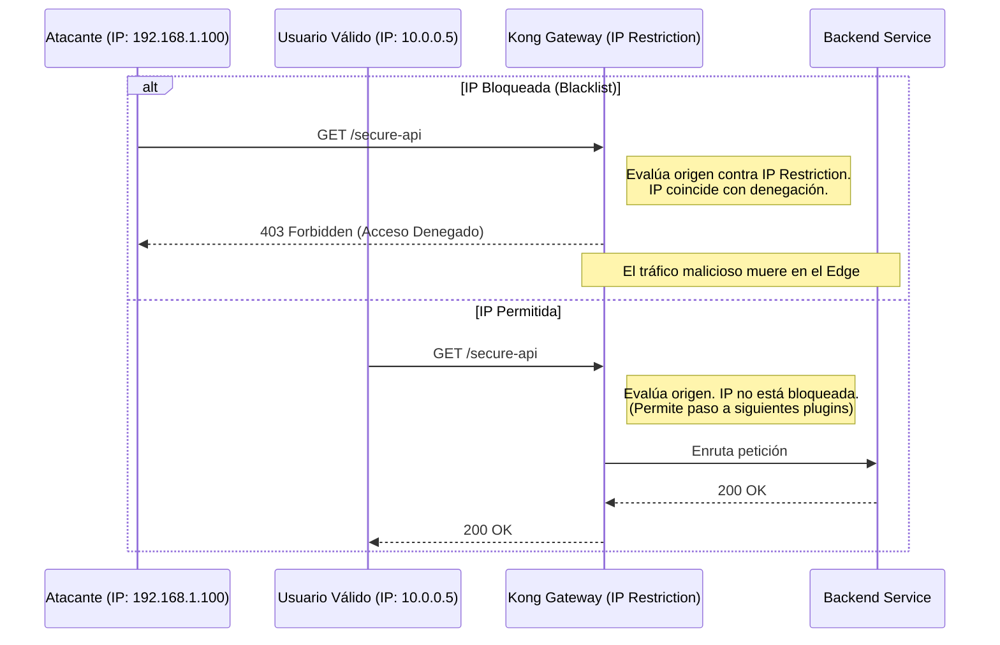

# Laboratorio 09: Restricción de IP

En este laboratorio vamos a proteger una API a nivel de red (capa 3/4) utilizando el plugin `ip-restriction`, asegurándonos de que solo direcciones específicas puedan consumir los servicios de back-office.



## Objetivos

- Configurar una lista blanca (whitelist) de IPs permitidas.
- Usar interpolación de variables de entorno en archivos de decK.


### Defensa en Profundidad (Defense in Depth)
La seguridad informática moderna no depende de un solo muro, sino de múltiples capas defensivas. La **restricción por IP (Capas 3 y 4 del modelo OSI)** es una de las defensas de primera línea más efectivas y baratas computacionalmente.

Antes de que Kong desperdicie CPU verificando firmas criptográficas de tokens JWT o evaluando reglas complejas de ruteo, el plugin de **IP Restriction** puede descartar tráfico de inmediato si proviene de:
- Direcciones IP maliciosas conocidas (Blacklisting).
- Geografías o rangos CIDR no autorizados.
- Peticiones que no provienen de la intranet corporativa (Whitelisting).

### Flujo de Restricción de IP (Sequence Diagram)




---

## Paso 1: Configurar la Restricción

Imagina que tenemos un endpoint de reportes internos que solo debe ser accesible desde la red corporativa.

Abre el archivo `lab_09_1.yaml` ubicado en la carpeta `workshop-assets/dia-2` y analiza su contenido:

```yaml
_format_version: "3.0"
services:
 - name: mock-internal-reports
  url: http://httpbin-backend:9081/anything/reports
  routes:
   - name: internal-reports-route
    paths: 
     - /api/internal/reports
    plugins:
     - name: ip-restriction
      config:
       allow:
        - 127.0.0.1
 # decK permite interpolar variables de entorno de tu máquina local
         - ${{ env "DECK_DOCKER_HOST_IP" }}
```

**Puntos Clave:**

- **Plugin `ip-restriction`:** Este plugin de capa de red bloquea todo el tráfico por defecto (comportamiento de `allow` explícito). Solamente las IPs listadas (en este caso, localhost y la IP de host del entorno Docker) podrán llegar al servicio `mock-internal-reports`.
- **Interpolación en decK:** Usar `${{ env "VARIABLE" }}` permite evitar quemar IPs estáticas o secretos en los archivos YAML, favoreciendo la portabilidad entre entornos (Dev, QA, Prod).

## Paso 2: Aplicar y Probar Bloqueo (Atacante Externo)
Exportaremos la variable de entorno necesaria, sincronizaremos y luego simularemos ser un usuario de una red externa usando el header `X-Real-Ip`.

```bash
export DECK_DOCKER_HOST_IP="192.168.65.1" && \
deck gateway sync lab_09_1.yaml && \
echo "Esperando 15s para que Konnect actualice el Data Plane..." && sleep 15 && \
curl -s -D /dev/stderr -H "X-Real-Ip: 200.150.10.20" http://localhost:8000/api/internal/reports 
```

**Analizando el resultado:**

- Observa la respuesta HTTP: Obtendrás un rotundo `403 Forbidden`.
- Kong ha interceptado el tráfico devolviendo el JSON `{"message":"Your IP address is not allowed"}`.
- Aunque el atacante conozca la ruta secreta de los reportes, la capa de red del Gateway lo detuvo en milisegundos.

## Paso 3: Probar Acceso Válido (Red Interna)
Ahora lanzaremos la petición simulando ser tráfico que proviene genuinamente de nuestra máquina local (o del host de Docker), que está explícitamente en la lista blanca de Kong.

```bash
curl -s -D /dev/stderr http://localhost:8000/api/internal/reports 
```

**Para Windows (CMD):**
```cmd
curl -s -D /dev/stderr http://localhost:8000/api/internal/reports 
```

**Analizando el resultado:**

- El código HTTP ahora será `200 OK`.
- El payload atravesó exitosamente el Firewall L4 implementado por Kong, y el backend de `httpbin` devolvió la información solicitada.

---
## Conclusión
Hemos establecido un perímetro de defensa duro a nivel del Gateway sin tener que manipular los Security Groups del Cloud o los Firewalls internos del sistema operativo de los nodos, configurando todo de manera declarativa con decK.
