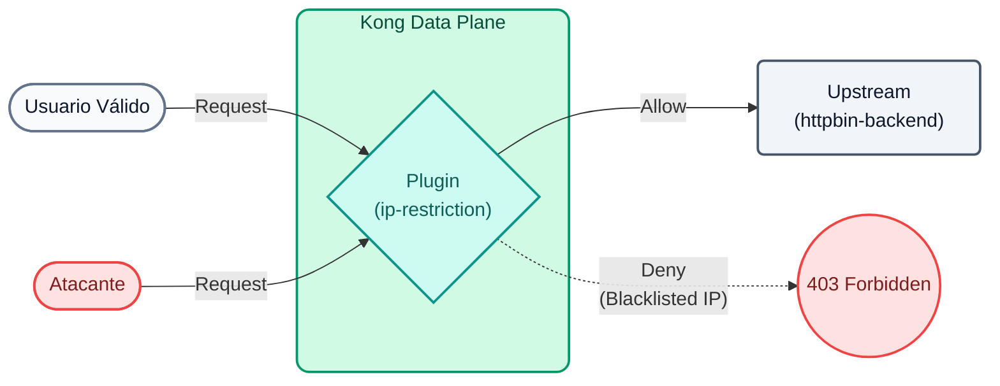
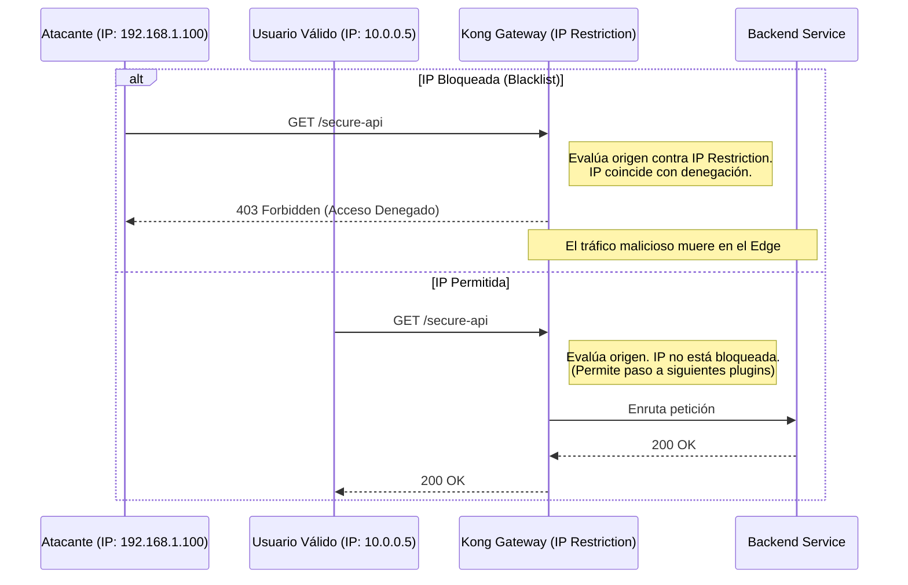

# Laboratório 09: Restrição de IP

Neste laboratório vamos proteger uma API no nível da rede (camada 3/4) usando o plugin `ip-restriction`, garantindo que apenas endereços específicos possam consumir serviços de back-office.


## Objetivos

- Configure uma lista branca de IPs permitidos.
- Utilize interpolação de variáveis ​​de ambiente em arquivos de deck.


### Defesa em profundidade
A cibersegurança moderna não depende de um único muro, mas de múltiplas camadas defensivas. **A restrição de IP (camadas 3 e 4 do modelo OSI)** é uma das defesas de primeira linha mais eficazes e computacionalmente mais baratas.

Antes que Kong desperdice CPU verificando assinaturas criptográficas de tokens JWT ou avaliando regras de roteamento complexas, o plug-in **Restrição de IP** pode descartar imediatamente o tráfego se ele vier de:
- Endereços IP maliciosos conhecidos (lista negra).
- Geografias não autorizadas ou intervalos CIDR.
- Solicitações que não vêm da intranet corporativa (Whitelisting).

### Fluxo de restrição de IP (diagrama de sequência)


---

## Etapa 1: Configurar restrição

Imagine que temos um endpoint de relatórios internos que só deveria ser acessível na rede corporativa.

Abra o arquivo `lab_09_1.yaml` localizado na pasta `workshop-assets/dia-2` e analise seu conteúdo:

```yaml
_format_version: "3.0"
services:
 - name: mock-internal-reports
  url: http://httpbin-backend:9081/anything/reports
  routes:
   - name: internal-reports-route
    paths: 
     - /api/internal/reports
    plugins:
     - name: ip-restriction
      config:
       allow:
        - 127.0.0.1
 # decK permite interpolar variables de entorno de tu máquina local
         - ${{ env "DECK_DOCKER_HOST_IP" }}
```
**Pontos-chave:**

- **plugin `ip-restriction`:** Este plugin da camada de rede bloqueia todo o tráfego por padrão (comportamento `allow` explícito). Somente os IPs listados (neste caso, localhost e o IP do host do ambiente Docker) poderão acessar o serviço `mock-internal-reports`.
- **Interpolação no deck:** Usar `${{ env "VARIABLE" }}` permite evitar a queima de IPs estáticos ou segredos em arquivos YAML, favorecendo a portabilidade entre ambientes (Dev, QA, Prod).

## Etapa 2: Aplicar e testar bloco (atacante externo)
Exportaremos a variável de ambiente necessária, sincronizaremos e então fingiremos ser um usuário em uma rede externa usando o cabeçalho `X-Real-Ip`.

```bash
export DECK_DOCKER_HOST_IP="192.168.65.1" && \
deck gateway sync lab_09_1.yaml && \
echo "Esperando 15s para que Konnect actualice el Data Plane..." && sleep 15 && \
curl -s -D /dev/stderr -H "X-Real-Ip: 200.150.10.20" http://localhost:8000/api/internal/reports 
```
**Analisando o resultado:**

- Observe a resposta HTTP: você receberá um retumbante `403 Forbidden`.
- Kong interceptou o tráfego retornando o JSON `{"message":"Seu endereço IP não é permitido"}`.
- Mesmo que o invasor conhecesse a rota secreta dos relatórios, a camada de rede do Gateway o deteve em milissegundos.

## Etapa 3: testar o acesso válido (rede interna)
Agora lançaremos a solicitação fingindo ser tráfego genuinamente proveniente de nossa máquina local (ou host Docker), que está explicitamente na lista de permissões do Kong.

```bash
curl -s -D /dev/stderr http://localhost:8000/api/internal/reports 
```
**Para Windows (CMD):**

```cmd
curl -s -D /dev/stderr http://localhost:8000/api/internal/reports 
```
**Analisando o resultado:**

- O código HTTP agora será `200 OK`.
- A carga passou com sucesso pelo Firewall L4 implementado pelo Kong, e o backend `httpbin` retornou as informações solicitadas.

---
## Conclusão
Estabelecemos um perímetro de defesa rígido ao nível do Gateway sem ter que manipular os Cloud Security Groups ou os Firewalls internos do sistema operativo dos nós, configurando tudo de forma declarativa com o deck.
