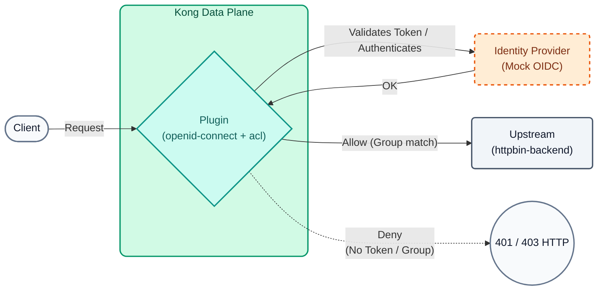
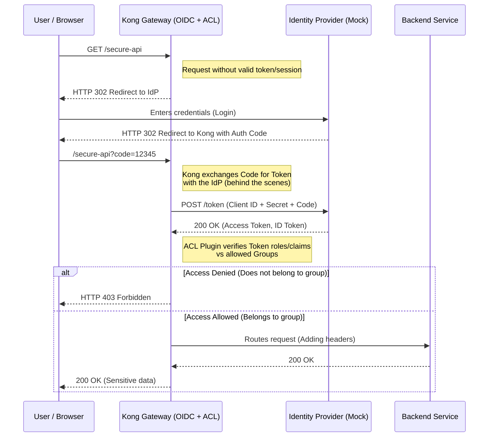

# Lab 10: Advanced Authentication (OIDC) and Authorization (ACL)

In this lab, we will make the leap to enterprise identity. We will replace static tokens with the **OpenID Connect (OIDC)** standard using Kong Konnect's native Identity Provider (Application Auth).



## Objectives

- Configure the Enterprise `openid-connect` plugin in Resource Server mode.
- Integrate validation with the Kong Konnect issuer.
- Combine OIDC with Access Control Lists (ACL) for security routing.

### Authentication vs Authorization
It is crucial to understand the difference between these two concepts:
- **Authentication (OIDC):** Answering the question *"Who are you?"*. For this, we will delegate responsibility to a modern Identity Provider (IdP) using the **Authorization Code** flow of OpenID Connect. The Gateway acts as a "Relying Party" (Client), redirecting users to the IdP to log in.
- **Authorization (ACL):** Answering the question *"What are you allowed to do?"*. Once we know who the user is (via JWT or session token), Kong (through its ACL plugin) verifies if that user belongs to the appropriate group (e.g., "admin" or "premium") before allowing the request to pass to the backend.

### OIDC and ACL Flow (Sequence Diagram)



---

## Step 1: Configure OIDC and ACL

We want the `/api/v1/echo` path to require a valid Access Token issued by Konnect and also for the user (or application) to belong to the `partners-vip` group.

Open the `lab_10_1.yaml` file located in the `workshop-assets/dia-2` folder and analyze its content:

```yaml
_format_version: "3.0"
services:
 - name: mock-echo-secure
  url: http://httpbin-backend:9081/anything/echo
  routes:
   - name: echo-secure-route
    paths: 
     - /api/v1/echo
  plugins:
   - name: openid-connect
    config:
     issuer: ${{ env "DECK_KONNECT_AUTH_ISSUER" }}
     auth_methods:
      - bearer
     consumer_claim:
      - sub
     cache_tokens_salt: ${{ env "DECK_KONNECT_AUTH_CLIENT_ID" }}
     session_secret: ${{ env "DECK_KONNECT_AUTH_CLIENT_SECRET" }}
     ssl_verify: true
   - name: acl
    config:
     allow:
      - partners-vip

consumers:
 - username: app-b2b
  custom_id: ${{ env "DECK_KONNECT_AUTH_CLIENT_ID" }}
  acls:
   - group: partners-vip
# Note: Credential validation is done by the OIDC plugin against the Issuer.
# Kong will automatically link the validated token to this Consumer if the claims match.
```

**Key Points:**

- **`openid-connect` Plugin:** Delegates all identity validation to an external provider (in this case, Konnect). Kong will intercept the request, validate the JWT Bearer's signature and validity against the `issuer`, and only if valid, will allow it to pass to the backend.
- **`auth_methods: bearer`:** We specify that we will only accept tokens injected via the `Authorization: Bearer <token>` header.
- **`consumer_claim: sub`:** We instruct Kong to automatically assign this request to the consumer whose username matches the `sub` claim of the JWT token, allowing the IdP identity to be linked with Kong's Rate Limiting or metrics.
- **ACLs & Consumers:** In addition to validating the JWT, the `acl` plugin ensures that the consumer (which was matched via `sub`) belongs to the `partners-vip` group.

To apply these policies to your environment, run the following command (you will notice that we inject Konnect's environment variables):

```bash
export DECK_KONNECT_AUTH_ISSUER=http://mock-oidc:8081/default
export DECK_KONNECT_AUTH_CLIENT_ID=mock-client-id
export DECK_KONNECT_AUTH_CLIENT_SECRET=mock-client-secret

deck gateway sync lab_10_1.yaml && \
echo "Waiting 15s for Konnect to update the Data Plane..." && sleep 15
```

## Step 2: Test Rejection (Anonymous Access)
Let's try to access without presenting any JWT token.

```bash
curl -s -D /dev/stderr http://localhost:8000/api/v1/echo 
```

**For Windows (CMD):**
```cmd
curl -s -D /dev/stderr http://localhost:8000/api/v1/echo 
```

**Analyzing the result:**

- The HTTP code will be `401 Unauthorized`.
- Kong detects that the Bearer token is missing (the OIDC flow cannot be initiated for this API route).

## Step 3: Test Successful Flow with JWT Token
Unlike Lab 08, where we used a pre-signed static token, in a real OIDC environment, tokens have a short lifespan (expire quickly) and must be dynamically requested from the authorization server (Identity Provider or IdP).

We will break down this process into three sub-steps to understand exactly what happens behind the scenes in a B2B (machine-to-machine) integration.

### Step 3.1: Prepare the Identity Provider URL
First, we need to know which URL to request the token from. In the Konnect environment, the Issuer exposes a `/token` endpoint. Since we are running part of this lab in local Docker containers, we will execute a small adjustment to ensure our `curl` command points to the correct location:

### Step 3.2: Request the Token from the IdP (Client Credentials Flow)
In a backend-to-backend integration, there is no human user typing passwords. The **Client Credentials** flow of OAuth2/OIDC is used.

We will send our IdP the `client_id` and `client_secret` of our application. In return, if the credentials are valid, the IdP will return a JWT (Access Token).

```bash
if [[ "$DECK_KONNECT_AUTH_ISSUER" == *"mock-oidc"* ]]; then
  export LOCAL_TOKEN_URL="${DECK_KONNECT_AUTH_ISSUER/mock-oidc/localhost}/token"
  export ACCESS_TOKEN=$(curl -s -X POST "$LOCAL_TOKEN_URL" -H "Host: mock-oidc:8081" -H "Content-Type: application/x-www-form-urlencoded" -d "client_id=${DECK_KONNECT_AUTH_CLIENT_ID}" -d "client_secret=${DECK_KONNECT_AUTH_CLIENT_SECRET}" -d "grant_type=client_credentials" | jq -r .access_token)
else
  export LOCAL_TOKEN_URL="${DECK_KONNECT_AUTH_ISSUER}/token"
  export ACCESS_TOKEN=$(curl -s -X POST "$LOCAL_TOKEN_URL" -H "Content-Type: application/x-www-form-urlencoded" -d "client_id=${DECK_KONNECT_AUTH_CLIENT_ID}" -d "client_secret=${DECK_KONNECT_AUTH_CLIENT_SECRET}" -d "grant_type=client_credentials" | jq -r .access_token)
fi

echo "Token obtained successfully!"
echo "$ACCESS_TOKEN"
```
*(Note: The `jq -r .access_token` command at the end simply extracts the token string from the JSON response to cleanly save it in the `ACCESS_TOKEN` variable).*

### Step 3.3: Call the API using the Bearer Token
Now that our application has a fresh and valid token, we can finally make the business call to Kong, injecting the token into the `Authorization` header.

```bash
curl -s -D /dev/stderr http://localhost:8000/api/v1/echo \
 -H "Authorization: Bearer $ACCESS_TOKEN" 
```

**For Windows (CMD):**
```cmd
curl -s -D /dev/stderr http://localhost:8000/api/v1/echo ^
 -H "Authorization: Bearer $ACCESS_TOKEN" 
```

**Analyzing the result:**

- The HTTP code will now be `200 OK`.
- Kong received the token, contacted the `issuer` (locally cached) to validate its cryptography (RS256 signature) and validated that the `sub` claim matched a Consumer that in turn has the `partners-vip` ACL group. All without programming a single line of code in your application.

---
## Conclusion
You have implemented the Enterprise OIDC plugin. Kong dynamically validates tokens against Konnect's native identity repository without the need to install a third-party Identity Provider (IdP). This allows you to manage the complete lifecycle of developers and applications from a single location.