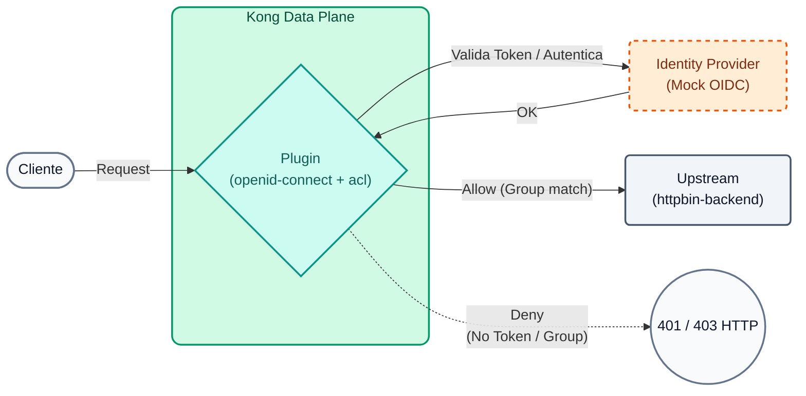
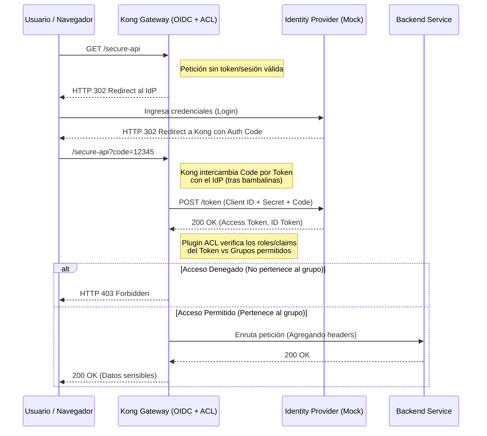

# Laboratorio 10: Autenticación Avanzada (OIDC) y Autorización (ACL)

En este laboratorio daremos el salto hacia la identidad empresarial. Reemplazaremos los tokens estáticos por el estándar **OpenID Connect (OIDC)** utilizando el Identity Provider nativo (Application Auth) de Kong Konnect.




## Objetivos

- Configurar el plugin Enterprise `openid-connect` en modo Resource Server.
- Integrar la validación con el emisor (Issuer) de Kong Konnect.
- Combinar OIDC con listas de control de acceso (ACL) para ruteo de seguridad.


### Autenticación vs Autorización
Es crucial entender la diferencia entre estos dos conceptos:
- **Autenticación (Authentication - OIDC):** Responder a la pregunta *"¿Quién eres?"*. Para esto delegaremos la responsabilidad a un Proveedor de Identidad (IdP) moderno utilizando el flujo **Authorization Code** de OpenID Connect. El Gateway actúa como "Relying Party" (Cliente), redirigiendo a los usuarios al IdP para que inicien sesión.
- **Autorización (Authorization - ACL):** Responder a la pregunta *"¿Qué tienes permitido hacer?"*. Una vez que sabemos quién es el usuario (vía JWT o token de sesión), Kong (mediante su plugin ACL) verifica si ese usuario pertenece al grupo adecuado (ej. "admin" o "premium") antes de dejar pasar la petición al backend.

### Flujo OIDC y ACL (Sequence Diagram)




---

## Paso 1: Configurar OIDC y ACL

Queremos que el path `/api/v1/echo` requiera un Access Token válido emitido por Konnect y además que el usuario (o aplicación) pertenezca al grupo `partners-vip`.

Abre el archivo `lab_10_1.yaml` ubicado en la carpeta `workshop-assets/dia-2` y analiza su contenido:

```yaml
_format_version: "3.0"
services:
 - name: mock-echo-secure
  url: http://httpbin-backend:9081/anything/echo
  routes:
   - name: echo-secure-route
    paths: 
     - /api/v1/echo
  plugins:
   - name: openid-connect
    config:
     issuer: ${{ env "DECK_KONNECT_AUTH_ISSUER" }}
     auth_methods:
      - bearer
     consumer_claim:
      - sub
     cache_tokens_salt: ${{ env "DECK_KONNECT_AUTH_CLIENT_ID" }}
     session_secret: ${{ env "DECK_KONNECT_AUTH_CLIENT_SECRET" }}
     ssl_verify: true
   - name: acl
    config:
     allow:
      - partners-vip

consumers:
 - username: app-b2b
  custom_id: ${{ env "DECK_KONNECT_AUTH_CLIENT_ID" }}
  acls:
   - group: partners-vip
# Nota: La validación de credenciales la hace el plugin OIDC contra el Issuer.
# Kong enlazará automáticamente el token validado con este Consumer si los claims coinciden.
```

**Puntos Clave:**

- **Plugin `openid-connect`:** Delega toda la validación de identidad a un proveedor externo (en este caso Konnect). Kong interceptará la petición, validará la firma y vigencia del JWT Bearer contra el `issuer`, y solo si es válido permitirá el paso al backend.
- **`auth_methods: bearer`:** Especificamos que solo aceptaremos tokens inyectados vía cabecera `Authorization: Bearer <token>`.
- **`consumer_claim: sub`:** Instruimos a Kong para que asigne automáticamente esta petición al consumidor cuyo username coincida con el claim `sub` del token JWT, permitiendo enlazar la identidad del IDP con el Rate Limiting o métricas de Kong.
- **ACLs & Consumers:** Además de validar el JWT, el plugin `acl` asegura que el consumidor (que fue matcheado vía `sub`) pertenezca al grupo `partners-vip`.

Para aplicar estas políticas a tu entorno, ejecuta el siguiente comando (notarás que inyectamos las variables de entorno de Konnect):

```bash
export DECK_KONNECT_AUTH_ISSUER=http://mock-oidc:8081/default
export DECK_KONNECT_AUTH_CLIENT_ID=mock-client-id
export DECK_KONNECT_AUTH_CLIENT_SECRET=mock-client-secret

deck gateway sync lab_10_1.yaml && \
echo "Esperando 15s para que Konnect actualice el Data Plane..." && sleep 15
```

## Paso 2: Probar Rechazo (Acceso Anónimo)
Vamos a intentar acceder sin presentar ningún token JWT.

```bash
curl -s -D /dev/stderr http://localhost:8000/api/v1/echo 
```

**Para Windows (CMD):**
```cmd
curl -s -D /dev/stderr http://localhost:8000/api/v1/echo 
```

**Analizando el resultado:**

- El código HTTP será `401 Unauthorized`.
- Kong detecta que falta el Bearer token (no se puede iniciar el flujo OIDC para esta ruta de API).

## Paso 3: Probar Flujo Exitoso con Token JWT
A diferencia del Laboratorio 08, donde usamos un token estático pre-firmado, en un entorno OIDC real los tokens tienen una vida útil corta (expiran rápidamente) y deben solicitarse dinámicamente al servidor de autorización (Identity Provider o IdP).

Vamos a desglosar este proceso en tres sub-pasos para entender exactamente qué ocurre tras bambalinas en una integración B2B (máquina a máquina).

### Paso 3.1: Preparar la URL del Identity Provider
Primero, necesitamos saber a qué URL pedirle el token. En el entorno de Konnect, el Issuer expone un endpoint `/token`. Como estamos corriendo parte de este laboratorio en contenedores locales de Docker, ejecutaremos un pequeño ajuste para asegurar que nuestro comando `curl` apunte al lugar correcto:

### Paso 3.2: Solicitar el Token al IdP (Flujo Client Credentials)
En una integración de backend a backend, no hay un usuario humano escribiendo contraseñas. Se utiliza el flujo **Client Credentials** de OAuth2/OIDC. 

Vamos a enviarle a nuestro IdP el `client_id` y `client_secret` de nuestra aplicación. A cambio, si las credenciales son válidas, el IdP nos devolverá un JWT (Access Token).

```bash
if [[ "$DECK_KONNECT_AUTH_ISSUER" == *"mock-oidc"* ]]; then
  export LOCAL_TOKEN_URL="${DECK_KONNECT_AUTH_ISSUER/mock-oidc/localhost}/token"
  export ACCESS_TOKEN=$(curl -s -X POST "$LOCAL_TOKEN_URL" -H "Host: mock-oidc:8081" -H "Content-Type: application/x-www-form-urlencoded" -d "client_id=${DECK_KONNECT_AUTH_CLIENT_ID}" -d "client_secret=${DECK_KONNECT_AUTH_CLIENT_SECRET}" -d "grant_type=client_credentials" | jq -r .access_token)
else
  export LOCAL_TOKEN_URL="${DECK_KONNECT_AUTH_ISSUER}/token"
  export ACCESS_TOKEN=$(curl -s -X POST "$LOCAL_TOKEN_URL" -H "Content-Type: application/x-www-form-urlencoded" -d "client_id=${DECK_KONNECT_AUTH_CLIENT_ID}" -d "client_secret=${DECK_KONNECT_AUTH_CLIENT_SECRET}" -d "grant_type=client_credentials" | jq -r .access_token)
fi

echo "¡Token obtenido con éxito!"
echo "$ACCESS_TOKEN"
```
*(Nota: El comando `jq -r .access_token` al final simplemente extrae el string del token de la respuesta JSON para guardarlo limpiamente en la variable `ACCESS_TOKEN`).*

### Paso 3.3: Llamar a la API usando el Token Bearer
Ahora que nuestra aplicación tiene un token fresco y válido, finalmente podemos hacer la llamada de negocio a Kong, inyectando el token en el header `Authorization`.

```bash
curl -s -D /dev/stderr http://localhost:8000/api/v1/echo \
 -H "Authorization: Bearer $ACCESS_TOKEN" 
```

**Para Windows (CMD):**
```cmd
curl -s -D /dev/stderr http://localhost:8000/api/v1/echo ^
 -H "Authorization: Bearer $ACCESS_TOKEN" 
```

**Analizando el resultado:**

- El código HTTP ahora será `200 OK`.
- Kong recibió el token, contactó al `issuer` (localmente en caché) para validar su criptografía (firma RS256) y validó que el claim `sub` matcheara con un Consumer que a su vez tiene el grupo ACL `partners-vip`. Todo sin programar una sola línea de código en tu aplicación.

---
## Conclusión
Has implementado el plugin Enterprise OIDC. Kong valida dinámicamente los tokens contra el repositorio de identidad nativo de Konnect sin necesidad de instalar un Identity Provider (IdP) de terceros. Esto te permite gestionar el ciclo de vida completo de desarrolladores y aplicaciones desde un solo lugar.
