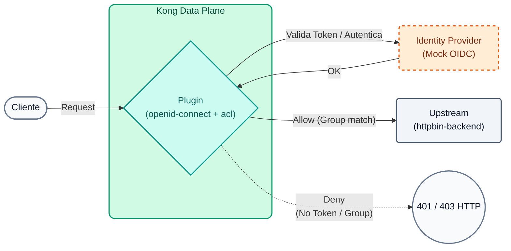
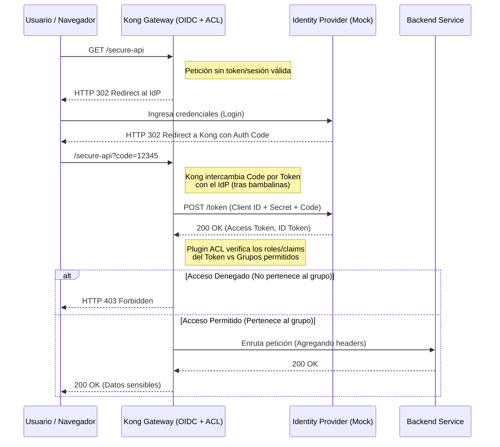

# Laboratório 10: Autenticação Avançada (OIDC) e Autorização (ACL)

Neste laboratório daremos o salto em direção à identidade empresarial. Substituiremos os tokens estáticos pelo padrão **OpenID Connect (OIDC)** usando o provedor de identidade nativo (Application Auth) do Kong Konnect.


## Objetivos

- Configure o plugin Enterprise `openid-connect` no modo Resource Server.
- Integrar a validação com o Emissor Kong Konnect.
- Combine OIDC com listas de controle de acesso (ACL) para roteamento de segurança.


### Autenticação vs Autorização
É crucial entender a diferença entre esses dois conceitos:
- **Autenticação (Autenticação - OIDC):** Responda a pergunta *"Quem é você?"*. Para isso, delegaremos a responsabilidade a um provedor de identidade (IdP) moderno usando o fluxo **Código de Autorização** do OpenID Connect. O Gateway atua como uma “Parte Confiante”, redirecionando os usuários ao IdP para efetuar login.
- **Autorização (ACL):** Responda à pergunta *"O que você tem permissão para fazer?"*. Depois de sabermos quem é o usuário (via JWT ou token de sessão), Kong (por meio de seu plugin ACL) verifica se esse usuário pertence ao grupo apropriado (por exemplo, "admin" ou "premium") antes de passar a solicitação para o backend.

### Fluxo OIDC e ACL (diagrama de sequência)


---

## Etapa 1: Configurar OIDC e ACL

Queremos que o caminho `/api/v1/echo` exija um Access Token válido emitido pelo Konnect e também que o usuário (ou aplicação) pertença ao grupo `partners-vip`.

Abra o arquivo `lab_10_1.yaml` localizado na pasta `workshop-assets/dia-2` e analise seu conteúdo:

```yaml
_format_version: "3.0"
services:
 - name: mock-echo-secure
  url: http://httpbin-backend:9081/anything/echo
  routes:
   - name: echo-secure-route
    paths: 
     - /api/v1/echo
  plugins:
   - name: openid-connect
    config:
     issuer: ${{ env "DECK_KONNECT_AUTH_ISSUER" }}
     auth_methods:
      - bearer
     consumer_claim:
      - sub
     cache_tokens_salt: ${{ env "DECK_KONNECT_AUTH_CLIENT_ID" }}
     session_secret: ${{ env "DECK_KONNECT_AUTH_CLIENT_SECRET" }}
     ssl_verify: true
   - name: acl
    config:
     allow:
      - partners-vip

consumers:
 - username: app-b2b
  custom_id: ${{ env "DECK_KONNECT_AUTH_CLIENT_ID" }}
  acls:
   - group: partners-vip
# Nota: La validación de credenciales la hace el plugin OIDC contra el Issuer.
# Kong enlazará automáticamente el token validado con este Consumer si los claims coinciden.
```
**Pontos-chave:**

- **Plugin `openid-connect`:** Delega toda validação de identidade a um provedor externo (neste caso Konnect). Kong irá interceptar a solicitação, validar a assinatura e validade do JWT Bearer contra o `emissor`, e somente se for válido permitirá que ela passe para o backend.
- **`auth_methods: bearer`:** Especificamos que aceitaremos apenas tokens injetados através do cabeçalho `Authorization: Bearer <token>`.
- **`consumer_claim: sub`:** Instruímos Kong a atribuir automaticamente esta solicitação ao consumidor cujo nome de usuário corresponde à reivindicação `sub` do token JWT, permitindo que a identidade do IDP seja vinculada ao Rate Limiting ou às métricas Kong.
- **ACLs e Consumidores:** Além de validar o JWT, o plugin `acl` garante que o consumidor (que foi correspondido via `sub`) pertence ao grupo `partners-vip`.

Para aplicar essas políticas ao seu ambiente, execute o seguinte comando (você notará que injetamos as variáveis ​​de ambiente do Konnect):

```bash
export DECK_KONNECT_AUTH_ISSUER=http://mock-oidc:8081/default
export DECK_KONNECT_AUTH_CLIENT_ID=mock-client-id
export DECK_KONNECT_AUTH_CLIENT_SECRET=mock-client-secret

deck gateway sync lab_10_1.yaml && \
echo "Esperando 15s para que Konnect actualice el Data Plane..." && sleep 15
```
## Etapa 2: Rejeição do teste (acesso anônimo)
Vamos tentar acessar sem apresentar nenhum token JWT.

```bash
curl -s -D /dev/stderr http://localhost:8000/api/v1/echo 
```
**Para Windows (CMD):**

```cmd
curl -s -D /dev/stderr http://localhost:8000/api/v1/echo 
```
**Analisando o resultado:**

- O código HTTP será `401 Não Autorizado`.
- Kong detecta que o token Bearer está faltando (não é possível iniciar o fluxo OIDC para esta rota API).

## Etapa 3: teste o fluxo bem-sucedido com token JWT
Ao contrário do Laboratório 08, onde usamos um token estático pré-assinado, em um ambiente OIDC real os tokens têm vida útil curta (expiram rapidamente) e devem ser solicitados dinamicamente ao servidor de autorização (Provedor de Identidade ou IdP).

Vamos dividir esse processo em três subetapas para entender exatamente o que acontece nos bastidores de uma integração B2B (máquina a máquina).

### Etapa 3.1: Preparar o URL do provedor de identidade
Primeiro, precisamos saber qual URL solicitar o token. No ambiente Konnect, o Emissor expõe um endpoint `/token`. Como estamos executando parte deste laboratório em contêineres Docker locais, faremos alguns ajustes para garantir que nosso comando `curl` aponte para o lugar certo:

### Etapa 3.2: Solicitar o token do IdP (fluxo de credenciais do cliente)
Em uma integração backend a backend, não há usuário humano digitando senhas. O fluxo OAuth2/OIDC **Credenciais de cliente** é usado. 

Enviaremos ao nosso IdP o `client_id` e `client_secret` da nossa aplicação. Em troca, se as credenciais forem válidas, o IdP retornará um JWT (Access Token).

```bash
if [[ "$DECK_KONNECT_AUTH_ISSUER" == *"mock-oidc"* ]]; then
  export LOCAL_TOKEN_URL="${DECK_KONNECT_AUTH_ISSUER/mock-oidc/localhost}/token"
  export ACCESS_TOKEN=$(curl -s -X POST "$LOCAL_TOKEN_URL" -H "Host: mock-oidc:8081" -H "Content-Type: application/x-www-form-urlencoded" -d "client_id=${DECK_KONNECT_AUTH_CLIENT_ID}" -d "client_secret=${DECK_KONNECT_AUTH_CLIENT_SECRET}" -d "grant_type=client_credentials" | jq -r .access_token)
else
  export LOCAL_TOKEN_URL="${DECK_KONNECT_AUTH_ISSUER}/token"
  export ACCESS_TOKEN=$(curl -s -X POST "$LOCAL_TOKEN_URL" -H "Content-Type: application/x-www-form-urlencoded" -d "client_id=${DECK_KONNECT_AUTH_CLIENT_ID}" -d "client_secret=${DECK_KONNECT_AUTH_CLIENT_SECRET}" -d "grant_type=client_credentials" | jq -r .access_token)
fi

echo "¡Token obtenido con éxito!"
echo "$ACCESS_TOKEN"
```
*(Nota: O comando `jq -r .access_token` no final simplesmente extrai a string do token da resposta JSON para armazená-la de forma limpa na variável `ACCESS_TOKEN`).*

### Etapa 3.3: Chame a API usando o Token Bearer
Agora que nosso aplicativo tem um token novo e válido, podemos finalmente fazer a chamada comercial para Kong, injetando o token no cabeçalho `Authorization`.

```bash
curl -s -D /dev/stderr http://localhost:8000/api/v1/echo \
 -H "Authorization: Bearer $ACCESS_TOKEN" 
```
**Para Windows (CMD):**

```cmd
curl -s -D /dev/stderr http://localhost:8000/api/v1/echo ^
 -H "Authorization: Bearer $ACCESS_TOKEN" 
```
**Analisando o resultado:**

- O código HTTP agora será `200 OK`.
- Kong recebeu o token, contatou o `emissor` (armazenado em cache localmente) para validar sua criptografia (assinatura RS256) e validou que a reivindicação `sub` correspondia a um Consumidor que por sua vez possui o grupo ACL `partners-vip`. Tudo sem programar uma única linha de código na sua aplicação.

---
## Conclusão
Você implementou o plug-in Enterprise OIDC. Kong valida tokens dinamicamente no repositório de identidade nativo do Konnect sem a necessidade de instalar um provedor de identidade (IdP) de terceiros. Isso permite que você gerencie todo o ciclo de vida do desenvolvedor e do aplicativo em um só lugar.
