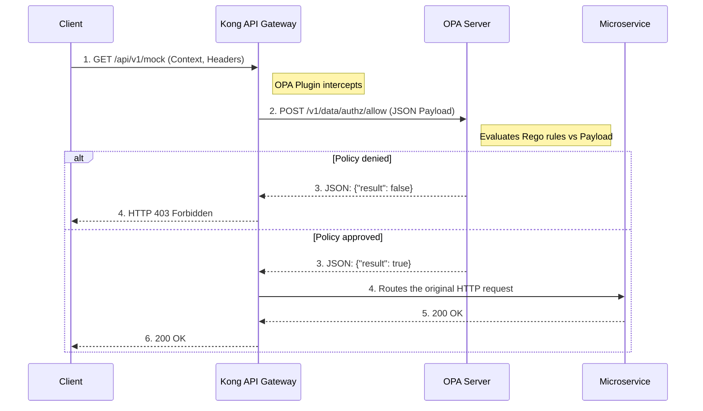

# Lab 11: Open Policy Agent (OPA)

### What is OPA?
**Open Policy Agent (OPA)** is an open-source, general-purpose policy engine. In modern architectures (Cloud Native), it's common to adopt the **Policy as Code** paradigm.
Instead of programming authorization logic (e.g., *"user X has permission Y only during business hours"*) within each microservice, you centralize all those rules in OPA using its declarative language called **Rego**.

Kong integrates elegantly with OPA: when a request arrives, Kong pauses execution, packages the HTTP context (headers, body, method, path) into a large JSON object, and queries OPA. OPA evaluates its `.rego` rules and responds to Kong, deciding the request's fate in real-time.

### Sequence Diagram (Authorization Flow)



## Objectives

- Understand the integration between Kong and OPA.
- Configure the `opa` plugin on a Kong service.
- Validate how Kong delegates access decisions to policies defined on the external OPA server.

---

## Step 1: Configure OPA and Enable the Plugin

In our local lab environment, we already have an OPA server running (as a Docker container on port `8181`). When starting this environment, we automatically inject a configuration file called `policy.rego` directly into OPA's memory.

For this lab, we will simulate attribute-based access control (ABAC), where the policy requires the consumer to present the explicit `admin` role to proceed.

Look at the exact source code of the `policy.rego` policy currently running on your server:

```rego
package authz

import rego.v1

default allow := false

allow if {
    input.request.http.headers["x-role"] == "admin"
}
```

**Policy Explanation:**

- **`package authz`**: Defines the logical namespace. This will dictate the REST API path where Kong will query OPA (`/v1/data/authz/...`).
- **`default allow := false`**: The core of **Zero Trust**. By default, if no rule is explicitly met, the gate remains closed.
- **`allow if { ... }`**: The rule becomes true *only* if, within the JSON object sent by Kong (`input.request.http`), the `headers` contain the key `x-role` with the exact value `"admin"`.

Open the `lab_11_1.yaml` file located in the `workshop-assets/dia-2` folder and analyze its content:

```yaml
_format_version: "3.0"
services:
 - name: mock-service
  host: mock-upstream
  path: /
  protocol: http
  plugins:
   - name: opa
    config:
     opa_host: opa
     opa_port: 8181
     opa_path: /v1/data/authz_advanced/allow
  routes:
   - name: mock-route
    paths:
     - /api/v1/mock
```

**Key Points:**

- **`opa` Plugin:** Instructs Kong that, before routing the request to the `mock-service`, it must query the OPA server (in this case hosted at `opa:8181`).
- **`opa_path: /v1/data/authz_advanced/allow`:** This is the OPA engine endpoint where we will inject our advanced policy. Kong will pass the request context (headers, method, path) to OPA and expect an `allow = true` response. If OPA says no, Kong aborts and returns a 403.

To apply this configuration to your environment, run the following command:

```bash
deck gateway sync lab_11_1.yaml && \
echo "Waiting 15s for Konnect to update the Data Plane..." && sleep 15
```

## Step 2: Test the Static Policy (Denial and Approval)

Before proceeding, let's verify that the default static policy is working.

First, let's try to make a request without providing any context that identifies you as an administrator.
```bash
curl -s -D /dev/stderr http://localhost:8000/api/v1/mock 
```

**For Windows (CMD):**
```cmd
curl -s -D /dev/stderr http://localhost:8000/api/v1/mock 
```
The HTTP code will be `403 Forbidden` because you did not send the required header. OPA returned `false`.

Now, let's simulate injecting the required claim (the `x-role: admin` header):
```bash
curl -s -D /dev/stderr -H "x-role: admin" http://localhost:8000/api/v1/mock 
```

**For Windows (CMD):**
```cmd
curl -s -D /dev/stderr -H "x-role: admin" http://localhost:8000/api/v1/mock 
```
The HTTP code will be `200 OK`. OPA analyzed the header, the rule evaluated to true, and responded `allow = true`.

## Step 3: Dynamically Inject an Advanced Policy (REST API)

One of OPA's most powerful advantages is that it does not require restarts to update its rules. We can use its native REST API to inject complex policies "on the fly."

We are going to inject an advanced policy (`authz_advanced`) with these business rules:
- If the role is `admin`, it can execute any HTTP method.
- If the role is `manager`, it can **only** execute the `GET` method.

Execute the following command to push this policy directly into OPA's memory:

```bash
curl -s -X PUT http://localhost:8181/v1/policies/authz_advanced --data-binary '
package authz_advanced

import rego.v1

default allow := false

# Admin has unrestricted access
allow if {
    input.request.http.headers["x-role"] == "admin"
}

# Manager has read-only access (GET)
allow if {
    input.request.http.headers["x-role"] == "manager"
    input.request.http.method == "GET"
}'
```

**For Windows (CMD):**
```cmd
curl -s -X PUT http://localhost:8181/v1/policies/authz_advanced --data-binary " package authz_advanced import rego.v1 default allow := false # Admin has unrestricted access allow if { input.request.http.headers[\"x-role\"] == \"admin\" } # Manager has read-only access (GET) allow if { input.request.http.headers[\"x-role\"] == \"manager\" input.request.http.method == \"GET\" }"
```
*You should not see any console output if the command was successful (OPA returns an empty JSON `{}`).*

## Step 4: Test Advanced Access Controls (Manager)
Let's verify if OPA is correctly evaluating the HTTP method.

Let's try to have the `manager` make a `GET` request (Should be 200 OK):
```bash
curl -s -D /dev/stderr -X GET -H "x-role: manager" http://localhost:8000/api/v1/mock 
```

**For Windows (CMD):**
```cmd
curl -s -D /dev/stderr -X GET -H "x-role: manager" http://localhost:8000/api/v1/mock 
```

Now let's try to have the `manager` make a `POST` request (Should be 403 Forbidden because our policy restricts it):
```bash
curl -s -D /dev/stderr -X POST -H "x-role: manager" http://localhost:8000/api/v1/mock 
```

**For Windows (CMD):**
```cmd
curl -s -D /dev/stderr -X POST -H "x-role: manager" http://localhost:8000/api/v1/mock 
```

**Analyzing the result:**
- In the first request (GET), OPA evaluated that the role was `manager` and the method was `GET`, returning `allow = true`.
- In the second request (POST), the `manager` rule was not met because the method was not `GET`, and the `admin` rule was not met either. Therefore, OPA fell back to its `default allow := false`, and Kong immediately blocked the request.

## Step 5: Validate Unrestricted Access (Admin)
Finally, let's test that an `admin` has no restrictions and can execute the `POST` that was denied to the `manager`.

```bash
curl -s -D /dev/stderr -X POST -H "x-role: admin" http://localhost:8000/api/v1/mock 
```

**For Windows (CMD):**
```cmd
curl -s -D /dev/stderr -X POST -H "x-role: admin" http://localhost:8000/api/v1/mock 
```

**Analyzing the result:**
- The HTTP code will be `200 OK`.
- OPA evaluated the first rule of the policy, which only requires the `admin` role, ignoring which HTTP method is being executed.

---
## Conclusion
You have implemented an advanced Zero Trust model, delegating complex authorization decisions to a centralized policy engine (OPA) from your API Gateway.