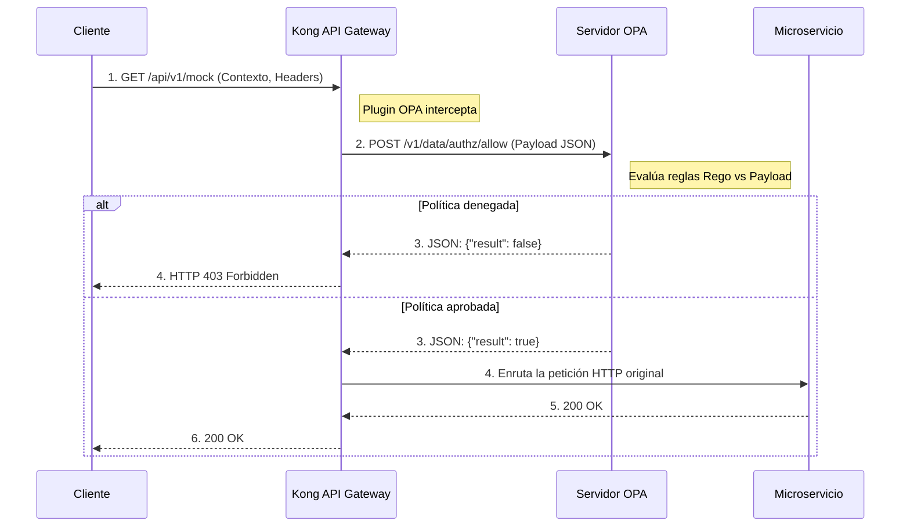

# Laboratorio 11: Open Policy Agent (OPA)

### ¿Qué es OPA?
**Open Policy Agent (OPA)** es un motor de políticas de propósito general de código abierto. En arquitecturas modernas (Cloud Native), es común adoptar el paradigma de **Policy as Code** (Políticas como Código). 
En lugar de programar la lógica de autorización (ej. *"el usuario X tiene permiso Y solo en horario laboral"*) dentro de cada microservicio, centralizas todas esas reglas en OPA usando su lenguaje declarativo llamado **Rego**. 

Kong se integra con OPA de forma elegante: cuando llega una petición, Kong pausa la ejecución, empaqueta el contexto HTTP (headers, body, method, path) en un gran objeto JSON y le hace una consulta a OPA. OPA evalúa sus reglas `.rego` y responde a Kong, decidiendo en tiempo real el destino de la petición.

### Diagrama de Secuencia (Flujo de Autorización)



## Objetivos

- Entender la integración entre Kong y OPA.
- Configurar el plugin `opa` en un servicio de Kong.
- Validar cómo Kong delega la decisión de acceso a las políticas definidas en el servidor OPA externo.

---

## Paso 1: Configurar OPA y Habilitar el Plugin

En nuestro entorno local de laboratorios, ya tenemos un servidor OPA corriendo (como un contenedor Docker en el puerto `8181`). Al iniciar este entorno, inyectamos automáticamente un archivo de configuración llamado `policy.rego` directamente en la memoria de OPA.

Para este laboratorio, simularemos una autorización basada en atributos (ABAC), donde la política exige que el consumidor presente el rol explícito de `admin` para poder pasar. 

Mira el código fuente exacto de la política `policy.rego` que está actualmente ejecutándose en tu servidor:

```rego
package authz

import rego.v1

default allow := false

allow if {
    input.request.http.headers["x-role"] == "admin"
}
```

**Explicación de la Política:**

- **`package authz`**: Define el namespace lógico. Esto dictará la ruta de API REST donde Kong consultará a OPA (`/v1/data/authz/...`).
- **`default allow := false`**: El núcleo de **Zero Trust**. Por defecto, si ninguna regla se cumple explícitamente, la puerta permanece cerrada.
- **`allow if { ... }`**: La regla se vuelve verdadera *únicamente* si dentro del objeto JSON que le envía Kong (`input.request.http`), los `headers` contienen la llave `x-role` con el valor exacto `"admin"`.

Abre el archivo `lab_11_1.yaml` ubicado en la carpeta `workshop-assets/dia-2` y analiza su contenido:

```yaml
_format_version: "3.0"
services:
 - name: mock-service
  host: mock-upstream
  path: /
  protocol: http
  plugins:
   - name: opa
    config:
     opa_host: opa
     opa_port: 8181
     opa_path: /v1/data/authz_advanced/allow
  routes:
   - name: mock-route
    paths:
     - /api/v1/mock
```

**Puntos Clave:**

- **Plugin `opa`:** Le indica a Kong que, antes de enrutar la petición al `mock-service`, debe consultar al servidor OPA (en este caso alojado en `opa:8181`).
- **`opa_path: /v1/data/authz_advanced/allow`:** Este es el endpoint del motor OPA donde inyectaremos nuestra política avanzada. Kong le pasará a OPA el contexto de la petición (headers, método, path) y esperará una respuesta de `allow = true`. Si OPA dice que no, Kong aborta y retorna un 403.

Para aplicar esta configuración a tu entorno, ejecuta el siguiente comando:

```bash
deck gateway sync lab_11_1.yaml && \
echo "Esperando 15s para que Konnect actualice el Data Plane..." && sleep 15
```

## Paso 2: Probar la Política Estática (Rechazo y Aprobación)

Antes de avanzar, verifiquemos que la política estática por defecto está funcionando. 

Primero, intentemos realizar una petición sin proveer ningún contexto que te identifique como administrador.
```bash
curl -s -D /dev/stderr http://localhost:8000/api/v1/mock 
```

**Para Windows (CMD):**
```cmd
curl -s -D /dev/stderr http://localhost:8000/api/v1/mock 
```
El código HTTP será `403 Forbidden` porque no enviaste el header requerido. OPA devolvió `false`.

Ahora, vamos a simular que inyectamos el claim requerido (el header `x-role: admin`):
```bash
curl -s -D /dev/stderr -H "x-role: admin" http://localhost:8000/api/v1/mock 
```

**Para Windows (CMD):**
```cmd
curl -s -D /dev/stderr -H "x-role: admin" http://localhost:8000/api/v1/mock 
```
El código HTTP será `200 OK`. OPA analizó el header, la regla evaluó a verdadero y respondió `allow = true`.

## Paso 3: Inyectar una Política Avanzada Dinámicamente (API REST)

Una de las ventajas más potentes de OPA es que no requiere reinicios para actualizar sus reglas. Podemos usar su API REST nativa para inyectar políticas complejas "al vuelo".

Vamos a inyectar una política avanzada (`authz_advanced`) con estas reglas de negocio:
- Si el rol es `admin`, puede ejecutar cualquier método HTTP.
- Si el rol es `manager`, **solamente** puede ejecutar el método `GET`.

Ejecuta el siguiente comando para empujar esta política directamente a la memoria de OPA:

```bash
curl -s -X PUT http://localhost:8181/v1/policies/authz_advanced --data-binary '
package authz_advanced

import rego.v1

default allow := false

# Admin tiene acceso irrestricto
allow if {
    input.request.http.headers["x-role"] == "admin"
}

# Manager tiene acceso de solo lectura (GET)
allow if {
    input.request.http.headers["x-role"] == "manager"
    input.request.http.method == "GET"
}'
```

**Para Windows (CMD):**
```cmd
curl -s -X PUT http://localhost:8181/v1/policies/authz_advanced --data-binary " package authz_advanced import rego.v1 default allow := false # Admin tiene acceso irrestricto allow if { input.request.http.headers[\"x-role\"] == \"admin\" } # Manager tiene acceso de solo lectura (GET) allow if { input.request.http.headers[\"x-role\"] == \"manager\" input.request.http.method == \"GET\" }"
```
*No deberías ver ninguna salida en consola si el comando fue exitoso (OPA retorna un JSON vacío `{}`).*

## Paso 4: Probar los Controles de Acceso Avanzados (Manager)
Vamos a verificar si OPA está evaluando correctamente el método HTTP.

Intentemos que el `manager` haga un `GET` (Debería ser 200 OK):
```bash
curl -s -D /dev/stderr -X GET -H "x-role: manager" http://localhost:8000/api/v1/mock 
```

**Para Windows (CMD):**
```cmd
curl -s -D /dev/stderr -X GET -H "x-role: manager" http://localhost:8000/api/v1/mock 
```

Ahora intentemos que el `manager` haga un `POST` (Debería ser 403 Forbidden porque nuestra política lo restringe):
```bash
curl -s -D /dev/stderr -X POST -H "x-role: manager" http://localhost:8000/api/v1/mock 
```

**Para Windows (CMD):**
```cmd
curl -s -D /dev/stderr -X POST -H "x-role: manager" http://localhost:8000/api/v1/mock 
```

**Analizando el resultado:**
- En la primera petición (GET), OPA evaluó que el rol era `manager` y el método era `GET`, devolviendo `allow = true`.
- En la segunda petición (POST), la regla de `manager` no se cumplió porque el método no era `GET`, y la regla de `admin` tampoco. Por lo tanto, OPA cayó en su `default allow := false` y Kong bloqueó el paso inmediatamente.

## Paso 5: Validar el Acceso Irrestricto (Admin)
Finalmente, probemos que un `admin` no tiene restricciones y puede ejecutar el `POST` que le fue denegado al `manager`.

```bash
curl -s -D /dev/stderr -X POST -H "x-role: admin" http://localhost:8000/api/v1/mock 
```

**Para Windows (CMD):**
```cmd
curl -s -D /dev/stderr -X POST -H "x-role: admin" http://localhost:8000/api/v1/mock 
```

**Analizando el resultado:**
- El código HTTP será `200 OK`. 
- OPA evaluó la primera regla de la política, la cual solo exige el rol `admin` ignorando qué método HTTP se esté ejecutando.

---
## Conclusión
Has implementado un modelo avanzado de Zero Trust, delegando decisiones de autorización complejas a un motor centralizado de políticas (OPA) desde tu API Gateway.
