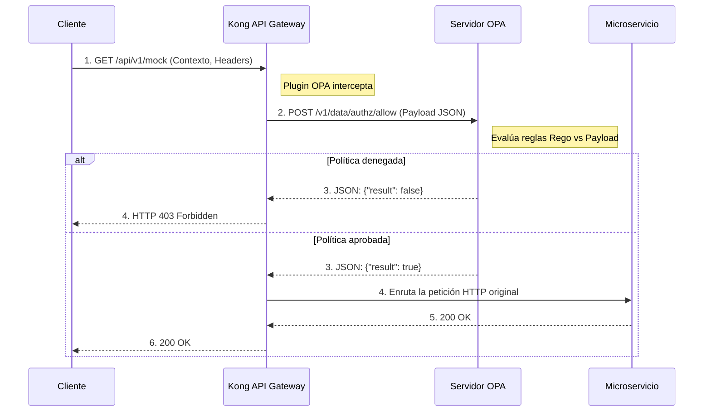

#Laboratório 11: Agente de Política Aberta (OPA)

### O que é OPA?
**Open Policy Agent (OPA)** é um mecanismo de política de uso geral de código aberto. Nas arquiteturas modernas (Cloud Native), é comum adotar o paradigma **Policy as Code**. 
Em vez de programar a lógica de autorização (por exemplo, *"user 

Kong se integra ao OPA de maneira elegante: quando chega uma solicitação, Kong pausa a execução, empacota o contexto HTTP (cabeçalhos, corpo, método, caminho) em um grande objeto JSON e faz uma consulta ao OPA. A OPA avalia suas regras `.rego` e responde ao Kong, decidindo em tempo real o destino da solicitação.

### Diagrama de sequência (fluxo de autorização)


## Objetivos

- Compreender a integração entre Kong e OPA.
- Configure o plugin `opa` em um serviço Kong.
- Validar como o Kong delega a decisão de acesso às políticas definidas no servidor OPA externo.

---

## Etapa 1: Configurar OPA e ativar o plug-in

Em nosso ambiente de laboratório local, já temos um servidor OPA em execução (como um contêiner Docker na porta `8181`). Ao iniciar este ambiente, injetamos automaticamente um arquivo de configuração chamado `policy.rego` diretamente na memória OPA.

Neste laboratório, simularemos a autorização baseada em atributos (ABAC), em que a política exige que o consumidor apresente a função explícita de `admin` para passar. 

Veja o código-fonte exato da política `policy.rego` que está atualmente em execução no seu servidor:

```rego
package authz

import rego.v1

default allow := false

allow if {
    input.request.http.headers["x-role"] == "admin"
}
```
**Explicação da política:**

- **`package authz`**: Define o namespace lógico. Isso ditará o caminho da API REST onde Kong consultará o OPA (`/v1/data/authz/...`).
- **`permissão padrão := false`**: O núcleo do **Zero Trust**. Por padrão, se nenhuma regra for explicitamente atendida, a porta permanece fechada.
- **`allow if { ... }`**: A regra se torna verdadeira *somente* se dentro do objeto JSON enviado a ela pelo Kong (`input.request.http`), os `headers` contêm a chave `x-role` com o valor exato `"admin"`.

Abra o arquivo `lab_11_1.yaml` localizado na pasta `workshop-assets/dia-2` e analise seu conteúdo:

```yaml
_format_version: "3.0"
services:
 - name: mock-service
  host: mock-upstream
  path: /
  protocol: http
  plugins:
   - name: opa
    config:
     opa_host: opa
     opa_port: 8181
     opa_path: /v1/data/authz_advanced/allow
  routes:
   - name: mock-route
    paths:
     - /api/v1/mock
```
**Pontos-chave:**

- **`opa` plugin:** Diz ao Kong que, antes de encaminhar a solicitação para o `mock-service`, ele deve consultar o servidor OPA (neste caso hospedado em `opa:8181`).
- **`opa_path: /v1/data/authz_advanced/allow`:** Este é o endpoint do mecanismo OPA onde injetaremos nossa política avançada. Kong passará ao OPA o contexto da solicitação (cabeçalhos, método, caminho) e aguardará uma resposta de `allow = true`. Se a OPA disser não, Kong aborta e retorna 403.

Para aplicar esta configuração ao seu ambiente, execute o seguinte comando:

```bash
deck gateway sync lab_11_1.yaml && \
echo "Esperando 15s para que Konnect actualice el Data Plane..." && sleep 15
```
## Etapa 2: Teste a política estática (rejeição e aprovação)

Antes de prosseguir, vamos verificar se a política estática padrão está funcionando. 

Primeiro, vamos tentar fazer uma solicitação sem fornecer nenhum contexto que identifique você como administrador.

```bash
curl -s -D /dev/stderr http://localhost:8000/api/v1/mock 
```
**Para Windows (CMD):**

```cmd
curl -s -D /dev/stderr http://localhost:8000/api/v1/mock 
```
O código HTTP será `403 Forbidden` porque você não enviou o cabeçalho necessário. OPA retornou `falso`.

Agora, vamos simular que injetamos a declaração necessária (o cabeçalho `x-role: admin`):

```bash
curl -s -D /dev/stderr -H "x-role: admin" http://localhost:8000/api/v1/mock 
```
**Para Windows (CMD):**

```cmd
curl -s -D /dev/stderr -H "x-role: admin" http://localhost:8000/api/v1/mock 
```
O código HTTP será `200 OK`. OPA analisou o cabeçalho, a regra foi avaliada como verdadeira e respondeu `allow = true`.

## Etapa 3: injetar uma política avançada dinamicamente (API REST)

Uma das vantagens mais poderosas do OPA é que ele não requer reinicializações para atualizar suas regras. Podemos usar sua API REST nativa para injetar políticas complexas “on the fly”.

Vamos injetar uma política avançada (`authz_advanced`) com estas regras de negócio:
- Se a função for `admin`, você pode executar qualquer método HTTP.
- Se a função for `manager`, **somente** poderá executar o método `GET`.

Execute o seguinte comando para enviar esta política diretamente para a memória OPA:

```bash
curl -s -X PUT http://localhost:8181/v1/policies/authz_advanced --data-binary '
package authz_advanced

import rego.v1

default allow := false

# Admin tiene acceso irrestricto
allow if {
    input.request.http.headers["x-role"] == "admin"
}

# Manager tiene acceso de solo lectura (GET)
allow if {
    input.request.http.headers["x-role"] == "manager"
    input.request.http.method == "GET"
}'
```
**Para Windows (CMD):**

```cmd
curl -s -X PUT http://localhost:8181/v1/policies/authz_advanced --data-binary " package authz_advanced import rego.v1 default allow := false # Admin tiene acceso irrestricto allow if { input.request.http.headers[\"x-role\"] == \"admin\" } # Manager tiene acceso de solo lectura (GET) allow if { input.request.http.headers[\"x-role\"] == \"manager\" input.request.http.method == \"GET\" }"
```
*No deberías ver ninguna salida en consola si el comando fue exitoso (OPA retorna un JSON vacío `{}`).*

## Paso 4: Probar los Controles de Acceso Avanzados (Manager)
Vamos a verificar si OPA está evaluando correctamente el método HTTP.

Intentemos que el `manager` haga un `GET` (Debería ser 200 OK):
```bash
curl -s -D /dev/stderr -X GET -H "x-role: manager" http://localhost:8000/api/v1/mock 
```

**Para Windows (CMD):**
```cmd
curl -s -D /dev/stderr -X GET -H "x-role: manager" http://localhost:8000/api/v1/mock 
```
Agora vamos tentar fazer com que o `manager` faça um `POST` (deve ser 403 Forbidden porque nossa política o restringe):

```bash
curl -s -D /dev/stderr -X POST -H "x-role: manager" http://localhost:8000/api/v1/mock 
```
**Para Windows (CMD):**

```cmd
curl -s -D /dev/stderr -X POST -H "x-role: manager" http://localhost:8000/api/v1/mock 
```

**Analizando el resultado:**
- En la primera petición (GET), OPA evaluó que el rol era `manager` y el método era `GET`, devolviendo `allow = true`.
- En la segunda petición (POST), la regla de `manager` no se cumplió porque el método no era `GET`, y la regla de `admin` tampoco. Por lo tanto, OPA cayó en su `default allow := false` y Kong bloqueó el paso inmediatamente.

## Paso 5: Validar el Acceso Irrestricto (Admin)
Finalmente, probemos que un `admin` no tiene restricciones y puede ejecutar el `POST` que le fue denegado al `manager`.

```bash
curl -s -D /dev/stderr -X POST -H "x-role: admin" http://localhost:8000/api/v1/mock 
```

**Para Windows (CMD):**
```cmd
curl -s -D /dev/stderr -X POST -H "x-role: admin" http://localhost:8000/api/v1/mock 
```
**Analisando o resultado:**
- O código HTTP será `200 OK`. 
- OPA avaliou a primeira regra da política, que requer apenas a função `admin` independentemente de qual método HTTP está sendo executado.

---
## Conclusão
Você implementou um modelo avançado de Zero Trust, delegando decisões de autorização complexas a um mecanismo de política centralizado (OPA) do seu API Gateway.
