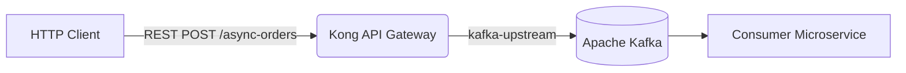
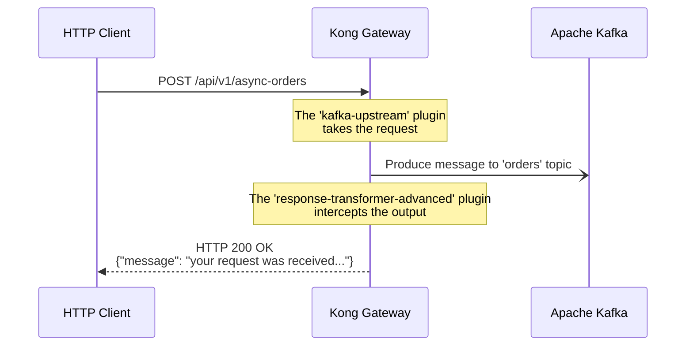

# Lab 12: Event Gateway with Kafka

In this lab, we will use Kong Gateway as an **Event Gateway**.
Unlike the traditional HTTP to HTTP proxy, Kong will intercept an incoming REST request and transform it into a message sent asynchronously to an **Apache Kafka** topic.

Additionally, to improve the client experience (who would otherwise receive an empty HTTP 200 or an error if there's no upstream), we will use the response transformation plugin to intercept the 200 OK and return a confirmation message in JSON format.

## Objectives
1. Configure a route that uses the `kafka-upstream` plugin.
2. Chain the `response-transformer-advanced` plugin to provide immediate feedback to the HTTP client.
3. Verify the message arrival at the message broker (Kafka).

---

## Architecture and Flow

**Architecture Diagram:**



**Sequence Diagram:**



---


## Step 1: Synchronize the Configuration

We are going to load the `lab_12_kafka.yaml` file, which contains the service (pointing to a fictitious backend), the `/api/v1/async-orders` route, and the necessary plugins.

Open the terminal in the repository's root folder and execute:

```bash
deck gateway sync workshop-assets/dia-2/lab_12_kafka.yaml
```

**Expected Output:**
```text
creating service event-gateway
creating route async-orders
creating plugin kafka-upstream for route async-orders
creating plugin response-transformer-advanced for route async-orders
Summary:
  Created: 4
  Updated: 0
  Deleted: 0
```

---

## Step 2: Send the Payload (REST Message)

Imagine we are a client application sending a new purchase order, but the order is not processed synchronously; instead, it is enqueued in Kafka.

Execute the following command to send the message:

```bash
curl -i -X POST http://localhost:8000/api/v1/async-orders \
  -H "Content-Type: application/json" \
  -d '{
    "order_id": "ORD-9988",
    "customer": "Juan Perez",
    "amount": 1500.50,
    "status": "NEW"
  }'
```

**Expected Output:**
You will notice that the response code is `200 OK`, but instead of an empty body (the default for Kafka upstream), you receive our intercepted message:

```http
HTTP/1.1 200 OK
Content-Type: application/json
Connection: keep-alive

{"message": "your request was received and will be processed"}
```

---

## Step 3: Validate that the Message arrived in Kafka

Now we will check if our Event Gateway truly did its job. We will execute an interactive command (using the official Kafka image) to consume the `orders` topic.

Open a **new terminal tab** and execute:

```bash
docker exec -it kafka /opt/kafka/bin/kafka-console-consumer.sh \
  --bootstrap-server localhost:9092 \
  --topic orders \
  --from-beginning \
  --max-messages 1
```

**Expected Output:**
In the Kafka console, you will see the same order JSON printed that you just sent via Kong:

```json
{
  "order_id": "ORD-9988",
  "customer": "Juan Perez",
  "amount": 1500.50,
  "status": "NEW"
}
Processed a total of 1 messages
```

Excellent! You have successfully converted your API Gateway into an **Event Gateway**, achieving a queuing (fire-and-forget) pattern and providing a controlled response to the user.