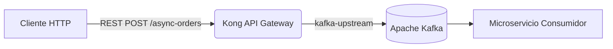
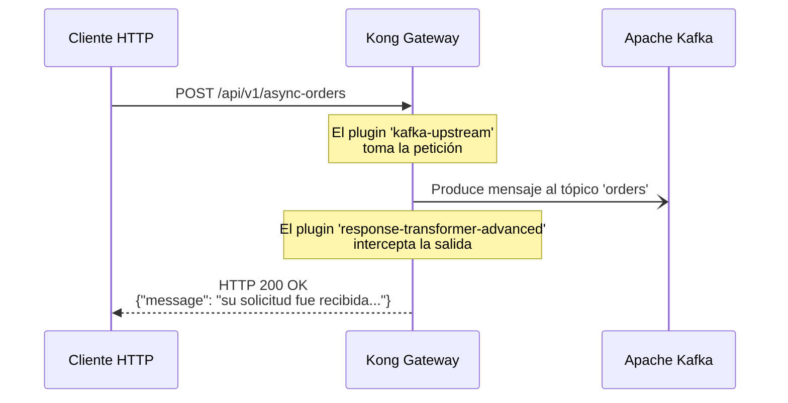

# Laboratorio 12: Event Gateway con Kafka

En este laboratorio vamos a utilizar Kong Gateway como un **Event Gateway**. 
A diferencia del proxy tradicional HTTP a HTTP, Kong interceptará una petición REST entrante y la transformará en un mensaje enviado asíncronamente a un tópico de **Apache Kafka**. 

Además, para mejorar la experiencia del cliente (que de otro modo recibiría un HTTP 200 vacío o un error si no hay upstream), utilizaremos el plugin de transformación de respuesta para interceptar el 200 OK y devolver un mensaje de confirmación en formato JSON.

## Objetivos
1. Configurar una ruta que utilice el plugin `kafka-upstream`.
2. Encadenar el plugin `response-transformer-advanced` para dar feedback inmediato al cliente HTTP.
3. Verificar la llegada del mensaje al broker de mensajería (Kafka).

---

## Arquitectura y Flujo

**Diagrama de Arquitectura:**



**Diagrama de Secuencia:**



---


## Paso 1: Sincronizar la Configuración

Vamos a cargar el archivo `lab_12_kafka.yaml` que contiene el servicio (apuntando a un backend ficticio), la ruta `/api/v1/async-orders` y los plugins necesarios.

Abre la terminal en la carpeta raíz del repositorio y ejecuta:

```bash
deck gateway sync workshop-assets/dia-2/lab_12_kafka.yaml
```

**Resultado esperado:**
```text
creating service event-gateway
creating route async-orders
creating plugin kafka-upstream for route async-orders
creating plugin response-transformer-advanced for route async-orders
Summary:
  Created: 4
  Updated: 0
  Deleted: 0
```

---

## Paso 2: Enviar el Payload (Mensaje REST)

Imagina que somos una aplicación cliente enviando una nueva orden de compra, pero la orden no se procesa sincrónicamente, sino que se encola en Kafka.

Ejecuta el siguiente comando para enviar el mensaje:

```bash
curl -i -X POST http://localhost:8000/api/v1/async-orders \
  -H "Content-Type: application/json" \
  -d '{
    "order_id": "ORD-9988",
    "customer": "Juan Perez",
    "amount": 1500.50,
    "status": "NEW"
  }'
```

**Resultado esperado:**
Notarás que el código de respuesta es `200 OK`, pero en lugar de un cuerpo vacío (el default de Kafka upstream), recibes nuestro mensaje interceptado:

```http
HTTP/1.1 200 OK
Content-Type: application/json
Connection: keep-alive

{"message": "su solicitud fue recibida y va a ser procesada"}
```

---

## Paso 3: Validar que el Mensaje llegó a Kafka

Ahora comprobaremos si nuestro Event Gateway realmente hizo su trabajo. Ejecutaremos un comando interactivo (usando la imagen oficial de Kafka) para consumir el tópico `orders`.

Abre una **nueva pestaña** de tu terminal y ejecuta:

```bash
docker exec -it kafka /opt/kafka/bin/kafka-console-consumer.sh \
  --bootstrap-server localhost:9092 \
  --topic orders \
  --from-beginning \
  --max-messages 1
```

**Resultado esperado:**
En la consola de Kafka verás impreso el mismo JSON de la orden que acabas de enviar a través de Kong:

```json
{
  "order_id": "ORD-9988",
  "customer": "Juan Perez",
  "amount": 1500.50,
  "status": "NEW"
}
Processed a total of 1 messages
```

¡Excelente! Has convertido con éxito tu API Gateway en un **Event Gateway**, logrando un patrón de encolamiento (fire-and-forget) y brindando una respuesta controlada al usuario.
