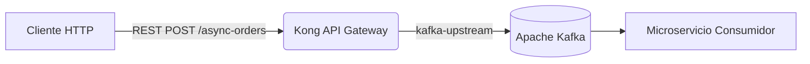
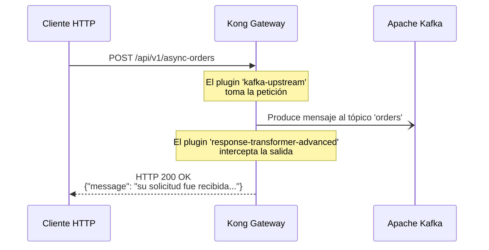

# Laboratório 12: Gateway de eventos com Kafka

Neste laboratório, usaremos o Kong Gateway como **Event Gateway**. 
Ao contrário do proxy HTTP para HTTP tradicional, Kong interceptará uma solicitação REST recebida e a transformará em uma mensagem enviada de forma assíncrona para um tópico do Apache Kafka. 

Além disso, para melhorar a experiência do cliente (que de outra forma receberia um HTTP 200 vazio ou um erro se não houvesse upstream), usaremos o plugin de transformação de resposta para interceptar o 200 OK e retornar uma mensagem de confirmação no formato JSON.

## Objetivos
1. Configure uma rota que use o plugin `kafka-upstream`.
2. Encadeie o plugin `response-transformer-advanced` para fornecer feedback imediato ao cliente HTTP.
3. Verifique a chegada da mensagem ao agente de mensagens (Kafka).

---

## Arquitetura e Fluxo

**Diagrama de Arquitetura:**


**Diagrama de sequência:**


---


## Etapa 1: configurações de sincronização

Vamos carregar o arquivo `lab_12_kafka.yaml` que contém o serviço (apontando para um backend fictício), o caminho `/api/v1/async-orders` e os plugins necessários.

Abra o terminal na pasta raiz do repositório e execute:

```bash
deck gateway sync workshop-assets/dia-2/lab_12_kafka.yaml
```
**Resultado esperado:**

```text
creating service event-gateway
creating route async-orders
creating plugin kafka-upstream for route async-orders
creating plugin response-transformer-advanced for route async-orders
Summary:
  Created: 4
  Updated: 0
  Deleted: 0
```
---

## Etapa 2: Enviar a carga útil (mensagem REST)

Imagine que somos uma aplicação cliente enviando um novo pedido de compra, mas o pedido não é processado de forma síncrona, mas sim enfileirado no Kafka.

Execute o seguinte comando para enviar a mensagem:

```bash
curl -i -X POST http://localhost:8000/api/v1/async-orders \
  -H "Content-Type: application/json" \
  -d '{
    "order_id": "ORD-9988",
    "customer": "Juan Perez",
    "amount": 1500.50,
    "status": "NEW"
  }'
```
**Resultado esperado:**
Você notará que o código de resposta é `200 OK`, mas em vez de um corpo vazio (o padrão do upstream do Kafka), você receberá nossa mensagem interceptada:

```http
HTTP/1.1 200 OK
Content-Type: application/json
Connection: keep-alive

{"message": "su solicitud fue recibida y va a ser procesada"}
```
---

## Etapa 3: Valide se a mensagem chegou ao Kafka

Agora vamos verificar se nosso Event Gateway realmente fez seu trabalho. Executaremos um comando interativo (usando a imagem oficial do Kafka) para consumir o tópico `orders`.

Abra uma **nova aba** do seu terminal e execute:

```bash
docker exec -it kafka /opt/kafka/bin/kafka-console-consumer.sh \
  --bootstrap-server localhost:9092 \
  --topic orders \
  --from-beginning \
  --max-messages 1
```
**Resultado esperado:**
No console do Kafka você verá impresso o mesmo JSON do comando que acabou de enviar através do Kong:

```json
{
  "order_id": "ORD-9988",
  "customer": "Juan Perez",
  "amount": 1500.50,
  "status": "NEW"
}
Processed a total of 1 messages
```
Excelente! Você converteu com êxito seu API Gateway em um **Event Gateway**, alcançando um padrão de enfileiramento (disparar e esquecer) e fornecer uma resposta controlada ao usuário.
