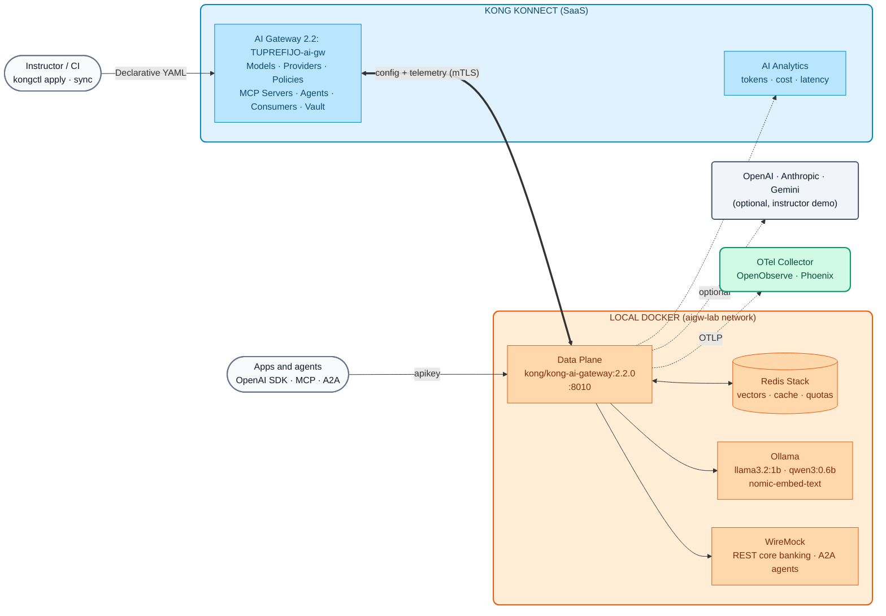
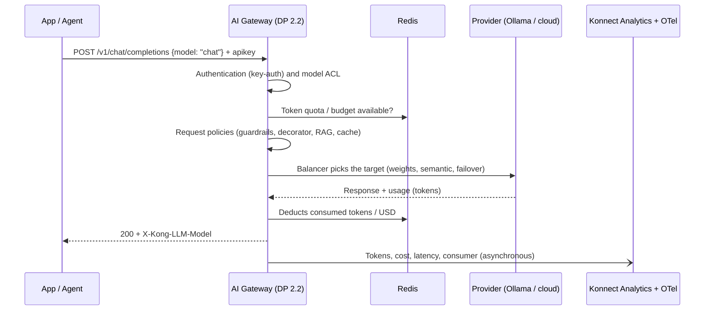

# AI Module 00: AI Gateway 2.x Architecture in Konnect and kongctl

On Days 1 and 2 we worked with "classic" Kong Gateway: Gateway Services, Routes and Plugins on top of a Konnect Control Plane. Day 3 moves to a different plane: **Kong AI Gateway 2.x** is a product with its **own Control Plane** and an entity model designed for AI traffic (models, providers, MCP tools and agents). This module explains that architecture and the tool we will use to govern it all day long: **kongctl**.

!!! info "Reference versions for Day 3 and Day 4"
    - **Kong AI Gateway 2.2.0** (released on September 30, 2026) — Data Plane image `kong/kong-ai-gateway:2.2.0`.
    - **kongctl ≥ 1.20.1** — version 1.16 does not know the 2.1 and 2.2 entities.
    - The Control Plane (AI Gateway in Konnect) and the Data Plane must run **exactly** the same version; if they do not match, the DP does not receive the configuration.

---

## 1. Why an AI Gateway? (a bank's story)

> "Every team started using AI on its own: OpenAI keys in the code, agents calling internal APIs without any control, and invoices nobody can explain."

This is the starting point for almost every financial institution we work with. The problems are always the same:

| Problem | Risk for the bank | AI Gateway answer |
| :--- | :--- | :--- |
| LLM provider keys scattered across applications | Credential leaks, uncontrolled spending | Keys live in the **Konnect vault**; apps only hold a corporate API key |
| Each app picks its own provider and model | Provider dependency, no continuity plan | **Virtual models** with load balancing and failover across providers (AI Module 01) |
| Prompts containing customer data go out to the internet | Breach of banking secrecy / data protection | **Guardrails** and PII anonymization before data leaves (AI Module 03) |
| Nobody knows how much each area spends | FinOps impossible, invoice surprises | **Token quotas and USD budgets** per consumer (AI Module 02) and cost observability (AI Module 08) |
| Agents invoking core APIs without control | Unauthorized destructive actions | **Governed MCP**: each agent only sees its own tools (AI Module 06) and **A2A** with ACLs (AI Module 07) |

The AI Gateway provides **a single point of control** for models, tools (MCP) and agents (A2A), with identity, security, costs and observability, **without changing the applications**: they keep using the OpenAI SDK pointed at a different `base_url`.

---

## 2. From plugins to entities: what changes in 2.x

In AI Gateway 1.x (and on Day 1 with Kong Gateway) AI was configured with plugins (`ai-proxy-advanced`, `ai-prompt-guard`, `ai-mcp-proxy`...) on top of Services and Routes. In **2.x** those plugins are abstracted into a **dedicated entity model**, on a dedicated Control Plane. You no longer create Services, Routes or plugins by hand.

| 1.x / Kong Gateway concept | AI Gateway 2.x entity | What it is for |
| :--- | :--- | :--- |
| `ai-proxy-advanced` configuration | **AI Model** (`ai_gateway_models`) | **Virtual** model with one or more *targets*, load balancing, route and policies |
| Credentials repeated in every plugin | **AI Model Provider** (`ai_gateway_model_providers`) | A provider credential declared **once** and reused by all models |
| `ai-mcp-proxy` | **AI MCP Server** (`ai_gateway_mcp_servers`) | REST APIs as MCP tools, *bundling*, proxying of external MCP servers |
| `ai-a2a-proxy` | **AI Agent** (`ai_gateway_agents`) | Agent-to-agent (A2A) traffic with its own analytics |
| Consumers / Consumer Groups | **AI Consumer / AI Consumer Group** | Identity and ACLs for models, tools and agents |
| Plugins (`ai-sanitizer`, `ai-rate-limiting-advanced`...) | **AI Policy** (`ai_gateway_policies`) | Same `type` and same `config` as the equivalent plugin |
| Vaults / certificates | **AI Vault**, **Config Store**, **Data Plane Certificates** | Referenceable secrets (`{vault://...}`) and DP mTLS |
| Custom plugins (required rebuilding images) | **Custom Policy** (`ai_gateway_custom_policies`, 2.2) | Lua published from Konnect to the DPs without a rebuild |

---

## 3. Reference architecture (the one we will use on Day 4)



**Key points of the architecture:**

- **Control Plane (Konnect):** the AI Gateway is a Konnect entity with its own configuration and telemetry endpoints. Models, providers, policies, MCP servers, agents, consumers and the vault live there.
- **Data Plane:** a `kong/kong-ai-gateway:2.2.0` container that connects over mTLS (with a certificate registered in the AI Gateway) and processes the traffic. **It is stateless**: quotas, cache and vectors are stored in **Redis**, which is why it scales to N replicas.
- **A single OpenAI-compatible endpoint:** `POST /v1/chat/completions`. The client picks an **alias** in the `model` field of the body (`chat`, `codigo`, `auto`...) and the gateway decides the provider, target, failover, policies and cost.
- **Identity:** the AI Gateway key-auth uses the `apikey` header. Watch out: it does **not** strip the `Bearer` prefix, so with the OpenAI SDKs `apikey` is sent as an extra header (`default_headers`).

### Request flow



---

## 4. kongctl: APIOps for the AI Gateway

For Kong Gateway we use **decK**. For AI Gateway 2.x the declarative tool is **kongctl** (the official Konnect CLI). All of Day 3 and Day 4 is configured with version-controlled YAML; there are no manual steps in the UI except creating the AI Gateway.

### 4.1 File structure

The course splits the configuration by topic, just like the AI Gateway 2.2 Demo Track it comes from:

```text
workshop-assets/dia-4/config/
├── base/
│   ├── 00-gateway.yaml        ← the AI Gateway (external: kongctl neither creates nor deletes it)
│   ├── 10-proveedores.yaml    ← Ollama provider (local, no paid keys)
│   └── 15-identidad.yaml      ← key-auth, consumers and consumer groups
├── lab_01_multi_llm.yaml      ← models chat, chat-resiliente, local-passthrough
├── lab_02_gobierno_cuotas.yaml
├── ...                        ← one file per lab (cumulative)
└── lab_09_desafio_credito.yaml
```

### 4.2 Concepts you need to understand

```yaml
ai_gateways:
  - ref: lab-ai-gw
    _external:
      id: __AI_GATEWAY_ID__          # the gateway exists; kongctl only manages its children

ai_gateway_model_providers:
  - ref: ollama
    ai_gateway: !ref lab-ai-gw#id   # reference to another declared entity (even if it lives in another file)
    name: ollama
    display_name: Ollama (local, open-weight)
    type: ollama
    config:
      auth:
        type: basic
```

| Element | Meaning |
| :--- | :--- |
| `ref` | **Local** identifier of the entity within the files (it is not the Konnect ID) |
| `!ref <ref>#id` / `#name` | Reference to another entity: kongctl resolves its real ID or name |
| `_external` | The entity already exists and is **not** managed by kongctl (it does not create, modify or delete it) |
| `!env VAR` | Takes the value from an environment variable (URLs, model names) |
| `!secret {source: !env VAR}` | Same as `!env`, but the value is treated as a secret (API keys, tokens) |
| `{vault://llm-keys/clave}` | Reference that the **Data Plane resolves** at runtime against the Konnect vault |

### 4.3 apply, sync and diff

| Command | What it does | When to use it |
| :--- | :--- | :--- |
| `kongctl diff -f ...` | Shows what would change (create / update / **delete**) | Always before applying, and in the *pull request* |
| `kongctl apply -f ... --auto-approve` | Creates and updates; **never deletes** | First step of a deployment |
| `kongctl sync -f ... --auto-approve` | Reconciles: creates, updates and **deletes** anything not declared | Second step: makes Konnect match the repository |

!!! warning "sync fully reconciles the AI Gateway collections"
    With the gateway declared as `_external`, kongctl does not touch the gateway itself, but it **does delete** any model, policy, MCP server, agent or consumer of that gateway that is not in the files. That is why the safe order (inherited from the Demo Track) is: **(1)** vault and secrets first, **(2)** `apply` to create/update, **(3)** `sync` to delete leftovers. The `workshop-assets/dia-4/scripts/aplicar.sh` script does this for you.

---

## 5. Demo Script (Step by Step)

> The instructor uses their own AI Gateway (`instructor-ai-gw`) and their **kong-env** profile (which exports `KONNECT_TOKEN`, `DEMO_PREFIX` and, optionally, the commercial provider keys). Participants do **not** need to run anything today: they will do it in [AI Lab 00](../../dia-4-ai-gateway-labs/Lab_IA_00_Setup.md).

### Demo 1: The AI Gateway in Konnect (5 min)

1. In Konnect, open **AI Gateway** → `instructor-ai-gw`. Show that **version 2.2** is selected.
2. Walk through the sections: **Models**, **Model Providers**, **Policies**, **MCP Servers**, **Agents**, **Consumers**, **Vaults**, **Data Plane Nodes**, **Analytics**.
3. Point out in **Data Plane Nodes** that there are no connected nodes yet.

### Demo 2: Bringing up the 2.2 Data Plane (10 min)

```bash
kong-env aigw-curso                 # instructor profile: KONNECT_TOKEN, DEMO_PREFIX=instructor, optional keys
kongctl version                     # >= 1.20.1
./workshop-assets/dia-4/scripts/setup_lab.sh
```

While it runs, explain each step the script prints:

- It discovers the `instructor-ai-gw` AI Gateway through the `GET /v1/ai-gateways` API and stores its ID.
- It generates the consumers' API keys **outside the repository** (`~/.kong-workshop/aigw-lab/.env.generated`).
- It generates the DP certificate and registers it with `POST /v1/ai-gateways/{id}/data-plane-certificates`.
- It reads the gateway's `configuration` and `telemetry` endpoints and brings up the 2.2 DP + Redis + WireMock + Ollama.
- It downloads the open-weight models and applies the base configuration with kongctl.

When it finishes, go back to **Data Plane Nodes**: the `aigw-lab-dp-instructor` node shows up as connected with version 2.2.0.

### Demo 3: kongctl diff → apply → sync (10 min)

```bash
# What would change if I apply lab 01?
./workshop-assets/dia-4/scripts/aplicar.sh 01 --diff

# Apply (apply + sync)
./workshop-assets/dia-4/scripts/aplicar.sh 01
```

- Show the `CREATE` operations in the diff for the `chat`, `chat-resiliente` and `local-passthrough` models.
- In Konnect → **Models**, show the newly created models, their *targets* and weights.
- Run `aplicar.sh 00 --diff` again: the `DELETE` operations for those three models appear. This proves that `sync` fully reconciles (do not apply; just show it).

### Demo 4: First call (5 min)

```bash
source ~/.kong-workshop/aigw-lab/.env.generated
curl -s http://localhost:8010/v1/chat/completions \
  -H "apikey: $AIGW_KEY_EQUIPO_DATOS" -H "Content-Type: application/json" \
  -d '{"model":"chat","messages":[{"role":"user","content":"En una frase: ¿qué es una API?"}]}' | jq .
```

- Without `apikey` → `401`. With `apikey` → `200`, and the `X-Kong-LLM-Model` header shows which real model answered.

---

## 6. What to highlight (banking and financial services)

!!! success "Messages for the architecture and risk committee"
    - **Segregation of duties:** the configuration lives in Git and is applied through a pipeline (kongctl); the security team approves the *diff*, not a click in a console. This is auditable evidence for regulators.
    - **Data residency:** the Data Plane runs **inside the bank's network** (on-premises or private cloud). Only configuration and telemetry travel through the tunnel to Konnect, **never** the content of prompts and responses sent to the provider.
    - **Secrets kept out of applications:** provider keys live in the vault and are resolved by the DP; no app, developer or container ever sees them.
    - **Stateless scalability:** quotas, cache and vectors live in Redis; DP replicas can be added without losing counters (critical for spending limits).
    - **Same discipline as APIs:** the bank already governs its APIs with Kong; AI comes in through the same operating model (GitOps, observability, Konnect RBAC).

---

## 7. Summary and next step

| Question | Short answer |
| :--- | :--- |
| Where is it configured? | In the Konnect AI Gateway, with kongctl (YAML in Git) |
| Where does the traffic run? | In the `kong/kong-ai-gateway:2.2.0` Data Plane, inside the bank's network |
| What changes for the apps? | Only the `base_url` and the `apikey` header; `model` is an alias |
| What do you need to watch out for? | Same CP/DP version, kongctl ≥ 1.20.1, and the fact that `sync` deletes anything not declared |

➡️ Hands-on: [AI Lab 00 — AI Gateway Setup](../../dia-4-ai-gateway-labs/Lab_IA_00_Setup.md)
