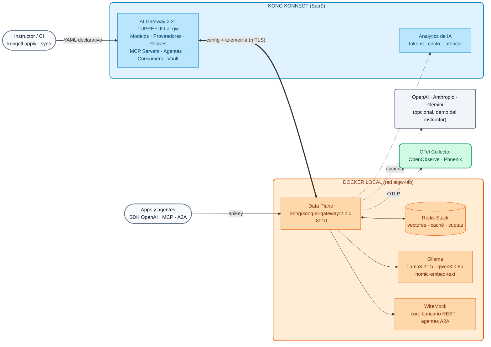
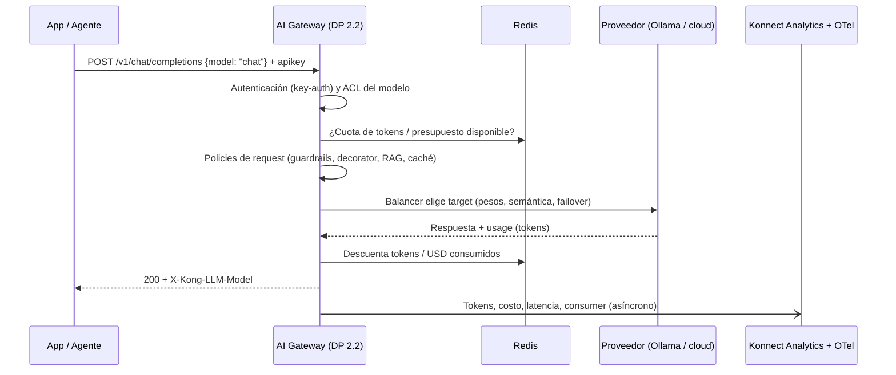

# Módulo IA 00: Arquitectura de AI Gateway 2.x en Konnect y kongctl

En los Días 1 y 2 trabajamos con Kong Gateway "clásico": Gateway Services, Routes y Plugins sobre un Control Plane de Konnect. El Día 3 cambia de plano: **Kong AI Gateway 2.x** es un producto con su **propio Control Plane** y un modelo de entidades pensado para tráfico de IA (modelos, proveedores, tools MCP y agentes). Este módulo explica esa arquitectura y la herramienta con la que la vamos a gobernar todo el día: **kongctl**.

!!! info "Versiones de referencia del Día 3 y del Día 4"
    - **Kong AI Gateway 2.2.0** (publicado el 30/09/2026) — imagen del Data Plane `kong/kong-ai-gateway:2.2.0`.
    - **kongctl ≥ 1.20.1** — la 1.16 no conoce las entidades de 2.1 y 2.2.
    - El Control Plane (AI Gateway en Konnect) y el Data Plane deben tener **exactamente** la misma versión; si no coinciden, el DP no recibe la configuración.

---

## 1. ¿Por qué un AI Gateway? (la historia de un banco)

> "Cada equipo empezó a usar IA por su cuenta: claves de OpenAI en el código, agentes que llaman APIs internas sin control y facturas que nadie puede explicar."

Este es el punto de partida de casi todas las entidades financieras con las que trabajamos. Los problemas son siempre los mismos:

| Problema | Riesgo para el banco | Respuesta del AI Gateway |
| :--- | :--- | :--- |
| Claves de proveedores de LLM repartidas en aplicaciones | Fuga de credenciales, gasto no controlado | Las claves viven en el **vault de Konnect**; las apps sólo tienen una API key corporativa |
| Cada app elige proveedor y modelo | Dependencia de un proveedor, sin plan de continuidad | **Modelos virtuales** con balanceo y failover entre proveedores (Módulo IA 01) |
| Prompts con datos de clientes salen a internet | Incumplimiento de secreto bancario / protección de datos | **Guardrails** y anonimización de PII antes de salir (Módulo IA 03) |
| Nadie sabe cuánto gasta cada área | FinOps imposible, sorpresas en la factura | **Cuotas en tokens y presupuesto en USD** por consumidor (Módulo IA 02) y observabilidad de costos (Módulo IA 08) |
| Agentes que invocan APIs del core sin control | Acciones destructivas no autorizadas | **MCP gobernado**: cada agente ve sólo sus tools (Módulo IA 06) y **A2A** con ACL (Módulo IA 07) |

El AI Gateway pone **un único punto de control** para modelos, tools (MCP) y agentes (A2A), con identidad, seguridad, costos y observabilidad, **sin cambiar las aplicaciones**: siguen usando el SDK de OpenAI apuntando a otra `base_url`.

---

## 2. De plugins a entidades: qué cambia en 2.x

En AI Gateway 1.x (y en el Día 1 con Kong Gateway) la IA se configuraba con plugins (`ai-proxy-advanced`, `ai-prompt-guard`, `ai-mcp-proxy`...) sobre Services y Routes. En **2.x** esos plugins se abstraen en un **modelo de entidades propio**, sobre un Control Plane dedicado. Ya no se crean Services, Routes ni plugins a mano.

| Concepto 1.x / Kong Gateway | Entidad en AI Gateway 2.x | Para qué sirve |
| :--- | :--- | :--- |
| Configuración de `ai-proxy-advanced` | **AI Model** (`ai_gateway_models`) | Modelo **virtual** con uno o más *targets*, balanceo, ruta y policies |
| Credenciales repetidas en cada plugin | **AI Model Provider** (`ai_gateway_model_providers`) | Credencial de un proveedor declarada **una vez** y reutilizada por todos los modelos |
| `ai-mcp-proxy` | **AI MCP Server** (`ai_gateway_mcp_servers`) | APIs REST como tools MCP, *bundling*, proxy de MCP externos |
| `ai-a2a-proxy` | **AI Agent** (`ai_gateway_agents`) | Tráfico agente-a-agente (A2A) con analytics propios |
| Consumers / Consumer Groups | **AI Consumer / AI Consumer Group** | Identidad y ACL de modelos, tools y agentes |
| Plugins (`ai-sanitizer`, `ai-rate-limiting-advanced`...) | **AI Policy** (`ai_gateway_policies`) | Mismo `type` y mismo `config` que el plugin equivalente |
| Vaults / certificados | **AI Vault**, **Config Store**, **Data Plane Certificates** | Secretos referenciables (`{vault://...}`) y mTLS del DP |
| Plugins custom (requería reconstruir imágenes) | **Custom Policy** (`ai_gateway_custom_policies`, 2.2) | Lua publicado desde Konnect a los DP sin rebuild |

---

## 3. Arquitectura de referencia (la que usaremos en el Día 4)



**Puntos clave de la arquitectura:**

- **Control Plane (Konnect):** el AI Gateway es una entidad de Konnect con sus propios endpoints de configuración y telemetría. Allí viven modelos, proveedores, policies, servidores MCP, agentes, consumers y el vault.
- **Data Plane:** un contenedor `kong/kong-ai-gateway:2.2.0` que se conecta por mTLS (certificado registrado en el AI Gateway) y procesa el tráfico. **No guarda estado**: cuotas, caché y vectores están en **Redis**, por eso escala a N réplicas.
- **Un único endpoint OpenAI-compatible:** `POST /v1/chat/completions`. El cliente elige un **alias** en el campo `model` del body (`chat`, `codigo`, `auto`...) y el gateway decide proveedor, target, failover, policies y costo.
- **Identidad:** el key-auth del AI Gateway usa el header `apikey`. Ojo: **no** quita el prefijo `Bearer`, por eso con los SDK de OpenAI se envía `apikey` como header extra (`default_headers`).

### Flujo de una petición



---

## 4. kongctl: APIOps para el AI Gateway

Para Kong Gateway usamos **decK**. Para AI Gateway 2.x la herramienta declarativa es **kongctl** (CLI oficial de Konnect). Todo el Día 3 y el Día 4 se configuran con YAML versionable; no hay pasos manuales en la UI salvo crear el AI Gateway.

### 4.1 Estructura de los archivos

El curso separa la configuración por tema, igual que el Demo Track de AI Gateway 2.2 del que proviene:

```text
workshop-assets/dia-4/config/
├── base/
│   ├── 00-gateway.yaml        ← el AI Gateway (externo: kongctl no lo crea ni lo borra)
│   ├── 10-proveedores.yaml    ← proveedor Ollama (local, sin claves de pago)
│   └── 15-identidad.yaml      ← key-auth, consumers y consumer groups
├── lab_01_multi_llm.yaml      ← modelos chat, chat-resiliente, local-passthrough
├── lab_02_gobierno_cuotas.yaml
├── ...                        ← un archivo por lab (acumulativos)
└── lab_09_desafio_credito.yaml
```

### 4.2 Conceptos que hay que entender

```yaml
ai_gateways:
  - ref: lab-ai-gw
    _external:
      id: __AI_GATEWAY_ID__          # el gateway existe; kongctl sólo gestiona sus hijos

ai_gateway_model_providers:
  - ref: ollama
    ai_gateway: !ref lab-ai-gw#id   # referencia a otra entidad declarada (aunque esté en otro archivo)
    name: ollama
    display_name: Ollama (local, open-weight)
    type: ollama
    config:
      auth:
        type: basic
```

| Elemento | Significado |
| :--- | :--- |
| `ref` | Identificador **local** de la entidad dentro de los archivos (no es el ID de Konnect) |
| `!ref <ref>#id` / `#name` | Referencia a otra entidad: kongctl resuelve su ID o nombre real |
| `_external` | La entidad ya existe y **no** la gestiona kongctl (no la crea, no la modifica, no la borra) |
| `!env VAR` | Toma el valor de una variable de entorno (URLs, nombres de modelos) |
| `!secret {source: !env VAR}` | Igual que `!env` pero el valor se trata como secreto (API keys, tokens) |
| `{vault://llm-keys/clave}` | Referencia que **resuelve el Data Plane** en tiempo de ejecución contra el vault de Konnect |

### 4.3 apply, sync y diff

| Comando | Qué hace | Cuándo usarlo |
| :--- | :--- | :--- |
| `kongctl diff -f ...` | Muestra lo que cambiaría (crear / actualizar / **borrar**) | Siempre antes de aplicar, y en el *pull request* |
| `kongctl apply -f ... --auto-approve` | Crea y actualiza; **nunca borra** | Primer paso de un despliegue |
| `kongctl sync -f ... --auto-approve` | Reconcilia: crea, actualiza y **borra** lo no declarado | Segundo paso: deja Konnect igual al repositorio |

!!! warning "sync reconcilia por completo las colecciones del AI Gateway"
    Con el gateway declarado como `_external`, kongctl no toca el gateway en sí, pero **sí borra** cualquier modelo, policy, servidor MCP, agente o consumer de ese gateway que no esté en los archivos. Por eso el orden seguro (heredado del Demo Track) es: **(1)** vault y secretos primero, **(2)** `apply` para crear/actualizar, **(3)** `sync` para borrar lo sobrante. El script `workshop-assets/dia-4/scripts/aplicar.sh` lo hace por ti.

---

## 5. Guion de Demostración (Paso a Paso)

> El instructor usa su propio AI Gateway (`instructor-ai-gw`) y su perfil **kong-env** (que exporta `KONNECT_TOKEN`, `DEMO_PREFIX` y, opcionalmente, las claves de los proveedores comerciales). Los participantes **no** necesitan ejecutar nada hoy: lo harán en el [Lab IA 00](../../dia-4-ai-gateway-labs/Lab_IA_00_Setup.md).

### Demostración 1: El AI Gateway en Konnect (5 min)

1. En Konnect, abrir **AI Gateway** → `instructor-ai-gw`. Mostrar que la **versión 2.2** está seleccionada.
2. Recorrer las secciones: **Models**, **Model Providers**, **Policies**, **MCP Servers**, **Agents**, **Consumers**, **Vaults**, **Data Plane Nodes**, **Analytics**.
3. Señalar en **Data Plane Nodes** que aún no hay nodos conectados.

### Demostración 2: Levantar el Data Plane 2.2 (10 min)

```bash
kong-env aigw-curso                 # perfil del instructor: KONNECT_TOKEN, DEMO_PREFIX=instructor, claves opcionales
kongctl version                     # >= 1.20.1
./workshop-assets/dia-4/scripts/setup_lab.sh
```

Mientras corre, explicar cada paso que imprime el script:

- Descubre el AI Gateway `instructor-ai-gw` por la API `GET /v1/ai-gateways` y guarda su ID.
- Genera las API keys de los consumers **fuera del repositorio** (`~/.kong-workshop/aigw-lab/.env.generated`).
- Genera el certificado del DP y lo registra con `POST /v1/ai-gateways/{id}/data-plane-certificates`.
- Lee los endpoints `configuration` y `telemetry` del gateway y levanta el DP 2.2 + Redis + WireMock + Ollama.
- Descarga los modelos open-weight y aplica la configuración base con kongctl.

Al terminar, volver a **Data Plane Nodes**: el nodo `aigw-lab-dp-instructor` aparece conectado con versión 2.2.0.

### Demostración 3: kongctl diff → apply → sync (10 min)

```bash
# ¿Qué cambiaría si aplico el lab 01?
./workshop-assets/dia-4/scripts/aplicar.sh 01 --diff

# Aplicar (apply + sync)
./workshop-assets/dia-4/scripts/aplicar.sh 01
```

- Mostrar en el diff las operaciones `CREATE` de los modelos `chat`, `chat-resiliente` y `local-passthrough`.
- En Konnect → **Models**, mostrar los modelos recién creados, sus *targets* y pesos.
- Volver a ejecutar `aplicar.sh 00 --diff`: aparecen los `DELETE` de esos tres modelos. Es la prueba de que `sync` reconcilia por completo (no aplicar; sólo mostrar).

### Demostración 4: Primera llamada (5 min)

```bash
source ~/.kong-workshop/aigw-lab/.env.generated
curl -s http://localhost:8010/v1/chat/completions \
  -H "apikey: $AIGW_KEY_EQUIPO_DATOS" -H "Content-Type: application/json" \
  -d '{"model":"chat","messages":[{"role":"user","content":"En una frase: ¿qué es una API?"}]}' | jq .
```

- Sin `apikey` → `401`. Con `apikey` → `200` y el header `X-Kong-LLM-Model` indica qué modelo real respondió.

---

## 6. Qué destacar (banca y servicios financieros)

!!! success "Mensajes para el comité de arquitectura y riesgo"
    - **Separación de funciones:** la configuración vive en Git y se aplica por pipeline (kongctl); el equipo de seguridad aprueba el *diff*, no un clic en una consola. Es evidencia auditable para reguladores.
    - **Residencia de datos:** el Data Plane corre **en la red del banco** (on-premise o nube privada). Por el túnel con Konnect viaja configuración y telemetría, **nunca** el contenido de prompts y respuestas hacia el proveedor.
    - **Secretos fuera de las aplicaciones:** las claves de los proveedores están en el vault y las resuelve el DP; ninguna app, desarrollador ni contenedor las ve.
    - **Escalabilidad sin estado:** cuotas, caché y vectores en Redis; se agregan réplicas del DP sin perder contadores (crítico para límites de gasto).
    - **Misma disciplina que las APIs:** el banco ya gobierna sus APIs con Kong; la IA entra por el mismo modelo operativo (GitOps, observabilidad, RBAC de Konnect).

---

## 7. Resumen y siguiente paso

| Pregunta | Respuesta corta |
| :--- | :--- |
| ¿Dónde se configura? | En el AI Gateway de Konnect, con kongctl (YAML en Git) |
| ¿Dónde corre el tráfico? | En el Data Plane `kong/kong-ai-gateway:2.2.0`, en la red del banco |
| ¿Qué cambia para las apps? | Sólo la `base_url` y el header `apikey`; el `model` es un alias |
| ¿Qué hay que cuidar? | Misma versión CP/DP, kongctl ≥ 1.20.1, y que `sync` borra lo no declarado |

➡️ Práctica: [Lab IA 00 — Setup del AI Gateway](../../dia-4-ai-gateway-labs/Lab_IA_00_Setup.md)
