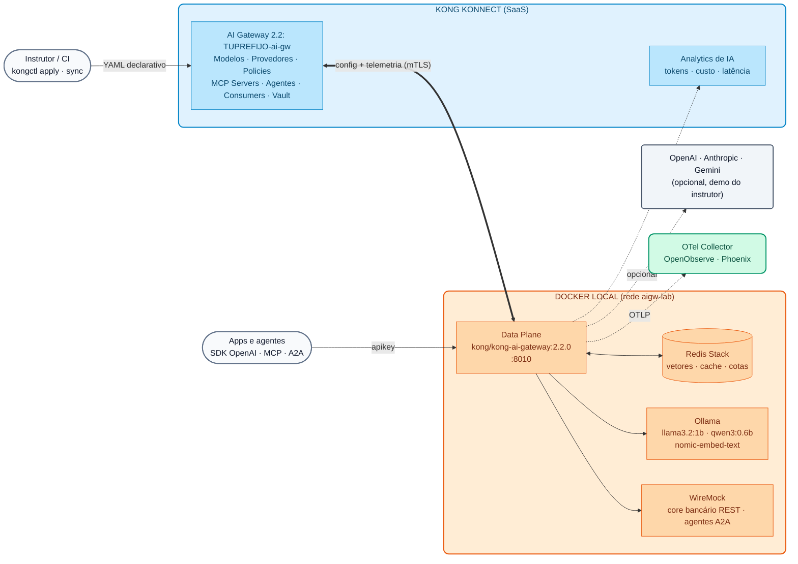
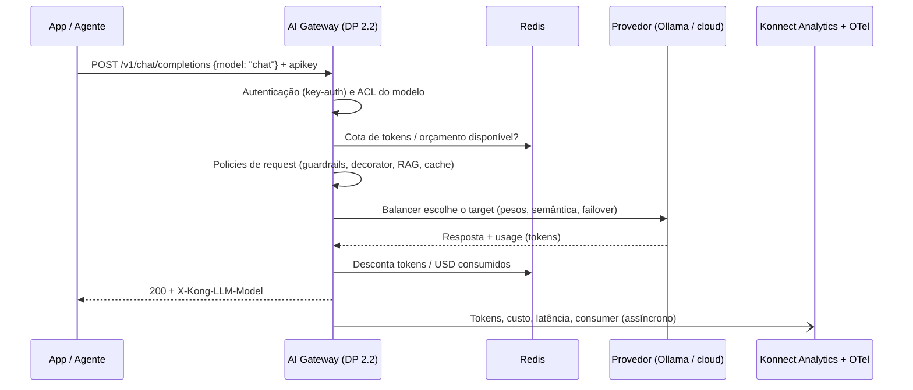

# Módulo IA 00: Arquitetura do AI Gateway 2.x no Konnect e kongctl

Nos Dias 1 e 2 trabalhamos com o Kong Gateway "clássico": Gateway Services, Routes e Plugins sobre um Control Plane do Konnect. O Dia 3 muda de plano: o **Kong AI Gateway 2.x** é um produto com seu **próprio Control Plane** e um modelo de entidades pensado para tráfego de IA (modelos, provedores, tools MCP e agentes). Este módulo explica essa arquitetura e a ferramenta com a qual vamos governá-la durante todo o dia: **kongctl**.

!!! info "Versões de referência do Dia 3 e do Dia 4"
    - **Kong AI Gateway 2.2.0** (lançado em 30/09/2026) — imagem do Data Plane `kong/kong-ai-gateway:2.2.0`.
    - **kongctl ≥ 1.20.1** — a 1.16 não conhece as entidades da 2.1 e da 2.2.
    - O Control Plane (AI Gateway no Konnect) e o Data Plane devem ter **exatamente** a mesma versão; se não coincidirem, o DP não recebe a configuração.

---

## 1. Por que um AI Gateway? (a história de um banco)

> "Cada equipe começou a usar IA por conta própria: chaves da OpenAI no código, agentes que chamam APIs internas sem controle e faturas que ninguém consegue explicar."

Este é o ponto de partida de quase todas as instituições financeiras com as quais trabalhamos. Os problemas são sempre os mesmos:

| Problema | Risco para o banco | Resposta do AI Gateway |
| :--- | :--- | :--- |
| Chaves de provedores de LLM espalhadas pelas aplicações | Vazamento de credenciais, gasto sem controle | As chaves ficam no **vault do Konnect**; as apps só têm uma API key corporativa |
| Cada app escolhe provedor e modelo | Dependência de um único provedor, sem plano de continuidade | **Modelos virtuais** com balanceamento e failover entre provedores (Módulo IA 01) |
| Prompts com dados de clientes saem para a internet | Descumprimento do sigilo bancário / proteção de dados | **Guardrails** e anonimização de PII antes da saída (Módulo IA 03) |
| Ninguém sabe quanto cada área gasta | FinOps impossível, surpresas na fatura | **Cotas em tokens e orçamento em USD** por consumidor (Módulo IA 02) e observabilidade de custos (Módulo IA 08) |
| Agentes que invocam APIs do core sem controle | Ações destrutivas não autorizadas | **MCP governado**: cada agente vê apenas suas tools (Módulo IA 06) e **A2A** com ACL (Módulo IA 07) |

O AI Gateway oferece **um único ponto de controle** para modelos, tools (MCP) e agentes (A2A), com identidade, segurança, custos e observabilidade, **sem alterar as aplicações**: elas continuam usando o SDK da OpenAI apontando para outra `base_url`.

---

## 2. De plugins a entidades: o que muda na 2.x

No AI Gateway 1.x (e no Dia 1 com o Kong Gateway) a IA era configurada com plugins (`ai-proxy-advanced`, `ai-prompt-guard`, `ai-mcp-proxy`...) sobre Services e Routes. Na **2.x** esses plugins são abstraídos em um **modelo de entidades próprio**, sobre um Control Plane dedicado. Não se criam mais Services, Routes nem plugins manualmente.

| Conceito 1.x / Kong Gateway | Entidade no AI Gateway 2.x | Para que serve |
| :--- | :--- | :--- |
| Configuração do `ai-proxy-advanced` | **AI Model** (`ai_gateway_models`) | Modelo **virtual** com um ou mais *targets*, balanceamento, rota e policies |
| Credenciais repetidas em cada plugin | **AI Model Provider** (`ai_gateway_model_providers`) | Credencial de um provedor declarada **uma vez** e reutilizada por todos os modelos |
| `ai-mcp-proxy` | **AI MCP Server** (`ai_gateway_mcp_servers`) | APIs REST como tools MCP, *bundling*, proxy de MCP externos |
| `ai-a2a-proxy` | **AI Agent** (`ai_gateway_agents`) | Tráfego agente-a-agente (A2A) com analytics próprios |
| Consumers / Consumer Groups | **AI Consumer / AI Consumer Group** | Identidade e ACL de modelos, tools e agentes |
| Plugins (`ai-sanitizer`, `ai-rate-limiting-advanced`...) | **AI Policy** (`ai_gateway_policies`) | Mesmo `type` e mesmo `config` do plugin equivalente |
| Vaults / certificados | **AI Vault**, **Config Store**, **Data Plane Certificates** | Segredos referenciáveis (`{vault://...}`) e mTLS do DP |
| Plugins custom (exigiam reconstruir imagens) | **Custom Policy** (`ai_gateway_custom_policies`, 2.2) | Lua publicado a partir do Konnect para os DP sem rebuild |

---

## 3. Arquitetura de referência (a que usaremos no Dia 4)



**Pontos-chave da arquitetura:**

- **Control Plane (Konnect):** o AI Gateway é uma entidade do Konnect com seus próprios endpoints de configuração e telemetria. Ali ficam modelos, provedores, policies, servidores MCP, agentes, consumers e o vault.
- **Data Plane:** um contêiner `kong/kong-ai-gateway:2.2.0` que se conecta via mTLS (certificado registrado no AI Gateway) e processa o tráfego. **Não guarda estado**: cotas, cache e vetores ficam no **Redis**, por isso escala para N réplicas.
- **Um único endpoint compatível com OpenAI:** `POST /v1/chat/completions`. O cliente escolhe um **alias** no campo `model` do body (`chat`, `codigo`, `auto`...) e o gateway decide provedor, target, failover, policies e custo.
- **Identidade:** o key-auth do AI Gateway usa o header `apikey`. Atenção: ele **não** remove o prefixo `Bearer`, por isso, com os SDKs da OpenAI, `apikey` é enviado como header extra (`default_headers`).

### Fluxo de uma requisição



---

## 4. kongctl: APIOps para o AI Gateway

Para o Kong Gateway usamos o **decK**. Para o AI Gateway 2.x a ferramenta declarativa é o **kongctl** (CLI oficial do Konnect). Todo o Dia 3 e o Dia 4 são configurados com YAML versionável; não há passos manuais na UI, exceto a criação do AI Gateway.

### 4.1 Estrutura dos arquivos

O curso separa a configuração por tema, assim como o Demo Track de AI Gateway 2.2 do qual ela provém:

```text
workshop-assets/dia-4/config/
├── base/
│   ├── 00-gateway.yaml        ← o AI Gateway (externo: o kongctl não o cria nem o apaga)
│   ├── 10-proveedores.yaml    ← provedor Ollama (local, sem chaves pagas)
│   └── 15-identidad.yaml      ← key-auth, consumers e consumer groups
├── lab_01_multi_llm.yaml      ← modelos chat, chat-resiliente, local-passthrough
├── lab_02_gobierno_cuotas.yaml
├── ...                        ← um arquivo por lab (cumulativos)
└── lab_09_desafio_credito.yaml
```

### 4.2 Conceitos que é preciso entender

```yaml
ai_gateways:
  - ref: lab-ai-gw
    _external:
      id: __AI_GATEWAY_ID__          # o gateway já existe; o kongctl só gerencia seus filhos

ai_gateway_model_providers:
  - ref: ollama
    ai_gateway: !ref lab-ai-gw#id   # referência a outra entidade declarada (mesmo que esteja em outro arquivo)
    name: ollama
    display_name: Ollama (local, open-weight)
    type: ollama
    config:
      auth:
        type: basic
```

| Elemento | Significado |
| :--- | :--- |
| `ref` | Identificador **local** da entidade dentro dos arquivos (não é o ID do Konnect) |
| `!ref <ref>#id` / `#name` | Referência a outra entidade: o kongctl resolve seu ID ou nome real |
| `_external` | A entidade já existe e **não** é gerenciada pelo kongctl (ele não a cria, não a modifica, não a apaga) |
| `!env VAR` | Obtém o valor de uma variável de ambiente (URLs, nomes de modelos) |
| `!secret {source: !env VAR}` | Igual a `!env`, mas o valor é tratado como segredo (API keys, tokens) |
| `{vault://llm-keys/clave}` | Referência que **o Data Plane resolve** em tempo de execução contra o vault do Konnect |

### 4.3 apply, sync e diff

| Comando | O que faz | Quando usar |
| :--- | :--- | :--- |
| `kongctl diff -f ...` | Mostra o que mudaria (criar / atualizar / **apagar**) | Sempre antes de aplicar, e no *pull request* |
| `kongctl apply -f ... --auto-approve` | Cria e atualiza; **nunca apaga** | Primeiro passo de um deploy |
| `kongctl sync -f ... --auto-approve` | Reconcilia: cria, atualiza e **apaga** o que não estiver declarado | Segundo passo: deixa o Konnect igual ao repositório |

!!! warning "O sync reconcilia por completo as coleções do AI Gateway"
    Com o gateway declarado como `_external`, o kongctl não mexe no gateway em si, mas **apaga sim** qualquer modelo, policy, servidor MCP, agente ou consumer desse gateway que não esteja nos arquivos. Por isso a ordem segura (herdada do Demo Track) é: **(1)** vault e segredos primeiro, **(2)** `apply` para criar/atualizar, **(3)** `sync` para apagar o que sobrar. O script `workshop-assets/dia-4/scripts/aplicar.sh` faz isso por você.

---

## 5. Roteiro de Demonstração (Passo a Passo)

> O instrutor usa seu próprio AI Gateway (`instructor-ai-gw`) e seu perfil **kong-env** (que exporta `KONNECT_TOKEN`, `DEMO_PREFIX` e, opcionalmente, as chaves dos provedores comerciais). Os participantes **não** precisam executar nada hoje: farão isso no [Lab IA 00](../../dia-4-ai-gateway-labs/Lab_IA_00_Setup.md).

### Demonstração 1: O AI Gateway no Konnect (5 min)

1. No Konnect, abrir **AI Gateway** → `instructor-ai-gw`. Mostrar que a **versão 2.2** está selecionada.
2. Percorrer as seções: **Models**, **Model Providers**, **Policies**, **MCP Servers**, **Agents**, **Consumers**, **Vaults**, **Data Plane Nodes**, **Analytics**.
3. Apontar em **Data Plane Nodes** que ainda não há nós conectados.

### Demonstração 2: Subir o Data Plane 2.2 (10 min)

```bash
kong-env aigw-curso                 # perfil do instrutor: KONNECT_TOKEN, DEMO_PREFIX=instructor, chaves opcionais
kongctl version                     # >= 1.20.1
./workshop-assets/dia-4/scripts/setup_lab.sh
```

Enquanto ele roda, explicar cada passo que o script imprime:

- Descobre o AI Gateway `instructor-ai-gw` pela API `GET /v1/ai-gateways` e guarda seu ID.
- Gera as API keys dos consumers **fora do repositório** (`~/.kong-workshop/aigw-lab/.env.generated`).
- Gera o certificado do DP e o registra com `POST /v1/ai-gateways/{id}/data-plane-certificates`.
- Lê os endpoints `configuration` e `telemetry` do gateway e sobe o DP 2.2 + Redis + WireMock + Ollama.
- Baixa os modelos open-weight e aplica a configuração base com o kongctl.

Ao terminar, voltar a **Data Plane Nodes**: o nó `aigw-lab-dp-instructor` aparece conectado com a versão 2.2.0.

### Demonstração 3: kongctl diff → apply → sync (10 min)

```bash
# O que mudaria se eu aplicar o lab 01?
./workshop-assets/dia-4/scripts/aplicar.sh 01 --diff

# Aplicar (apply + sync)
./workshop-assets/dia-4/scripts/aplicar.sh 01
```

- Mostrar no diff as operações `CREATE` dos modelos `chat`, `chat-resiliente` e `local-passthrough`.
- No Konnect → **Models**, mostrar os modelos recém-criados, seus *targets* e pesos.
- Executar novamente `aplicar.sh 00 --diff`: aparecem os `DELETE` desses três modelos. É a prova de que o `sync` reconcilia por completo (não aplicar; apenas mostrar).

### Demonstração 4: Primeira chamada (5 min)

```bash
source ~/.kong-workshop/aigw-lab/.env.generated
curl -s http://localhost:8010/v1/chat/completions \
  -H "apikey: $AIGW_KEY_EQUIPO_DATOS" -H "Content-Type: application/json" \
  -d '{"model":"chat","messages":[{"role":"user","content":"En una frase: ¿qué es una API?"}]}' | jq .
```

- Sem `apikey` → `401`. Com `apikey` → `200` e o header `X-Kong-LLM-Model` indica qual modelo real respondeu.

---

## 6. O que destacar (bancos e serviços financeiros)

!!! success "Mensagens para o comitê de arquitetura e risco"
    - **Segregação de funções:** a configuração fica no Git e é aplicada via pipeline (kongctl); a equipe de segurança aprova o *diff*, não um clique em um console. É evidência auditável para os reguladores.
    - **Residência de dados:** o Data Plane roda **na rede do banco** (on-premise ou nuvem privada). Pelo túnel com o Konnect trafegam configuração e telemetria, **nunca** o conteúdo dos prompts e respostas enviados ao provedor.
    - **Segredos fora das aplicações:** as chaves dos provedores ficam no vault e são resolvidas pelo DP; nenhuma app, desenvolvedor ou contêiner as vê.
    - **Escalabilidade sem estado:** cotas, cache e vetores no Redis; réplicas do DP são adicionadas sem perder contadores (crítico para limites de gasto).
    - **Mesma disciplina das APIs:** o banco já governa suas APIs com o Kong; a IA entra pelo mesmo modelo operacional (GitOps, observabilidade, RBAC do Konnect).

---

## 7. Resumo e próximo passo

| Pergunta | Resposta curta |
| :--- | :--- |
| Onde se configura? | No AI Gateway do Konnect, com o kongctl (YAML no Git) |
| Onde o tráfego roda? | No Data Plane `kong/kong-ai-gateway:2.2.0`, na rede do banco |
| O que muda para as apps? | Só a `base_url` e o header `apikey`; o `model` é um alias |
| Com o que é preciso ter cuidado? | Mesma versão CP/DP, kongctl ≥ 1.20.1, e o fato de que o `sync` apaga o que não estiver declarado |

➡️ Prática: [Lab IA 00 — Setup do AI Gateway](../../dia-4-ai-gateway-labs/Lab_IA_00_Setup.md)
