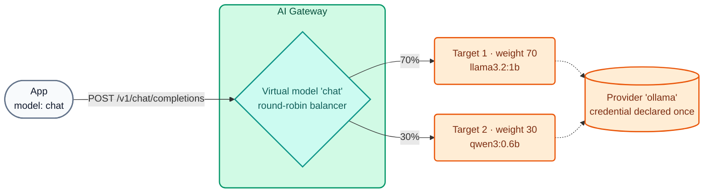

# AI Module 01: One endpoint, many LLMs

**Module message:** applications consume AI through **a single OpenAI-compatible endpoint** and **one corporate API key**. Which provider answers, with what weight, what happens if one goes down, and whether the model runs in the cloud or in the bank's own datacenter is decided by the **gateway**, not by the code.

---

## 1. Concepts

### 1.1 Virtual model, provider and target



| Entity | What it defines | Example in the course |
| :--- | :--- | :--- |
| **Model Provider** | Provider type and **credential** (header, query param, IAM...) | `ollama`, `openai`, `anthropic`, `gemini` |
| **Model** (virtual) | Route, alias (the body's `model`), format, access, load balancing, policies | `chat`, `chat-resiliente`, `codigo`, `auto` |
| **Target** | Real model + provider + weight + prices + optional `upstream_url` | `llama3.2:1b` on Ollama, `gpt-4.1-mini` on OpenAI |

- **Alias-based selection** (`route.model.body_param: model`): several virtual models share `/v1/chat/completions`; the gateway routes based on the value of `"model"` in the body. Since **2.1** a model accepts **multiple aliases** (`route.model.values: [chat, asistente-general]`), which is useful for migrations without touching the apps.
- **`model.name_header: true`**: the gateway returns `X-Kong-LLM-Model` with the real model that answered (ideal for demos and debugging).
- **Formats:** `openai` (the gateway translates into each provider's native format) or **`passthrough`** (2.2, see 1.4).

### 1.2 Load balancing and failover

| Parameter | Values | Use |
| :--- | :--- | :--- |
| `balancer.algorithm` | `round-robin` (with `weight`), `semantic` (AI Module 04), and the algorithms inherited from `ai-proxy-advanced` (`lowest-latency`, `lowest-usage`, `consistent-hashing`, `priority`) | Spread load, reduce costs, prioritize |
| `failover_criteria` | `error`, `timeout`, `http_429`, `http_500`, `http_502`, `http_503`, `http_504` | When to retry on another target |
| `retries` | integer | Maximum number of retries |

!!! tip "Transparent failover"
    If the primary provider responds with `503` or `429` (provider quota exhausted), the gateway retries on the next target **within the same request**. The client receives `200` and never notices. On Day 4 we simulate this with WireMock responding `503`.

### 1.3 Local open-weight models vs. commercial models

| Criterion | Local open-weight (Ollama, vLLM, NIM...) | Commercial (OpenAI, Anthropic, Gemini...) |
| :--- | :--- | :--- |
| Data | Never leaves the bank's network | Goes out to the provider (requires anonymization / a contract) |
| Cost | Own infrastructure (GPU/CPU); cost per token ≈ 0 | Per token, varies by model |
| Quality | Good for bounded tasks (classify, summarize, extract) | Superior at complex reasoning |
| Latency | Depends on the hardware (seconds on CPU) | Low and stable, dependent on the internet |
| Governance in the gateway | **Identical**: same API, same policies, quotas and analytics | **Identical** |

The most common pattern in banking is **hybrid**: sensitive data → local model; general tasks → commercial model; and local ↔ cloud failover for continuity. In the instructor's optional demo (`chat-hibrido`) the local model answers and, if it goes down, the cloud answers.

!!! note "Why Day 4 uses only small local models"
    So that no participant needs paid keys and everything runs on a laptop or a Codespace **without a GPU**: `llama3.2:1b` (~1.3 GB), `qwen3:0.6b` (~0.5 GB) and `nomic-embed-text` for embeddings. They are small models: they answer in seconds and their quality is limited, but the governance the gateway applies is exactly the same as with a frontier model.

### 1.4 Passthrough mode (AI Gateway 2.2, GA)

With `formats: [{type: passthrough}]` the gateway **does not transform the body**: the client speaks the backend's **native** API (for example Ollama's `/api/chat`, or the vLLM, NVIDIA NIM, Triton or a provider's *preview* APIs). Authentication, ACLs, rate limiting, logging and analytics still apply. Policies that modify the body (decorator, RAG, cache, guardrails) do **not** apply.

### 1.5 Pricing per target

Each target declares its price (USD per 1M tokens): `input_cost`, `output_cost`, `cache_read_cost`, `cache_write_cost` and, since **2.1**, **per-modality** prices (`input_cost_list` with `modal: text | image | audio | video`). These values feed Analytics, the USD budget (AI Module 02) and AI Cost Management (AI Module 08).

Other GA providers in 2.x that can be added with one more `ai_gateway_model_providers` entry: Kimi, Microsoft Foundry (`azure` + `foundry`), SageMaker and Bedrock AgentCore with AWS IAM / SigV4.

---

## 2. Configuration (kongctl)

File: `workshop-assets/dia-4/config/lab_01_multi_llm.yaml` (excerpt).

```yaml
ai_gateway_models:
  - ref: chat
    ai_gateway: !ref lab-ai-gw#id
    type: model
    name: chat
    display_name: Chat general (balanceo entre modelos locales)
    capabilities: [generate]
    formats: [{type: openai}]
    access:
      auth_strategies: [!ref lab-key-auth#name]
    config:
      route:
        paths: [/v1]
        methods: [POST]
        model: {body_param: model, values: [chat]}
      model: {name_header: true}
      balancer:
        algorithm: round-robin
        failover_criteria: [error, timeout, http_429, http_500, http_502, http_503]
        retries: 3
    targets:
      - name: !env AIGW_MODELO_GENERAL      # llama3.2:1b
        provider: ollama
        weight: 70
        config: {type: ollama, upstream_url: !env AIGW_OLLAMA_CHAT_URL, max_tokens: 256, input_cost: 0.05, output_cost: 0.20}
      - name: !env AIGW_MODELO_CODIGO       # qwen3:0.6b
        provider: ollama
        weight: 30
        config: {type: ollama, upstream_url: !env AIGW_OLLAMA_CHAT_URL, max_tokens: 256, input_cost: 0.05, output_cost: 0.20}
```

And in the demo with commercial providers (`workshop-assets/dia-3/config/demo_20_modelos_comerciales.yaml`), the same pattern with Gemini and OpenAI and the credential resolved from the vault:

```yaml
ai_gateway_model_providers:
  - ref: openai
    ai_gateway: !ref lab-ai-gw#id
    name: openai
    display_name: OpenAI
    type: openai
    config:
      auth:
        type: basic
        headers:
          - name: Authorization
            value: '{vault://llm-keys/openai-auth-header}'   # the DP resolves it; nobody else sees it
```

---

## 3. Demo Script (Step by Step)

Prerequisite: the instructor environment is up (AI Module 00) and lab 01 is applied:

```bash
./workshop-assets/dia-4/scripts/aplicar.sh 01
# Optional, with commercial keys in the instructor's kong-env profile:
WITH_CLOUD=1 ./workshop-assets/dia-4/scripts/aplicar.sh 02
```

Or fully guided: `./run_all_demos_dia3.sh` → option **Módulo IA 01**.

### Demo 1: No credential, no AI (2 min)

```bash
curl -s -o /dev/null -w "%{http_code}\n" http://localhost:8010/v1/chat/completions \
  -H "Content-Type: application/json" -d '{"model":"chat","messages":[{"role":"user","content":"hola"}]}'
# 401
```

### Demo 2: One alias, several models (8 min)

```bash
source ~/.kong-workshop/aigw-lab/.env.generated
for i in 1 2 3 4 5 6; do
  curl -s -D - -o /dev/null http://localhost:8010/v1/chat/completions \
    -H "apikey: $AIGW_KEY_EQUIPO_DATOS" -H "Content-Type: application/json" \
    -d '{"model":"chat","messages":[{"role":"user","content":"En una frase: ¿qué es una API?"}]}' \
    | grep -i x-kong-llm-model
done
```

**What to show:** the `X-Kong-LLM-Model` header alternates between `ollama/llama3.2:1b` (≈70%) and `ollama/qwen3:0.6b` (≈30%). The app never changed: it always sent `"model": "chat"`.

### Demo 3: Transparent failover (8 min)

```bash
# 1) The "primary provider" is down (direct call to the mock)
curl -s -o /dev/null -w "%{http_code}\n" -X POST http://localhost:8089/proveedor-caido/api/chat -d '{}'
# 503

# 2) The client still receives 200
curl -s -D - http://localhost:8010/v1/chat/completions \
  -H "apikey: $AIGW_KEY_EQUIPO_DATOS" -H "Content-Type: application/json" \
  -d '{"model":"chat-resiliente","messages":[{"role":"user","content":"Responde solo: el servicio está disponible"}]}' \
  | grep -iE "^HTTP|x-kong-llm-model"
```

**What to show:** the primary target (weight 100) points to `http://wiremock:8080/proveedor-caido/api/chat`; the gateway retries on the backup target according to `failover_criteria` and responds `200`.

### Demo 4: Passthrough of Ollama's native API (5 min)

```bash
curl -s http://localhost:8010/passthrough/ollama/api/chat \
  -H "apikey: $AIGW_KEY_EQUIPO_DATOS" -H "Content-Type: application/json" \
  -d '{"model":"llama3.2:1b","stream":false,"messages":[{"role":"user","content":"Di hola en una palabra"}]}' | jq '.message'
```

**What to show:** the response uses Ollama's native format (`.message.content`), not OpenAI's. Without `apikey` → `401`: governance applies all the same.

### Demo 5 (optional, `WITH_CLOUD=1`): commercial multi-provider and hybrid (7 min)

```bash
for m in chat-cloud chat-hibrido; do
  curl -s -D - -o /dev/null http://localhost:8010/v1/chat/completions \
    -H "apikey: $AIGW_KEY_EQUIPO_DATOS" -H "Content-Type: application/json" \
    -d "{\"model\":\"$m\",\"messages\":[{\"role\":\"user\",\"content\":\"Explica en 2 oraciones qué es una transferencia inmediata.\"}]}" \
    | grep -i x-kong-llm-model
done
```

- `chat-cloud` spreads traffic between `gemini/gemini-2.5-flash` and `openai/gpt-4.1-mini`.
- `chat-hibrido` answers with the local model; stop Ollama (`docker stop aigw-lab-ollama`) and repeat: `openai/gpt-4.1-mini` answers. Start it again when you are done.

### Demo 6: Apps do not change (5 min)

```python
from openai import OpenAI
client = OpenAI(
    base_url="http://localhost:8010/v1",
    api_key="no-se-usa",                                   # required by the SDK, ignored by the gateway
    default_headers={"apikey": "<AIGW_KEY_EQUIPO_DATOS>"},  # corporate identity
)
r = client.chat.completions.create(model="chat", messages=[{"role": "user", "content": "Hola"}])
print(r.choices[0].message.content)
```

---

## 4. What to highlight (banking and financial services)

!!! success "Key messages"
    - **Operational continuity:** failover between providers (or between local and cloud) is an **operational resilience** control that regulators require for critical services: an AI provider outage does not stop customer service.
    - **No provider dependency (*vendor lock-in*):** switching providers or models is a YAML change reviewed in a *pull request*, not a development project in every application.
    - **Data sovereignty:** use cases involving customer data can go to **local** models behind the same endpoint, with the same governance as commercial ones.
    - **Passthrough** makes it possible to onboard in-house inference engines (vLLM, NIM) without waiting for them to support the OpenAI schema.
    - **Cost per request from day one:** each target declares its price and every call is attributed to a consumer.

---

➡️ Hands-on: [AI Lab 01 — Multi-LLM, failover and passthrough](../../dia-4-ai-gateway-labs/Lab_IA_01_Multi_LLM_Failover.md)
