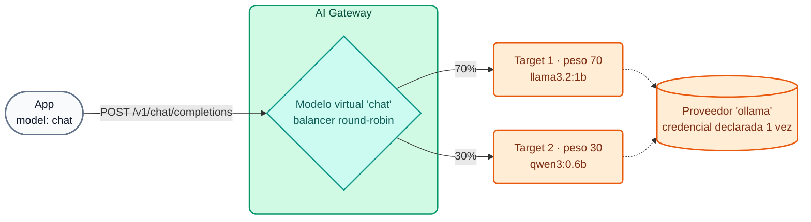

# Módulo IA 01: Un endpoint, muchos LLMs

**Mensaje del módulo:** las aplicaciones consumen IA con **un único endpoint compatible con OpenAI** y **una API key corporativa**. Qué proveedor responde, con qué peso, qué pasa si uno cae y si el modelo corre en la nube o en el propio datacenter lo decide el **gateway**, no el código.

---

## 1. Conceptos

### 1.1 Modelo virtual, proveedor y target



| Entidad | Qué define | Ejemplo en el curso |
| :--- | :--- | :--- |
| **Model Provider** | Tipo de proveedor y **credencial** (header, query param, IAM...) | `ollama`, `openai`, `anthropic`, `gemini` |
| **Model** (virtual) | Ruta, alias (`model` del body), formato, acceso, balanceo, policies | `chat`, `chat-resiliente`, `codigo`, `auto` |
| **Target** | Modelo real + proveedor + peso + precios + `upstream_url` opcional | `llama3.2:1b` en Ollama, `gpt-4.1-mini` en OpenAI |

- **Selección por alias** (`route.model.body_param: model`): varios modelos virtuales comparten `/v1/chat/completions`; el gateway enruta según el valor de `"model"` en el body. Desde **2.1** un modelo admite **varios alias** (`route.model.values: [chat, asistente-general]`), útil para migraciones sin tocar apps.
- **`model.name_header: true`**: el gateway devuelve `X-Kong-LLM-Model` con el modelo real que respondió (ideal para demos y para depurar).
- **Formatos:** `openai` (el gateway traduce al formato nativo de cada proveedor) o **`passthrough`** (2.2, ver 1.4).

### 1.2 Balanceo y failover

| Parámetro | Valores | Uso |
| :--- | :--- | :--- |
| `balancer.algorithm` | `round-robin` (con `weight`), `semantic` (Módulo IA 04), y los algoritmos heredados de `ai-proxy-advanced` (`lowest-latency`, `lowest-usage`, `consistent-hashing`, `priority`) | Repartir carga, abaratar, priorizar |
| `failover_criteria` | `error`, `timeout`, `http_429`, `http_500`, `http_502`, `http_503`, `http_504` | Cuándo reintentar en otro target |
| `retries` | entero | Cuántos reintentos como máximo |

!!! tip "Failover transparente"
    Si el proveedor principal responde `503` o `429` (cuota agotada del proveedor), el gateway reintenta en el siguiente target **dentro de la misma petición**. El cliente recibe `200` y nunca se entera. En el Día 4 lo simulamos con WireMock respondiendo `503`.

### 1.3 Modelos locales open-weight vs. comerciales

| Criterio | Open-weight local (Ollama, vLLM, NIM...) | Comercial (OpenAI, Anthropic, Gemini...) |
| :--- | :--- | :--- |
| Datos | No salen de la red del banco | Salen al proveedor (requiere anonimización / contrato) |
| Costo | Infraestructura propia (GPU/CPU); costo por token ≈ 0 | Por token, variable según modelo |
| Calidad | Buena para tareas acotadas (clasificar, resumir, extraer) | Superior en razonamiento complejo |
| Latencia | Depende del hardware (en CPU, segundos) | Baja y estable, dependiente de internet |
| Gobierno en el gateway | **Idéntico**: misma API, mismas policies, cuotas y analytics | **Idéntico** |

El patrón más común en banca es **híbrido**: datos sensibles → modelo local; tareas generales → modelo comercial; y failover local ↔ nube para continuidad. En la demo opcional del instructor (`chat-hibrido`) el modelo local atiende y, si cae, responde la nube.

!!! note "Por qué el Día 4 usa sólo modelos locales pequeños"
    Para que ningún participante necesite claves de pago y todo corra en una laptop o un Codespace **sin GPU**: `llama3.2:1b` (~1,3 GB), `qwen3:0.6b` (~0,5 GB) y `nomic-embed-text` para embeddings. Son modelos pequeños: responden en segundos y su calidad es limitada, pero el gobierno que aplica el gateway es exactamente el mismo que con un modelo frontier.

### 1.4 Modo passthrough (AI Gateway 2.2, GA)

Con `formats: [{type: passthrough}]` el gateway **no transforma el body**: el cliente habla la API **nativa** del backend (por ejemplo `/api/chat` de Ollama, o APIs de vLLM, NVIDIA NIM, Triton o APIs *preview* de un proveedor). Aun así aplican la autenticación, las ACL, el rate limiting, el logging y analytics. **No** aplican las policies que modifican el body (decorator, RAG, caché, guardrails).

### 1.5 Precios por target

Cada target declara su precio (USD por 1M de tokens): `input_cost`, `output_cost`, `cache_read_cost`, `cache_write_cost` y, desde **2.1**, precios **por modalidad** (`input_cost_list` con `modal: text | image | audio | video`). Esos valores alimentan Analytics, el presupuesto en USD (Módulo IA 02) y AI Cost Management (Módulo IA 08).

Otros proveedores GA en 2.x que pueden agregarse con un `ai_gateway_model_providers` más: Kimi, Microsoft Foundry (`azure` + `foundry`), SageMaker y Bedrock AgentCore con AWS IAM / SigV4.

---

## 2. Configuración (kongctl)

Archivo: `workshop-assets/dia-4/config/lab_01_multi_llm.yaml` (extracto).

```yaml
ai_gateway_models:
  - ref: chat
    ai_gateway: !ref lab-ai-gw#id
    type: model
    name: chat
    display_name: Chat general (balanceo entre modelos locales)
    capabilities: [generate]
    formats: [{type: openai}]
    access:
      auth_strategies: [!ref lab-key-auth#name]
    config:
      route:
        paths: [/v1]
        methods: [POST]
        model: {body_param: model, values: [chat]}
      model: {name_header: true}
      balancer:
        algorithm: round-robin
        failover_criteria: [error, timeout, http_429, http_500, http_502, http_503]
        retries: 3
    targets:
      - name: !env AIGW_MODELO_GENERAL      # llama3.2:1b
        provider: ollama
        weight: 70
        config: {type: ollama, upstream_url: !env AIGW_OLLAMA_CHAT_URL, max_tokens: 256, input_cost: 0.05, output_cost: 0.20}
      - name: !env AIGW_MODELO_CODIGO       # qwen3:0.6b
        provider: ollama
        weight: 30
        config: {type: ollama, upstream_url: !env AIGW_OLLAMA_CHAT_URL, max_tokens: 256, input_cost: 0.05, output_cost: 0.20}
```

Y en la demo con proveedores comerciales (`workshop-assets/dia-3/config/demo_20_modelos_comerciales.yaml`), el mismo patrón con Gemini y OpenAI y la credencial resuelta desde el vault:

```yaml
ai_gateway_model_providers:
  - ref: openai
    ai_gateway: !ref lab-ai-gw#id
    name: openai
    display_name: OpenAI
    type: openai
    config:
      auth:
        type: basic
        headers:
          - name: Authorization
            value: '{vault://llm-keys/openai-auth-header}'   # el DP la resuelve; nadie más la ve
```

---

## 3. Guion de Demostración (Paso a Paso)

Prerrequisito: entorno del instructor levantado (Módulo IA 00) y lab 01 aplicado:

```bash
./workshop-assets/dia-4/scripts/aplicar.sh 01
# Opcional, con claves comerciales en el perfil kong-env del instructor:
WITH_CLOUD=1 ./workshop-assets/dia-4/scripts/aplicar.sh 02
```

O todo guiado: `./run_all_demos_dia3.sh` → opción **Módulo IA 01**.

### Demostración 1: Sin credencial no hay IA (2 min)

```bash
curl -s -o /dev/null -w "%{http_code}\n" http://localhost:8010/v1/chat/completions \
  -H "Content-Type: application/json" -d '{"model":"chat","messages":[{"role":"user","content":"hola"}]}'
# 401
```

### Demostración 2: Un alias, varios modelos (8 min)

```bash
source ~/.kong-workshop/aigw-lab/.env.generated
for i in 1 2 3 4 5 6; do
  curl -s -D - -o /dev/null http://localhost:8010/v1/chat/completions \
    -H "apikey: $AIGW_KEY_EQUIPO_DATOS" -H "Content-Type: application/json" \
    -d '{"model":"chat","messages":[{"role":"user","content":"En una frase: ¿qué es una API?"}]}' \
    | grep -i x-kong-llm-model
done
```

**Qué mostrar:** el header `X-Kong-LLM-Model` alterna entre `ollama/llama3.2:1b` (≈70%) y `ollama/qwen3:0.6b` (≈30%). La app nunca cambió: siempre envió `"model": "chat"`.

### Demostración 3: Failover transparente (8 min)

```bash
# 1) El "proveedor principal" está caído (llamada directa al mock)
curl -s -o /dev/null -w "%{http_code}\n" -X POST http://localhost:8089/proveedor-caido/api/chat -d '{}'
# 503

# 2) El cliente igual recibe 200
curl -s -D - http://localhost:8010/v1/chat/completions \
  -H "apikey: $AIGW_KEY_EQUIPO_DATOS" -H "Content-Type: application/json" \
  -d '{"model":"chat-resiliente","messages":[{"role":"user","content":"Responde solo: el servicio está disponible"}]}' \
  | grep -iE "^HTTP|x-kong-llm-model"
```

**Qué mostrar:** el target principal (peso 100) apunta a `http://wiremock:8080/proveedor-caido/api/chat`; el gateway reintenta en el target de respaldo según `failover_criteria` y responde `200`.

### Demostración 4: Passthrough de la API nativa de Ollama (5 min)

```bash
curl -s http://localhost:8010/passthrough/ollama/api/chat \
  -H "apikey: $AIGW_KEY_EQUIPO_DATOS" -H "Content-Type: application/json" \
  -d '{"model":"llama3.2:1b","stream":false,"messages":[{"role":"user","content":"Di hola en una palabra"}]}' | jq '.message'
```

**Qué mostrar:** la respuesta tiene el formato nativo de Ollama (`.message.content`), no el de OpenAI. Sin `apikey` → `401`: el gobierno aplica igual.

### Demostración 5 (opcional, `WITH_CLOUD=1`): multi-proveedor comercial e híbrido (7 min)

```bash
for m in chat-cloud chat-hibrido; do
  curl -s -D - -o /dev/null http://localhost:8010/v1/chat/completions \
    -H "apikey: $AIGW_KEY_EQUIPO_DATOS" -H "Content-Type: application/json" \
    -d "{\"model\":\"$m\",\"messages\":[{\"role\":\"user\",\"content\":\"Explica en 2 oraciones qué es una transferencia inmediata.\"}]}" \
    | grep -i x-kong-llm-model
done
```

- `chat-cloud` reparte entre `gemini/gemini-2.5-flash` y `openai/gpt-4.1-mini`.
- `chat-hibrido` responde con el modelo local; detener Ollama (`docker stop aigw-lab-ollama`) y repetir: responde `openai/gpt-4.1-mini`. Volver a iniciarlo al terminar.

### Demostración 6: Las apps no cambian (5 min)

```python
from openai import OpenAI
client = OpenAI(
    base_url="http://localhost:8010/v1",
    api_key="no-se-usa",                                   # el SDK lo exige, el gateway lo ignora
    default_headers={"apikey": "<AIGW_KEY_EQUIPO_DATOS>"},  # identidad corporativa
)
r = client.chat.completions.create(model="chat", messages=[{"role": "user", "content": "Hola"}])
print(r.choices[0].message.content)
```

---

## 4. Qué destacar (banca y servicios financieros)

!!! success "Mensajes clave"
    - **Continuidad operativa:** el failover entre proveedores (o entre local y nube) es un control de **resiliencia operacional** que los reguladores piden para servicios críticos: la caída de un proveedor de IA no detiene la atención al cliente.
    - **Sin dependencia de un proveedor (*vendor lock-in*):** cambiar de proveedor o de modelo es un cambio de YAML revisado en un *pull request*, no un proyecto de desarrollo en cada aplicación.
    - **Soberanía del dato:** los casos con datos de clientes pueden ir a modelos **locales** detrás del mismo endpoint, con el mismo gobierno que los comerciales.
    - **Passthrough** permite incorporar motores de inferencia propios (vLLM, NIM) sin esperar a que soporten el esquema OpenAI.
    - **Costo por request desde el primer día:** cada target declara su precio y cada llamada queda atribuida a un consumer.

---

➡️ Práctica: [Lab IA 01 — Multi-LLM, failover y passthrough](../../dia-4-ai-gateway-labs/Lab_IA_01_Multi_LLM_Failover.md)
