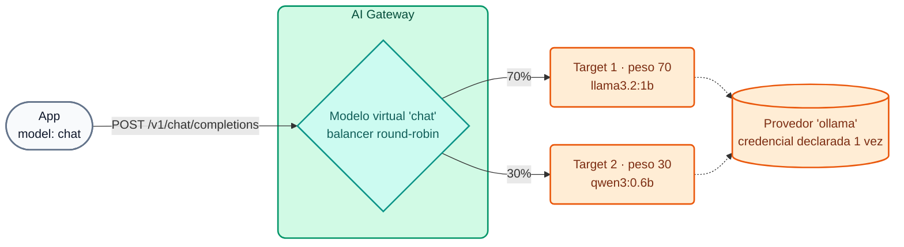

# Módulo IA 01: Um endpoint, muitos LLMs

**Mensagem do módulo:** as aplicações consomem IA com **um único endpoint compatível com OpenAI** e **uma API key corporativa**. Qual provedor responde, com que peso, o que acontece se um deles cair e se o modelo roda na nuvem ou no próprio datacenter é decidido pelo **gateway**, não pelo código.

---

## 1. Conceitos

### 1.1 Modelo virtual, provedor e target



| Entidade | O que define | Exemplo no curso |
| :--- | :--- | :--- |
| **Model Provider** | Tipo de provedor e **credencial** (header, query param, IAM...) | `ollama`, `openai`, `anthropic`, `gemini` |
| **Model** (virtual) | Rota, alias (`model` do body), formato, acesso, balanceamento, policies | `chat`, `chat-resiliente`, `codigo`, `auto` |
| **Target** | Modelo real + provedor + peso + preços + `upstream_url` opcional | `llama3.2:1b` no Ollama, `gpt-4.1-mini` na OpenAI |

- **Seleção por alias** (`route.model.body_param: model`): vários modelos virtuais compartilham `/v1/chat/completions`; o gateway roteia de acordo com o valor de `"model"` no body. Desde a **2.1** um modelo aceita **vários alias** (`route.model.values: [chat, asistente-general]`), útil para migrações sem mexer nas apps.
- **`model.name_header: true`**: o gateway devolve `X-Kong-LLM-Model` com o modelo real que respondeu (ideal para demos e para depuração).
- **Formatos:** `openai` (o gateway traduz para o formato nativo de cada provedor) ou **`passthrough`** (2.2, ver 1.4).

### 1.2 Balanceamento e failover

| Parâmetro | Valores | Uso |
| :--- | :--- | :--- |
| `balancer.algorithm` | `round-robin` (com `weight`), `semantic` (Módulo IA 04), e os algoritmos herdados do `ai-proxy-advanced` (`lowest-latency`, `lowest-usage`, `consistent-hashing`, `priority`) | Distribuir carga, reduzir custos, priorizar |
| `failover_criteria` | `error`, `timeout`, `http_429`, `http_500`, `http_502`, `http_503`, `http_504` | Quando tentar novamente em outro target |
| `retries` | inteiro | Quantas novas tentativas no máximo |

!!! tip "Failover transparente"
    Se o provedor principal responder `503` ou `429` (cota do provedor esgotada), o gateway tenta novamente no próximo target **dentro da mesma requisição**. O cliente recebe `200` e nunca fica sabendo. No Dia 4 simulamos isso com o WireMock respondendo `503`.

### 1.3 Modelos locais open-weight vs. comerciais

| Critério | Open-weight local (Ollama, vLLM, NIM...) | Comercial (OpenAI, Anthropic, Gemini...) |
| :--- | :--- | :--- |
| Dados | Não saem da rede do banco | Saem para o provedor (exige anonimização / contrato) |
| Custo | Infraestrutura própria (GPU/CPU); custo por token ≈ 0 | Por token, variável conforme o modelo |
| Qualidade | Boa para tarefas delimitadas (classificar, resumir, extrair) | Superior em raciocínio complexo |
| Latência | Depende do hardware (em CPU, segundos) | Baixa e estável, dependente da internet |
| Governança no gateway | **Idêntica**: mesma API, mesmas policies, cotas e analytics | **Idêntica** |

O padrão mais comum em bancos é o **híbrido**: dados sensíveis → modelo local; tarefas gerais → modelo comercial; e failover local ↔ nuvem para continuidade. Na demo opcional do instrutor (`chat-hibrido`) o modelo local atende e, se ele cair, a nuvem responde.

!!! note "Por que o Dia 4 usa apenas modelos locais pequenos"
    Para que nenhum participante precise de chaves pagas e tudo rode em um laptop ou em um Codespace **sem GPU**: `llama3.2:1b` (~1,3 GB), `qwen3:0.6b` (~0,5 GB) e `nomic-embed-text` para embeddings. São modelos pequenos: respondem em segundos e sua qualidade é limitada, mas a governança que o gateway aplica é exatamente a mesma que com um modelo frontier.

### 1.4 Modo passthrough (AI Gateway 2.2, GA)

Com `formats: [{type: passthrough}]` o gateway **não transforma o body**: o cliente fala a API **nativa** do backend (por exemplo `/api/chat` do Ollama, ou APIs do vLLM, NVIDIA NIM, Triton ou APIs *preview* de um provedor). Mesmo assim, continuam valendo a autenticação, as ACL, o rate limiting, o logging e o analytics. **Não** se aplicam as policies que modificam o body (decorator, RAG, cache, guardrails).

### 1.5 Preços por target

Cada target declara seu preço (USD por 1M de tokens): `input_cost`, `output_cost`, `cache_read_cost`, `cache_write_cost` e, desde a **2.1**, preços **por modalidade** (`input_cost_list` com `modal: text | image | audio | video`). Esses valores alimentam o Analytics, o orçamento em USD (Módulo IA 02) e o AI Cost Management (Módulo IA 08).

Outros provedores GA na 2.x que podem ser adicionados com mais um `ai_gateway_model_providers`: Kimi, Microsoft Foundry (`azure` + `foundry`), SageMaker e Bedrock AgentCore com AWS IAM / SigV4.

---

## 2. Configuração (kongctl)

Arquivo: `workshop-assets/dia-4/config/lab_01_multi_llm.yaml` (trecho).

```yaml
ai_gateway_models:
  - ref: chat
    ai_gateway: !ref lab-ai-gw#id
    type: model
    name: chat
    display_name: Chat general (balanceo entre modelos locales)
    capabilities: [generate]
    formats: [{type: openai}]
    access:
      auth_strategies: [!ref lab-key-auth#name]
    config:
      route:
        paths: [/v1]
        methods: [POST]
        model: {body_param: model, values: [chat]}
      model: {name_header: true}
      balancer:
        algorithm: round-robin
        failover_criteria: [error, timeout, http_429, http_500, http_502, http_503]
        retries: 3
    targets:
      - name: !env AIGW_MODELO_GENERAL      # llama3.2:1b
        provider: ollama
        weight: 70
        config: {type: ollama, upstream_url: !env AIGW_OLLAMA_CHAT_URL, max_tokens: 256, input_cost: 0.05, output_cost: 0.20}
      - name: !env AIGW_MODELO_CODIGO       # qwen3:0.6b
        provider: ollama
        weight: 30
        config: {type: ollama, upstream_url: !env AIGW_OLLAMA_CHAT_URL, max_tokens: 256, input_cost: 0.05, output_cost: 0.20}
```

E na demo com provedores comerciais (`workshop-assets/dia-3/config/demo_20_modelos_comerciales.yaml`), o mesmo padrão com Gemini e OpenAI e a credencial resolvida a partir do vault:

```yaml
ai_gateway_model_providers:
  - ref: openai
    ai_gateway: !ref lab-ai-gw#id
    name: openai
    display_name: OpenAI
    type: openai
    config:
      auth:
        type: basic
        headers:
          - name: Authorization
            value: '{vault://llm-keys/openai-auth-header}'   # o DP a resolve; ninguém mais a vê
```

---

## 3. Roteiro de Demonstração (Passo a Passo)

Pré-requisito: ambiente do instrutor em execução (Módulo IA 00) e lab 01 aplicado:

```bash
./workshop-assets/dia-4/scripts/aplicar.sh 01
# Opcional, com chaves comerciais no perfil kong-env do instrutor:
WITH_CLOUD=1 ./workshop-assets/dia-4/scripts/aplicar.sh 02
```

Ou tudo guiado: `./run_all_demos_dia3.sh` → opção **Módulo IA 01**.

### Demonstração 1: Sem credencial não há IA (2 min)

```bash
curl -s -o /dev/null -w "%{http_code}\n" http://localhost:8010/v1/chat/completions \
  -H "Content-Type: application/json" -d '{"model":"chat","messages":[{"role":"user","content":"hola"}]}'
# 401
```

### Demonstração 2: Um alias, vários modelos (8 min)

```bash
source ~/.kong-workshop/aigw-lab/.env.generated
for i in 1 2 3 4 5 6; do
  curl -s -D - -o /dev/null http://localhost:8010/v1/chat/completions \
    -H "apikey: $AIGW_KEY_EQUIPO_DATOS" -H "Content-Type: application/json" \
    -d '{"model":"chat","messages":[{"role":"user","content":"En una frase: ¿qué es una API?"}]}' \
    | grep -i x-kong-llm-model
done
```

**O que mostrar:** o header `X-Kong-LLM-Model` alterna entre `ollama/llama3.2:1b` (≈70%) e `ollama/qwen3:0.6b` (≈30%). A app nunca mudou: sempre enviou `"model": "chat"`.

### Demonstração 3: Failover transparente (8 min)

```bash
# 1) O "provedor principal" está fora do ar (chamada direta ao mock)
curl -s -o /dev/null -w "%{http_code}\n" -X POST http://localhost:8089/proveedor-caido/api/chat -d '{}'
# 503

# 2) Mesmo assim, o cliente recebe 200
curl -s -D - http://localhost:8010/v1/chat/completions \
  -H "apikey: $AIGW_KEY_EQUIPO_DATOS" -H "Content-Type: application/json" \
  -d '{"model":"chat-resiliente","messages":[{"role":"user","content":"Responde solo: el servicio está disponible"}]}' \
  | grep -iE "^HTTP|x-kong-llm-model"
```

**O que mostrar:** o target principal (peso 100) aponta para `http://wiremock:8080/proveedor-caido/api/chat`; o gateway tenta novamente no target de backup conforme `failover_criteria` e responde `200`.

### Demonstração 4: Passthrough da API nativa do Ollama (5 min)

```bash
curl -s http://localhost:8010/passthrough/ollama/api/chat \
  -H "apikey: $AIGW_KEY_EQUIPO_DATOS" -H "Content-Type: application/json" \
  -d '{"model":"llama3.2:1b","stream":false,"messages":[{"role":"user","content":"Di hola en una palabra"}]}' | jq '.message'
```

**O que mostrar:** a resposta tem o formato nativo do Ollama (`.message.content`), não o da OpenAI. Sem `apikey` → `401`: a governança se aplica da mesma forma.

### Demonstração 5 (opcional, `WITH_CLOUD=1`): multi-provedor comercial e híbrido (7 min)

```bash
for m in chat-cloud chat-hibrido; do
  curl -s -D - -o /dev/null http://localhost:8010/v1/chat/completions \
    -H "apikey: $AIGW_KEY_EQUIPO_DATOS" -H "Content-Type: application/json" \
    -d "{\"model\":\"$m\",\"messages\":[{\"role\":\"user\",\"content\":\"Explica en 2 oraciones qué es una transferencia inmediata.\"}]}" \
    | grep -i x-kong-llm-model
done
```

- `chat-cloud` distribui entre `gemini/gemini-2.5-flash` e `openai/gpt-4.1-mini`.
- `chat-hibrido` responde com o modelo local; parar o Ollama (`docker stop aigw-lab-ollama`) e repetir: responde `openai/gpt-4.1-mini`. Iniciá-lo novamente ao terminar.

### Demonstração 6: As apps não mudam (5 min)

```python
from openai import OpenAI
client = OpenAI(
    base_url="http://localhost:8010/v1",
    api_key="no-se-usa",                                   # o SDK exige, o gateway ignora
    default_headers={"apikey": "<AIGW_KEY_EQUIPO_DATOS>"},  # identidade corporativa
)
r = client.chat.completions.create(model="chat", messages=[{"role": "user", "content": "Hola"}])
print(r.choices[0].message.content)
```

---

## 4. O que destacar (bancos e serviços financeiros)

!!! success "Mensagens-chave"
    - **Continuidade operacional:** o failover entre provedores (ou entre local e nuvem) é um controle de **resiliência operacional** que os reguladores exigem para serviços críticos: a queda de um provedor de IA não interrompe o atendimento ao cliente.
    - **Sem dependência de um provedor (*vendor lock-in*):** trocar de provedor ou de modelo é uma mudança de YAML revisada em um *pull request*, não um projeto de desenvolvimento em cada aplicação.
    - **Soberania do dado:** os casos com dados de clientes podem ir para modelos **locais** atrás do mesmo endpoint, com a mesma governança dos comerciais.
    - **Passthrough** permite incorporar motores de inferência próprios (vLLM, NIM) sem esperar que eles suportem o esquema OpenAI.
    - **Custo por request desde o primeiro dia:** cada target declara seu preço e cada chamada fica atribuída a um consumer.

---

➡️ Prática: [Lab IA 01 — Multi-LLM, failover e passthrough](../../dia-4-ai-gateway-labs/Lab_IA_01_Multi_LLM_Failover.md)
