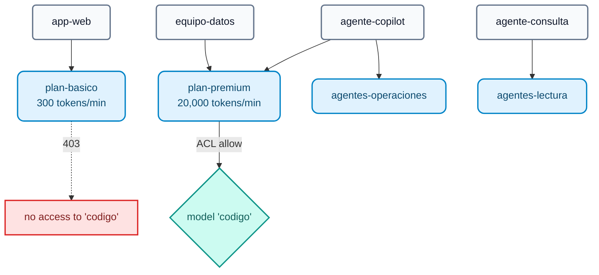

# AI Module 02: Governance — identity, per-model ACLs, token quotas and USD budgets

**Module message:** every application, team or agent has an **identity**. The gateway decides **which models** it can use and **how many tokens or dollars** it can consume. Quotas are measured in **tokens** and in **money**, not in number of requests: a 10-token request and a 10,000-token request do not cost the same.

---

## 1. Concepts

### 1.1 Identity in AI Gateway 2.x

| Entity | Role | In the course |
| :--- | :--- | :--- |
| **Auth Strategy** (`ai_gateway_auth_strategies`) | How the caller authenticates: `key-auth` or `openid-connect` | `lab-key-auth` (`apikey` header) |
| **AI Consumer** | The identity (app, team, agent) with one or more **credentials** | `app-web`, `equipo-datos`, `agente-copilot`, `agente-consulta` |
| **AI Consumer Group** | Plan / profile. ACLs and quotas are defined on it | `plan-basico`, `plan-premium`, `agentes-operaciones`, `agentes-lectura` |



### 1.2 ACLs per model (and per tool and per agent)

```yaml
access:
  auth_strategies: [!ref lab-key-auth#name]
  acls:
    allow: [plan-premium]        # or deny: [...]
```

- The same `access.acls` structure is used for **models**, **MCP tools** (AI Module 06) and **A2A agents** (AI Module 07): a single mental model of permissions for all AI traffic.
- Since **2.1** there are also the `condition` policy (expressions) and the `acl` policy with `allow_when` / `deny_when` (**CEL**) for richer rules (GA).

### 1.3 Token quotas: `ai-rate-limiting-advanced`

| Parameter | Values | What for |
| :--- | :--- | :--- |
| `tokens_count_strategy` | `total_tokens`, `prompt_tokens`, `completion_tokens`, `cost` | What is counted: tokens or **USD** |
| `window_type` | `sliding`, `fixed`, `calendar` | Sliding windows or **calendar** windows (day, month) with a time zone |
| `policies[].match` | `consumer_group`, `consumer`, `credential` (2.2), service (2.2) | Who each limit applies to; `partition_by: true` = one counter per value |
| `identifier: credential` | — | **2.2:** the limit applies to **each API key**, even if a consumer has several |
| `strategy: redis` | — | Shared counters: the quota is global even with N DP replicas |

### 1.4 Budget in money

With `tokens_count_strategy: cost` the limit is expressed in **USD**. The cost of each request is calculated with the prices declared in the target (`input_cost`, `output_cost`, per modality, cache read/write). Combined with `window_type: calendar` and `period: month` we get a **monthly budget per consumer**:

```yaml
policies:
  - window_type: calendar
    timezone: America/Sao_Paulo
    match:
      - {type: consumer, partition_by: true}
    limits:
      - {limit: 25, period: month, month_day: 1, tokens_count_strategy: cost}   # USD 25 per month
```

!!! note "Identity-aware AI policies"
    The 2.2 press announcement mentions *policies* per Kong Identity *principal*. The schema exposes `principals` in the auth strategies, but this is **not verified** in the changelog: in the course we use consumers and consumer groups.

---

## 2. Configuration (kongctl)

File: `workshop-assets/dia-4/config/lab_02_gobierno_cuotas.yaml`.

```yaml
ai_gateway_policies:
  - ref: cuota-tokens-por-plan
    ai_gateway: !ref lab-ai-gw#id
    name: cuota-tokens-por-plan
    display_name: Cuota de tokens por plan
    type: ai-rate-limiting-advanced
    config:
      strategy: redis
      redis: {host: redis-stack, port: 6379}
      sync_rate: 0
      window_type: sliding
      tokens_count_strategy: total_tokens
      error_message: 'Cuota de tokens del plan agotada. Reintente en unos segundos o solicite un plan superior: '
      policies:
        - match:
            - {type: consumer_group, values: [plan-basico]}
            - {type: consumer, partition_by: true}
          limits:
            - {limit: 300, window_size: 60}
        - match:
            - {type: consumer_group, values: [plan-premium]}
            - {type: consumer, partition_by: true}
          limits:
            - {limit: 20000, window_size: 60}

  - ref: cuota-tokens-por-credencial          # 2.2
    ...
    config:
      identifier: credential
      policies:
        - match: [{type: credential, partition_by: true}]
          limits: [{limit: 50000, window_size: 3600}]

ai_gateway_models:
  - ref: codigo
    ...
    access:
      auth_strategies: [!ref lab-key-auth#name]
      acls:
        allow: [plan-premium]
    policies:
      - !ref cuota-tokens-por-plan#name
```

Policies are **attached by name** in the `policies:` field of models, consumers, consumer groups, MCP servers or agents, or are marked `global: true` to apply to all traffic.

---

## 3. Demo Script (Step by Step)

```bash
./workshop-assets/dia-4/scripts/aplicar.sh 02
source ~/.kong-workshop/aigw-lab/.env.generated
```

Or fully guided: `./run_all_demos_dia3.sh` → option **Módulo IA 02**.

### Demo 1: Per-model ACL (5 min)

```bash
for key in "$AIGW_KEY_APP_WEB" "$AIGW_KEY_EQUIPO_DATOS"; do
  curl -s -o /dev/null -w "%{http_code}\n" http://localhost:8010/v1/chat/completions \
    -H "apikey: $key" -H "Content-Type: application/json" \
    -d '{"model":"codigo","messages":[{"role":"user","content":"Escribe hola mundo en Python"}]}'
done
# 403   (app-web, basic plan)
# 200   (equipo-datos, premium plan)
```

### Demo 2: TOKEN quota per plan (10 min)

```bash
for i in 1 2 3 4 5 6; do
  curl -s -D - -o /tmp/r.json http://localhost:8010/v1/chat/completions \
    -H "apikey: $AIGW_KEY_APP_WEB" -H "Content-Type: application/json" \
    -d '{"model":"chat-cuotas","messages":[{"role":"user","content":"Explica en 3 oraciones qué es una tasa de interés nominal anual."}]}' \
    | grep -iE "^HTTP|ratelimit"
  jq -r '.usage.total_tokens // .message // .error.message' /tmp/r.json
done
```

**What to show:**

- The `X-AI-RateLimit-*` headers (or similar) show the limit and what remains **in tokens**.
- By the 2nd–4th call `app-web` exceeds 300 tokens/min and receives **`429`** with the configured `error_message`.
- Repeat with `$AIGW_KEY_EQUIPO_DATOS`: no blocking (20,000 tokens/min).

### Demo 3: Monthly budget in USD (8 min)

```bash
for i in 1 2 3 4; do
  curl -s -o /dev/null -w "%{http_code}\n" http://localhost:8010/v1/chat/completions \
    -H "apikey: $AIGW_KEY_EQUIPO_DATOS" -H "Content-Type: application/json" \
    -d '{"model":"chat-presupuesto","messages":[{"role":"user","content":"Describe en 5 oraciones la diferencia entre TNA y TEA."}]}'
done
# 200 200 429 429   (from the 2nd-3rd call onwards the USD 0.02 budget is exhausted)
```

**What to show:** the `chat-presupuesto` model declares an illustrative "frontier" price (USD 20 / 80 per 1M tokens). The limit is **money**, not requests or tokens.

### Demo 4: Shared counters in Redis (3 min)

```bash
docker exec aigw-lab-redis redis-cli --scan | grep -viE 'kong_rag_injector|semantic|idx:' | head
```

With N Data Plane replicas there is still only one quota.

### Demo 5 (optional, `WITH_CLOUD=1`): budget on real commercial models

`chat-cloud` and `codigo-frontier` carry `presupuesto-mensual-usd` with the **real prices** of Gemini, OpenAI and Claude declared in the targets: in Konnect → **Analytics** you can see the cost per consumer and per model.

---

## 4. What to highlight (banking and financial services)

!!! success "Key messages"
    - **Least privilege applied to AI:** expensive or sensitive models (code generation, models with access to customer data) only for authorized groups. The same pattern applies to tools and agents.
    - **FinOps from the gateway:** a monthly USD budget per area or application, with a time zone and calendar month: it fits the bank's budget cycle and internal *chargeback*.
    - **Protection against abuse or agent loops:** a badly programmed agent can burn thousands of dollars in minutes; the per-credential token quota (2.2) cuts it off.
    - **Traceability for audit:** every request is attributed to a consumer and to a specific credential.
    - **A single quota even with N replicas** of the Data Plane (Redis), with no "leaks" due to load balancing.

---

➡️ Hands-on: [AI Lab 02 — Governance: ACLs, quotas and budget](../../dia-4-ai-gateway-labs/Lab_IA_02_Gobierno_Cuotas.md)
