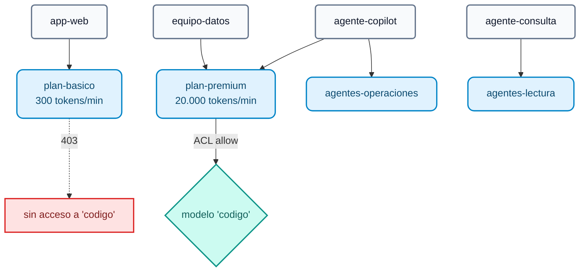

# Módulo IA 02: Gobierno — identidad, ACL por modelo, cuotas de tokens y presupuesto en USD

**Mensaje del módulo:** cada aplicación, equipo o agente tiene una **identidad**. El gateway decide **qué modelos** puede usar y **cuántos tokens o dólares** puede consumir. Las cuotas se miden en **tokens** y en **dinero**, no en número de peticiones: una petición de 10 tokens y otra de 10.000 no cuestan lo mismo.

---

## 1. Conceptos

### 1.1 Identidad en AI Gateway 2.x

| Entidad | Rol | En el curso |
| :--- | :--- | :--- |
| **Auth Strategy** (`ai_gateway_auth_strategies`) | Cómo se autentica quien llama: `key-auth` u `openid-connect` | `lab-key-auth` (header `apikey`) |
| **AI Consumer** | La identidad (app, equipo, agente) con una o más **credenciales** | `app-web`, `equipo-datos`, `agente-copilot`, `agente-consulta` |
| **AI Consumer Group** | Plan / perfil. Sobre él se definen ACL y cuotas | `plan-basico`, `plan-premium`, `agentes-operaciones`, `agentes-lectura` |



### 1.2 ACL por modelo (y por tool y por agente)

```yaml
access:
  auth_strategies: [!ref lab-key-auth#name]
  acls:
    allow: [plan-premium]        # o deny: [...]
```

- La misma estructura `access.acls` se usa en **modelos**, **tools MCP** (Módulo IA 06) y **agentes A2A** (Módulo IA 07): un único modelo mental de permisos para todo el tráfico de IA.
- Desde **2.1** existen además la policy `condition` (expresiones) y la policy `acl` con `allow_when` / `deny_when` (**CEL**) para reglas más ricas (GA).

### 1.3 Cuotas de tokens: `ai-rate-limiting-advanced`

| Parámetro | Valores | Para qué |
| :--- | :--- | :--- |
| `tokens_count_strategy` | `total_tokens`, `prompt_tokens`, `completion_tokens`, `cost` | Qué se cuenta: tokens o **USD** |
| `window_type` | `sliding`, `fixed`, `calendar` | Ventanas deslizantes o **calendario** (día, mes) con zona horaria |
| `policies[].match` | `consumer_group`, `consumer`, `credential` (2.2), servicio (2.2) | A quién aplica cada límite; `partition_by: true` = un contador por cada valor |
| `identifier: credential` | — | **2.2:** el límite se aplica a **cada API key**, aunque un consumer tenga varias |
| `strategy: redis` | — | Contadores compartidos: la cuota es global aunque haya N réplicas del DP |

### 1.4 Presupuesto en dinero

Con `tokens_count_strategy: cost` el límite se expresa en **USD**. El costo de cada petición se calcula con los precios declarados en el target (`input_cost`, `output_cost`, por modalidad, cache read/write). Combinado con `window_type: calendar` y `period: month` obtenemos un **presupuesto mensual por consumer**:

```yaml
policies:
  - window_type: calendar
    timezone: America/Sao_Paulo
    match:
      - {type: consumer, partition_by: true}
    limits:
      - {limit: 25, period: month, month_day: 1, tokens_count_strategy: cost}   # USD 25 por mes
```

!!! note "Identity-aware AI policies"
    El anuncio de prensa de 2.2 menciona *policies* por *principal* de Kong Identity. El esquema expone `principals` en las auth strategies, pero **no está verificado** en el changelog: en el curso usamos consumers y consumer groups.

---

## 2. Configuración (kongctl)

Archivo: `workshop-assets/dia-4/config/lab_02_gobierno_cuotas.yaml`.

```yaml
ai_gateway_policies:
  - ref: cuota-tokens-por-plan
    ai_gateway: !ref lab-ai-gw#id
    name: cuota-tokens-por-plan
    display_name: Cuota de tokens por plan
    type: ai-rate-limiting-advanced
    config:
      strategy: redis
      redis: {host: redis-stack, port: 6379}
      sync_rate: 0
      window_type: sliding
      tokens_count_strategy: total_tokens
      error_message: 'Cuota de tokens del plan agotada. Reintente en unos segundos o solicite un plan superior: '
      policies:
        - match:
            - {type: consumer_group, values: [plan-basico]}
            - {type: consumer, partition_by: true}
          limits:
            - {limit: 300, window_size: 60}
        - match:
            - {type: consumer_group, values: [plan-premium]}
            - {type: consumer, partition_by: true}
          limits:
            - {limit: 20000, window_size: 60}

  - ref: cuota-tokens-por-credencial          # 2.2
    ...
    config:
      identifier: credential
      policies:
        - match: [{type: credential, partition_by: true}]
          limits: [{limit: 50000, window_size: 3600}]

ai_gateway_models:
  - ref: codigo
    ...
    access:
      auth_strategies: [!ref lab-key-auth#name]
      acls:
        allow: [plan-premium]
    policies:
      - !ref cuota-tokens-por-plan#name
```

Las policies se **asocian por nombre** en `policies:` de modelos, consumers, consumer groups, servidores MCP o agentes, o se marcan `global: true` para aplicar a todo el tráfico.

---

## 3. Guion de Demostración (Paso a Paso)

```bash
./workshop-assets/dia-4/scripts/aplicar.sh 02
source ~/.kong-workshop/aigw-lab/.env.generated
```

O todo guiado: `./run_all_demos_dia3.sh` → opción **Módulo IA 02**.

### Demostración 1: ACL por modelo (5 min)

```bash
for key in "$AIGW_KEY_APP_WEB" "$AIGW_KEY_EQUIPO_DATOS"; do
  curl -s -o /dev/null -w "%{http_code}\n" http://localhost:8010/v1/chat/completions \
    -H "apikey: $key" -H "Content-Type: application/json" \
    -d '{"model":"codigo","messages":[{"role":"user","content":"Escribe hola mundo en Python"}]}'
done
# 403   (app-web, plan básico)
# 200   (equipo-datos, plan premium)
```

### Demostración 2: Cuota de TOKENS por plan (10 min)

```bash
for i in 1 2 3 4 5 6; do
  curl -s -D - -o /tmp/r.json http://localhost:8010/v1/chat/completions \
    -H "apikey: $AIGW_KEY_APP_WEB" -H "Content-Type: application/json" \
    -d '{"model":"chat-cuotas","messages":[{"role":"user","content":"Explica en 3 oraciones qué es una tasa de interés nominal anual."}]}' \
    | grep -iE "^HTTP|ratelimit"
  jq -r '.usage.total_tokens // .message // .error.message' /tmp/r.json
done
```

**Qué mostrar:**

- Los headers `X-AI-RateLimit-*` (o similares) muestran el límite y lo que queda **en tokens**.
- A la 2ª–4ª llamada `app-web` supera los 300 tokens/min y recibe **`429`** con el `error_message` configurado.
- Repetir con `$AIGW_KEY_EQUIPO_DATOS`: no hay bloqueo (20.000 tokens/min).

### Demostración 3: Presupuesto mensual en USD (8 min)

```bash
for i in 1 2 3 4; do
  curl -s -o /dev/null -w "%{http_code}\n" http://localhost:8010/v1/chat/completions \
    -H "apikey: $AIGW_KEY_EQUIPO_DATOS" -H "Content-Type: application/json" \
    -d '{"model":"chat-presupuesto","messages":[{"role":"user","content":"Describe en 5 oraciones la diferencia entre TNA y TEA."}]}'
done
# 200 200 429 429   (a partir de la 2ª-3ª llamada el presupuesto de USD 0,02 está agotado)
```

**Qué mostrar:** el modelo `chat-presupuesto` declara un precio "frontier" ilustrativo (USD 20 / 80 por 1M de tokens). El límite es **dinero**, no peticiones ni tokens.

### Demostración 4: Contadores compartidos en Redis (3 min)

```bash
docker exec aigw-lab-redis redis-cli --scan | grep -viE 'kong_rag_injector|semantic|idx:' | head
```

Con N réplicas del Data Plane la cuota sigue siendo una sola.

### Demostración 5 (opcional, `WITH_CLOUD=1`): presupuesto sobre modelos comerciales reales

`chat-cloud` y `codigo-frontier` llevan `presupuesto-mensual-usd` con los **precios reales** de Gemini, OpenAI y Claude declarados en los targets: en Konnect → **Analytics** se ve el costo por consumer y por modelo.

---

## 4. Qué destacar (banca y servicios financieros)

!!! success "Mensajes clave"
    - **Mínimo privilegio aplicado a la IA:** los modelos caros o sensibles (generación de código, modelos con acceso a datos de clientes) sólo para los grupos autorizados. Mismo patrón para tools y agentes.
    - **FinOps desde el gateway:** presupuesto mensual en USD por área o aplicación, con zona horaria y mes calendario: encaja con el ciclo presupuestario del banco y con el *chargeback* interno.
    - **Protección ante abuso o bucles de agentes:** un agente mal programado puede consumir miles de dólares en minutos; la cuota en tokens por credencial (2.2) lo corta.
    - **Trazabilidad para auditoría:** cada petición queda atribuida a un consumer y a una credencial concreta.
    - **Una sola cuota aunque haya N réplicas** del Data Plane (Redis), sin "fugas" por balanceo.

---

➡️ Práctica: [Lab IA 02 — Gobierno: ACL, cuotas y presupuesto](../../dia-4-ai-gateway-labs/Lab_IA_02_Gobierno_Cuotas.md)
