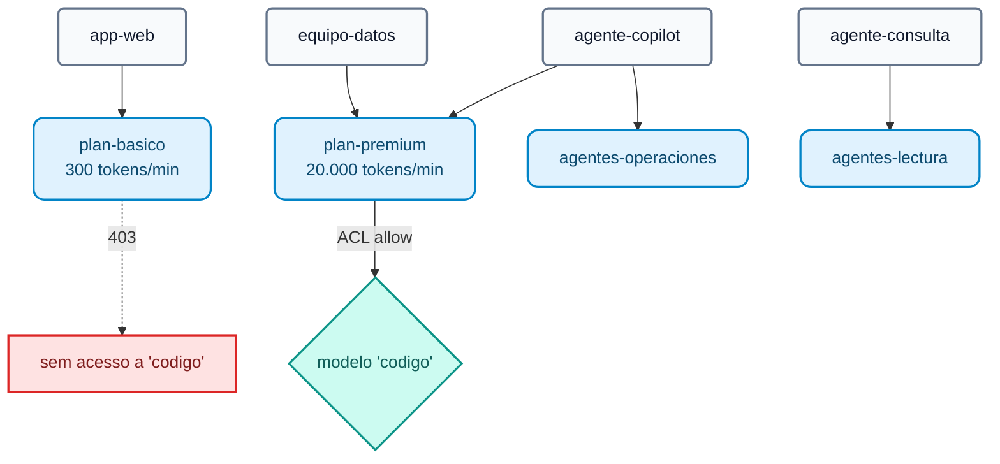

# Módulo IA 02: Governança — identidade, ACL por modelo, cotas de tokens e orçamento em USD

**Mensagem do módulo:** cada aplicação, equipe ou agente tem uma **identidade**. O gateway decide **quais modelos** ele pode usar e **quantos tokens ou dólares** pode consumir. As cotas são medidas em **tokens** e em **dinheiro**, não em número de requisições: uma requisição de 10 tokens e outra de 10.000 não custam o mesmo.

---

## 1. Conceitos

### 1.1 Identidade no AI Gateway 2.x

| Entidade | Papel | No curso |
| :--- | :--- | :--- |
| **Auth Strategy** (`ai_gateway_auth_strategies`) | Como quem chama se autentica: `key-auth` ou `openid-connect` | `lab-key-auth` (header `apikey`) |
| **AI Consumer** | A identidade (app, equipe, agente) com uma ou mais **credenciais** | `app-web`, `equipo-datos`, `agente-copilot`, `agente-consulta` |
| **AI Consumer Group** | Plano / perfil. Sobre ele são definidas ACL e cotas | `plan-basico`, `plan-premium`, `agentes-operaciones`, `agentes-lectura` |



### 1.2 ACL por modelo (e por tool e por agente)

```yaml
access:
  auth_strategies: [!ref lab-key-auth#name]
  acls:
    allow: [plan-premium]        # ou deny: [...]
```

- A mesma estrutura `access.acls` é usada em **modelos**, **tools MCP** (Módulo IA 06) e **agentes A2A** (Módulo IA 07): um único modelo mental de permissões para todo o tráfego de IA.
- Desde a **2.1** existem também a policy `condition` (expressões) e a policy `acl` com `allow_when` / `deny_when` (**CEL**) para regras mais ricas (GA).

### 1.3 Cotas de tokens: `ai-rate-limiting-advanced`

| Parâmetro | Valores | Para quê |
| :--- | :--- | :--- |
| `tokens_count_strategy` | `total_tokens`, `prompt_tokens`, `completion_tokens`, `cost` | O que é contado: tokens ou **USD** |
| `window_type` | `sliding`, `fixed`, `calendar` | Janelas deslizantes ou de **calendário** (dia, mês) com fuso horário |
| `policies[].match` | `consumer_group`, `consumer`, `credential` (2.2), serviço (2.2) | A quem cada limite se aplica; `partition_by: true` = um contador para cada valor |
| `identifier: credential` | — | **2.2:** o limite se aplica a **cada API key**, mesmo que um consumer tenha várias |
| `strategy: redis` | — | Contadores compartilhados: a cota é global mesmo que haja N réplicas do DP |

### 1.4 Orçamento em dinheiro

Com `tokens_count_strategy: cost` o limite é expresso em **USD**. O custo de cada requisição é calculado com os preços declarados no target (`input_cost`, `output_cost`, por modalidade, cache read/write). Combinado com `window_type: calendar` e `period: month`, obtemos um **orçamento mensal por consumer**:

```yaml
policies:
  - window_type: calendar
    timezone: America/Sao_Paulo
    match:
      - {type: consumer, partition_by: true}
    limits:
      - {limit: 25, period: month, month_day: 1, tokens_count_strategy: cost}   # USD 25 por mês
```

!!! note "Identity-aware AI policies"
    O anúncio de imprensa da 2.2 menciona *policies* por *principal* do Kong Identity. O esquema expõe `principals` nas auth strategies, mas isso **não está verificado** no changelog: no curso usamos consumers e consumer groups.

---

## 2. Configuração (kongctl)

Arquivo: `workshop-assets/dia-4/config/lab_02_gobierno_cuotas.yaml`.

```yaml
ai_gateway_policies:
  - ref: cuota-tokens-por-plan
    ai_gateway: !ref lab-ai-gw#id
    name: cuota-tokens-por-plan
    display_name: Cuota de tokens por plan
    type: ai-rate-limiting-advanced
    config:
      strategy: redis
      redis: {host: redis-stack, port: 6379}
      sync_rate: 0
      window_type: sliding
      tokens_count_strategy: total_tokens
      error_message: 'Cuota de tokens del plan agotada. Reintente en unos segundos o solicite un plan superior: '
      policies:
        - match:
            - {type: consumer_group, values: [plan-basico]}
            - {type: consumer, partition_by: true}
          limits:
            - {limit: 300, window_size: 60}
        - match:
            - {type: consumer_group, values: [plan-premium]}
            - {type: consumer, partition_by: true}
          limits:
            - {limit: 20000, window_size: 60}

  - ref: cuota-tokens-por-credencial          # 2.2
    ...
    config:
      identifier: credential
      policies:
        - match: [{type: credential, partition_by: true}]
          limits: [{limit: 50000, window_size: 3600}]

ai_gateway_models:
  - ref: codigo
    ...
    access:
      auth_strategies: [!ref lab-key-auth#name]
      acls:
        allow: [plan-premium]
    policies:
      - !ref cuota-tokens-por-plan#name
```

As policies são **associadas por nome** em `policies:` de modelos, consumers, consumer groups, servidores MCP ou agentes, ou são marcadas com `global: true` para se aplicarem a todo o tráfego.

---

## 3. Roteiro de Demonstração (Passo a Passo)

```bash
./workshop-assets/dia-4/scripts/aplicar.sh 02
source ~/.kong-workshop/aigw-lab/.env.generated
```

Ou tudo guiado: `./run_all_demos_dia3.sh` → opção **Módulo IA 02**.

### Demonstração 1: ACL por modelo (5 min)

```bash
for key in "$AIGW_KEY_APP_WEB" "$AIGW_KEY_EQUIPO_DATOS"; do
  curl -s -o /dev/null -w "%{http_code}\n" http://localhost:8010/v1/chat/completions \
    -H "apikey: $key" -H "Content-Type: application/json" \
    -d '{"model":"codigo","messages":[{"role":"user","content":"Escribe hola mundo en Python"}]}'
done
# 403   (app-web, plano básico)
# 200   (equipo-datos, plano premium)
```

### Demonstração 2: Cota de TOKENS por plano (10 min)

```bash
for i in 1 2 3 4 5 6; do
  curl -s -D - -o /tmp/r.json http://localhost:8010/v1/chat/completions \
    -H "apikey: $AIGW_KEY_APP_WEB" -H "Content-Type: application/json" \
    -d '{"model":"chat-cuotas","messages":[{"role":"user","content":"Explica en 3 oraciones qué es una tasa de interés nominal anual."}]}' \
    | grep -iE "^HTTP|ratelimit"
  jq -r '.usage.total_tokens // .message // .error.message' /tmp/r.json
done
```

**O que mostrar:**

- Os headers `X-AI-RateLimit-*` (ou similares) mostram o limite e o que resta **em tokens**.
- Entre a 2ª e a 4ª chamada, `app-web` ultrapassa os 300 tokens/min e recebe **`429`** com o `error_message` configurado.
- Repetir com `$AIGW_KEY_EQUIPO_DATOS`: não há bloqueio (20.000 tokens/min).

### Demonstração 3: Orçamento mensal em USD (8 min)

```bash
for i in 1 2 3 4; do
  curl -s -o /dev/null -w "%{http_code}\n" http://localhost:8010/v1/chat/completions \
    -H "apikey: $AIGW_KEY_EQUIPO_DATOS" -H "Content-Type: application/json" \
    -d '{"model":"chat-presupuesto","messages":[{"role":"user","content":"Describe en 5 oraciones la diferencia entre TNA y TEA."}]}'
done
# 200 200 429 429   (a partir da 2ª-3ª chamada o orçamento de USD 0,02 está esgotado)
```

**O que mostrar:** o modelo `chat-presupuesto` declara um preço "frontier" ilustrativo (USD 20 / 80 por 1M de tokens). O limite é **dinheiro**, não requisições nem tokens.

### Demonstração 4: Contadores compartilhados no Redis (3 min)

```bash
docker exec aigw-lab-redis redis-cli --scan | grep -viE 'kong_rag_injector|semantic|idx:' | head
```

Com N réplicas do Data Plane a cota continua sendo uma só.

### Demonstração 5 (opcional, `WITH_CLOUD=1`): orçamento sobre modelos comerciais reais

`chat-cloud` e `codigo-frontier` têm `presupuesto-mensual-usd` com os **preços reais** do Gemini, da OpenAI e do Claude declarados nos targets: no Konnect → **Analytics** é possível ver o custo por consumer e por modelo.

---

## 4. O que destacar (bancos e serviços financeiros)

!!! success "Mensagens-chave"
    - **Privilégio mínimo aplicado à IA:** os modelos caros ou sensíveis (geração de código, modelos com acesso a dados de clientes) ficam disponíveis apenas para os grupos autorizados. O mesmo padrão vale para tools e agentes.
    - **FinOps a partir do gateway:** orçamento mensal em USD por área ou aplicação, com fuso horário e mês-calendário: alinha-se ao ciclo orçamentário do banco e ao *chargeback* interno.
    - **Proteção contra abusos ou loops de agentes:** um agente mal programado pode consumir milhares de dólares em minutos; a cota em tokens por credencial (2.2) o interrompe.
    - **Rastreabilidade para auditoria:** cada requisição fica atribuída a um consumer e a uma credencial específica.
    - **Uma única cota mesmo com N réplicas** do Data Plane (Redis), sem "vazamentos" por balanceamento.

---

➡️ Prática: [Lab IA 02 — Governança: ACL, cotas e orçamento](../../dia-4-ai-gateway-labs/Lab_IA_02_Gobierno_Cuotas.md)
