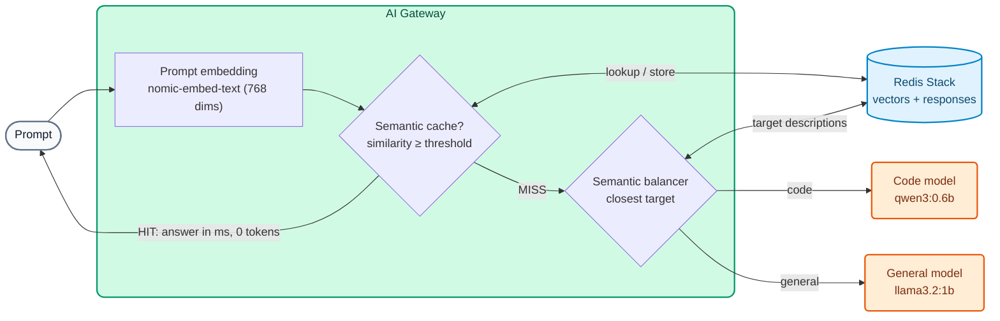

# AI Module 04: Semantics — semantic routing, semantic cache and compression

**Module message:** the gateway understands the **meaning** of prompts. With that, it can **choose the right model** for each question, **reuse answers** to equivalent questions and **compress** large prompts before sending them. The result: lower cost and lower latency **without changing the application**.

---

## 1. Concepts

### 1.1 Embeddings and vector database (common to all three techniques)

An *embedding* is a numeric vector that represents the meaning of a text. Two sentences with the same meaning have close vectors (high cosine similarity) even if they use different words.



In the course the embeddings are computed by **Ollama** (`nomic-embed-text`, 768 dimensions) and stored in **Redis Stack**. With commercial providers you would use, for example, OpenAI's `text-embedding-3-small` (1536 dimensions). **The dimensions must match** across all policies that share an index.

### 1.2 Semantic routing (`balancer.algorithm: semantic`)

1. The gateway computes the prompt's embedding.
2. It compares it with each target's `semantic_description` (vectors cached in Redis).
3. It sends the request to the closest target above the `threshold`. `X-Kong-LLM-Model` shows which one it was.

The application always sends `"model": "auto"`. Only the requests that need it pay for the premium model.

!!! warning "Changing descriptions requires deleting vectors"
    If you change a `semantic_description` or the `threshold`, you must delete the cached routing vectors (`workshop-assets/dia-4/scripts/reset_vectores.sh`). The Data Plane recreates them on the next request.

### 1.3 Semantic cache (`ai-semantic-cache`)

| Parameter | Effect |
| :--- | :--- |
| `cache_ttl` | How long a response lives in the cache (seconds) |
| `vectordb.threshold` | How similar two questions must be to be considered equivalent |
| `message_countback` | How many messages of the conversation are used for the key |
| `ignore_system_prompts` | Ignore the `system` message (useful if the decorator always adds the same one) |
| `stop_on_failure: false` | If Redis or the embeddings fail, the request still goes to the LLM |

The `X-Cache-Status` header shows `Miss` (it went to the LLM) or `Hit` (the cache answered, **0 tokens** and milliseconds).

### 1.4 Prompt compression with Headroom (AI Gateway 2.2, **tech preview**)

The `ai-prompt-compressor` policy with `provider: headroom` calls a **Headroom** service (container) before forwarding the prompt. It mainly compresses **structured content** (JSON, logs, tool outputs): in the Demo Track tests a list of 150 transactions went from **9,323 to 4,696 tokens** (≈50%). Short text passes through unchanged. With `stop_on_error: false`, if Headroom is unavailable the prompt passes through uncompressed.

!!! note "Status"
    Headroom compression is a **tech preview** in AI Gateway 2.2: it is shown as an instructor demo (`WITH_DEMO_EXTRAS=1`) and is not part of the Day 4 labs.

---

## 2. Configuration (kongctl)

File: `workshop-assets/dia-4/config/lab_04_semantica_cache.yaml` (excerpt).

```yaml
ai_gateway_models:
  - ref: auto
    ...
    config:
      balancer:
        algorithm: semantic
        failover_criteria: [error, timeout]
        embeddings:
          provider: ollama
          name: nomic-embed-text
          config: {type: ollama, upstream_url: !env AIGW_OLLAMA_URL}
        vectordb:
          type: redis
          host: redis-stack
          port: 6379
          dimensions: 768
          distance_metric: cosine
          threshold: 0.75
    targets:
      - name: !env AIGW_MODELO_CODIGO
        provider: ollama
        semantic_description: >-
          Escribir o corregir código. Generar una función, un script, una consulta SQL,
          endpoints REST, pruebas unitarias o la estructura de un proyecto. Write code.
        config: {type: ollama, upstream_url: !env AIGW_OLLAMA_CHAT_URL, max_tokens: 384}
      - name: !env AIGW_MODELO_GENERAL
        provider: ollama
        semantic_description: >-
          Explicar, resumir o comparar conceptos. Preguntas generales sobre productos
          bancarios, tarjetas, transferencias, regulación y atención al cliente.
        config: {type: ollama, upstream_url: !env AIGW_OLLAMA_CHAT_URL, max_tokens: 256}

ai_gateway_policies:
  - ref: cache-semantica
    ...
    type: ai-semantic-cache
    config:
      cache_ttl: 3600
      message_countback: 1
      ignore_system_prompts: true
      stop_on_failure: false
      embeddings:
        model: {provider: ollama, name: nomic-embed-text, options: {upstream_url: !env AIGW_OLLAMA_URL}}
      vectordb:
        strategy: redis
        dimensions: 768
        distance_metric: cosine
        threshold: 0.5
        redis: {host: redis-stack, port: 6379}
```

Compression (instructor demo, `workshop-assets/dia-3/config/demo_45_compresion.yaml`):

```yaml
type: ai-prompt-compressor
config:
  provider: headroom
  compressor_url: http://headroom:8787/v1/compress
  stop_on_error: false
  message_type: [user]
  compression_ranges:
    - {min_tokens: 200, max_tokens: 100000, value: 0.5}
  headroom:
    proxy_token: !env AIGW_HEADROOM_TOKEN
```

---

## 3. Demo Script (Step by Step)

```bash
./workshop-assets/dia-4/scripts/aplicar.sh 04
source ~/.kong-workshop/aigw-lab/.env.generated
```

Or fully guided: `./run_all_demos_dia3.sh` → option **Módulo IA 04**.

### Demo 1: The prompt picks the model (10 min)

```bash
for q in "Escribe una función en Python que valide un número de cuenta con dígito verificador módulo 11." \
         "¿Qué diferencia hay entre una tarjeta de débito y una de crédito? Responde breve."; do
  curl -s -D - -o /dev/null http://localhost:8010/v1/chat/completions \
    -H "apikey: $AIGW_KEY_EQUIPO_DATOS" -H "Content-Type: application/json" \
    -d "$(jq -cn --arg p "$q" '{model:"auto",messages:[{role:"user",content:$p}]}')" | grep -i x-kong-llm-model
done
# x-kong-llm-model: ollama/qwen3:0.6b     (code)
# x-kong-llm-model: ollama/llama3.2:1b    (general question)
```

### Demo 2: Semantic cache (10 min)

```bash
N=$(date +%s)   # makes the question unique on every run
for q in "Ref $N. ¿Cuál es el puerto por defecto de PostgreSQL?" \
         "Ref $N. ¿Qué port usa por defecto una base de datos postgres?" \
         "Ref $N. ¿Cómo funciona el garbage collector de Java? Muy breve."; do
  curl -s -D - -o /dev/null -w "%{time_total}s\n" http://localhost:8010/v1/chat/completions \
    -H "apikey: $AIGW_KEY_EQUIPO_DATOS" -H "Content-Type: application/json" \
    -d "$(jq -cn --arg p "$q" '{model:"chat-cache",messages:[{role:"user",content:$p}]}')" | grep -iE "x-cache-status|s$"
  sleep 2
done
# Miss (seconds) → Hit (milliseconds, same question in different words) → Miss (different question)
```

### Demo 3 (instructor, `WITH_DEMO_EXTRAS=1`): Compression with Headroom (8 min)

```bash
WITH_DEMO_EXTRAS=1 ./workshop-assets/dia-4/scripts/aplicar.sh 04
DATOS=$(python3 -c "import json; print(json.dumps([{'id':'tx-%d'%i,'tipo':'TRANSFERENCIA','monto':round(100+i*3.7,2),'estado':'OK','canal':'app'} for i in range(150)]))")
curl -s http://localhost:8010/v1/chat/completions -H "apikey: $AIGW_KEY_EQUIPO_DATOS" -H "Content-Type: application/json" \
  -d "$(jq -cn --arg p "Analiza estas transacciones y dime en una frase si ves algo anómalo: $DATOS" '{model:"chat-comprimido",messages:[{role:"user",content:$p}]}')" \
  | jq '.usage'
open http://localhost:8787/dashboard     # Headroom dashboard
```

**What to show:** `usage.prompt_tokens` is roughly half of what the uncompressed JSON would take; the Headroom dashboard shows the compression percentage.

---

## 4. What to highlight (banking and financial services)

!!! success "Key messages"
    - **Cost proportional to value:** semantic routing sends to the expensive model only what needs it (code, complex analysis) and everything else to cheap or local models.
    - **Contact centers:** frequent customer questions ("how much does the card cost?", "what are the branch opening hours?") repeat with a thousand different wordings; the semantic cache answers them in milliseconds at no cost.
    - **Be careful with personal data in the cache:** do not use the semantic cache on models that answer about a specific customer's data (balance, transactions). Attach it only to general-information models, with a `cache_ttl` matching how long the information stays valid (fees, opening hours).
    - **Agents and transaction analysis:** tool outputs and JSON batches are large; compression (tech preview) cuts tokens where spending is highest.

---

➡️ Hands-on: [AI Lab 04 — Semantic routing and cache](../../dia-4-ai-gateway-labs/Lab_IA_04_Semantica_Cache.md)
