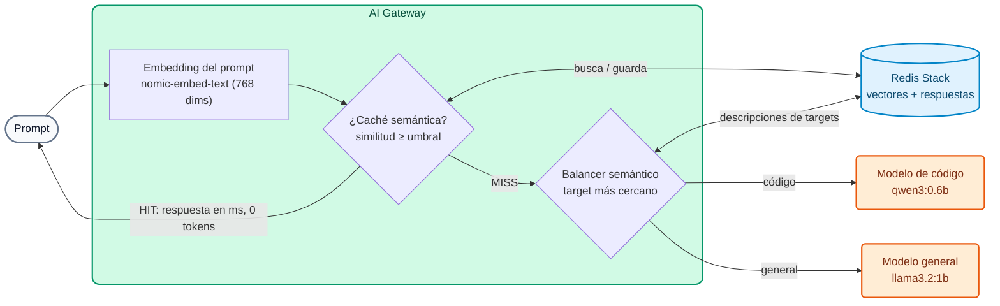

# Módulo IA 04: Semántica — ruteo semántico, caché semántica y compresión

**Mensaje del módulo:** el gateway entiende el **significado** de los prompts. Con eso puede **elegir el modelo** adecuado para cada pregunta, **reutilizar respuestas** a preguntas equivalentes y **comprimir** prompts grandes antes de enviarlos. Resultado: menos costo y menos latencia **sin cambiar la aplicación**.

---

## 1. Conceptos

### 1.1 Embeddings y base vectorial (lo común a las tres técnicas)

Un *embedding* es un vector numérico que representa el significado de un texto. Dos frases con el mismo significado tienen vectores cercanos (similitud coseno alta) aunque usen palabras distintas.



En el curso los embeddings los calcula **Ollama** (`nomic-embed-text`, 768 dimensiones) y se guardan en **Redis Stack**. Con proveedores comerciales se usaría, por ejemplo, `text-embedding-3-small` de OpenAI (1536 dimensiones). **Las dimensiones deben coincidir** en todas las policies que comparten índice.

### 1.2 Ruteo semántico (`balancer.algorithm: semantic`)

1. El gateway calcula el embedding del prompt.
2. Lo compara con la `semantic_description` de cada target (vectores cacheados en Redis).
3. Envía la petición al target más cercano por encima del `threshold`. `X-Kong-LLM-Model` muestra cuál fue.

La aplicación siempre envía `"model": "auto"`. Sólo las peticiones que lo necesitan pagan el modelo premium.

!!! warning "Cambiar descripciones requiere borrar vectores"
    Si se cambia una `semantic_description` o el `threshold`, hay que borrar los vectores de enrutamiento cacheados (`workshop-assets/dia-4/scripts/reset_vectores.sh`). El Data Plane los recrea en la siguiente petición.

### 1.3 Caché semántica (`ai-semantic-cache`)

| Parámetro | Efecto |
| :--- | :--- |
| `cache_ttl` | Cuánto vive una respuesta en caché (segundos) |
| `vectordb.threshold` | Qué tan parecidas deben ser dos preguntas para considerarlas equivalentes |
| `message_countback` | Cuántos mensajes de la conversación se usan para la clave |
| `ignore_system_prompts` | No tener en cuenta el `system` (útil si el decorator agrega siempre el mismo) |
| `stop_on_failure: false` | Si Redis o los embeddings fallan, la petición sigue al LLM |

El header `X-Cache-Status` indica `Miss` (fue al LLM) o `Hit` (respondió la caché, **0 tokens** y milisegundos).

### 1.4 Compresión de prompts con Headroom (AI Gateway 2.2, **tech preview**)

La policy `ai-prompt-compressor` con `provider: headroom` llama a un servicio **Headroom** (contenedor) antes de reenviar el prompt. Comprime sobre todo **contenido estructurado** (JSON, logs, salidas de tools): en las pruebas del Demo Track una lista de 150 transacciones pasó de **9.323 a 4.696 tokens** (≈50%). El texto corto pasa igual. Con `stop_on_error: false`, si Headroom no está disponible el prompt pasa sin comprimir.

!!! note "Estado"
    La compresión con Headroom es **tech preview** en AI Gateway 2.2: se muestra como demo del instructor (`WITH_DEMO_EXTRAS=1`), no forma parte de los labs del Día 4.

---

## 2. Configuración (kongctl)

Archivo: `workshop-assets/dia-4/config/lab_04_semantica_cache.yaml` (extracto).

```yaml
ai_gateway_models:
  - ref: auto
    ...
    config:
      balancer:
        algorithm: semantic
        failover_criteria: [error, timeout]
        embeddings:
          provider: ollama
          name: nomic-embed-text
          config: {type: ollama, upstream_url: !env AIGW_OLLAMA_URL}
        vectordb:
          type: redis
          host: redis-stack
          port: 6379
          dimensions: 768
          distance_metric: cosine
          threshold: 0.75
    targets:
      - name: !env AIGW_MODELO_CODIGO
        provider: ollama
        semantic_description: >-
          Escribir o corregir código. Generar una función, un script, una consulta SQL,
          endpoints REST, pruebas unitarias o la estructura de un proyecto. Write code.
        config: {type: ollama, upstream_url: !env AIGW_OLLAMA_CHAT_URL, max_tokens: 384}
      - name: !env AIGW_MODELO_GENERAL
        provider: ollama
        semantic_description: >-
          Explicar, resumir o comparar conceptos. Preguntas generales sobre productos
          bancarios, tarjetas, transferencias, regulación y atención al cliente.
        config: {type: ollama, upstream_url: !env AIGW_OLLAMA_CHAT_URL, max_tokens: 256}

ai_gateway_policies:
  - ref: cache-semantica
    ...
    type: ai-semantic-cache
    config:
      cache_ttl: 3600
      message_countback: 1
      ignore_system_prompts: true
      stop_on_failure: false
      embeddings:
        model: {provider: ollama, name: nomic-embed-text, options: {upstream_url: !env AIGW_OLLAMA_URL}}
      vectordb:
        strategy: redis
        dimensions: 768
        distance_metric: cosine
        threshold: 0.5
        redis: {host: redis-stack, port: 6379}
```

Compresión (demo del instructor, `workshop-assets/dia-3/config/demo_45_compresion.yaml`):

```yaml
type: ai-prompt-compressor
config:
  provider: headroom
  compressor_url: http://headroom:8787/v1/compress
  stop_on_error: false
  message_type: [user]
  compression_ranges:
    - {min_tokens: 200, max_tokens: 100000, value: 0.5}
  headroom:
    proxy_token: !env AIGW_HEADROOM_TOKEN
```

---

## 3. Guion de Demostración (Paso a Paso)

```bash
./workshop-assets/dia-4/scripts/aplicar.sh 04
source ~/.kong-workshop/aigw-lab/.env.generated
```

O todo guiado: `./run_all_demos_dia3.sh` → opción **Módulo IA 04**.

### Demostración 1: El prompt elige el modelo (10 min)

```bash
for q in "Escribe una función en Python que valide un número de cuenta con dígito verificador módulo 11." \
         "¿Qué diferencia hay entre una tarjeta de débito y una de crédito? Responde breve."; do
  curl -s -D - -o /dev/null http://localhost:8010/v1/chat/completions \
    -H "apikey: $AIGW_KEY_EQUIPO_DATOS" -H "Content-Type: application/json" \
    -d "$(jq -cn --arg p "$q" '{model:"auto",messages:[{role:"user",content:$p}]}')" | grep -i x-kong-llm-model
done
# x-kong-llm-model: ollama/qwen3:0.6b     (código)
# x-kong-llm-model: ollama/llama3.2:1b    (pregunta general)
```

### Demostración 2: Caché semántica (10 min)

```bash
N=$(date +%s)   # hace única la pregunta en cada ejecución
for q in "Ref $N. ¿Cuál es el puerto por defecto de PostgreSQL?" \
         "Ref $N. ¿Qué port usa por defecto una base de datos postgres?" \
         "Ref $N. ¿Cómo funciona el garbage collector de Java? Muy breve."; do
  curl -s -D - -o /dev/null -w "%{time_total}s\n" http://localhost:8010/v1/chat/completions \
    -H "apikey: $AIGW_KEY_EQUIPO_DATOS" -H "Content-Type: application/json" \
    -d "$(jq -cn --arg p "$q" '{model:"chat-cache",messages:[{role:"user",content:$p}]}')" | grep -iE "x-cache-status|s$"
  sleep 2
done
# Miss (segundos) → Hit (milisegundos, misma pregunta con otras palabras) → Miss (pregunta distinta)
```

### Demostración 3 (instructor, `WITH_DEMO_EXTRAS=1`): Compresión con Headroom (8 min)

```bash
WITH_DEMO_EXTRAS=1 ./workshop-assets/dia-4/scripts/aplicar.sh 04
DATOS=$(python3 -c "import json; print(json.dumps([{'id':'tx-%d'%i,'tipo':'TRANSFERENCIA','monto':round(100+i*3.7,2),'estado':'OK','canal':'app'} for i in range(150)]))")
curl -s http://localhost:8010/v1/chat/completions -H "apikey: $AIGW_KEY_EQUIPO_DATOS" -H "Content-Type: application/json" \
  -d "$(jq -cn --arg p "Analiza estas transacciones y dime en una frase si ves algo anómalo: $DATOS" '{model:"chat-comprimido",messages:[{role:"user",content:$p}]}')" \
  | jq '.usage'
open http://localhost:8787/dashboard     # dashboard de Headroom
```

**Qué mostrar:** `usage.prompt_tokens` es aproximadamente la mitad de lo que ocuparía el JSON sin comprimir; el dashboard de Headroom muestra el porcentaje de compresión.

---

## 4. Qué destacar (banca y servicios financieros)

!!! success "Mensajes clave"
    - **Costo proporcional al valor:** el ruteo semántico manda al modelo caro sólo lo que lo necesita (código, análisis complejo) y el resto a modelos baratos o locales.
    - **Centros de contacto:** las preguntas frecuentes de clientes ("¿cuánto cuesta la tarjeta?", "¿horario de sucursales?") se repiten con mil formulaciones distintas; la caché semántica las responde en milisegundos y sin costo.
    - **Cuidado con datos personales en caché:** no usar caché semántica en modelos que respondan sobre datos de un cliente concreto (saldo, movimientos). Asociarla sólo a modelos de información general, con `cache_ttl` acorde a la vigencia de la información (tarifas, horarios).
    - **Agentes y análisis de transacciones:** las salidas de tools y lotes JSON son grandes; la compresión (tech preview) reduce tokens donde más se gasta.

---

➡️ Práctica: [Lab IA 04 — Ruteo semántico y caché](../../dia-4-ai-gateway-labs/Lab_IA_04_Semantica_Cache.md)
