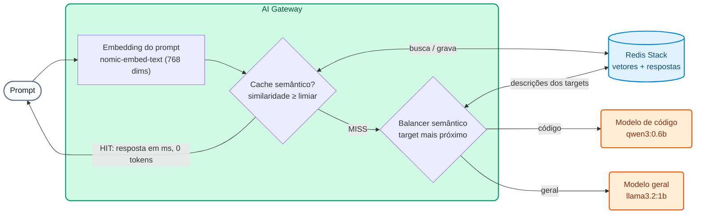

# Módulo IA 04: Semântica — roteamento semântico, cache semântico e compressão

**Mensagem do módulo:** o gateway entende o **significado** dos prompts. Com isso ele pode **escolher o modelo** adequado para cada pergunta, **reutilizar respostas** para perguntas equivalentes e **comprimir** prompts grandes antes de enviá-los. Resultado: menos custo e menos latência **sem alterar a aplicação**.

---

## 1. Conceitos

### 1.1 Embeddings e base vetorial (o que é comum às três técnicas)

Um *embedding* é um vetor numérico que representa o significado de um texto. Duas frases com o mesmo significado têm vetores próximos (similaridade de cosseno alta), mesmo que usem palavras diferentes.



No curso, os embeddings são calculados pelo **Ollama** (`nomic-embed-text`, 768 dimensões) e armazenados no **Redis Stack**. Com provedores comerciais seria usado, por exemplo, o `text-embedding-3-small` da OpenAI (1536 dimensões). **As dimensões devem coincidir** em todas as policies que compartilham um índice.

### 1.2 Roteamento semântico (`balancer.algorithm: semantic`)

1. O gateway calcula o embedding do prompt.
2. Compara-o com a `semantic_description` de cada target (vetores em cache no Redis).
3. Envia a requisição ao target mais próximo acima do `threshold`. `X-Kong-LLM-Model` mostra qual foi.

A aplicação sempre envia `"model": "auto"`. Apenas as requisições que precisam pagam pelo modelo premium.

!!! warning "Alterar descrições exige apagar vetores"
    Se uma `semantic_description` ou o `threshold` for alterado, é preciso apagar os vetores de roteamento em cache (`workshop-assets/dia-4/scripts/reset_vectores.sh`). O Data Plane os recria na requisição seguinte.

### 1.3 Cache semântico (`ai-semantic-cache`)

| Parâmetro | Efeito |
| :--- | :--- |
| `cache_ttl` | Quanto tempo uma resposta vive no cache (segundos) |
| `vectordb.threshold` | Quão parecidas duas perguntas devem ser para serem consideradas equivalentes |
| `message_countback` | Quantas mensagens da conversa são usadas para a chave |
| `ignore_system_prompts` | Não levar em conta o `system` (útil se o decorator sempre adiciona o mesmo) |
| `stop_on_failure: false` | Se o Redis ou os embeddings falharem, a requisição segue para o LLM |

O header `X-Cache-Status` indica `Miss` (foi ao LLM) ou `Hit` (o cache respondeu, **0 tokens** e milissegundos).

### 1.4 Compressão de prompts com Headroom (AI Gateway 2.2, **tech preview**)

A policy `ai-prompt-compressor` com `provider: headroom` chama um serviço **Headroom** (contêiner) antes de encaminhar o prompt. Ela comprime sobretudo **conteúdo estruturado** (JSON, logs, saídas de tools): nos testes do Demo Track, uma lista de 150 transações passou de **9.323 para 4.696 tokens** (≈50%). Texto curto passa sem alteração. Com `stop_on_error: false`, se o Headroom não estiver disponível, o prompt passa sem compressão.

!!! note "Status"
    A compressão com Headroom é **tech preview** no AI Gateway 2.2: é mostrada como demo do instrutor (`WITH_DEMO_EXTRAS=1`) e não faz parte dos labs do Dia 4.

---

## 2. Configuração (kongctl)

Arquivo: `workshop-assets/dia-4/config/lab_04_semantica_cache.yaml` (trecho).

```yaml
ai_gateway_models:
  - ref: auto
    ...
    config:
      balancer:
        algorithm: semantic
        failover_criteria: [error, timeout]
        embeddings:
          provider: ollama
          name: nomic-embed-text
          config: {type: ollama, upstream_url: !env AIGW_OLLAMA_URL}
        vectordb:
          type: redis
          host: redis-stack
          port: 6379
          dimensions: 768
          distance_metric: cosine
          threshold: 0.75
    targets:
      - name: !env AIGW_MODELO_CODIGO
        provider: ollama
        semantic_description: >-
          Escribir o corregir código. Generar una función, un script, una consulta SQL,
          endpoints REST, pruebas unitarias o la estructura de un proyecto. Write code.
        config: {type: ollama, upstream_url: !env AIGW_OLLAMA_CHAT_URL, max_tokens: 384}
      - name: !env AIGW_MODELO_GENERAL
        provider: ollama
        semantic_description: >-
          Explicar, resumir o comparar conceptos. Preguntas generales sobre productos
          bancarios, tarjetas, transferencias, regulación y atención al cliente.
        config: {type: ollama, upstream_url: !env AIGW_OLLAMA_CHAT_URL, max_tokens: 256}

ai_gateway_policies:
  - ref: cache-semantica
    ...
    type: ai-semantic-cache
    config:
      cache_ttl: 3600
      message_countback: 1
      ignore_system_prompts: true
      stop_on_failure: false
      embeddings:
        model: {provider: ollama, name: nomic-embed-text, options: {upstream_url: !env AIGW_OLLAMA_URL}}
      vectordb:
        strategy: redis
        dimensions: 768
        distance_metric: cosine
        threshold: 0.5
        redis: {host: redis-stack, port: 6379}
```

Compressão (demo do instrutor, `workshop-assets/dia-3/config/demo_45_compresion.yaml`):

```yaml
type: ai-prompt-compressor
config:
  provider: headroom
  compressor_url: http://headroom:8787/v1/compress
  stop_on_error: false
  message_type: [user]
  compression_ranges:
    - {min_tokens: 200, max_tokens: 100000, value: 0.5}
  headroom:
    proxy_token: !env AIGW_HEADROOM_TOKEN
```

---

## 3. Roteiro de Demonstração (Passo a Passo)

```bash
./workshop-assets/dia-4/scripts/aplicar.sh 04
source ~/.kong-workshop/aigw-lab/.env.generated
```

Ou tudo guiado: `./run_all_demos_dia3.sh` → opção **Módulo IA 04**.

### Demonstração 1: O prompt escolhe o modelo (10 min)

```bash
for q in "Escribe una función en Python que valide un número de cuenta con dígito verificador módulo 11." \
         "¿Qué diferencia hay entre una tarjeta de débito y una de crédito? Responde breve."; do
  curl -s -D - -o /dev/null http://localhost:8010/v1/chat/completions \
    -H "apikey: $AIGW_KEY_EQUIPO_DATOS" -H "Content-Type: application/json" \
    -d "$(jq -cn --arg p "$q" '{model:"auto",messages:[{role:"user",content:$p}]}')" | grep -i x-kong-llm-model
done
# x-kong-llm-model: ollama/qwen3:0.6b     (código)
# x-kong-llm-model: ollama/llama3.2:1b    (pergunta geral)
```

### Demonstração 2: Cache semântico (10 min)

```bash
N=$(date +%s)   # torna a pergunta única a cada execução
for q in "Ref $N. ¿Cuál es el puerto por defecto de PostgreSQL?" \
         "Ref $N. ¿Qué port usa por defecto una base de datos postgres?" \
         "Ref $N. ¿Cómo funciona el garbage collector de Java? Muy breve."; do
  curl -s -D - -o /dev/null -w "%{time_total}s\n" http://localhost:8010/v1/chat/completions \
    -H "apikey: $AIGW_KEY_EQUIPO_DATOS" -H "Content-Type: application/json" \
    -d "$(jq -cn --arg p "$q" '{model:"chat-cache",messages:[{role:"user",content:$p}]}')" | grep -iE "x-cache-status|s$"
  sleep 2
done
# Miss (segundos) → Hit (milissegundos, mesma pergunta com outras palavras) → Miss (pergunta diferente)
```

### Demonstração 3 (instrutor, `WITH_DEMO_EXTRAS=1`): Compressão com Headroom (8 min)

```bash
WITH_DEMO_EXTRAS=1 ./workshop-assets/dia-4/scripts/aplicar.sh 04
DATOS=$(python3 -c "import json; print(json.dumps([{'id':'tx-%d'%i,'tipo':'TRANSFERENCIA','monto':round(100+i*3.7,2),'estado':'OK','canal':'app'} for i in range(150)]))")
curl -s http://localhost:8010/v1/chat/completions -H "apikey: $AIGW_KEY_EQUIPO_DATOS" -H "Content-Type: application/json" \
  -d "$(jq -cn --arg p "Analiza estas transacciones y dime en una frase si ves algo anómalo: $DATOS" '{model:"chat-comprimido",messages:[{role:"user",content:$p}]}')" \
  | jq '.usage'
open http://localhost:8787/dashboard     # dashboard do Headroom
```

**O que mostrar:** `usage.prompt_tokens` é aproximadamente a metade do que o JSON ocuparia sem compressão; o dashboard do Headroom mostra a porcentagem de compressão.

---

## 4. O que destacar (bancos e serviços financeiros)

!!! success "Mensagens-chave"
    - **Custo proporcional ao valor:** o roteamento semântico envia ao modelo caro apenas o que precisa dele (código, análise complexa) e o restante a modelos baratos ou locais.
    - **Centrais de atendimento:** as perguntas frequentes de clientes ("quanto custa o cartão?", "horário das agências?") se repetem com mil formulações diferentes; o cache semântico as responde em milissegundos e sem custo.
    - **Cuidado com dados pessoais em cache:** não usar cache semântico em modelos que respondam sobre dados de um cliente específico (saldo, extrato). Associá-lo apenas a modelos de informação geral, com `cache_ttl` condizente com a validade da informação (tarifas, horários).
    - **Agentes e análise de transações:** as saídas de tools e os lotes JSON são grandes; a compressão (tech preview) reduz tokens onde mais se gasta.

---

➡️ Prática: [Lab IA 04 — Roteamento semântico e cache](../../dia-4-ai-gateway-labs/Lab_IA_04_Semantica_Cache.md)
