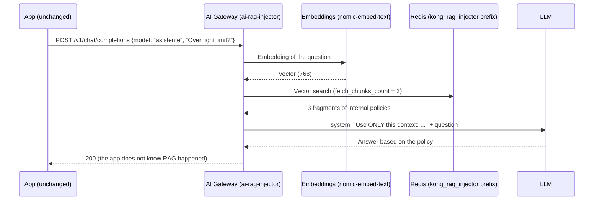

# AI Module 05: Gateway-managed RAG

**Module message:** the gateway adds the **context from internal documents** (policies, manuals, fee schedules) to the prompts. Applications **do not need** their own RAG pipeline or access to the vector database: they keep calling `/v1/chat/completions`.

---

## 1. Concepts

**RAG** (*Retrieval-Augmented Generation*) consists of searching for relevant fragments in a knowledge base and handing them to the model together with the question, so that it answers with the organization's own, up-to-date information instead of "making things up".



| `ai-rag-injector` parameter | Effect |
| :--- | :--- |
| `fetch_chunks_count` | How many fragments are injected |
| `inject_as_role` | Role of the injected message (`system` in the course) |
| `inject_template` | Template with the `<CONTEXT>` and `<PROMPT>` placeholders: defines the instructions for using the context |
| `vectordb_namespace` | Key prefix in Redis (`kong_rag_injector`) |
| `embeddings` / `vectordb` | Embeddings model and vector database (must match the ones used during loading) |
| `stop_on_failure` | If the search fails, is the request cut off or does it continue without context? |

**Document loading:** in the course this is done by `workshop-assets/dia-4/scripts/load_rag.sh`: it reads `workshop-assets/dia-4/rag/documentos.json` (6 "Banco Demo" policies: transfers, data classification, AI usage, fees, channels and consumer credit), computes the embeddings with Ollama and stores them in Redis with the prefix the policy reads.

!!! note "Separation of responsibilities"
    The **team that owns the knowledge** (Compliance, Product) maintains the documents; the **gateway** decides which models and which consumers use them; the **apps** only ask. In production, loading is usually a *pipeline* (for example, triggered when a new version of a policy is approved).

---

## 2. Configuration (kongctl)

File: `workshop-assets/dia-4/config/lab_05_rag.yaml` (excerpt).

```yaml
ai_gateway_policies:
  - ref: rag-banco
    ai_gateway: !ref lab-ai-gw#id
    name: rag-banco
    display_name: Base de conocimiento del banco (RAG)
    type: ai-rag-injector
    config:
      fetch_chunks_count: 3
      inject_as_role: system
      inject_template: |-
        Usa SOLO el siguiente contexto de documentos internos del Banco Demo para responder.
        Si la respuesta no está en el contexto, dilo.
        <CONTEXT>
        <PROMPT>
      stop_on_failure: false
      vectordb_namespace: kong_rag_injector
      embeddings:
        model: {provider: ollama, name: nomic-embed-text, options: {upstream_url: !env AIGW_OLLAMA_URL}}
      vectordb:
        strategy: redis
        dimensions: 768
        distance_metric: cosine
        redis: {host: redis-stack, port: 6379}

ai_gateway_models:
  - ref: asistente
    ...
    policies:
      - !ref rag-banco#name
```

---

## 3. Demo Script (Step by Step)

```bash
./workshop-assets/dia-4/scripts/load_rag.sh        # (setup_lab.sh already ran it)
./workshop-assets/dia-4/scripts/aplicar.sh 05
source ~/.kong-workshop/aigw-lab/.env.generated
```

Or fully guided: `./run_all_demos_dia3.sh` → option **Módulo IA 05**.

### Demo 1: The knowledge base (3 min)

```bash
docker exec aigw-lab-redis redis-cli --scan --pattern 'kong_rag_injector:*'
docker exec aigw-lab-redis redis-cli JSON.GET "$(docker exec aigw-lab-redis redis-cli --scan --pattern 'kong_rag_injector:*' | head -1)" '$.metadata'
```

### Demo 2: Same question, without and with RAG (10 min)

```bash
Q="¿Cuál es el límite por operación para transferencias entre las 22:00 y las 06:00 en el Banco Demo?"
for m in chat asistente; do
  echo "== $m"
  curl -s http://localhost:8010/v1/chat/completions -H "apikey: $AIGW_KEY_EQUIPO_DATOS" -H "Content-Type: application/json" \
    -d "$(jq -cn --arg m "$m" --arg p "$Q" '{model:$m,messages:[{role:"user",content:$p}]}')" | jq -r '.choices[0].message.content'
done
```

**What to show:**

- `chat` (without RAG): a generic or made-up answer.
- `asistente` (with RAG): quotes the real limit from the internal document (**USD 1,000** between 22:00 and 06:00).
- Konnect → **Analytics** (payloads of the `asistente` model): you can see the `system` message with the injected context.

---

## 4. What to highlight (banking and financial services)

!!! success "Key messages"
    - **Answers aligned with internal regulations:** the assistant answers with the policy currently in force, not with generic knowledge from the internet.
    - **A single source of truth:** changing a fee or a limit means updating the document in the knowledge base; every app answers differently instantly.
    - **Access control over knowledge:** only the models (and, through ACLs, only the consumers) that have the RAG policy can access that knowledge base. You can have separate knowledge bases per area (`vectordb_namespace`).
    - **Data that never leaves:** with local embeddings and a local model, neither the documents nor the questions leave the network.
    - **Mitigating hallucinations:** the template forces the model to say "it is not in the context" instead of making things up, which is key when the answer can have contractual effects.

---

➡️ Hands-on: [AI Lab 05 — RAG](../../dia-4-ai-gateway-labs/Lab_IA_05_RAG.md)
