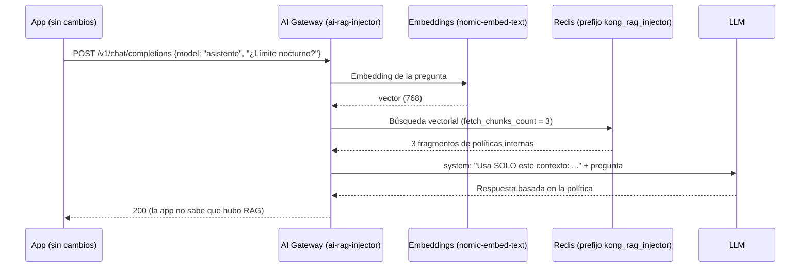

# Módulo IA 05: RAG gestionado por el gateway

**Mensaje del módulo:** el gateway agrega a los prompts el **contexto de los documentos internos** (políticas, manuales, tarifarios). Las aplicaciones **no necesitan** su propio pipeline de RAG ni acceso a la base vectorial: siguen llamando a `/v1/chat/completions`.

---

## 1. Conceptos

**RAG** (*Retrieval-Augmented Generation*) consiste en buscar fragmentos relevantes en una base de conocimiento y entregárselos al modelo junto con la pregunta, para que responda con información propia y actualizada en lugar de "inventar".



| Parámetro de `ai-rag-injector` | Efecto |
| :--- | :--- |
| `fetch_chunks_count` | Cuántos fragmentos se inyectan |
| `inject_as_role` | Rol del mensaje inyectado (`system` en el curso) |
| `inject_template` | Plantilla con los marcadores `<CONTEXT>` y `<PROMPT>`: define las instrucciones de uso del contexto |
| `vectordb_namespace` | Prefijo de las claves en Redis (`kong_rag_injector`) |
| `embeddings` / `vectordb` | Modelo de embeddings y base vectorial (deben coincidir con los usados al cargar) |
| `stop_on_failure` | Si falla la búsqueda, ¿se corta la petición o sigue sin contexto? |

**Carga de documentos:** en el curso la hace `workshop-assets/dia-4/scripts/load_rag.sh`: lee `workshop-assets/dia-4/rag/documentos.json` (6 políticas del "Banco Demo": transferencias, clasificación de datos, uso de IA, tarifas, canales y crédito de consumo), calcula los embeddings con Ollama y los guarda en Redis con el prefijo que lee la policy.

!!! note "Separación de responsabilidades"
    El **equipo dueño del conocimiento** (Cumplimiento, Producto) mantiene los documentos; el **gateway** decide qué modelos y qué consumidores los usan; las **apps** sólo preguntan. En producción la carga suele ser un *pipeline* (por ejemplo, al aprobar una nueva versión de una política).

---

## 2. Configuración (kongctl)

Archivo: `workshop-assets/dia-4/config/lab_05_rag.yaml` (extracto).

```yaml
ai_gateway_policies:
  - ref: rag-banco
    ai_gateway: !ref lab-ai-gw#id
    name: rag-banco
    display_name: Base de conocimiento del banco (RAG)
    type: ai-rag-injector
    config:
      fetch_chunks_count: 3
      inject_as_role: system
      inject_template: |-
        Usa SOLO el siguiente contexto de documentos internos del Banco Demo para responder.
        Si la respuesta no está en el contexto, dilo.
        <CONTEXT>
        <PROMPT>
      stop_on_failure: false
      vectordb_namespace: kong_rag_injector
      embeddings:
        model: {provider: ollama, name: nomic-embed-text, options: {upstream_url: !env AIGW_OLLAMA_URL}}
      vectordb:
        strategy: redis
        dimensions: 768
        distance_metric: cosine
        redis: {host: redis-stack, port: 6379}

ai_gateway_models:
  - ref: asistente
    ...
    policies:
      - !ref rag-banco#name
```

---

## 3. Guion de Demostración (Paso a Paso)

```bash
./workshop-assets/dia-4/scripts/load_rag.sh        # (setup_lab.sh ya lo ejecutó)
./workshop-assets/dia-4/scripts/aplicar.sh 05
source ~/.kong-workshop/aigw-lab/.env.generated
```

O todo guiado: `./run_all_demos_dia3.sh` → opción **Módulo IA 05**.

### Demostración 1: La base de conocimiento (3 min)

```bash
docker exec aigw-lab-redis redis-cli --scan --pattern 'kong_rag_injector:*'
docker exec aigw-lab-redis redis-cli JSON.GET "$(docker exec aigw-lab-redis redis-cli --scan --pattern 'kong_rag_injector:*' | head -1)" '$.metadata'
```

### Demostración 2: Misma pregunta, sin y con RAG (10 min)

```bash
Q="¿Cuál es el límite por operación para transferencias entre las 22:00 y las 06:00 en el Banco Demo?"
for m in chat asistente; do
  echo "== $m"
  curl -s http://localhost:8010/v1/chat/completions -H "apikey: $AIGW_KEY_EQUIPO_DATOS" -H "Content-Type: application/json" \
    -d "$(jq -cn --arg m "$m" --arg p "$Q" '{model:$m,messages:[{role:"user",content:$p}]}')" | jq -r '.choices[0].message.content'
done
```

**Qué mostrar:**

- `chat` (sin RAG): respuesta genérica o inventada.
- `asistente` (con RAG): cita el límite real del documento interno (**USD 1.000** entre las 22:00 y las 06:00).
- Konnect → **Analytics** (payloads del modelo `asistente`): se ve el mensaje `system` con el contexto inyectado.

---

## 4. Qué destacar (banca y servicios financieros)

!!! success "Mensajes clave"
    - **Respuestas alineadas a la normativa interna:** el asistente responde con la política vigente, no con conocimiento genérico de internet.
    - **Una sola fuente de verdad:** cambiar una tarifa o un límite es actualizar el documento en la base; todas las apps responden distinto al instante.
    - **Control de acceso al conocimiento:** sólo los modelos (y por ACL, sólo los consumidores) que tienen la policy RAG acceden a esa base. Se pueden tener bases distintas por área (`vectordb_namespace`).
    - **Datos que no salen:** con embeddings y modelo locales, ni los documentos ni las preguntas salen de la red.
    - **Mitigar alucinaciones:** la plantilla obliga a decir "no está en el contexto" en lugar de inventar, clave cuando la respuesta puede tener efectos contractuales.

---

➡️ Práctica: [Lab IA 05 — RAG](../../dia-4-ai-gateway-labs/Lab_IA_05_RAG.md)
