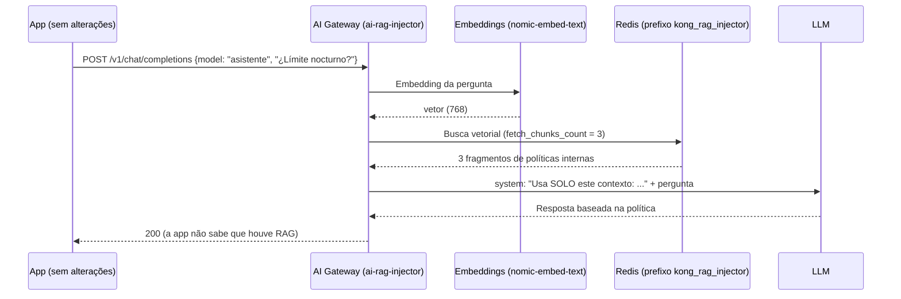

# Módulo IA 05: RAG gerenciado pelo gateway

**Mensagem do módulo:** o gateway adiciona aos prompts o **contexto dos documentos internos** (políticas, manuais, tabelas de tarifas). As aplicações **não precisam** de seu próprio pipeline de RAG nem de acesso à base vetorial: elas continuam chamando `/v1/chat/completions`.

---

## 1. Conceitos

**RAG** (*Retrieval-Augmented Generation*) consiste em buscar fragmentos relevantes em uma base de conhecimento e entregá-los ao modelo junto com a pergunta, para que ele responda com informação própria e atualizada em vez de "inventar".



| Parâmetro do `ai-rag-injector` | Efeito |
| :--- | :--- |
| `fetch_chunks_count` | Quantos fragmentos são injetados |
| `inject_as_role` | Papel da mensagem injetada (`system` no curso) |
| `inject_template` | Template com os marcadores `<CONTEXT>` e `<PROMPT>`: define as instruções de uso do contexto |
| `vectordb_namespace` | Prefixo das chaves no Redis (`kong_rag_injector`) |
| `embeddings` / `vectordb` | Modelo de embeddings e base vetorial (devem coincidir com os usados na carga) |
| `stop_on_failure` | Se a busca falhar, a requisição é interrompida ou segue sem contexto? |

**Carga de documentos:** no curso ela é feita por `workshop-assets/dia-4/scripts/load_rag.sh`: lê `workshop-assets/dia-4/rag/documentos.json` (6 políticas do "Banco Demo": transferências, classificação de dados, uso de IA, tarifas, canais e crédito ao consumidor), calcula os embeddings com o Ollama e os grava no Redis com o prefixo que a policy lê.

!!! note "Separação de responsabilidades"
    A **equipe dona do conhecimento** (Compliance, Produto) mantém os documentos; o **gateway** decide quais modelos e quais consumidores os usam; as **apps** apenas perguntam. Em produção, a carga costuma ser um *pipeline* (por exemplo, ao aprovar uma nova versão de uma política).

---

## 2. Configuração (kongctl)

Arquivo: `workshop-assets/dia-4/config/lab_05_rag.yaml` (trecho).

```yaml
ai_gateway_policies:
  - ref: rag-banco
    ai_gateway: !ref lab-ai-gw#id
    name: rag-banco
    display_name: Base de conocimiento del banco (RAG)
    type: ai-rag-injector
    config:
      fetch_chunks_count: 3
      inject_as_role: system
      inject_template: |-
        Usa SOLO el siguiente contexto de documentos internos del Banco Demo para responder.
        Si la respuesta no está en el contexto, dilo.
        <CONTEXT>
        <PROMPT>
      stop_on_failure: false
      vectordb_namespace: kong_rag_injector
      embeddings:
        model: {provider: ollama, name: nomic-embed-text, options: {upstream_url: !env AIGW_OLLAMA_URL}}
      vectordb:
        strategy: redis
        dimensions: 768
        distance_metric: cosine
        redis: {host: redis-stack, port: 6379}

ai_gateway_models:
  - ref: asistente
    ...
    policies:
      - !ref rag-banco#name
```

---

## 3. Roteiro de Demonstração (Passo a Passo)

```bash
./workshop-assets/dia-4/scripts/load_rag.sh        # (o setup_lab.sh já o executou)
./workshop-assets/dia-4/scripts/aplicar.sh 05
source ~/.kong-workshop/aigw-lab/.env.generated
```

Ou tudo guiado: `./run_all_demos_dia3.sh` → opção **Módulo IA 05**.

### Demonstração 1: A base de conhecimento (3 min)

```bash
docker exec aigw-lab-redis redis-cli --scan --pattern 'kong_rag_injector:*'
docker exec aigw-lab-redis redis-cli JSON.GET "$(docker exec aigw-lab-redis redis-cli --scan --pattern 'kong_rag_injector:*' | head -1)" '$.metadata'
```

### Demonstração 2: A mesma pergunta, sem e com RAG (10 min)

```bash
Q="¿Cuál es el límite por operación para transferencias entre las 22:00 y las 06:00 en el Banco Demo?"
for m in chat asistente; do
  echo "== $m"
  curl -s http://localhost:8010/v1/chat/completions -H "apikey: $AIGW_KEY_EQUIPO_DATOS" -H "Content-Type: application/json" \
    -d "$(jq -cn --arg m "$m" --arg p "$Q" '{model:$m,messages:[{role:"user",content:$p}]}')" | jq -r '.choices[0].message.content'
done
```

**O que mostrar:**

- `chat` (sem RAG): resposta genérica ou inventada.
- `asistente` (com RAG): cita o limite real do documento interno (**USD 1.000** entre 22:00 e 06:00).
- Konnect → **Analytics** (payloads do modelo `asistente`): é possível ver a mensagem `system` com o contexto injetado.

---

## 4. O que destacar (bancos e serviços financeiros)

!!! success "Mensagens-chave"
    - **Respostas alinhadas às normas internas:** o assistente responde com a política vigente, não com conhecimento genérico da internet.
    - **Uma única fonte da verdade:** alterar uma tarifa ou um limite significa atualizar o documento na base; todas as apps passam a responder de forma diferente na hora.
    - **Controle de acesso ao conhecimento:** apenas os modelos (e, via ACL, apenas os consumidores) que têm a policy de RAG acessam essa base. É possível ter bases diferentes por área (`vectordb_namespace`).
    - **Dados que não saem:** com embeddings e modelo locais, nem os documentos nem as perguntas saem da rede.
    - **Mitigar alucinações:** o template obriga a dizer "não está no contexto" em vez de inventar, algo essencial quando a resposta pode ter efeitos contratuais.

---

➡️ Prática: [Lab IA 05 — RAG](../../dia-4-ai-gateway-labs/Lab_IA_05_RAG.md)
