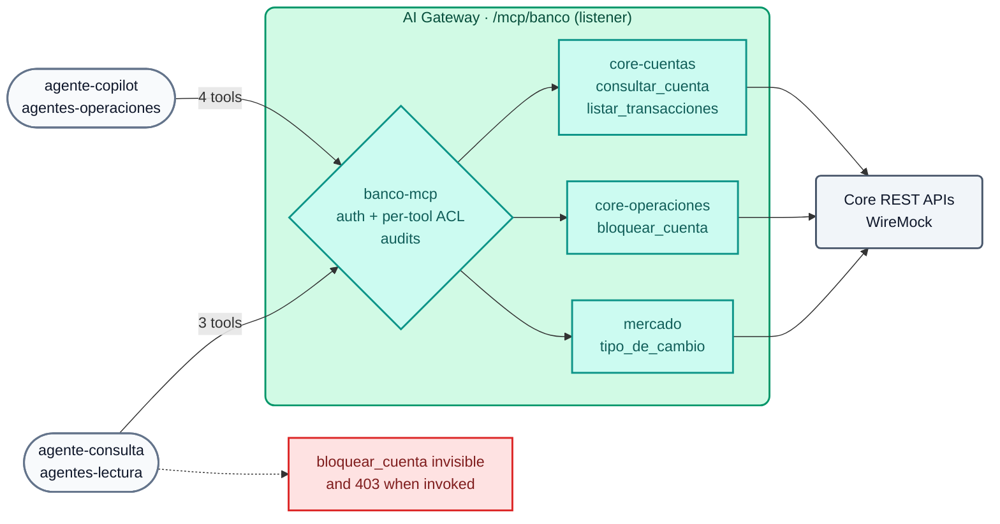

# AI Module 06: MCP — REST APIs as tools, bundling and per-agent ACLs

**Module message:** the APIs the bank **already has** are published as **MCP tools without writing MCP servers**. Each agent sees and executes **only** the tools its profile allows, and every invocation is audited.

---

## 1. Concepts

### 1.1 MCP in 2 minutes

The **Model Context Protocol (MCP)** is the standard that agents (Claude, Cursor, Copilot, in-house agents) use to discover and execute tools. Over HTTP (*Streamable HTTP*) it speaks **JSON-RPC 2.0**:

| Method | What for |
| :--- | :--- |
| `initialize` | Opens the session (returns `Mcp-Session-Id`) |
| `tools/list` | Which tools do I have available? (name, description, parameter schema) |
| `tools/call` | Executes a tool with arguments |

The problem: if every team writes its own MCP server, the mistakes of the early years of APIs repeat themselves (no authentication, no catalog, no auditing). The AI Gateway solves this **at the edge**.

### 1.2 MCP server types in AI Gateway 2.x

| `type` | What it does | Typical use |
| :--- | :--- | :--- |
| `conversion-only` | Converts a **REST API** into MCP tools (each tool defines method, path and parameters). It does not expose its own route | Source for a *listener* |
| `conversion-listener` | Same as above, but with its own route | One MCP server per API |
| `listener` + `sources` | **MCP Server Bundling**: a single endpoint that aggregates the tools of several servers | One corporate MCP per domain or per agent profile |
| `passthrough-listener` | Publishes an **external** MCP server behind the gateway with authentication, ACLs and the upstream credential | Third-party MCP servers, Konnect MCP Server |
| `upstream-server` | Registers an external MCP server only as a *source* (no route or auth of its own) | Source for a *listener* |



### 1.3 Tool governance

- `access.auth_strategies`: who can connect to the MCP endpoint (the same key-auth as the models).
- `access.acl_attribute_type: consumer` + `default_tool_acls`: groups enabled for **all** the tools in the bundle.
- `tools[].access.acls`: **per-tool** ACL; it replaces the default ACL (for example `bloquear_cuenta` only for `agentes-operaciones`).
- An unauthorized tool **does not appear** in `tools/list` and its execution is rejected.
- `annotations` (`read_only_hint`, `destructive_hint`, `title`): inform the agent and the human who approves the action.
- `logging: {payloads: true, audits: true}`: every *tool call* is recorded in Analytics.

### 1.4 Catalog and platform (AI Summit 2026)

| Announcement | Status | Relationship to this module |
| :--- | :--- | :--- |
| **Context Mesh** (existing APIs → well-designed MCP servers, *code mode*) | GA | Complements the REST→MCP conversion we declare here in the AI Gateway |
| **Konnect Catalog** (registry of models, APIs, MCP, events) | GA | Where the APIs published as tools are discovered |
| **AI Registry** | GA (new) | Registry of AI assets in Konnect |
| **Agent & MCP Registry** | Coming soon | — |
| **Token Vault** (agents without long-lived credentials) | Coming soon | — |

!!! note "API catalog for IDEs (Konnect MCP Server behind the gateway)"
    The Demo Track publishes the Konnect MCP Server with a `passthrough-listener` (gateway identity and ACLs, upstream credential in the vault). **Known limitation:** with kongctl 1.20.x the AI Gateway 2.2 API only accepts `upstream.auth` of type `aws`; injecting a *bearer token* towards the upstream is not supported yet, so that scenario returns `401` from the Konnect MCP. It is mentioned as roadmap, not demonstrated.

---

## 2. Configuration (kongctl)

File: `workshop-assets/dia-4/config/lab_06_mcp.yaml` (excerpt).

```yaml
ai_gateway_mcp_servers:
  - ref: core-operaciones
    ai_gateway: !ref lab-ai-gw#id
    type: conversion-only
    name: core-operaciones
    display_name: Core bancario — operaciones
    config:
      url: http://wiremock:8080
    tools:
      - name: bloquear_cuenta
        description: Bloquea preventivamente una cuenta y suspende las transferencias salientes.
        method: POST
        path: /core/v1/cuentas/{cuenta_id}/bloqueo
        annotations: {title: Bloquear cuenta, read_only_hint: false, destructive_hint: true}
        access:
          acls:
            allow: [agentes-operaciones]
        parameters:
          - {name: cuenta_id, in: path, required: true, description: Número de cuenta, schema: {type: string}}

  - ref: banco-mcp                           # bundling
    ai_gateway: !ref lab-ai-gw#id
    type: listener
    name: banco-mcp
    display_name: Banco Demo — MCP corporativo
    sources: [core-cuentas, core-operaciones, mercado]
    access:
      acl_attribute_type: consumer
      auth_strategies: [!ref lab-key-auth#name]
      default_tool_acls:
        allow: [agentes-operaciones, agentes-lectura]
    config:
      route:
        paths: [/mcp/banco]
        methods: [GET, POST, DELETE]
      logging: {payloads: true, audits: true}
```

---

## 3. Demo Script (Step by Step)

```bash
./workshop-assets/dia-4/scripts/aplicar.sh 06
source ~/.kong-workshop/aigw-lab/.env.generated
MCP=http://localhost:8010/mcp/banco
mcp() { python3 workshop-assets/dia-4/scripts/mcp_client.py "$@"; }   # minimal MCP client (stdlib)
```

Or fully guided: `./run_all_demos_dia3.sh` → option **Módulo IA 06**.

### Demo 1: The original API is NOT MCP (3 min)

```bash
curl -s http://localhost:8089/core/v1/cuentas/1001 | jq .
```

It is plain REST (WireMock simulates the core banking system). Nobody wrote an MCP server.

### Demo 2: Protected MCP endpoint (2 min)

```bash
mcp $MCP "" list
# {"http": 401, ...}
```

### Demo 3: Bundling + per-profile visibility (10 min)

```bash
mcp $MCP "$AIGW_KEY_AGENTE_COPILOT" list
# {"http": 200, "tools": ["consultar_cuenta", "listar_transacciones", "bloquear_cuenta", "tipo_de_cambio"]}
mcp $MCP "$AIGW_KEY_AGENTE_CONSULTA" list
# {"http": 200, "tools": ["consultar_cuenta", "listar_transacciones", "tipo_de_cambio"]}
```

**What to show:** a single endpoint aggregates 3 servers (4 tools). The read-only agent **does not see** the destructive tool.

### Demo 4: Governed execution (10 min)

```bash
mcp $MCP "$AIGW_KEY_AGENTE_CONSULTA" call listar_transacciones '{"cuenta_id":"1001"}' | jq -r '.result.content[0].text'
mcp $MCP "$AIGW_KEY_AGENTE_CONSULTA" call bloquear_cuenta '{"cuenta_id":"1001"}'     # rejected
mcp $MCP "$AIGW_KEY_AGENTE_COPILOT"  call bloquear_cuenta '{"cuenta_id":"1001"}'     # 200: BLOQUEADA
```

Konnect → **Analytics**: every *tool call* with consumer, tool, latency and payload (audit trail).

### Demo 5: Connecting a real MCP client (5 min)

Any MCP client with HTTP transport uses the gateway URL and the agent's API key. Examples:

```bash
# Claude Code
claude mcp add --transport http banco http://localhost:8010/mcp/banco --header "apikey: $AIGW_KEY_AGENTE_CONSULTA"
```

```json
{
  "mcpServers": {
    "banco": {
      "url": "http://localhost:8010/mcp/banco",
      "headers": { "apikey": "<API key del agente>" }
    }
  }
}
```

---

## 4. What to highlight (banking and financial services)

!!! success "Key messages"
    - **Controlled agency (OWASP LLM06):** destructive actions (blocking accounts, moving funds) are only for authorized agents, and are flagged as `destructive_hint` to require human approval in the client.
    - **Reusing the API investment:** the core already exposes governed REST APIs; turning them into tools is configuration, not a new project with its own security cycle.
    - **One corporate MCP per profile:** *bundling* prevents each agent from connecting to N servers with N credentials.
    - **Full auditability:** who (agent/consumer) executed which tool, with which arguments and when: evidence for operational risk and for the regulator.
    - **Platform roadmap:** Konnect Catalog and Context Mesh (GA) to discover and design MCP servers; Agent & MCP Registry and Token Vault (coming soon) for the lifecycle of agents without long-lived credentials.

---

➡️ Hands-on: [AI Lab 06 — MCP](../../dia-4-ai-gateway-labs/Lab_IA_06_MCP.md)
