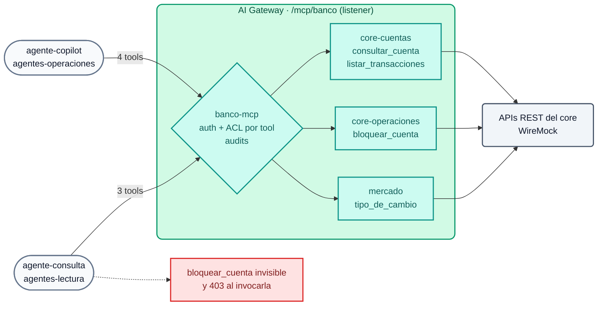

# Módulo IA 06: MCP — APIs REST como tools, bundling y ACL por agente

**Mensaje del módulo:** las APIs que el banco **ya tiene** se publican como **tools MCP sin escribir servidores MCP**. Cada agente ve y ejecuta **sólo** las tools que su perfil permite, y cada invocación queda auditada.

---

## 1. Conceptos

### 1.1 MCP en 2 minutos

El **Model Context Protocol (MCP)** es el estándar con el que los agentes (Claude, Cursor, Copilot, agentes propios) descubren y ejecutan herramientas. Sobre HTTP (*Streamable HTTP*) habla **JSON-RPC 2.0**:

| Método | Para qué |
| :--- | :--- |
| `initialize` | Abre la sesión (devuelve `Mcp-Session-Id`) |
| `tools/list` | ¿Qué herramientas tengo disponibles? (nombre, descripción, esquema de parámetros) |
| `tools/call` | Ejecuta una herramienta con argumentos |

El problema: si cada equipo escribe su servidor MCP, se repiten los errores de los primeros años de las APIs (sin autenticación, sin catálogo, sin auditoría). El AI Gateway resuelve eso **en el borde**.

### 1.2 Tipos de servidor MCP en AI Gateway 2.x

| `type` | Qué hace | Uso típico |
| :--- | :--- | :--- |
| `conversion-only` | Convierte una **API REST** en tools MCP (cada tool define método, path y parámetros). No expone ruta propia | Fuente para un *listener* |
| `conversion-listener` | Igual que el anterior, pero con ruta propia | Un servidor MCP por API |
| `listener` + `sources` | **MCP Server Bundling**: un único endpoint que agrega las tools de varios servidores | Un MCP corporativo por dominio o por perfil de agente |
| `passthrough-listener` | Publica un servidor MCP **externo** detrás del gateway con autenticación, ACL y credencial del upstream | MCP de terceros, Konnect MCP Server |
| `upstream-server` | Registra un servidor MCP externo sólo como *source* (sin ruta ni auth propias) | Fuente para un *listener* |



### 1.3 Gobierno de tools

- `access.auth_strategies`: quién puede conectarse al endpoint MCP (mismo key-auth que los modelos).
- `access.acl_attribute_type: consumer` + `default_tool_acls`: grupos habilitados para **todas** las tools del bundle.
- `tools[].access.acls`: ACL **por tool**; reemplaza la ACL por defecto (por ejemplo `bloquear_cuenta` sólo para `agentes-operaciones`).
- Una tool no autorizada **no aparece** en `tools/list` y su ejecución se rechaza.
- `annotations` (`read_only_hint`, `destructive_hint`, `title`): informan al agente y al humano que aprueba la acción.
- `logging: {payloads: true, audits: true}`: cada *tool call* queda registrada en Analytics.

### 1.4 Catálogo y plataforma (AI Summit 2026)

| Anuncio | Estado | Relación con este módulo |
| :--- | :--- | :--- |
| **Context Mesh** (APIs existentes → servidores MCP bien diseñados, *code mode*) | GA | Complementa la conversión REST→MCP que aquí declaramos en el AI Gateway |
| **Konnect Catalog** (registro de modelos, APIs, MCP, eventos) | GA | Dónde se descubren las APIs que se publican como tools |
| **AI Registry** | GA (nuevo) | Registro de activos de IA en Konnect |
| **Agent & MCP Registry** | Coming soon | — |
| **Token Vault** (agentes sin credenciales de larga duración) | Coming soon | — |

!!! note "Catálogo de APIs para IDEs (Konnect MCP Server detrás del gateway)"
    El Demo Track publica el Konnect MCP Server con un `passthrough-listener` (identidad y ACL del gateway, credencial del upstream en el vault). **Limitación conocida:** con kongctl 1.20.x la API de AI Gateway 2.2 sólo acepta `upstream.auth` de tipo `aws`; la inyección de un *bearer token* hacia el upstream no está soportada todavía, por lo que ese escenario devuelve `401` del MCP de Konnect. Se menciona como roadmap, no se demuestra.

---

## 2. Configuración (kongctl)

Archivo: `workshop-assets/dia-4/config/lab_06_mcp.yaml` (extracto).

```yaml
ai_gateway_mcp_servers:
  - ref: core-operaciones
    ai_gateway: !ref lab-ai-gw#id
    type: conversion-only
    name: core-operaciones
    display_name: Core bancario — operaciones
    config:
      url: http://wiremock:8080
    tools:
      - name: bloquear_cuenta
        description: Bloquea preventivamente una cuenta y suspende las transferencias salientes.
        method: POST
        path: /core/v1/cuentas/{cuenta_id}/bloqueo
        annotations: {title: Bloquear cuenta, read_only_hint: false, destructive_hint: true}
        access:
          acls:
            allow: [agentes-operaciones]
        parameters:
          - {name: cuenta_id, in: path, required: true, description: Número de cuenta, schema: {type: string}}

  - ref: banco-mcp                           # bundling
    ai_gateway: !ref lab-ai-gw#id
    type: listener
    name: banco-mcp
    display_name: Banco Demo — MCP corporativo
    sources: [core-cuentas, core-operaciones, mercado]
    access:
      acl_attribute_type: consumer
      auth_strategies: [!ref lab-key-auth#name]
      default_tool_acls:
        allow: [agentes-operaciones, agentes-lectura]
    config:
      route:
        paths: [/mcp/banco]
        methods: [GET, POST, DELETE]
      logging: {payloads: true, audits: true}
```

---

## 3. Guion de Demostración (Paso a Paso)

```bash
./workshop-assets/dia-4/scripts/aplicar.sh 06
source ~/.kong-workshop/aigw-lab/.env.generated
MCP=http://localhost:8010/mcp/banco
mcp() { python3 workshop-assets/dia-4/scripts/mcp_client.py "$@"; }   # cliente MCP mínimo (stdlib)
```

O todo guiado: `./run_all_demos_dia3.sh` → opción **Módulo IA 06**.

### Demostración 1: La API original NO es MCP (3 min)

```bash
curl -s http://localhost:8089/core/v1/cuentas/1001 | jq .
```

Es REST plano (WireMock simula el core bancario). Nadie escribió un servidor MCP.

### Demostración 2: Endpoint MCP protegido (2 min)

```bash
mcp $MCP "" list
# {"http": 401, ...}
```

### Demostración 3: Bundling + visibilidad por perfil (10 min)

```bash
mcp $MCP "$AIGW_KEY_AGENTE_COPILOT" list
# {"http": 200, "tools": ["consultar_cuenta", "listar_transacciones", "bloquear_cuenta", "tipo_de_cambio"]}
mcp $MCP "$AIGW_KEY_AGENTE_CONSULTA" list
# {"http": 200, "tools": ["consultar_cuenta", "listar_transacciones", "tipo_de_cambio"]}
```

**Qué mostrar:** un único endpoint agrega 3 servidores (4 tools). El agente de solo lectura **no ve** la tool destructiva.

### Demostración 4: Ejecución gobernada (10 min)

```bash
mcp $MCP "$AIGW_KEY_AGENTE_CONSULTA" call listar_transacciones '{"cuenta_id":"1001"}' | jq -r '.result.content[0].text'
mcp $MCP "$AIGW_KEY_AGENTE_CONSULTA" call bloquear_cuenta '{"cuenta_id":"1001"}'     # rechazada
mcp $MCP "$AIGW_KEY_AGENTE_COPILOT"  call bloquear_cuenta '{"cuenta_id":"1001"}'     # 200: BLOQUEADA
```

Konnect → **Analytics**: cada *tool call* con consumer, tool, latencia y payload (auditoría).

### Demostración 5: Conectar un cliente MCP real (5 min)

Cualquier cliente MCP con transporte HTTP usa la URL del gateway y la API key del agente. Ejemplos:

```bash
# Claude Code
claude mcp add --transport http banco http://localhost:8010/mcp/banco --header "apikey: $AIGW_KEY_AGENTE_CONSULTA"
```

```json
{
  "mcpServers": {
    "banco": {
      "url": "http://localhost:8010/mcp/banco",
      "headers": { "apikey": "<API key del agente>" }
    }
  }
}
```

---

## 4. Qué destacar (banca y servicios financieros)

!!! success "Mensajes clave"
    - **Agencia controlada (OWASP LLM06):** las acciones destructivas (bloquear cuentas, mover fondos) sólo para agentes autorizados, y marcadas como `destructive_hint` para exigir aprobación humana en el cliente.
    - **Reutilizar la inversión en APIs:** el core ya expone APIs REST gobernadas; convertirlas en tools es configuración, no un proyecto nuevo con su propio ciclo de seguridad.
    - **Un MCP corporativo por perfil:** el *bundling* evita que cada agente se conecte a N servidores con N credenciales.
    - **Auditoría completa:** quién (agente/consumer) ejecutó qué tool, con qué argumentos y cuándo: evidencia para riesgo operacional y para el regulador.
    - **Roadmap de plataforma:** Konnect Catalog y Context Mesh (GA) para descubrir y diseñar los MCP; Agent & MCP Registry y Token Vault (coming soon) para el ciclo de vida de agentes sin credenciales de larga duración.

---

➡️ Práctica: [Lab IA 06 — MCP](../../dia-4-ai-gateway-labs/Lab_IA_06_MCP.md)
