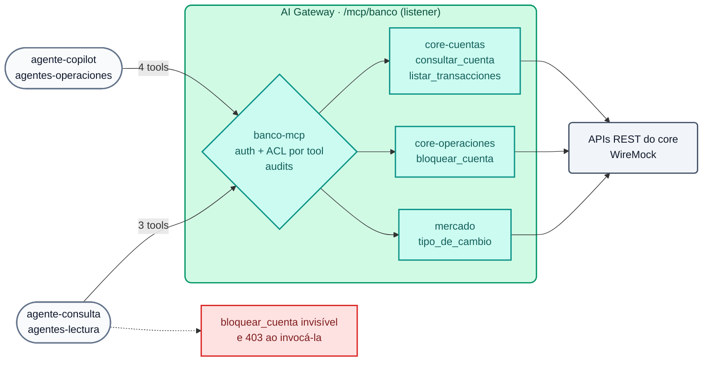

# Módulo IA 06: MCP — APIs REST como tools, bundling e ACL por agente

**Mensagem do módulo:** as APIs que o banco **já tem** são publicadas como **tools MCP sem escrever servidores MCP**. Cada agente vê e executa **apenas** as tools que seu perfil permite, e cada invocação fica auditada.

---

## 1. Conceitos

### 1.1 MCP em 2 minutos

O **Model Context Protocol (MCP)** é o padrão com o qual os agentes (Claude, Cursor, Copilot, agentes próprios) descobrem e executam ferramentas. Sobre HTTP (*Streamable HTTP*) ele fala **JSON-RPC 2.0**:

| Método | Para quê |
| :--- | :--- |
| `initialize` | Abre a sessão (devolve `Mcp-Session-Id`) |
| `tools/list` | Quais ferramentas tenho disponíveis? (nome, descrição, esquema de parâmetros) |
| `tools/call` | Executa uma ferramenta com argumentos |

O problema: se cada equipe escrever seu próprio servidor MCP, repetem-se os erros dos primeiros anos das APIs (sem autenticação, sem catálogo, sem auditoria). O AI Gateway resolve isso **na borda**.

### 1.2 Tipos de servidor MCP no AI Gateway 2.x

| `type` | O que faz | Uso típico |
| :--- | :--- | :--- |
| `conversion-only` | Converte uma **API REST** em tools MCP (cada tool define método, path e parâmetros). Não expõe rota própria | Fonte para um *listener* |
| `conversion-listener` | Igual ao anterior, mas com rota própria | Um servidor MCP por API |
| `listener` + `sources` | **MCP Server Bundling**: um único endpoint que agrega as tools de vários servidores | Um MCP corporativo por domínio ou por perfil de agente |
| `passthrough-listener` | Publica um servidor MCP **externo** atrás do gateway com autenticação, ACL e credencial do upstream | MCP de terceiros, Konnect MCP Server |
| `upstream-server` | Registra um servidor MCP externo apenas como *source* (sem rota nem auth próprias) | Fonte para um *listener* |



### 1.3 Governança de tools

- `access.auth_strategies`: quem pode se conectar ao endpoint MCP (o mesmo key-auth dos modelos).
- `access.acl_attribute_type: consumer` + `default_tool_acls`: grupos habilitados para **todas** as tools do bundle.
- `tools[].access.acls`: ACL **por tool**; substitui a ACL padrão (por exemplo, `bloquear_cuenta` apenas para `agentes-operaciones`).
- Uma tool não autorizada **não aparece** em `tools/list` e sua execução é rejeitada.
- `annotations` (`read_only_hint`, `destructive_hint`, `title`): informam o agente e o humano que aprova a ação.
- `logging: {payloads: true, audits: true}`: cada *tool call* fica registrada no Analytics.

### 1.4 Catálogo e plataforma (AI Summit 2026)

| Anúncio | Status | Relação com este módulo |
| :--- | :--- | :--- |
| **Context Mesh** (APIs existentes → servidores MCP bem projetados, *code mode*) | GA | Complementa a conversão REST→MCP que aqui declaramos no AI Gateway |
| **Konnect Catalog** (registro de modelos, APIs, MCP, eventos) | GA | Onde são descobertas as APIs publicadas como tools |
| **AI Registry** | GA (novo) | Registro de ativos de IA no Konnect |
| **Agent & MCP Registry** | Coming soon | — |
| **Token Vault** (agentes sem credenciais de longa duração) | Coming soon | — |

!!! note "Catálogo de APIs para IDEs (Konnect MCP Server atrás do gateway)"
    O Demo Track publica o Konnect MCP Server com um `passthrough-listener` (identidade e ACL do gateway, credencial do upstream no vault). **Limitação conhecida:** com o kongctl 1.20.x, a API do AI Gateway 2.2 só aceita `upstream.auth` do tipo `aws`; a injeção de um *bearer token* para o upstream ainda não é suportada, por isso esse cenário devolve `401` do MCP do Konnect. É mencionado como roadmap, não é demonstrado.

---

## 2. Configuração (kongctl)

Arquivo: `workshop-assets/dia-4/config/lab_06_mcp.yaml` (trecho).

```yaml
ai_gateway_mcp_servers:
  - ref: core-operaciones
    ai_gateway: !ref lab-ai-gw#id
    type: conversion-only
    name: core-operaciones
    display_name: Core bancario — operaciones
    config:
      url: http://wiremock:8080
    tools:
      - name: bloquear_cuenta
        description: Bloquea preventivamente una cuenta y suspende las transferencias salientes.
        method: POST
        path: /core/v1/cuentas/{cuenta_id}/bloqueo
        annotations: {title: Bloquear cuenta, read_only_hint: false, destructive_hint: true}
        access:
          acls:
            allow: [agentes-operaciones]
        parameters:
          - {name: cuenta_id, in: path, required: true, description: Número de cuenta, schema: {type: string}}

  - ref: banco-mcp                           # bundling
    ai_gateway: !ref lab-ai-gw#id
    type: listener
    name: banco-mcp
    display_name: Banco Demo — MCP corporativo
    sources: [core-cuentas, core-operaciones, mercado]
    access:
      acl_attribute_type: consumer
      auth_strategies: [!ref lab-key-auth#name]
      default_tool_acls:
        allow: [agentes-operaciones, agentes-lectura]
    config:
      route:
        paths: [/mcp/banco]
        methods: [GET, POST, DELETE]
      logging: {payloads: true, audits: true}
```

---

## 3. Roteiro de Demonstração (Passo a Passo)

```bash
./workshop-assets/dia-4/scripts/aplicar.sh 06
source ~/.kong-workshop/aigw-lab/.env.generated
MCP=http://localhost:8010/mcp/banco
mcp() { python3 workshop-assets/dia-4/scripts/mcp_client.py "$@"; }   # cliente MCP mínimo (stdlib)
```

Ou tudo guiado: `./run_all_demos_dia3.sh` → opção **Módulo IA 06**.

### Demonstração 1: A API original NÃO é MCP (3 min)

```bash
curl -s http://localhost:8089/core/v1/cuentas/1001 | jq .
```

É REST puro (o WireMock simula o core bancário). Ninguém escreveu um servidor MCP.

### Demonstração 2: Endpoint MCP protegido (2 min)

```bash
mcp $MCP "" list
# {"http": 401, ...}
```

### Demonstração 3: Bundling + visibilidade por perfil (10 min)

```bash
mcp $MCP "$AIGW_KEY_AGENTE_COPILOT" list
# {"http": 200, "tools": ["consultar_cuenta", "listar_transacciones", "bloquear_cuenta", "tipo_de_cambio"]}
mcp $MCP "$AIGW_KEY_AGENTE_CONSULTA" list
# {"http": 200, "tools": ["consultar_cuenta", "listar_transacciones", "tipo_de_cambio"]}
```

**O que mostrar:** um único endpoint agrega 3 servidores (4 tools). O agente somente leitura **não vê** a tool destrutiva.

### Demonstração 4: Execução governada (10 min)

```bash
mcp $MCP "$AIGW_KEY_AGENTE_CONSULTA" call listar_transacciones '{"cuenta_id":"1001"}' | jq -r '.result.content[0].text'
mcp $MCP "$AIGW_KEY_AGENTE_CONSULTA" call bloquear_cuenta '{"cuenta_id":"1001"}'     # rejeitada
mcp $MCP "$AIGW_KEY_AGENTE_COPILOT"  call bloquear_cuenta '{"cuenta_id":"1001"}'     # 200: BLOQUEADA
```

Konnect → **Analytics**: cada *tool call* com consumer, tool, latência e payload (auditoria).

### Demonstração 5: Conectar um cliente MCP real (5 min)

Qualquer cliente MCP com transporte HTTP usa a URL do gateway e a API key do agente. Exemplos:

```bash
# Claude Code
claude mcp add --transport http banco http://localhost:8010/mcp/banco --header "apikey: $AIGW_KEY_AGENTE_CONSULTA"
```

```json
{
  "mcpServers": {
    "banco": {
      "url": "http://localhost:8010/mcp/banco",
      "headers": { "apikey": "<API key del agente>" }
    }
  }
}
```

---

## 4. O que destacar (bancos e serviços financeiros)

!!! success "Mensagens-chave"
    - **Agência controlada (OWASP LLM06):** as ações destrutivas (bloquear contas, movimentar fundos) ficam restritas a agentes autorizados e marcadas como `destructive_hint` para exigir aprovação humana no cliente.
    - **Reaproveitar o investimento em APIs:** o core já expõe APIs REST governadas; convertê-las em tools é configuração, não um projeto novo com seu próprio ciclo de segurança.
    - **Um MCP corporativo por perfil:** o *bundling* evita que cada agente se conecte a N servidores com N credenciais.
    - **Auditoria completa:** quem (agente/consumer) executou qual tool, com quais argumentos e quando: evidência para risco operacional e para o regulador.
    - **Roadmap da plataforma:** Konnect Catalog e Context Mesh (GA) para descobrir e projetar os MCP; Agent & MCP Registry e Token Vault (coming soon) para o ciclo de vida de agentes sem credenciais de longa duração.

---

➡️ Prática: [Lab IA 06 — MCP](../../dia-4-ai-gateway-labs/Lab_IA_06_MCP.md)
