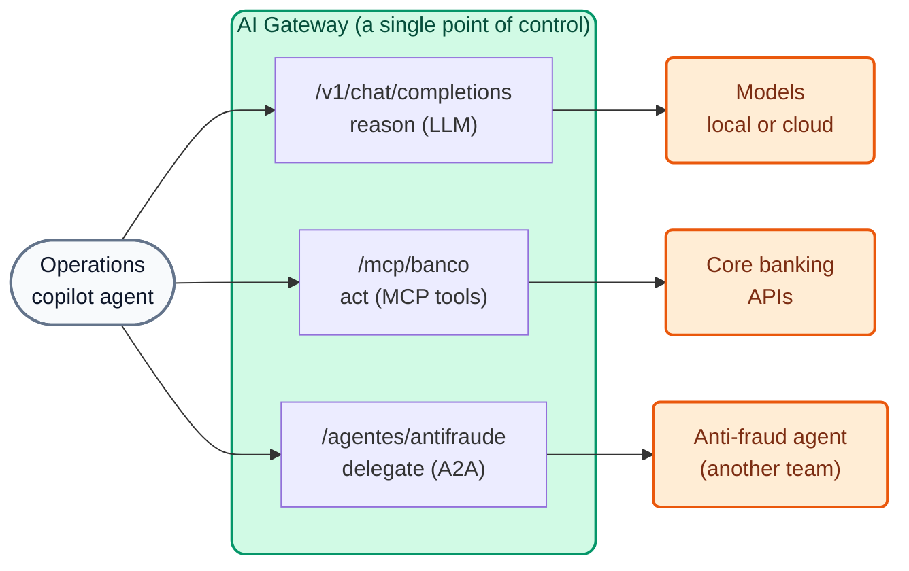

# AI Module 07: Agents and A2A (Agent-to-Agent)

**Module message:** traffic **between agents** goes through the same control plane as LLMs and MCP tools: **identity, ACLs, logging and analytics**. An agent can only delegate to another agent if the bank has authorized it.

---

## 1. Concepts

### 1.1 The three conversations of an agent



| Conversation | Protocol | 2.x entity | Module |
| :--- | :--- | :--- | :--- |
| Agent → LLM | OpenAI Chat Completions | AI Model | AI 01–05 |
| Agent → tools | MCP (JSON-RPC over HTTP) | AI MCP Server | AI 06 |
| Agent → agent | **A2A** (JSON-RPC over HTTP) | **AI Agent** (`type: a2a`) | AI 07 |

### 1.2 The A2A protocol

- Each agent publishes an **Agent Card** (`/.well-known/agent-card.json`) with its name, description, URL and *skills*.
- Interaction happens over JSON-RPC, for example the `message/send` method, whose result can include text *parts* or structured data *parts*.

### 1.3 The AI Agent entity

```yaml
ai_gateway_agents:
  - ref: agente-antifraude
    ai_gateway: !ref lab-ai-gw#id
    type: a2a
    name: agente-antifraude
    display_name: Agente antifraude (A2A)
    access:
      auth_strategies: [!ref lab-key-auth#name]
      acls:
        allow: [agentes-operaciones]      # only the copilot can delegate to this agent
    config:
      url: http://wiremock:8080/antifraude/
      route:
        paths: [/agentes/antifraude]
      logging:
        payloads: true
        statistics: true
```

- The gateway **rewrites the URLs** (the published Agent Card points to the gateway, not to the backend) and records native **A2A analytics**.
- Same `access` schema as models and tools: a single permission model.
- Since 2.2 there is also **AWS IAM / SigV4** authentication towards **Bedrock AgentCore** (GA).

!!! note "On the platform side (AI Summit 2026)"
    **Webhook Engine** (event-triggered agents) is in *private beta*; **Agent & MCP Registry** and **Token Vault** have been announced as *coming soon*. They are not part of the demos.

---

## 2. Demo Script (Step by Step)

```bash
./workshop-assets/dia-4/scripts/aplicar.sh 07
source ~/.kong-workshop/aigw-lab/.env.generated
A2A=http://localhost:8010/agentes/antifraude
SEND='{"jsonrpc":"2.0","id":"1","method":"message/send","params":{"message":{"role":"user","messageId":"m-1","parts":[{"kind":"text","text":"Evaluar transferencia tx-9001: USD 5.500 a cuenta creada hace 2 h, 23:41 h."}]}}}'
```

Or fully guided: `./run_all_demos_dia3.sh` → option **Módulo IA 07**.

### Demo 1: Discovery through the gateway (5 min)

```bash
curl -s -H "apikey: $AIGW_KEY_AGENTE_COPILOT" "$A2A/.well-known/agent-card.json" | jq '{name, url, skills: [.skills[].id]}'
```

### Demo 2: Governed delegation (7 min)

```bash
curl -s -X POST "$A2A/" -H "apikey: $AIGW_KEY_AGENTE_COPILOT" -H "Content-Type: application/json" -d "$SEND" \
  | jq '.result.parts[0].data'
# {"score_riesgo": 94, "recomendacion": "BLOQUEAR", "motivo": "..."}
```

### Demo 3: Who CANNOT delegate (5 min)

```bash
curl -s -o /dev/null -w "%{http_code}\n" -X POST "$A2A/" -H "Content-Type: application/json" -d "$SEND"                                  # 401
curl -s -o /dev/null -w "%{http_code}\n" -X POST "$A2A/" -H "apikey: $AIGW_KEY_AGENTE_CONSULTA" -H "Content-Type: application/json" -d "$SEND"  # 403
```

### Demo 4: The complete flow (narrative, 5 min)

Tie modules 06 and 07 together into one story: the copilot **reads** the transactions with `listar_transacciones` (MCP), **delegates** the assessment to the anti-fraud agent (A2A), and if the recommendation is `BLOQUEAR` it **acts** with `bloquear_cuenta` (MCP, a destructive tool reserved for its group). Everything went through the gateway and was recorded in Analytics under the same consumer.

---

## 3. What to highlight (banking and financial services)

!!! success "Key messages"
    - **An agent ecosystem with segregation of duties:** the agent that detects fraud belongs to another team (Risk); the Operations copilot can only **query** it, not modify it, and only if its group is authorized.
    - **Traceability of automated decisions:** every A2A delegation is recorded with its *payload* and statistics: the basis for explaining to the customer or the regulator why a transaction was blocked.
    - **Third-party agents (fintechs, vendors):** they are integrated behind the gateway with the same rules as open APIs (Open Finance).
    - **A single control plane** for LLM + MCP + A2A: there are no "back doors" between agents.

---

➡️ Hands-on: [AI Lab 07 — A2A](../../dia-4-ai-gateway-labs/Lab_IA_07_A2A.md)
