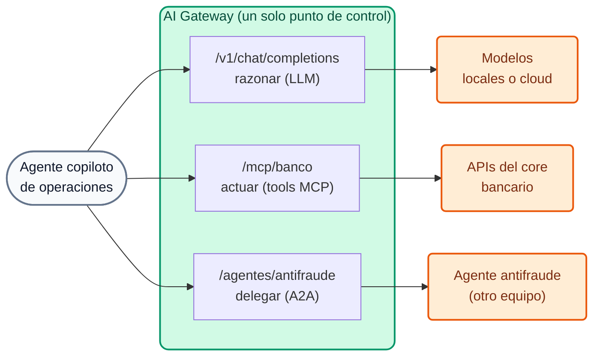

# Módulo IA 07: Agentes y A2A (Agent-to-Agent)

**Mensaje del módulo:** el tráfico **entre agentes** pasa por el mismo plano de control que los LLMs y las tools MCP: **identidad, ACL, logging y analytics**. Un agente sólo puede delegar en otro si el banco lo autorizó.

---

## 1. Conceptos

### 1.1 Las tres conversaciones de un agente



| Conversación | Protocolo | Entidad en 2.x | Módulo |
| :--- | :--- | :--- | :--- |
| Agente → LLM | OpenAI Chat Completions | AI Model | IA 01–05 |
| Agente → herramientas | MCP (JSON-RPC sobre HTTP) | AI MCP Server | IA 06 |
| Agente → agente | **A2A** (JSON-RPC sobre HTTP) | **AI Agent** (`type: a2a`) | IA 07 |

### 1.2 El protocolo A2A

- Cada agente publica una **Agent Card** (`/.well-known/agent-card.json`) con nombre, descripción, URL y *skills*.
- La interacción se hace con JSON-RPC, por ejemplo el método `message/send`, cuyo resultado puede incluir *parts* de texto o de datos estructurados.

### 1.3 La entidad AI Agent

```yaml
ai_gateway_agents:
  - ref: agente-antifraude
    ai_gateway: !ref lab-ai-gw#id
    type: a2a
    name: agente-antifraude
    display_name: Agente antifraude (A2A)
    access:
      auth_strategies: [!ref lab-key-auth#name]
      acls:
        allow: [agentes-operaciones]      # sólo el copiloto puede delegar en este agente
    config:
      url: http://wiremock:8080/antifraude/
      route:
        paths: [/agentes/antifraude]
      logging:
        payloads: true
        statistics: true
```

- El gateway **reescribe las URLs** (la Agent Card publicada apunta al gateway, no al backend) y registra **analytics A2A** nativos.
- Mismo esquema `access` que modelos y tools: un único modelo de permisos.
- Desde 2.2 existe además autenticación **AWS IAM / SigV4** hacia **Bedrock AgentCore** (GA).

!!! note "Del lado de la plataforma (AI Summit 2026)"
    **Webhook Engine** (agentes disparados por eventos) está en *private beta*; **Agent & MCP Registry** y **Token Vault** están anunciados como *coming soon*. No forman parte de las demos.

---

## 2. Guion de Demostración (Paso a Paso)

```bash
./workshop-assets/dia-4/scripts/aplicar.sh 07
source ~/.kong-workshop/aigw-lab/.env.generated
A2A=http://localhost:8010/agentes/antifraude
SEND='{"jsonrpc":"2.0","id":"1","method":"message/send","params":{"message":{"role":"user","messageId":"m-1","parts":[{"kind":"text","text":"Evaluar transferencia tx-9001: USD 5.500 a cuenta creada hace 2 h, 23:41 h."}]}}}'
```

O todo guiado: `./run_all_demos_dia3.sh` → opción **Módulo IA 07**.

### Demostración 1: Descubrimiento vía gateway (5 min)

```bash
curl -s -H "apikey: $AIGW_KEY_AGENTE_COPILOT" "$A2A/.well-known/agent-card.json" | jq '{name, url, skills: [.skills[].id]}'
```

### Demostración 2: Delegación gobernada (7 min)

```bash
curl -s -X POST "$A2A/" -H "apikey: $AIGW_KEY_AGENTE_COPILOT" -H "Content-Type: application/json" -d "$SEND" \
  | jq '.result.parts[0].data'
# {"score_riesgo": 94, "recomendacion": "BLOQUEAR", "motivo": "..."}
```

### Demostración 3: Quién NO puede delegar (5 min)

```bash
curl -s -o /dev/null -w "%{http_code}\n" -X POST "$A2A/" -H "Content-Type: application/json" -d "$SEND"                                  # 401
curl -s -o /dev/null -w "%{http_code}\n" -X POST "$A2A/" -H "apikey: $AIGW_KEY_AGENTE_CONSULTA" -H "Content-Type: application/json" -d "$SEND"  # 403
```

### Demostración 4: El flujo completo (narrativa, 5 min)

Unir los módulos 06 y 07 en una historia: el copiloto **lee** las transacciones con `listar_transacciones` (MCP), **delega** la evaluación en el agente antifraude (A2A), y si la recomendación es `BLOQUEAR` **actúa** con `bloquear_cuenta` (MCP, tool destructiva sólo para su grupo). Todo pasó por el gateway y quedó en Analytics con el mismo consumer.

---

## 3. Qué destacar (banca y servicios financieros)

!!! success "Mensajes clave"
    - **Ecosistema de agentes con separación de funciones:** el agente que detecta fraude es de otro equipo (Riesgo); el copiloto de Operaciones sólo puede **consultarlo**, no modificarlo, y sólo si su grupo está autorizado.
    - **Trazabilidad de decisiones automatizadas:** cada delegación A2A queda registrada con *payload* y estadísticas: base para explicar ante el cliente o el regulador por qué se bloqueó una operación.
    - **Agentes de terceros (fintechs, proveedores):** se integran detrás del gateway con las mismas reglas que las APIs abiertas (Open Finance).
    - **Un solo plano de control** para LLM + MCP + A2A: no hay "puertas traseras" entre agentes.

---

➡️ Práctica: [Lab IA 07 — A2A](../../dia-4-ai-gateway-labs/Lab_IA_07_A2A.md)
