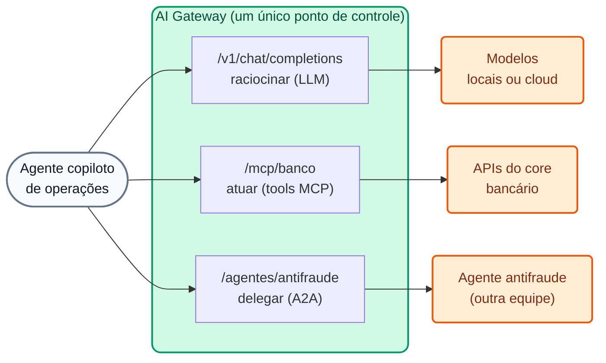

# Módulo IA 07: Agentes e A2A (Agent-to-Agent)

**Mensagem do módulo:** o tráfego **entre agentes** passa pelo mesmo plano de controle que os LLMs e as tools MCP: **identidade, ACL, logging e analytics**. Um agente só pode delegar a outro se o banco tiver autorizado.

---

## 1. Conceitos

### 1.1 As três conversas de um agente



| Conversa | Protocolo | Entidade na 2.x | Módulo |
| :--- | :--- | :--- | :--- |
| Agente → LLM | OpenAI Chat Completions | AI Model | IA 01–05 |
| Agente → ferramentas | MCP (JSON-RPC sobre HTTP) | AI MCP Server | IA 06 |
| Agente → agente | **A2A** (JSON-RPC sobre HTTP) | **AI Agent** (`type: a2a`) | IA 07 |

### 1.2 O protocolo A2A

- Cada agente publica um **Agent Card** (`/.well-known/agent-card.json`) com nome, descrição, URL e *skills*.
- A interação é feita com JSON-RPC, por exemplo o método `message/send`, cujo resultado pode incluir *parts* de texto ou de dados estruturados.

### 1.3 A entidade AI Agent

```yaml
ai_gateway_agents:
  - ref: agente-antifraude
    ai_gateway: !ref lab-ai-gw#id
    type: a2a
    name: agente-antifraude
    display_name: Agente antifraude (A2A)
    access:
      auth_strategies: [!ref lab-key-auth#name]
      acls:
        allow: [agentes-operaciones]      # apenas o copiloto pode delegar a este agente
    config:
      url: http://wiremock:8080/antifraude/
      route:
        paths: [/agentes/antifraude]
      logging:
        payloads: true
        statistics: true
```

- O gateway **reescreve as URLs** (o Agent Card publicado aponta para o gateway, não para o backend) e registra **analytics A2A** nativos.
- O mesmo esquema `access` de modelos e tools: um único modelo de permissões.
- Desde a 2.2 existe também autenticação **AWS IAM / SigV4** para o **Bedrock AgentCore** (GA).

!!! note "Do lado da plataforma (AI Summit 2026)"
    O **Webhook Engine** (agentes disparados por eventos) está em *private beta*; o **Agent & MCP Registry** e o **Token Vault** foram anunciados como *coming soon*. Não fazem parte das demos.

---

## 2. Roteiro de Demonstração (Passo a Passo)

```bash
./workshop-assets/dia-4/scripts/aplicar.sh 07
source ~/.kong-workshop/aigw-lab/.env.generated
A2A=http://localhost:8010/agentes/antifraude
SEND='{"jsonrpc":"2.0","id":"1","method":"message/send","params":{"message":{"role":"user","messageId":"m-1","parts":[{"kind":"text","text":"Evaluar transferencia tx-9001: USD 5.500 a cuenta creada hace 2 h, 23:41 h."}]}}}'
```

Ou tudo guiado: `./run_all_demos_dia3.sh` → opção **Módulo IA 07**.

### Demonstração 1: Descoberta via gateway (5 min)

```bash
curl -s -H "apikey: $AIGW_KEY_AGENTE_COPILOT" "$A2A/.well-known/agent-card.json" | jq '{name, url, skills: [.skills[].id]}'
```

### Demonstração 2: Delegação governada (7 min)

```bash
curl -s -X POST "$A2A/" -H "apikey: $AIGW_KEY_AGENTE_COPILOT" -H "Content-Type: application/json" -d "$SEND" \
  | jq '.result.parts[0].data'
# {"score_riesgo": 94, "recomendacion": "BLOQUEAR", "motivo": "..."}
```

### Demonstração 3: Quem NÃO pode delegar (5 min)

```bash
curl -s -o /dev/null -w "%{http_code}\n" -X POST "$A2A/" -H "Content-Type: application/json" -d "$SEND"                                  # 401
curl -s -o /dev/null -w "%{http_code}\n" -X POST "$A2A/" -H "apikey: $AIGW_KEY_AGENTE_CONSULTA" -H "Content-Type: application/json" -d "$SEND"  # 403
```

### Demonstração 4: O fluxo completo (narrativa, 5 min)

Unir os módulos 06 e 07 em uma história: o copiloto **lê** as transações com `listar_transacciones` (MCP), **delega** a avaliação ao agente antifraude (A2A) e, se a recomendação for `BLOQUEAR`, **atua** com `bloquear_cuenta` (MCP, tool destrutiva apenas para o seu grupo). Tudo passou pelo gateway e ficou registrado no Analytics com o mesmo consumer.

---

## 3. O que destacar (bancos e serviços financeiros)

!!! success "Mensagens-chave"
    - **Ecossistema de agentes com segregação de funções:** o agente que detecta fraude é de outra equipe (Risco); o copiloto de Operações só pode **consultá-lo**, não modificá-lo, e apenas se seu grupo estiver autorizado.
    - **Rastreabilidade de decisões automatizadas:** cada delegação A2A fica registrada com *payload* e estatísticas: base para explicar ao cliente ou ao regulador por que uma operação foi bloqueada.
    - **Agentes de terceiros (fintechs, provedores):** são integrados atrás do gateway com as mesmas regras das APIs abertas (Open Finance).
    - **Um único plano de controle** para LLM + MCP + A2A: não há "portas dos fundos" entre agentes.

---

➡️ Prática: [Lab IA 07 — A2A](../../dia-4-ai-gateway-labs/Lab_IA_07_A2A.md)
