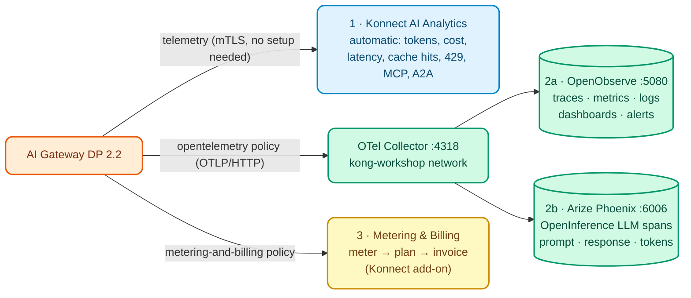

# AI Module 08: AI Observability and FinOps (OpenObserve + Phoenix) and Metering & Billing

**Module message:** all AI traffic (LLMs, MCP and A2A) can be **observed** and **attributed** to each consumer: tokens, cost, latency, blocks and errors. That is what lets you operate it (SRE), control spending (FinOps) and, if desired, **bill** for usage (Metering & Billing). And the platform can be **extended** with your own logic without rebuilding images.

> This module reuses the course's observability stack (OTel Collector + OpenObserve + Arize Phoenix) introduced in [Day 1 Module 06](../../dia-1-teoria-y-demos/06-observability/Guia_06_Observability.md) and practiced in [Day 2 Lab 07](../../dia-2-labs/Lab_07_Observabilidad_Avanzada.md). There, Phoenix showed "generic" HTTP traces; today we look at it with **real LLM traffic**.

---

## 1. Concepts

### 1.1 Three layers of visibility



| Layer | How it is enabled | For whom |
| :--- | :--- | :--- |
| **Konnect AI Analytics** | Automatic: the DP sends telemetry to the Control Plane | Platform owners, FinOps, product |
| **OpenTelemetry** (`opentelemetry` policy, global) | Traces, metrics (including AI metrics) and logs to a Collector; the Collector fans out to OpenObserve and Phoenix | SRE / Operations, AI teams |
| **Metering & Billing** (`metering-and-billing` policy) | Token events per consumer sent to Konnect Metering & Billing (add-on, GA) | Finance, monetization, *chargeback* |

### 1.2 OpenTelemetry in AI Gateway 2.2

- `opentelemetry` policy with `global: true`: `traces_endpoint`, `logs_endpoint`, `metrics.endpoint` and flags such as `enable_ai_metrics`, `enable_consumer_attribute`, `enable_latency_metrics`.
- **2.2 (GA):** **OpenInference** attributes in the spans (model, tokens, prompt/response) and **mTLS** support towards the Collector (`client_certificate`). Phoenix understands OpenInference and shows each call as an LLM span.
- `resource_attributes.service.name`: it is the filter in OpenObserve (`service_name`) and the **project** in Phoenix (the course's Collector copies `service.name` into `openinference.project.name`).

### 1.3 AI FinOps

| Question | Where it is answered |
| :--- | :--- |
| How much did each area / app / agent spend this month? | Konnect Analytics (cost per consumer, based on each target's prices) |
| Which model is the most expensive per useful answer? | Analytics per model + semantic cache (hits) |
| Who is close to their budget? | Budget policy (AI Module 02) + alerts in OpenObserve |
| How much do I bill each customer / business unit? | Metering & Billing (meter → feature → plan → customer → invoice) |

**AI Summit 2026:** **AI Cost Management** (spend attribution per agent/model) and **Advanced AI Observability** (traces of multi-turn conversations) are in **early access**: today, per-target costs already feed Analytics and OTel traces can be seen in OpenObserve/Phoenix.

### 1.4 Extensibility: Custom Policies (2.2)

`ai_gateway_custom_policies` (`type: streaming`) lets you publish **Lua code** from Konnect to all Data Planes **without rebuilding images** (GA in the product, **beta** in kongctl). Example from the Demo Track: a policy that adds `X-Gobierno-IA` and `X-Gobierno-Consumer` to every response (`workshop-assets/dia-3/config/demo_80_custom_policy.yaml`).

---

## 2. Configuration (kongctl)

File: `workshop-assets/dia-4/config/lab_08_observabilidad.yaml`.

```yaml
ai_gateway_policies:
  - ref: trazas-otel
    ai_gateway: !ref lab-ai-gw#id
    name: trazas-otel
    display_name: OpenTelemetry (trazas, métricas y logs de IA)
    type: opentelemetry
    global: true
    config:
      traces_endpoint: !env AIGW_OTEL_TRACES_ENDPOINT     # http://otel-collector:4318/v1/traces
      logs_endpoint: !env AIGW_OTEL_LOGS_ENDPOINT
      metrics:
        endpoint: !env AIGW_OTEL_METRICS_ENDPOINT
        push_interval: 30
        enable_ai_metrics: true
        enable_request_metrics: true
        enable_latency_metrics: true
        enable_bandwidth_metrics: true
        enable_consumer_attribute: true
        enable_upstream_health_metrics: true
      sampling_rate: 1
      propagation:
        default_format: w3c
      resource_attributes:
        service.name: !env AIGW_OTEL_SERVICE_NAME          # aigw-<DEMO_PREFIX>
```

Metering & Billing (optional, `workshop-assets/dia-3/config/demo_90_metering_billing.yaml`):

```yaml
type: metering-and-billing
global: true
config:
  ingest_endpoint: !env AIGW_METERING_INGEST_ENDPOINT    # <KONNECT_ADDR>/v3/openmeter/events
  api_token: !env AIGW_METERING_INGEST_TOKEN             # System Account with the Ingest role
  meter_api_requests: false
  meter_ai_token_usage: true
  subject:
    look_up_value_in: consumer
```

---

## 3. Demo Script (Step by Step)

```bash
./workshop-assets/dia-1/06-observability/scripts/setup-observability.sh     # OTel Collector + OpenObserve + Phoenix
./workshop-assets/dia-4/scripts/aplicar.sh 08
./workshop-assets/dia-4/scripts/trafico.sh 90                              # 90 s of mixed traffic
```

Or fully guided: `./run_all_demos_dia3.sh` → option **Módulo IA 08**.

### Demo 1: Konnect AI Analytics (8 min)

Konnect → **AI Gateway** → `instructor-ai-gw` → **Analytics**:

- Input/output tokens and **cost** per model, provider and consumer.
- Requests blocked by guardrails (`400`), quotas (`429`), ACLs (`403`), *cache hits*.
- MCP traffic (tool calls) and A2A traffic.

### Demo 2: OpenObserve — operations (10 min)

1. `http://localhost:5080` (stack username and password, see `otel-stack/.env`).
2. **Traces** → stream `default` → filter `service_name = 'aigw-instructor'`. Open a `/v1/chat/completions` trace: gateway spans (auth, policies, balancer) and the model call span; AI attributes (model, tokens).
3. **Logs** → same filter. SQL: `SELECT * FROM "default" WHERE service_name = 'aigw-instructor' ORDER BY _timestamp DESC LIMIT 20`.
4. **Metrics** → look for the gateway's AI metrics (tokens, cost, LLM latency) and group by model or consumer. Create a "Tokens per consumer" panel.

### Demo 3: Arize Phoenix — LLM view (8 min)

1. `http://localhost:6006` → project `aigw-instructor`.
2. Open an LLM span: **model**, **prompt**, **response**, **tokens** and latency (2.2 OpenInference attributes).
3. Compare with an `asistente` span (RAG): you can see the injected context in the `system` message.
4. Same `trace_id` as in OpenObserve: the Collector does the *fan-out*.

### Demo 4 (instructor, `WITH_DEMO_EXTRAS=1`): Custom policy without a rebuild (5 min)

```bash
WITH_DEMO_EXTRAS=1 ./workshop-assets/dia-4/scripts/aplicar.sh 08
curl -s -D - -o /dev/null http://localhost:8010/v1/chat/completions -H "apikey: $AIGW_KEY_EQUIPO_DATOS" \
  -H "Content-Type: application/json" -d '{"model":"chat","messages":[{"role":"user","content":"Responde solo: OK"}]}' | grep -i x-gobierno
# x-gobierno-ia: banco-demo
# x-gobierno-consumer: equipo-datos
```

### Demo 5 (optional, add-on): Metering & Billing (8 min)

```bash
WITH_METERING=1 ./workshop-assets/dia-4/scripts/aplicar.sh 08
./workshop-assets/dia-3/scripts/metering_billing.sh
```

It creates (idempotently) meter → feature → plan (illustrative price) → customers linked to the consumers (`consumer:<id>`), generates traffic and queries the usage. Konnect → **Metering & Billing → Billing → Invoices**: a draft invoice per customer.

!!! warning "Metering & Billing demo requirements"
    It requires the add-on to be enabled in the org, `METERING_INGEST_TOKEN` (System Account with the *Ingest* role) in the instructor's kong-env profile, and a `KONNECT_TOKEN` with Metering & Billing administration permissions. If the org does not have the add-on, show the cost per consumer in Analytics instead.

---

## 4. What to highlight (banking and financial services)

!!! success "Key messages"
    - **Internal chargeback:** each area (Retail Banking, Risk, Contact Center) sees and pays for its own AI consumption. AI stops being an ownerless "central cost".
    - **Monetization:** Metering & Billing makes it possible to charge corporate customers or fintechs (Open Finance) for AI services, with plans and invoices.
    - **Operational and model risk:** traces with prompt and response make it possible to investigate incidents ("what did the assistant answer to this customer?"). Agree with Security on the retention and masking of payloads in the traces.
    - **Open standards:** OTLP and OpenInference avoid observability *lock-in*; the bank can send the same telemetry from the Collector to its SIEM or its corporate APM.
    - **Extend without a rebuild:** custom policies (2.2) make it possible to add the bank's own controls (governance headers, validations) by publishing them from Konnect.

---

➡️ Hands-on: [AI Lab 08 — AI Observability](../../dia-4-ai-gateway-labs/Lab_IA_08_Observabilidad.md)
