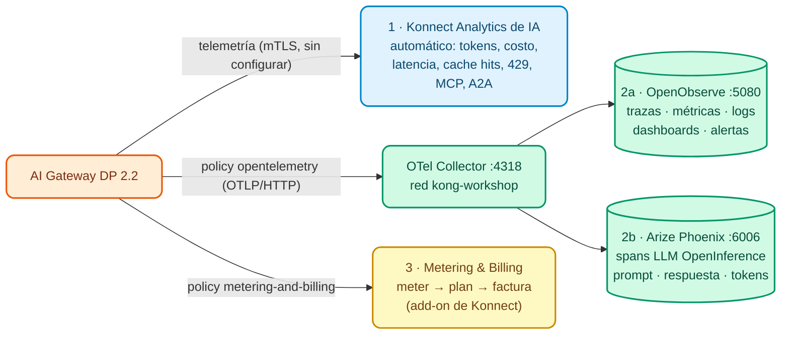

# Módulo IA 08: Observabilidad y FinOps de IA (OpenObserve + Phoenix) y Metering & Billing

**Mensaje del módulo:** todo el tráfico de IA (LLMs, MCP y A2A) se puede **observar** y **atribuir** a cada consumer: tokens, costo, latencia, bloqueos y errores. Con eso se opera (SRE), se controla el gasto (FinOps) y, si se quiere, se **factura** el uso (Metering & Billing). Y la plataforma se **extiende** con lógica propia sin reconstruir imágenes.

> Este módulo reutiliza el stack de observabilidad del curso (OTel Collector + OpenObserve + Arize Phoenix) presentado en el [Módulo 06 del Día 1](../../dia-1-teoria-y-demos/06-observability/Guia_06_Observability.md) y practicado en el [Lab 07 del Día 2](../../dia-2-labs/Lab_07_Observabilidad_Avanzada.md). Allí Phoenix mostraba trazas HTTP "genéricas"; hoy lo vemos con **tráfico real de LLM**.

---

## 1. Conceptos

### 1.1 Tres capas de visibilidad



| Capa | Cómo se activa | Para quién |
| :--- | :--- | :--- |
| **Konnect Analytics de IA** | Automático: el DP envía la telemetría al Control Plane | Dueños de plataforma, FinOps, producto |
| **OpenTelemetry** (policy `opentelemetry`, global) | Trazas, métricas (incluidas las de IA) y logs hacia un Collector; el Collector reparte a OpenObserve y Phoenix | SRE / Operaciones, equipos de IA |
| **Metering & Billing** (policy `metering-and-billing`) | Eventos de tokens por consumer hacia Konnect Metering & Billing (add-on, GA) | Finanzas, monetización, *chargeback* |

### 1.2 OpenTelemetry en AI Gateway 2.2

- Policy `opentelemetry` con `global: true`: `traces_endpoint`, `logs_endpoint`, `metrics.endpoint` y flags como `enable_ai_metrics`, `enable_consumer_attribute`, `enable_latency_metrics`.
- **2.2 (GA):** atributos **OpenInference** en los spans (modelo, tokens, prompt/respuesta) y soporte de **mTLS** hacia el Collector (`client_certificate`). Phoenix entiende OpenInference y muestra cada llamada como un span de LLM.
- `resource_attributes.service.name`: es el filtro en OpenObserve (`service_name`) y el **proyecto** en Phoenix (el Collector del curso copia `service.name` en `openinference.project.name`).

### 1.3 FinOps de IA

| Pregunta | Dónde se responde |
| :--- | :--- |
| ¿Cuánto gastó cada área / app / agente este mes? | Konnect Analytics (costo por consumer, a partir de los precios de cada target) |
| ¿Qué modelo es más caro por respuesta útil? | Analytics por modelo + caché semántica (hits) |
| ¿Quién está cerca de su presupuesto? | Policy de presupuesto (Módulo IA 02) + alertas en OpenObserve |
| ¿Cuánto le facturo a cada cliente / unidad de negocio? | Metering & Billing (meter → feature → plan → customer → factura) |

**AI Summit 2026:** **AI Cost Management** (atribución de gasto por agente/modelo) y **Advanced AI Observability** (trazas de conversaciones multi-turno) están en **early access**: hoy los costos por target ya alimentan Analytics y las trazas OTel se ven en OpenObserve/Phoenix.

### 1.4 Extensibilidad: Custom Policies (2.2)

`ai_gateway_custom_policies` (`type: streaming`) permite publicar **código Lua** desde Konnect a todos los Data Planes **sin reconstruir imágenes** (GA en el producto, **beta** en kongctl). Ejemplo del Demo Track: una policy que agrega `X-Gobierno-IA` y `X-Gobierno-Consumer` a cada respuesta (`workshop-assets/dia-3/config/demo_80_custom_policy.yaml`).

---

## 2. Configuración (kongctl)

Archivo: `workshop-assets/dia-4/config/lab_08_observabilidad.yaml`.

```yaml
ai_gateway_policies:
  - ref: trazas-otel
    ai_gateway: !ref lab-ai-gw#id
    name: trazas-otel
    display_name: OpenTelemetry (trazas, métricas y logs de IA)
    type: opentelemetry
    global: true
    config:
      traces_endpoint: !env AIGW_OTEL_TRACES_ENDPOINT     # http://otel-collector:4318/v1/traces
      logs_endpoint: !env AIGW_OTEL_LOGS_ENDPOINT
      metrics:
        endpoint: !env AIGW_OTEL_METRICS_ENDPOINT
        push_interval: 30
        enable_ai_metrics: true
        enable_request_metrics: true
        enable_latency_metrics: true
        enable_bandwidth_metrics: true
        enable_consumer_attribute: true
        enable_upstream_health_metrics: true
      sampling_rate: 1
      propagation:
        default_format: w3c
      resource_attributes:
        service.name: !env AIGW_OTEL_SERVICE_NAME          # aigw-<DEMO_PREFIX>
```

Metering & Billing (opcional, `workshop-assets/dia-3/config/demo_90_metering_billing.yaml`):

```yaml
type: metering-and-billing
global: true
config:
  ingest_endpoint: !env AIGW_METERING_INGEST_ENDPOINT    # <KONNECT_ADDR>/v3/openmeter/events
  api_token: !env AIGW_METERING_INGEST_TOKEN             # System Account con rol Ingest
  meter_api_requests: false
  meter_ai_token_usage: true
  subject:
    look_up_value_in: consumer
```

---

## 3. Guion de Demostración (Paso a Paso)

```bash
./workshop-assets/dia-1/06-observability/scripts/setup-observability.sh     # OTel Collector + OpenObserve + Phoenix
./workshop-assets/dia-4/scripts/aplicar.sh 08
./workshop-assets/dia-4/scripts/trafico.sh 90                              # 90 s de tráfico mixto
```

O todo guiado: `./run_all_demos_dia3.sh` → opción **Módulo IA 08**.

### Demostración 1: Konnect Analytics de IA (8 min)

Konnect → **AI Gateway** → `instructor-ai-gw` → **Analytics**:

- Tokens de entrada/salida y **costo** por modelo, proveedor y consumer.
- Peticiones bloqueadas por guardrails (`400`), cuotas (`429`), ACL (`403`), *cache hits*.
- Tráfico MCP (tool calls) y A2A.

### Demostración 2: OpenObserve — operación (10 min)

1. `http://localhost:5080` (usuario y contraseña del stack, ver `otel-stack/.env`).
2. **Traces** → stream `default` → filtro `service_name = 'aigw-instructor'`. Abrir una traza de `/v1/chat/completions`: spans del gateway (auth, policies, balancer) y de la llamada al modelo; atributos de IA (modelo, tokens).
3. **Logs** → mismo filtro. SQL: `SELECT * FROM "default" WHERE service_name = 'aigw-instructor' ORDER BY _timestamp DESC LIMIT 20`.
4. **Metrics** → buscar las métricas de IA del gateway (tokens, costo, latencia de LLM) y agrupar por modelo o consumer. Crear un panel "Tokens por consumer".

### Demostración 3: Arize Phoenix — vista LLM (8 min)

1. `http://localhost:6006` → proyecto `aigw-instructor`.
2. Abrir un span de LLM: **modelo**, **prompt**, **respuesta**, **tokens** y latencia (atributos OpenInference de 2.2).
3. Comparar un span de `asistente` (RAG): se ve el contexto inyectado en el mensaje `system`.
4. Mismo `trace_id` que en OpenObserve: el Collector hace *fan-out*.

### Demostración 4 (instructor, `WITH_DEMO_EXTRAS=1`): Policy custom sin rebuild (5 min)

```bash
WITH_DEMO_EXTRAS=1 ./workshop-assets/dia-4/scripts/aplicar.sh 08
curl -s -D - -o /dev/null http://localhost:8010/v1/chat/completions -H "apikey: $AIGW_KEY_EQUIPO_DATOS" \
  -H "Content-Type: application/json" -d '{"model":"chat","messages":[{"role":"user","content":"Responde solo: OK"}]}' | grep -i x-gobierno
# x-gobierno-ia: banco-demo
# x-gobierno-consumer: equipo-datos
```

### Demostración 5 (opcional, add-on): Metering & Billing (8 min)

```bash
WITH_METERING=1 ./workshop-assets/dia-4/scripts/aplicar.sh 08
./workshop-assets/dia-3/scripts/metering_billing.sh
```

Crea (idempotente) meter → feature → plan (precio ilustrativo) → customers asociados a los consumers (`consumer:<id>`), genera tráfico y consulta el uso. Konnect → **Metering & Billing → Billing → Invoices**: factura en borrador por customer.

!!! warning "Requisitos de la demo de Metering & Billing"
    Requiere el add-on habilitado en la org, `METERING_INGEST_TOKEN` (System Account con rol *Ingest*) en el perfil kong-env del instructor y un `KONNECT_TOKEN` con permisos de administración de Metering & Billing. Si la org no tiene el add-on, mostrar el costo por consumer en Analytics.

---

## 4. Qué destacar (banca y servicios financieros)

!!! success "Mensajes clave"
    - **Chargeback interno:** cada área (Banca Minorista, Riesgos, Contact Center) ve y paga su consumo de IA. La IA deja de ser un "costo central" sin dueño.
    - **Monetización:** Metering & Billing permite cobrar servicios de IA a clientes corporativos o fintechs (Open Finance) con planes y facturas.
    - **Riesgo operacional y modelo:** trazas con prompt y respuesta permiten investigar incidentes ("¿qué le respondió el asistente a este cliente?"). Definir con Seguridad la retención y el enmascaramiento de payloads en las trazas.
    - **Estándares abiertos:** OTLP y OpenInference evitan *lock-in* de observabilidad; el banco puede enviar la misma telemetría a su SIEM o a su APM corporativo desde el Collector.
    - **Extender sin rebuild:** las custom policies (2.2) permiten agregar controles propios del banco (cabeceras de gobierno, validaciones) publicándolos desde Konnect.

---

➡️ Práctica: [Lab IA 08 — Observabilidad de IA](../../dia-4-ai-gateway-labs/Lab_IA_08_Observabilidad.md)
