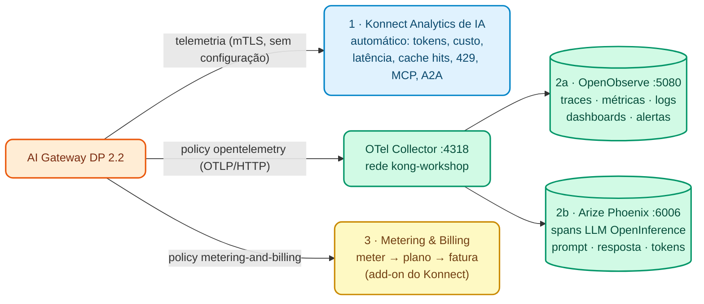

# Módulo IA 08: Observabilidade e FinOps de IA (OpenObserve + Phoenix) e Metering & Billing

**Mensagem do módulo:** todo o tráfego de IA (LLMs, MCP e A2A) pode ser **observado** e **atribuído** a cada consumer: tokens, custo, latência, bloqueios e erros. Com isso se opera (SRE), se controla o gasto (FinOps) e, se desejado, se **fatura** o uso (Metering & Billing). E a plataforma é **estendida** com lógica própria sem reconstruir imagens.

> Este módulo reutiliza o stack de observabilidade do curso (OTel Collector + OpenObserve + Arize Phoenix) apresentado no [Módulo 06 do Dia 1](../../dia-1-teoria-y-demos/06-observability/Guia_06_Observability.md) e praticado no [Lab 07 do Dia 2](../../dia-2-labs/Lab_07_Observabilidad_Avanzada.md). Ali o Phoenix mostrava traces HTTP "genéricos"; hoje o vemos com **tráfego real de LLM**.

---

## 1. Conceitos

### 1.1 Três camadas de visibilidade



| Camada | Como é ativada | Para quem |
| :--- | :--- | :--- |
| **Konnect Analytics de IA** | Automático: o DP envia a telemetria ao Control Plane | Donos da plataforma, FinOps, produto |
| **OpenTelemetry** (policy `opentelemetry`, global) | Traces, métricas (incluindo as de IA) e logs para um Collector; o Collector distribui para o OpenObserve e o Phoenix | SRE / Operações, equipes de IA |
| **Metering & Billing** (policy `metering-and-billing`) | Eventos de tokens por consumer para o Konnect Metering & Billing (add-on, GA) | Finanças, monetização, *chargeback* |

### 1.2 OpenTelemetry no AI Gateway 2.2

- Policy `opentelemetry` com `global: true`: `traces_endpoint`, `logs_endpoint`, `metrics.endpoint` e flags como `enable_ai_metrics`, `enable_consumer_attribute`, `enable_latency_metrics`.
- **2.2 (GA):** atributos **OpenInference** nos spans (modelo, tokens, prompt/resposta) e suporte a **mTLS** para o Collector (`client_certificate`). O Phoenix entende OpenInference e mostra cada chamada como um span de LLM.
- `resource_attributes.service.name`: é o filtro no OpenObserve (`service_name`) e o **projeto** no Phoenix (o Collector do curso copia `service.name` para `openinference.project.name`).

### 1.3 FinOps de IA

| Pergunta | Onde é respondida |
| :--- | :--- |
| Quanto cada área / app / agente gastou este mês? | Konnect Analytics (custo por consumer, a partir dos preços de cada target) |
| Qual modelo é mais caro por resposta útil? | Analytics por modelo + cache semântico (hits) |
| Quem está perto do seu orçamento? | Policy de orçamento (Módulo IA 02) + alertas no OpenObserve |
| Quanto faturo para cada cliente / unidade de negócio? | Metering & Billing (meter → feature → plan → customer → fatura) |

**AI Summit 2026:** o **AI Cost Management** (atribuição de gasto por agente/modelo) e o **Advanced AI Observability** (traces de conversas multi-turno) estão em **early access**: hoje os custos por target já alimentam o Analytics e os traces OTel são vistos no OpenObserve/Phoenix.

### 1.4 Extensibilidade: Custom Policies (2.2)

`ai_gateway_custom_policies` (`type: streaming`) permite publicar **código Lua** a partir do Konnect para todos os Data Planes **sem reconstruir imagens** (GA no produto, **beta** no kongctl). Exemplo do Demo Track: uma policy que adiciona `X-Gobierno-IA` e `X-Gobierno-Consumer` a cada resposta (`workshop-assets/dia-3/config/demo_80_custom_policy.yaml`).

---

## 2. Configuração (kongctl)

Arquivo: `workshop-assets/dia-4/config/lab_08_observabilidad.yaml`.

```yaml
ai_gateway_policies:
  - ref: trazas-otel
    ai_gateway: !ref lab-ai-gw#id
    name: trazas-otel
    display_name: OpenTelemetry (trazas, métricas y logs de IA)
    type: opentelemetry
    global: true
    config:
      traces_endpoint: !env AIGW_OTEL_TRACES_ENDPOINT     # http://otel-collector:4318/v1/traces
      logs_endpoint: !env AIGW_OTEL_LOGS_ENDPOINT
      metrics:
        endpoint: !env AIGW_OTEL_METRICS_ENDPOINT
        push_interval: 30
        enable_ai_metrics: true
        enable_request_metrics: true
        enable_latency_metrics: true
        enable_bandwidth_metrics: true
        enable_consumer_attribute: true
        enable_upstream_health_metrics: true
      sampling_rate: 1
      propagation:
        default_format: w3c
      resource_attributes:
        service.name: !env AIGW_OTEL_SERVICE_NAME          # aigw-<DEMO_PREFIX>
```

Metering & Billing (opcional, `workshop-assets/dia-3/config/demo_90_metering_billing.yaml`):

```yaml
type: metering-and-billing
global: true
config:
  ingest_endpoint: !env AIGW_METERING_INGEST_ENDPOINT    # <KONNECT_ADDR>/v3/openmeter/events
  api_token: !env AIGW_METERING_INGEST_TOKEN             # System Account com papel Ingest
  meter_api_requests: false
  meter_ai_token_usage: true
  subject:
    look_up_value_in: consumer
```

---

## 3. Roteiro de Demonstração (Passo a Passo)

```bash
./workshop-assets/dia-1/06-observability/scripts/setup-observability.sh     # OTel Collector + OpenObserve + Phoenix
./workshop-assets/dia-4/scripts/aplicar.sh 08
./workshop-assets/dia-4/scripts/trafico.sh 90                              # 90 s de tráfego misto
```

Ou tudo guiado: `./run_all_demos_dia3.sh` → opção **Módulo IA 08**.

### Demonstração 1: Konnect Analytics de IA (8 min)

Konnect → **AI Gateway** → `instructor-ai-gw` → **Analytics**:

- Tokens de entrada/saída e **custo** por modelo, provedor e consumer.
- Requisições bloqueadas por guardrails (`400`), cotas (`429`), ACL (`403`), *cache hits*.
- Tráfego MCP (tool calls) e A2A.

### Demonstração 2: OpenObserve — operação (10 min)

1. `http://localhost:5080` (usuário e senha do stack, ver `otel-stack/.env`).
2. **Traces** → stream `default` → filtro `service_name = 'aigw-instructor'`. Abrir um trace de `/v1/chat/completions`: spans do gateway (auth, policies, balancer) e da chamada ao modelo; atributos de IA (modelo, tokens).
3. **Logs** → mesmo filtro. SQL: `SELECT * FROM "default" WHERE service_name = 'aigw-instructor' ORDER BY _timestamp DESC LIMIT 20`.
4. **Metrics** → buscar as métricas de IA do gateway (tokens, custo, latência de LLM) e agrupar por modelo ou consumer. Criar um painel "Tokens por consumer".

### Demonstração 3: Arize Phoenix — visão LLM (8 min)

1. `http://localhost:6006` → projeto `aigw-instructor`.
2. Abrir um span de LLM: **modelo**, **prompt**, **resposta**, **tokens** e latência (atributos OpenInference da 2.2).
3. Comparar com um span de `asistente` (RAG): é possível ver o contexto injetado na mensagem `system`.
4. Mesmo `trace_id` que no OpenObserve: o Collector faz *fan-out*.

### Demonstração 4 (instrutor, `WITH_DEMO_EXTRAS=1`): Policy custom sem rebuild (5 min)

```bash
WITH_DEMO_EXTRAS=1 ./workshop-assets/dia-4/scripts/aplicar.sh 08
curl -s -D - -o /dev/null http://localhost:8010/v1/chat/completions -H "apikey: $AIGW_KEY_EQUIPO_DATOS" \
  -H "Content-Type: application/json" -d '{"model":"chat","messages":[{"role":"user","content":"Responde solo: OK"}]}' | grep -i x-gobierno
# x-gobierno-ia: banco-demo
# x-gobierno-consumer: equipo-datos
```

### Demonstração 5 (opcional, add-on): Metering & Billing (8 min)

```bash
WITH_METERING=1 ./workshop-assets/dia-4/scripts/aplicar.sh 08
./workshop-assets/dia-3/scripts/metering_billing.sh
```

Cria (de forma idempotente) meter → feature → plan (preço ilustrativo) → customers associados aos consumers (`consumer:<id>`), gera tráfego e consulta o uso. Konnect → **Metering & Billing → Billing → Invoices**: fatura em rascunho por customer.

!!! warning "Requisitos da demo de Metering & Billing"
    Exige o add-on habilitado na org, `METERING_INGEST_TOKEN` (System Account com papel *Ingest*) no perfil kong-env do instrutor e um `KONNECT_TOKEN` com permissões de administração do Metering & Billing. Se a org não tiver o add-on, mostrar o custo por consumer no Analytics.

---

## 4. O que destacar (bancos e serviços financeiros)

!!! success "Mensagens-chave"
    - **Chargeback interno:** cada área (Varejo, Riscos, Central de Atendimento) vê e paga seu consumo de IA. A IA deixa de ser um "custo central" sem dono.
    - **Monetização:** o Metering & Billing permite cobrar serviços de IA de clientes corporativos ou fintechs (Open Finance) com planos e faturas.
    - **Risco operacional e de modelo:** traces com prompt e resposta permitem investigar incidentes ("o que o assistente respondeu a este cliente?"). Definir com a Segurança a retenção e o mascaramento de payloads nos traces.
    - **Padrões abertos:** OTLP e OpenInference evitam *lock-in* de observabilidade; o banco pode enviar a mesma telemetria ao seu SIEM ou ao seu APM corporativo a partir do Collector.
    - **Estender sem rebuild:** as custom policies (2.2) permitem adicionar controles próprios do banco (headers de governança, validações) publicando-os a partir do Konnect.

---

➡️ Prática: [Lab IA 08 — Observabilidade de IA](../../dia-4-ai-gateway-labs/Lab_IA_08_Observabilidad.md)
