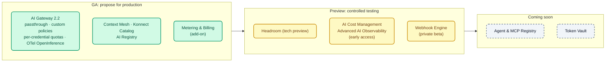

# AI Module 09: What's new in AI Gateway 2.1/2.2, AI Summit 2026 and roadmap

**Module message:** what was announced, **what status it is in** (GA, tech preview, early access, private beta, coming soon) and where we saw it in the course. Status as of **October 5, 2026**.

!!! warning "Rule for discussing the roadmap with customers"
    Only what is marked as **GA** can be proposed for production. *Tech preview*, *early access* and *private beta* are for controlled testing; *coming soon* is product intent with no committed date. Do not present any feature that does not appear in these tables.

---

## 1. Kong AI Gateway 2.1 and 2.2

AI Gateway **2.2** was released on **September 30, 2026**. Image: `kong/kong-ai-gateway:2.2.0`. Requires `kongctl` ≥ 1.20.1.

| New feature | Version | Status | Where it appears in the course |
| :--- | :---: | :--- | :--- |
| Custom policies published from the Control Plane (`ai_gateway_custom_policies`, `type: streaming`) | 2.2 (in 2.1, plugin streaming) | GA (beta in kongctl) | AI Module 08, demo 4 |
| **Passthrough** mode (`formats: [{type: passthrough}]`) | 2.2 | GA | AI Module 01 · AI Lab 01 |
| **Headroom** compression (`ai-prompt-compressor`, `provider: headroom`) | 2.2 | Tech preview | AI Module 04, demo 3 (instructor) |
| `ai-rate-limiting-advanced`: match by **credential** and by service | 2.2 | GA | AI Module 02 · AI Lab 02 |
| Calendar windows and **cost**-based budget (`tokens_count_strategy: cost`) | 2.x | GA | AI Module 02 · AI Lab 02 |
| **Per-modality** pricing (`input_cost_list` with `modal: text/image/audio/video`), cache read/write | 2.1 | GA | AI Module 01 (`demo_20_modelos_comerciales.yaml`) |
| MCP Server **Bundling** (`type: listener` + `sources`) with per-tool ACLs | 2.x | GA | AI Module 06 · AI Lab 06 |
| `condition` policy (expressions) and `acl` policy with `allow_when` / `deny_when` (CEL) | 2.1 | GA | AI Module 02 (concept) |
| Multiple aliases per model (`route.model.values`) | 2.1 | GA | AI Lab 01 (exercise) |
| Skills API (OpenAI / Anthropic, `type: api`, `capabilities: [skills]`) | 2.2 | GA | — |
| Typesafe/Jev provider (`decisions` capability) | 2.2 | GA | — |
| Kimi, Microsoft Foundry (`azure` + `foundry`), SageMaker providers | 2.x | GA | AI Module 01 (mention) |
| AWS IAM / SigV4 for Bedrock AgentCore | 2.2 | GA | AI Module 07 (mention) |
| MCP `passthrough-listener` (proxy for an external MCP server with auth, ACLs and upstream credential) | 2.x | GA | AI Module 06 (concept and known limitation) |
| **Metering & Billing** policy (`metering-and-billing`, `meter_ai_token_usage`) | 2.x | GA (Konnect add-on) | AI Module 08, demo 5 (optional) |
| MCP Token Vault | 2.2 | — | — (not exposed in kongctl) |
| OpenTelemetry with mTLS (`client_certificate`) and OpenInference attributes | 2.2 | GA | AI Module 08 · AI Lab 08 (OTel without mTLS) |
| Distroless and FIPS 140-3 images (`-fips-140-3`) | 2.2 | GA | — |
| CP and DP must run **exactly** the same version | 2.2 | — | AI Module 00 · AI Lab 00 |

!!! note "Not verified"
    The *identity-aware AI policies* (policies per Kong Identity *principal*) from the press announcement: the schema exposes `principals` in the auth strategies, but they were not found in the changelog. The course uses consumers and consumer groups.

---

## 2. AI Summit 2026: the Konnect platform as an "AI Connectivity Platform"

| Announcement | Status | How to show it |
| :--- | :--- | :--- |
| **Context Mesh** (existing APIs → well-designed MCP servers, *code mode*) | GA | Complement to AI Module 06 (in the course the REST→MCP conversion is declared in the AI Gateway) |
| **Konnect Catalog** (registry of models, APIs, MCP, events) | GA | Konnect UI |
| **AI Registry** | GA (new) | Konnect UI |
| **AI Cost Management** (spend attribution per agent/model) | Early access | Slide; per-target costs already feed Analytics (AI Module 08) |
| **Advanced AI Observability** (traces of multi-turn conversations) | Early access | Slide; today: OTel traces in OpenObserve / Phoenix (AI Module 08) |
| **Webhook Engine** (event-triggered agents) | Private beta | Slide |
| **Agent & MCP Registry** | Coming soon | Slide |
| **Token Vault** (agents without long-lived credentials) | Coming soon | Slide |

---

## 3. Day 3 wrap-up (instructor script, 10 min)

1. Go back to the AI Module 00 narrative: scattered keys, uncontrolled agents, ownerless invoices.
2. Review how each module addressed a problem: unified access (01), governance (02), security (03), optimization (04), knowledge (05), agents (06–07), visibility (08).
3. Show the two tables in this module and clearly separate **what can be used today** from what is coming.
4. Introduce Day 4: participants will build **everything they have seen** on their own AI Gateway, with local models and no paid keys, and will finish with the **governed credit assistant challenge**.

## 4. Sources

- [Introducing Kong AI Gateway 2.2](https://konghq.com/blog/product-releases/kong-ai-gateway-2-2)
- [AI Summit 2026 launch recap](https://konghq.com/blog/news/ai-summit-2026-launch-recap)
- [AI Gateway 2.x concepts](https://developer.konghq.com/ai-gateway/ai-gateway-v2-concepts/)
- [Kong AI Gateway Policies](https://developer.konghq.com/ai-gateway/policies/)
- kongctl v1.20.1: `docs/examples/declarative/ai-gateway/`

---

➡️ Next: [Day 4 — AI Lab 00: AI Gateway Setup](../../dia-4-ai-gateway-labs/Lab_IA_00_Setup.md)
