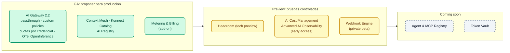

# Módulo IA 09: Novedades de AI Gateway 2.1/2.2, AI Summit 2026 y roadmap

**Mensaje del módulo:** qué se anunció, **en qué estado está** (GA, tech preview, early access, private beta, coming soon) y dónde lo vimos en el curso. Estado al **05/10/2026**.

!!! warning "Regla para hablar de roadmap con clientes"
    Sólo lo marcado como **GA** se puede proponer para producción. *Tech preview*, *early access* y *private beta* son para pruebas controladas; *coming soon* es intención de producto sin fecha comprometida. No presentar ninguna funcionalidad que no figure en estas tablas.

---

## 1. Kong AI Gateway 2.1 y 2.2

AI Gateway **2.2** se publicó el **30/09/2026**. Imagen: `kong/kong-ai-gateway:2.2.0`. Requiere `kongctl` ≥ 1.20.1.

| Novedad | Versión | Estado | Dónde se ve en el curso |
| :--- | :---: | :--- | :--- |
| Policies custom publicadas desde el Control Plane (`ai_gateway_custom_policies`, `type: streaming`) | 2.2 (en 2.1, streaming de plugins) | GA (beta en kongctl) | Módulo IA 08, demo 4 |
| Modo **passthrough** (`formats: [{type: passthrough}]`) | 2.2 | GA | Módulo IA 01 · Lab IA 01 |
| Compresión con **Headroom** (`ai-prompt-compressor`, `provider: headroom`) | 2.2 | Tech preview | Módulo IA 04, demo 3 (instructor) |
| `ai-rate-limiting-advanced`: match por **credencial** y por servicio | 2.2 | GA | Módulo IA 02 · Lab IA 02 |
| Ventanas calendario y presupuesto por **costo** (`tokens_count_strategy: cost`) | 2.x | GA | Módulo IA 02 · Lab IA 02 |
| Precios **por modalidad** (`input_cost_list` con `modal: text/image/audio/video`), cache read/write | 2.1 | GA | Módulo IA 01 (`demo_20_modelos_comerciales.yaml`) |
| MCP Server **Bundling** (`type: listener` + `sources`) con ACL por tool | 2.x | GA | Módulo IA 06 · Lab IA 06 |
| Policy `condition` (expresiones) y `acl` con `allow_when` / `deny_when` (CEL) | 2.1 | GA | Módulo IA 02 (concepto) |
| Varios alias por modelo (`route.model.values`) | 2.1 | GA | Lab IA 01 (ejercicio) |
| Skills API (OpenAI / Anthropic, `type: api`, `capabilities: [skills]`) | 2.2 | GA | — |
| Proveedor Typesafe/Jev (capability `decisions`) | 2.2 | GA | — |
| Proveedores Kimi, Microsoft Foundry (`azure` + `foundry`), SageMaker | 2.x | GA | Módulo IA 01 (mención) |
| AWS IAM / SigV4 para Bedrock AgentCore | 2.2 | GA | Módulo IA 07 (mención) |
| MCP `passthrough-listener` (proxy de un MCP externo con auth, ACL y credencial del upstream) | 2.x | GA | Módulo IA 06 (concepto y limitación conocida) |
| Policy **Metering & Billing** (`metering-and-billing`, `meter_ai_token_usage`) | 2.x | GA (add-on de Konnect) | Módulo IA 08, demo 5 (opcional) |
| MCP Token Vault | 2.2 | — | — (no expuesto en kongctl) |
| OpenTelemetry con mTLS (`client_certificate`) y atributos OpenInference | 2.2 | GA | Módulo IA 08 · Lab IA 08 (OTel sin mTLS) |
| Imágenes distroless y FIPS 140-3 (`-fips-140-3`) | 2.2 | GA | — |
| CP y DP deben tener **exactamente** la misma versión | 2.2 | — | Módulo IA 00 · Lab IA 00 |

!!! note "No verificado"
    Las *identity-aware AI policies* (policies por *principal* de Kong Identity) del anuncio de prensa: el esquema expone `principals` en las auth strategies, pero no se encontró en el changelog. El curso usa consumers y consumer groups.

---

## 2. AI Summit 2026: la plataforma Konnect como "AI Connectivity Platform"

| Anuncio | Estado | Cómo mostrarlo |
| :--- | :--- | :--- |
| **Context Mesh** (APIs existentes → servidores MCP bien diseñados, *code mode*) | GA | Complemento del Módulo IA 06 (en el curso la conversión REST→MCP se declara en el AI Gateway) |
| **Konnect Catalog** (registro de modelos, APIs, MCP, eventos) | GA | UI de Konnect |
| **AI Registry** | GA (nuevo) | UI de Konnect |
| **AI Cost Management** (atribución de gasto por agente/modelo) | Early access | Slide; los costos por target ya alimentan Analytics (Módulo IA 08) |
| **Advanced AI Observability** (trazas de conversaciones multi-turno) | Early access | Slide; hoy: trazas OTel en OpenObserve / Phoenix (Módulo IA 08) |
| **Webhook Engine** (agentes disparados por eventos) | Private beta | Slide |
| **Agent & MCP Registry** | Coming soon | Slide |
| **Token Vault** (agentes sin credenciales de larga duración) | Coming soon | Slide |

---

## 3. Cierre del Día 3 (guion del instructor, 10 min)

1. Volver a la narrativa del Módulo IA 00: claves dispersas, agentes sin control, facturas sin dueño.
2. Repasar cómo cada módulo respondió a un problema: acceso unificado (01), gobierno (02), seguridad (03), optimización (04), conocimiento (05), agentes (06–07), visibilidad (08).
3. Mostrar las dos tablas de este módulo y separar claramente **lo que se puede usar hoy** de lo que viene.
4. Presentar el Día 4: los participantes construirán **todo lo visto** en su propio AI Gateway, con modelos locales y sin claves de pago, y cerrarán con el **desafío del asistente de crédito gobernado**.

## 4. Fuentes

- [Introducing Kong AI Gateway 2.2](https://konghq.com/blog/product-releases/kong-ai-gateway-2-2)
- [AI Summit 2026 launch recap](https://konghq.com/blog/news/ai-summit-2026-launch-recap)
- [AI Gateway 2.x concepts](https://developer.konghq.com/ai-gateway/ai-gateway-v2-concepts/)
- [Kong AI Gateway Policies](https://developer.konghq.com/ai-gateway/policies/)
- kongctl v1.20.1: `docs/examples/declarative/ai-gateway/`

---

➡️ Siguiente: [Día 4 — Lab IA 00: Setup del AI Gateway](../../dia-4-ai-gateway-labs/Lab_IA_00_Setup.md)
