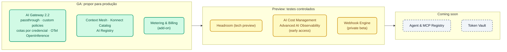

# Módulo IA 09: Novidades do AI Gateway 2.1/2.2, AI Summit 2026 e roadmap

**Mensagem do módulo:** o que foi anunciado, **em que status está** (GA, tech preview, early access, private beta, coming soon) e onde o vimos no curso. Status em **05/10/2026**.

!!! warning "Regra para falar de roadmap com clientes"
    Apenas o que estiver marcado como **GA** pode ser proposto para produção. *Tech preview*, *early access* e *private beta* são para testes controlados; *coming soon* é uma intenção de produto sem data comprometida. Não apresentar nenhuma funcionalidade que não conste nestas tabelas.

---

## 1. Kong AI Gateway 2.1 e 2.2

O AI Gateway **2.2** foi lançado em **30/09/2026**. Imagem: `kong/kong-ai-gateway:2.2.0`. Exige `kongctl` ≥ 1.20.1.

| Novidade | Versão | Status | Onde aparece no curso |
| :--- | :---: | :--- | :--- |
| Policies custom publicadas a partir do Control Plane (`ai_gateway_custom_policies`, `type: streaming`) | 2.2 (na 2.1, streaming de plugins) | GA (beta no kongctl) | Módulo IA 08, demo 4 |
| Modo **passthrough** (`formats: [{type: passthrough}]`) | 2.2 | GA | Módulo IA 01 · Lab IA 01 |
| Compressão com **Headroom** (`ai-prompt-compressor`, `provider: headroom`) | 2.2 | Tech preview | Módulo IA 04, demo 3 (instrutor) |
| `ai-rate-limiting-advanced`: match por **credencial** e por serviço | 2.2 | GA | Módulo IA 02 · Lab IA 02 |
| Janelas de calendário e orçamento por **custo** (`tokens_count_strategy: cost`) | 2.x | GA | Módulo IA 02 · Lab IA 02 |
| Preços **por modalidade** (`input_cost_list` com `modal: text/image/audio/video`), cache read/write | 2.1 | GA | Módulo IA 01 (`demo_20_modelos_comerciales.yaml`) |
| MCP Server **Bundling** (`type: listener` + `sources`) com ACL por tool | 2.x | GA | Módulo IA 06 · Lab IA 06 |
| Policy `condition` (expressões) e `acl` com `allow_when` / `deny_when` (CEL) | 2.1 | GA | Módulo IA 02 (conceito) |
| Vários alias por modelo (`route.model.values`) | 2.1 | GA | Lab IA 01 (exercício) |
| Skills API (OpenAI / Anthropic, `type: api`, `capabilities: [skills]`) | 2.2 | GA | — |
| Provedor Typesafe/Jev (capability `decisions`) | 2.2 | GA | — |
| Provedores Kimi, Microsoft Foundry (`azure` + `foundry`), SageMaker | 2.x | GA | Módulo IA 01 (menção) |
| AWS IAM / SigV4 para Bedrock AgentCore | 2.2 | GA | Módulo IA 07 (menção) |
| MCP `passthrough-listener` (proxy de um MCP externo com auth, ACL e credencial do upstream) | 2.x | GA | Módulo IA 06 (conceito e limitação conhecida) |
| Policy **Metering & Billing** (`metering-and-billing`, `meter_ai_token_usage`) | 2.x | GA (add-on do Konnect) | Módulo IA 08, demo 5 (opcional) |
| MCP Token Vault | 2.2 | — | — (não exposto no kongctl) |
| OpenTelemetry com mTLS (`client_certificate`) e atributos OpenInference | 2.2 | GA | Módulo IA 08 · Lab IA 08 (OTel sem mTLS) |
| Imagens distroless e FIPS 140-3 (`-fips-140-3`) | 2.2 | GA | — |
| CP e DP devem ter **exatamente** a mesma versão | 2.2 | — | Módulo IA 00 · Lab IA 00 |

!!! note "Não verificado"
    As *identity-aware AI policies* (policies por *principal* do Kong Identity) do anúncio de imprensa: o esquema expõe `principals` nas auth strategies, mas isso não foi encontrado no changelog. O curso usa consumers e consumer groups.

---

## 2. AI Summit 2026: a plataforma Konnect como "AI Connectivity Platform"

| Anúncio | Status | Como mostrar |
| :--- | :--- | :--- |
| **Context Mesh** (APIs existentes → servidores MCP bem projetados, *code mode*) | GA | Complemento do Módulo IA 06 (no curso, a conversão REST→MCP é declarada no AI Gateway) |
| **Konnect Catalog** (registro de modelos, APIs, MCP, eventos) | GA | UI do Konnect |
| **AI Registry** | GA (novo) | UI do Konnect |
| **AI Cost Management** (atribuição de gasto por agente/modelo) | Early access | Slide; os custos por target já alimentam o Analytics (Módulo IA 08) |
| **Advanced AI Observability** (traces de conversas multi-turno) | Early access | Slide; hoje: traces OTel no OpenObserve / Phoenix (Módulo IA 08) |
| **Webhook Engine** (agentes disparados por eventos) | Private beta | Slide |
| **Agent & MCP Registry** | Coming soon | Slide |
| **Token Vault** (agentes sem credenciais de longa duração) | Coming soon | Slide |

---

## 3. Encerramento do Dia 3 (roteiro do instrutor, 10 min)

1. Voltar à narrativa do Módulo IA 00: chaves dispersas, agentes sem controle, faturas sem dono.
2. Revisar como cada módulo respondeu a um problema: acesso unificado (01), governança (02), segurança (03), otimização (04), conhecimento (05), agentes (06–07), visibilidade (08).
3. Mostrar as duas tabelas deste módulo e separar claramente **o que pode ser usado hoje** do que está por vir.
4. Apresentar o Dia 4: os participantes construirão **tudo o que foi visto** em seu próprio AI Gateway, com modelos locais e sem chaves pagas, e encerrarão com o **desafio do assistente de crédito governado**.

## 4. Fontes

- [Introducing Kong AI Gateway 2.2](https://konghq.com/blog/product-releases/kong-ai-gateway-2-2)
- [AI Summit 2026 launch recap](https://konghq.com/blog/news/ai-summit-2026-launch-recap)
- [AI Gateway 2.x concepts](https://developer.konghq.com/ai-gateway/ai-gateway-v2-concepts/)
- [Kong AI Gateway Policies](https://developer.konghq.com/ai-gateway/policies/)
- kongctl v1.20.1: `docs/examples/declarative/ai-gateway/`

---

➡️ Próximo: [Dia 4 — Lab IA 00: Setup do AI Gateway](../../dia-4-ai-gateway-labs/Lab_IA_00_Setup.md)
