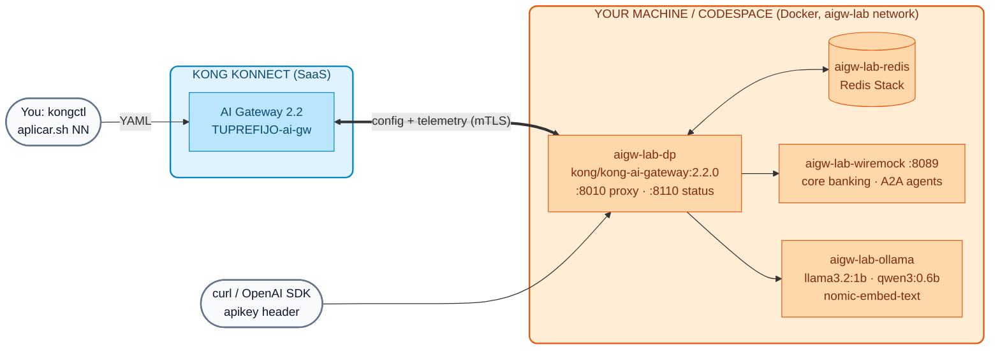

# AI Lab 00: AI Gateway 2.2 Setup (Konnect + local Data Plane + Ollama)

In this lab you will create **your own AI Gateway** in Konnect, bring up the **Data Plane 2.2** in Docker together with Redis, WireMock and **Ollama** (small open-weight models, running on CPU), and apply the base configuration with **kongctl**. When you finish, you will have a governed OpenAI-compatible endpoint at `http://localhost:8010`.

!!! success "No paid keys needed"
    All Day 4 labs use **local** models served by Ollama: `llama3.2:1b` (~1.3 GB), `qwen3:0.6b` (~0.5 GB) and `nomic-embed-text` (~0.3 GB) for embeddings. They run on a laptop or a Codespace **without a GPU**. They are small models: they answer in seconds and their quality is limited, but the governance the gateway applies is identical to that of a commercial model.



## Objectives

- Create the AI Gateway `TUPREFIJO-ai-gw` (version 2.2) in Konnect.
- Install/validate **kongctl ≥ 1.20.1**.
- Bring up the Data Plane 2.2 and the supporting services with a single script.
- Download the open-weight models and load the RAG knowledge base.
- Apply the base configuration (Ollama provider + identity) with kongctl and validate it.

---

## Step 1: Prerequisites

| Tool | Version | Validation |
| :--- | :--- | :--- |
| Docker + Docker Compose | 24+ (≥ 8 GB of RAM allocated to Docker; 10–12 GB if you also bring up the observability stack from AI Lab 08) | `docker info` |
| **kongctl** | **≥ 1.20.1** | `kongctl version` |
| jq, curl, openssl, python3 | any recent version | `jq --version && python3 --version` |

The general course prerequisites are in [Installation Prerequisites](../00-setup-entorno/Prerequisitos_Workshop_Kong_Konnect_Instalacion.md).

**Install or update kongctl** (version 1.16 does not know the AI Gateway 2.1/2.2 entities): download the binary for your operating system from the [v1.20.1](https://github.com/Kong/kongctl/releases/tag/v1.20.1) release page (for example `kongctl_darwin_arm64.zip` on a Mac with Apple Silicon), unzip it and place it on your `PATH`:

```bash
unzip kongctl_*.zip && chmod +x kongctl && mkdir -p ~/.local/bin && mv kongctl ~/.local/bin/
export PATH="$HOME/.local/bin:$PATH"
kongctl version
```

**Expected result:** `1.20.1` or later.

!!! tip "Codespaces / machines without a GPU"
    Use a **4-core / 16 GB** Codespace. It works with 2 cores, but model responses will take considerably longer. On a Mac with Apple Silicon you can use **Ollama installed on the host** (it uses the chip's GPU and is much faster): install Ollama and export `AIGW_OLLAMA_MODE=host` before running the setup.

## Step 2: Create your AI Gateway in Konnect

1. Log in to [Konnect](https://cloud.konghq.com) with your course user.
2. In the menu, open **AI Gateway** and create a new one (**New AI Gateway**).
3. Name: **`TUPREFIJO-ai-gw`** (use your `DEMO_PREFIX`, for example `jperez-ai-gw`).
4. Version: **2.2**. Deployment: self-managed Data Plane (*self-hosted*).
5. You do not need to follow the Data Plane deployment wizard: our script will take care of it.

!!! warning "Exact version"
    In AI Gateway 2.2 the Data Plane must have **exactly** the same version as the gateway in Konnect. The script uses `kong/kong-ai-gateway:2.2.0`; if your gateway ended up on a different version, change it in Konnect or export `KONG_DP_IMAGE` with the equivalent image.

## Step 3: Environment variables

```bash
export KONNECT_TOKEN="kpat_xxxxx"          # your Personal Access Token (provided by the instructor)
export DEMO_PREFIX="tu_nombre"             # the same prefix as the AI Gateway name
export KONNECT_ADDR="https://us.api.konghq.com"   # Konnect region (us, eu, au...)
# Optional:
# export AIGW_OLLAMA_MODE=host             # use Ollama installed on the host
# export AI_GATEWAY_ID=<id>                # if your gateway has a different name
```

!!! danger "Never write the token into repository files"
    The token only lives in your terminal. The consumers' API keys and the DP certificate are generated by the script in `~/.kong-workshop/aigw-lab/` (outside the repository, `600` permissions). Instructors load these variables with their **kong-env** profile.

## Step 4: Run the setup

From the root of the course repository:

```bash
./workshop-assets/dia-4/scripts/setup_lab.sh
```

The script is **idempotent** (you can re-run it) and performs 8 steps:

| Step | What it does |
| :--- | :--- |
| 1/8 | Checks Docker, kongctl ≥ 1.20.1, jq, curl, openssl, python3 |
| 2/8 | Looks up your AI Gateway `TUPREFIJO-ai-gw` with `GET /v1/ai-gateways` and saves its ID |
| 3/8 | Generates the API keys for 5 consumers in `~/.kong-workshop/aigw-lab/.env.generated` |
| 4/8 | Generates the DP certificate and registers it with `POST /v1/ai-gateways/{id}/data-plane-certificates` |
| 5/8 | Brings up `aigw-lab-dp`, `aigw-lab-redis`, `aigw-lab-wiremock` and `aigw-lab-ollama` (`workshop-assets/dia-4/docker-compose.yml`) and waits for the DP to connect |
| 6/8 | Downloads `llama3.2:1b`, `qwen3:0.6b` and `nomic-embed-text` into Ollama (the first time takes several minutes) |
| 7/8 | Loads the RAG knowledge base into Redis (`scripts/load_rag.sh`) |
| 8/8 | Applies the base configuration with kongctl (`scripts/aplicar.sh 00`) |

**Expected result (final):**

```text
Listo.
  Proxy AI Gateway .. http://localhost:8010   (POST /v1/chat/completions, header apikey)
  Konnect ........... https://cloud.konghq.com/us/ai-manager/v2/gateways/<id>
  Modelos ........... llama3.2:1b · qwen3:0.6b · nomic-embed-text (Ollama container)
  API keys .......... source /home/<tu-usuario>/.kong-workshop/aigw-lab/.env.generated   (variables AIGW_KEY_*)
  Siguiente ......... Lab IA 01: workshop-assets/dia-4/scripts/aplicar.sh 01

  Resultado: N OK, 0 fallos
```

## Step 5: Understand the base configuration

The configuration lives in `workshop-assets/dia-4/config/base/`:

```yaml
# 00-gateway.yaml — your gateway already exists; kongctl does NOT create or delete it
ai_gateways:
  - ref: lab-ai-gw
    _external:
      id: __AI_GATEWAY_ID__        # aplicar.sh replaces it with your AI_GATEWAY_ID

# 10-proveedores.yaml — a single, local provider
ai_gateway_model_providers:
  - ref: ollama
    ai_gateway: !ref lab-ai-gw#id
    name: ollama
    display_name: Ollama (local, open-weight)
    type: ollama
    config:
      auth:
        type: basic

# 15-identidad.yaml — key-auth (apikey header) + 4 consumers + 4 groups
ai_gateway_auth_strategies:
  - ref: lab-key-auth
    ...
    type: key-auth
    config: {key_names: [apikey], key_in_header: true, hide_credentials: true}
```

| Consumer | Groups | Use in the labs |
| :--- | :--- | :--- |
| `app-web` | `plan-basico` | Customer-facing app, low quota |
| `equipo-datos` | `plan-premium` | Internal team, high quota |
| `agente-copilot` | `plan-premium`, `agentes-operaciones` | Agent with write permissions |
| `agente-consulta` | `agentes-lectura` | Read-only agent |

**The working cycle for every lab:**

```bash
./workshop-assets/dia-4/scripts/aplicar.sh NN --diff        # what is going to change?
./workshop-assets/dia-4/scripts/aplicar.sh NN               # kongctl apply + sync (base + labs 01..NN)
./workshop-assets/dia-4/scripts/aplicar.sh NN --solucion    # applies the exercise solution
```

!!! info "What does aplicar.sh run?"
    It replaces your gateway ID in `00-gateway.yaml` (in a temporary directory) and runs `kongctl apply` followed by `kongctl sync` with `-f` for the base and for labs `01..NN`, plus `--base-url $KONNECT_ADDR --pat $KONNECT_TOKEN`. The labs are **cumulative**: `sync` deletes anything that is not declared, which is why `aplicar.sh 00` leaves your gateway clean.

## Step 6: Validation

1. **Containers:**

    ```bash
    docker ps --format '{{.Names}}\t{{.Status}}' | grep aigw-lab
    ```

    **Expected result:** `aigw-lab-dp` (healthy), `aigw-lab-redis`, `aigw-lab-wiremock` and `aigw-lab-ollama` in `Up` state.

2. **Data Plane connected:** in Konnect → AI Gateway → `TUPREFIJO-ai-gw` → **Data Plane Nodes**, `aigw-lab-dp-TUPREFIJO` appears with version `2.2.0`. From the terminal:

    ```bash
    curl -s -o /dev/null -w "%{http_code}\n" http://localhost:8110/status/ready
    # 200
    ```

3. **Models in Ollama:**

    ```bash
    docker exec aigw-lab-ollama ollama list      # (or 'ollama list' if you use AIGW_OLLAMA_MODE=host)
    ```

4. **RAG base loaded:**

    ```bash
    docker exec aigw-lab-redis redis-cli --scan --pattern 'kong_rag_injector:*' | wc -l
    # 6
    ```

5. **Configuration in sync** (there should be no pending changes):

    ```bash
    ./workshop-assets/dia-4/scripts/aplicar.sh 00 --diff
    ```

6. **The gateway responds** (there are no models yet: "no route" is expected):

    ```bash
    source ~/.kong-workshop/aigw-lab/.env.generated
    curl -s -i http://localhost:8010/v1/chat/completions -H "apikey: $AIGW_KEY_EQUIPO_DATOS" \
      -H "Content-Type: application/json" -d '{"model":"chat","messages":[{"role":"user","content":"hola"}]}' | head -1
    # HTTP/1.1 404 Not Found
    ```

## Common problems

| Symptom | Likely cause | Solution |
| :--- | :--- | :--- |
| `kongctl ... es anterior a 1.20.1` (older than 1.20.1) | Old kongctl on the `PATH` | Step 1; `which -a kongctl` |
| `No encontré el AI Gateway 'X-ai-gw'` (AI Gateway not found) | Different name or wrong region | Check `DEMO_PREFIX` / `KONNECT_ADDR`, or export `AI_GATEWAY_ID` |
| The DP is *healthy* but does not show up in Konnect | DP version ≠ gateway version | Adjust the version in Konnect or `KONG_DP_IMAGE`; `docker logs aigw-lab-dp` |
| `port is already allocated` (8010/8110/8089) | Another process is using the port | Export `AIGW_PROXY_PORT`, `AIGW_STATUS_PORT` or `AIGW_WIREMOCK_PORT` and re-run |
| Model download is very slow | Classroom network | Ask the instructor for the preloaded volume or use `AIGW_OLLAMA_MODE=host` with models already downloaded |
| 30–60 s responses | CPU with few cores | Normal on CPU; use short prompts. `docker stats` to see resource usage |

To shut down the environment: `./workshop-assets/dia-4/scripts/teardown.sh` (keeps models and state) or `teardown.sh --all` (deletes volumes and `~/.kong-workshop/aigw-lab`).

---

## Optional: commercial keys

They are not required. If you have your own OpenAI, Anthropic and Gemini keys, you can reproduce the Day 3 commercial demos by exporting `OPENAI_API_KEY`, `ANTHROPIC_API_KEY` and `GEMINI_API_KEY` and applying with `WITH_CLOUD=1` (see [AI Module 01](../dia-3-ai-gateway-teoria-y-demos/01-multi-llm/Guia_IA_01_Un_Endpoint_Muchos_LLMs.md)). The keys are stored in the **Konnect vault**, never in files.

---

## Conclusion

You now have your own AI Gateway 2.2, governed from Konnect with YAML and kongctl, with a Data Plane on your machine and local open-weight models. Next: [AI Lab 01 — Multi-LLM, failover and passthrough](Lab_IA_01_Multi_LLM_Failover.md).
