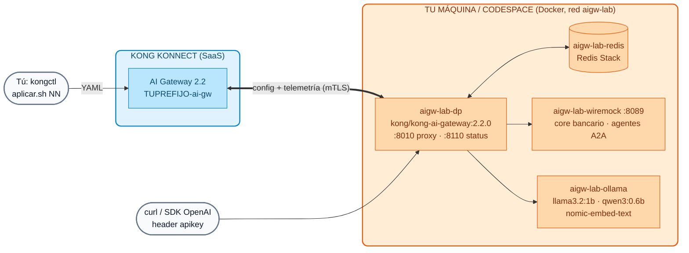

# Lab IA 00: Setup del AI Gateway 2.2 (Konnect + Data Plane local + Ollama)

En este laboratorio crearás **tu propio AI Gateway** en Konnect, levantarás el **Data Plane 2.2** en Docker junto con Redis, WireMock y **Ollama** (modelos open-weight pequeños, en CPU) y aplicarás la configuración base con **kongctl**. Al terminar tendrás un endpoint OpenAI-compatible gobernado en `http://localhost:8010`.

!!! success "No necesitas claves de pago"
    Todos los labs del Día 4 usan modelos **locales** servidos por Ollama: `llama3.2:1b` (~1,3 GB), `qwen3:0.6b` (~0,5 GB) y `nomic-embed-text` (~0,3 GB) para embeddings. Funcionan en una laptop o un Codespace **sin GPU**. Son modelos pequeños: responden en segundos y su calidad es limitada, pero el gobierno que aplica el gateway es idéntico al de un modelo comercial.



## Objetivos

- Crear el AI Gateway `TUPREFIJO-ai-gw` (versión 2.2) en Konnect.
- Instalar/validar **kongctl ≥ 1.20.1**.
- Levantar el Data Plane 2.2 y los servicios de apoyo con un único script.
- Descargar los modelos open-weight y cargar la base de conocimiento RAG.
- Aplicar la configuración base (proveedor Ollama + identidad) con kongctl y validar.

---

## Paso 1: Prerrequisitos

| Herramienta | Versión | Validación |
| :--- | :--- | :--- |
| Docker + Docker Compose | 24+ (≥ 8 GB de RAM asignados a Docker; 10–12 GB si además levantas el stack de observabilidad del Lab IA 08) | `docker info` |
| **kongctl** | **≥ 1.20.1** | `kongctl version` |
| jq, curl, openssl, python3 | cualquiera reciente | `jq --version && python3 --version` |

Los prerrequisitos generales del curso están en [Prerrequisitos de Instalación](../00-setup-entorno/Prerequisitos_Workshop_Kong_Konnect_Instalacion.md).

**Instalar o actualizar kongctl** (la 1.16 no conoce las entidades de AI Gateway 2.1/2.2): descarga el binario de tu sistema operativo desde la página de la release [v1.20.1](https://github.com/Kong/kongctl/releases/tag/v1.20.1) (por ejemplo `kongctl_darwin_arm64.zip` en Mac con Apple Silicon), descomprímelo y colócalo en tu `PATH`:

```bash
unzip kongctl_*.zip && chmod +x kongctl && mkdir -p ~/.local/bin && mv kongctl ~/.local/bin/
export PATH="$HOME/.local/bin:$PATH"
kongctl version
```

**Resultado esperado:** `1.20.1` o superior.

!!! tip "Codespaces / máquinas sin GPU"
    Usa un Codespace de **4 núcleos / 16 GB**. Con 2 núcleos funciona, pero las respuestas de los modelos tardarán bastante más. En Mac con Apple Silicon puedes usar **Ollama instalado en el host** (aprovecha la GPU del chip y es mucho más rápido): instala Ollama y exporta `AIGW_OLLAMA_MODE=host` antes del setup.

## Paso 2: Crear tu AI Gateway en Konnect

1. Entra a [Konnect](https://cloud.konghq.com) con tu usuario del curso.
2. En el menú, abre **AI Gateway** y crea uno nuevo (**New AI Gateway**).
3. Nombre: **`TUPREFIJO-ai-gw`** (usa tu `DEMO_PREFIX`, por ejemplo `jperez-ai-gw`).
4. Versión: **2.2**. Despliegue: Data Plane autogestionado (*self-hosted*).
5. No hace falta seguir el asistente de despliegue del Data Plane: lo hará nuestro script.

!!! warning "Versión exacta"
    En AI Gateway 2.2 el Data Plane debe tener **exactamente** la misma versión que el gateway en Konnect. El script usa `kong/kong-ai-gateway:2.2.0`; si tu gateway quedó en otra versión, cámbiala en Konnect o exporta `KONG_DP_IMAGE` con la imagen equivalente.

## Paso 3: Variables de entorno

```bash
export KONNECT_TOKEN="kpat_xxxxx"          # tu Personal Access Token (te lo da el instructor)
export DEMO_PREFIX="tu_nombre"             # el mismo prefijo del nombre del AI Gateway
export KONNECT_ADDR="https://us.api.konghq.com"   # región de Konnect (us, eu, au...)
# Opcional:
# export AIGW_OLLAMA_MODE=host             # usar Ollama instalado en el host
# export AI_GATEWAY_ID=<id>                # si tu gateway tiene otro nombre
```

!!! danger "Nunca escribas el token en archivos del repositorio"
    El token sólo vive en tu terminal. Las API keys de los consumers y el certificado del DP los genera el script en `~/.kong-workshop/aigw-lab/` (fuera del repositorio, permisos `600`). Los instructores cargan estas variables con su perfil **kong-env**.

## Paso 4: Ejecutar el setup

Desde la raíz del repositorio del curso:

```bash
./workshop-assets/dia-4/scripts/setup_lab.sh
```

El script es **idempotente** (puedes re-ejecutarlo) y hace 8 pasos:

| Paso | Qué hace |
| :--- | :--- |
| 1/8 | Verifica Docker, kongctl ≥ 1.20.1, jq, curl, openssl, python3 |
| 2/8 | Busca tu AI Gateway `TUPREFIJO-ai-gw` con `GET /v1/ai-gateways` y guarda su ID |
| 3/8 | Genera las API keys de 5 consumers en `~/.kong-workshop/aigw-lab/.env.generated` |
| 4/8 | Genera el certificado del DP y lo registra con `POST /v1/ai-gateways/{id}/data-plane-certificates` |
| 5/8 | Levanta `aigw-lab-dp`, `aigw-lab-redis`, `aigw-lab-wiremock` y `aigw-lab-ollama` (`workshop-assets/dia-4/docker-compose.yml`) y espera a que el DP se conecte |
| 6/8 | Descarga `llama3.2:1b`, `qwen3:0.6b` y `nomic-embed-text` en Ollama (la primera vez tarda varios minutos) |
| 7/8 | Carga la base de conocimiento RAG en Redis (`scripts/load_rag.sh`) |
| 8/8 | Aplica la configuración base con kongctl (`scripts/aplicar.sh 00`) |

**Resultado esperado (final):**

```text
Listo.
  Proxy AI Gateway .. http://localhost:8010   (POST /v1/chat/completions, header apikey)
  Konnect ........... https://cloud.konghq.com/us/ai-manager/v2/gateways/<id>
  Modelos ........... llama3.2:1b · qwen3:0.6b · nomic-embed-text (Ollama container)
  API keys .......... source /home/<tu-usuario>/.kong-workshop/aigw-lab/.env.generated   (variables AIGW_KEY_*)
  Siguiente ......... Lab IA 01: workshop-assets/dia-4/scripts/aplicar.sh 01

  Resultado: N OK, 0 fallos
```

## Paso 5: Entender la configuración base

La configuración vive en `workshop-assets/dia-4/config/base/`:

```yaml
# 00-gateway.yaml — tu gateway existe; kongctl NO lo crea ni lo borra
ai_gateways:
  - ref: lab-ai-gw
    _external:
      id: __AI_GATEWAY_ID__        # aplicar.sh lo reemplaza por tu AI_GATEWAY_ID

# 10-proveedores.yaml — un único proveedor, local
ai_gateway_model_providers:
  - ref: ollama
    ai_gateway: !ref lab-ai-gw#id
    name: ollama
    display_name: Ollama (local, open-weight)
    type: ollama
    config:
      auth:
        type: basic

# 15-identidad.yaml — key-auth (header apikey) + 4 consumers + 4 grupos
ai_gateway_auth_strategies:
  - ref: lab-key-auth
    ...
    type: key-auth
    config: {key_names: [apikey], key_in_header: true, hide_credentials: true}
```

| Consumer | Grupos | Uso en los labs |
| :--- | :--- | :--- |
| `app-web` | `plan-basico` | App de clientes, cuota baja |
| `equipo-datos` | `plan-premium` | Equipo interno, cuota alta |
| `agente-copilot` | `plan-premium`, `agentes-operaciones` | Agente con permisos de escritura |
| `agente-consulta` | `agentes-lectura` | Agente de solo lectura |

**El ciclo de trabajo de todos los labs:**

```bash
./workshop-assets/dia-4/scripts/aplicar.sh NN --diff        # ¿qué va a cambiar?
./workshop-assets/dia-4/scripts/aplicar.sh NN               # kongctl apply + sync (base + labs 01..NN)
./workshop-assets/dia-4/scripts/aplicar.sh NN --solucion    # aplica la solución del ejercicio
```

!!! info "¿Qué ejecuta aplicar.sh?"
    Reemplaza el ID de tu gateway en `00-gateway.yaml` (en un directorio temporal) y ejecuta `kongctl apply` y luego `kongctl sync` con `-f` de la base y de los labs `01..NN`, más `--base-url $KONNECT_ADDR --pat $KONNECT_TOKEN`. Los labs son **acumulativos**: `sync` borra lo que no esté declarado, por eso `aplicar.sh 00` deja tu gateway limpio.

## Paso 6: Validación

1. **Contenedores:**

    ```bash
    docker ps --format '{{.Names}}\t{{.Status}}' | grep aigw-lab
    ```

    **Resultado esperado:** `aigw-lab-dp` (healthy), `aigw-lab-redis`, `aigw-lab-wiremock` y `aigw-lab-ollama` en estado `Up`.

2. **Data Plane conectado:** en Konnect → AI Gateway → `TUPREFIJO-ai-gw` → **Data Plane Nodes** aparece `aigw-lab-dp-TUPREFIJO` con versión `2.2.0`. Desde la terminal:

    ```bash
    curl -s -o /dev/null -w "%{http_code}\n" http://localhost:8110/status/ready
    # 200
    ```

3. **Modelos en Ollama:**

    ```bash
    docker exec aigw-lab-ollama ollama list      # (o 'ollama list' si usas AIGW_OLLAMA_MODE=host)
    ```

4. **Base RAG cargada:**

    ```bash
    docker exec aigw-lab-redis redis-cli --scan --pattern 'kong_rag_injector:*' | wc -l
    # 6
    ```

5. **Configuración sincronizada** (no debería haber cambios pendientes):

    ```bash
    ./workshop-assets/dia-4/scripts/aplicar.sh 00 --diff
    ```

6. **El gateway responde** (todavía no hay modelos: lo esperado es "no route"):

    ```bash
    source ~/.kong-workshop/aigw-lab/.env.generated
    curl -s -i http://localhost:8010/v1/chat/completions -H "apikey: $AIGW_KEY_EQUIPO_DATOS" \
      -H "Content-Type: application/json" -d '{"model":"chat","messages":[{"role":"user","content":"hola"}]}' | head -1
    # HTTP/1.1 404 Not Found
    ```

## Problemas comunes

| Síntoma | Causa probable | Solución |
| :--- | :--- | :--- |
| `kongctl ... es anterior a 1.20.1` | kongctl viejo en el `PATH` | Paso 1; `which -a kongctl` |
| `No encontré el AI Gateway 'X-ai-gw'` | Nombre distinto o región incorrecta | Revisa `DEMO_PREFIX` / `KONNECT_ADDR`, o exporta `AI_GATEWAY_ID` |
| El DP está *healthy* pero no aparece en Konnect | Versión del DP ≠ versión del gateway | Ajustar la versión en Konnect o `KONG_DP_IMAGE`; `docker logs aigw-lab-dp` |
| `port is already allocated` (8010/8110/8089) | Otro proceso usa el puerto | Exporta `AIGW_PROXY_PORT`, `AIGW_STATUS_PORT` o `AIGW_WIREMOCK_PORT` y re-ejecuta |
| La descarga de modelos es muy lenta | Red del aula | Pedir al instructor el volumen precargado o usar `AIGW_OLLAMA_MODE=host` con modelos ya descargados |
| Respuestas de 30–60 s | CPU con pocos núcleos | Normal en CPU; usa prompts cortos. `docker stats` para ver consumo |

Para apagar el entorno: `./workshop-assets/dia-4/scripts/teardown.sh` (conserva modelos y estado) o `teardown.sh --all` (borra volúmenes y `~/.kong-workshop/aigw-lab`).

---

## Opcional: claves comerciales

No son necesarias. Si tienes claves propias de OpenAI, Anthropic y Gemini, puedes reproducir las demos comerciales del Día 3 exportando `OPENAI_API_KEY`, `ANTHROPIC_API_KEY` y `GEMINI_API_KEY` y aplicando con `WITH_CLOUD=1` (ver [Módulo IA 01](../dia-3-ai-gateway-teoria-y-demos/01-multi-llm/Guia_IA_01_Un_Endpoint_Muchos_LLMs.md)). Las claves se guardan en el **vault de Konnect**, nunca en archivos.

---

## Conclusión

Tienes un AI Gateway 2.2 propio, gobernado desde Konnect con YAML y kongctl, con un Data Plane en tu máquina y modelos open-weight locales. Siguiente: [Lab IA 01 — Multi-LLM, failover y passthrough](Lab_IA_01_Multi_LLM_Failover.md).
