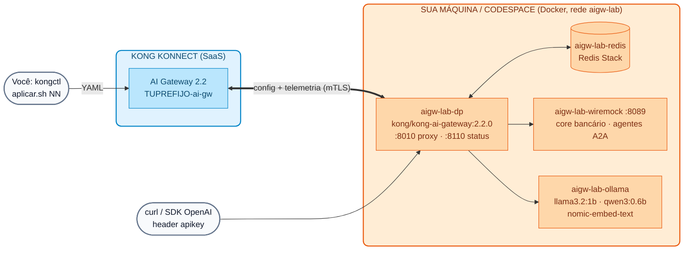

# Lab IA 00: Setup do AI Gateway 2.2 (Konnect + Data Plane local + Ollama)

Neste laboratório você vai criar **o seu próprio AI Gateway** no Konnect, subir o **Data Plane 2.2** no Docker junto com Redis, WireMock e **Ollama** (modelos open-weight pequenos, em CPU) e aplicar a configuração base com o **kongctl**. Ao final, você terá um endpoint compatível com OpenAI e governado em `http://localhost:8010`.

!!! success "Você não precisa de chaves pagas"
    Todos os labs do Dia 4 usam modelos **locais** servidos pelo Ollama: `llama3.2:1b` (~1,3 GB), `qwen3:0.6b` (~0,5 GB) e `nomic-embed-text` (~0,3 GB) para embeddings. Eles funcionam em um notebook ou em um Codespace **sem GPU**. São modelos pequenos: respondem em segundos e têm qualidade limitada, mas a governança aplicada pelo gateway é idêntica à de um modelo comercial.



## Objetivos

- Criar o AI Gateway `TUPREFIJO-ai-gw` (versão 2.2) no Konnect.
- Instalar/validar o **kongctl ≥ 1.20.1**.
- Subir o Data Plane 2.2 e os serviços de apoio com um único script.
- Baixar os modelos open-weight e carregar a base de conhecimento RAG.
- Aplicar a configuração base (provedor Ollama + identidade) com o kongctl e validar.

---

## Passo 1: Pré-requisitos

| Ferramenta | Versão | Validação |
| :--- | :--- | :--- |
| Docker + Docker Compose | 24+ (≥ 8 GB de RAM alocados ao Docker; 10–12 GB se você também subir o stack de observabilidade do Lab IA 08) | `docker info` |
| **kongctl** | **≥ 1.20.1** | `kongctl version` |
| jq, curl, openssl, python3 | qualquer versão recente | `jq --version && python3 --version` |

Os pré-requisitos gerais do curso estão em [Pré-requisitos de Instalação](../00-setup-entorno/Prerequisitos_Workshop_Kong_Konnect_Instalacion.md).

**Instalar ou atualizar o kongctl** (a 1.16 não conhece as entidades do AI Gateway 2.1/2.2): baixe o binário do seu sistema operacional na página da release [v1.20.1](https://github.com/Kong/kongctl/releases/tag/v1.20.1) (por exemplo `kongctl_darwin_arm64.zip` em um Mac com Apple Silicon), descompacte-o e coloque-o no seu `PATH`:

```bash
unzip kongctl_*.zip && chmod +x kongctl && mkdir -p ~/.local/bin && mv kongctl ~/.local/bin/
export PATH="$HOME/.local/bin:$PATH"
kongctl version
```

**Resultado esperado:** `1.20.1` ou superior.

!!! tip "Codespaces / máquinas sem GPU"
    Use um Codespace de **4 núcleos / 16 GB**. Com 2 núcleos funciona, mas as respostas dos modelos vão demorar bem mais. Em um Mac com Apple Silicon você pode usar o **Ollama instalado no host** (ele aproveita a GPU do chip e é muito mais rápido): instale o Ollama e exporte `AIGW_OLLAMA_MODE=host` antes do setup.

## Passo 2: Criar o seu AI Gateway no Konnect

1. Acesse o [Konnect](https://cloud.konghq.com) com o seu usuário do curso.
2. No menu, abra **AI Gateway** e crie um novo (**New AI Gateway**).
3. Nome: **`TUPREFIJO-ai-gw`** (use o seu `DEMO_PREFIX`, por exemplo `jperez-ai-gw`).
4. Versão: **2.2**. Implantação: Data Plane autogerenciado (*self-hosted*).
5. Não é preciso seguir o assistente de implantação do Data Plane: o nosso script fará isso.

!!! warning "Versão exata"
    No AI Gateway 2.2, o Data Plane deve ter **exatamente** a mesma versão do gateway no Konnect. O script usa `kong/kong-ai-gateway:2.2.0`; se o seu gateway ficou em outra versão, altere-a no Konnect ou exporte `KONG_DP_IMAGE` com a imagem equivalente.

## Passo 3: Variáveis de ambiente

```bash
export KONNECT_TOKEN="kpat_xxxxx"          # seu Personal Access Token (fornecido pelo instrutor)
export DEMO_PREFIX="tu_nombre"             # o mesmo prefixo do nome do AI Gateway
export KONNECT_ADDR="https://us.api.konghq.com"   # região do Konnect (us, eu, au...)
# Opcional:
# export AIGW_OLLAMA_MODE=host             # usar o Ollama instalado no host
# export AI_GATEWAY_ID=<id>                # se o seu gateway tiver outro nome
```

!!! danger "Nunca escreva o token em arquivos do repositório"
    O token existe apenas no seu terminal. As API keys dos consumers e o certificado do DP são gerados pelo script em `~/.kong-workshop/aigw-lab/` (fora do repositório, permissões `600`). Os instrutores carregam essas variáveis com o perfil **kong-env**.

## Passo 4: Executar o setup

A partir da raiz do repositório do curso:

```bash
./workshop-assets/dia-4/scripts/setup_lab.sh
```

O script é **idempotente** (você pode executá-lo novamente) e realiza 8 passos:

| Passo | O que faz |
| :--- | :--- |
| 1/8 | Verifica Docker, kongctl ≥ 1.20.1, jq, curl, openssl, python3 |
| 2/8 | Procura o seu AI Gateway `TUPREFIJO-ai-gw` com `GET /v1/ai-gateways` e guarda o ID |
| 3/8 | Gera as API keys de 5 consumers em `~/.kong-workshop/aigw-lab/.env.generated` |
| 4/8 | Gera o certificado do DP e o registra com `POST /v1/ai-gateways/{id}/data-plane-certificates` |
| 5/8 | Sobe `aigw-lab-dp`, `aigw-lab-redis`, `aigw-lab-wiremock` e `aigw-lab-ollama` (`workshop-assets/dia-4/docker-compose.yml`) e espera o DP se conectar |
| 6/8 | Baixa `llama3.2:1b`, `qwen3:0.6b` e `nomic-embed-text` no Ollama (na primeira vez leva vários minutos) |
| 7/8 | Carrega a base de conhecimento RAG no Redis (`scripts/load_rag.sh`) |
| 8/8 | Aplica a configuração base com o kongctl (`scripts/aplicar.sh 00`) |

**Resultado esperado (final):**

```text
Listo.
  Proxy AI Gateway .. http://localhost:8010   (POST /v1/chat/completions, header apikey)
  Konnect ........... https://cloud.konghq.com/us/ai-manager/v2/gateways/<id>
  Modelos ........... llama3.2:1b · qwen3:0.6b · nomic-embed-text (Ollama container)
  API keys .......... source /home/<tu-usuario>/.kong-workshop/aigw-lab/.env.generated   (variables AIGW_KEY_*)
  Siguiente ......... Lab IA 01: workshop-assets/dia-4/scripts/aplicar.sh 01

  Resultado: N OK, 0 fallos
```

## Passo 5: Entender a configuração base

A configuração fica em `workshop-assets/dia-4/config/base/`:

```yaml
# 00-gateway.yaml — o seu gateway já existe; o kongctl NÃO o cria nem o apaga
ai_gateways:
  - ref: lab-ai-gw
    _external:
      id: __AI_GATEWAY_ID__        # o aplicar.sh substitui pelo seu AI_GATEWAY_ID

# 10-proveedores.yaml — um único provedor, local
ai_gateway_model_providers:
  - ref: ollama
    ai_gateway: !ref lab-ai-gw#id
    name: ollama
    display_name: Ollama (local, open-weight)
    type: ollama
    config:
      auth:
        type: basic

# 15-identidad.yaml — key-auth (header apikey) + 4 consumers + 4 grupos
ai_gateway_auth_strategies:
  - ref: lab-key-auth
    ...
    type: key-auth
    config: {key_names: [apikey], key_in_header: true, hide_credentials: true}
```

| Consumer | Grupos | Uso nos labs |
| :--- | :--- | :--- |
| `app-web` | `plan-basico` | App de clientes, cota baixa |
| `equipo-datos` | `plan-premium` | Equipe interna, cota alta |
| `agente-copilot` | `plan-premium`, `agentes-operaciones` | Agente com permissões de escrita |
| `agente-consulta` | `agentes-lectura` | Agente somente leitura |

**O ciclo de trabalho de todos os labs:**

```bash
./workshop-assets/dia-4/scripts/aplicar.sh NN --diff        # o que vai mudar?
./workshop-assets/dia-4/scripts/aplicar.sh NN               # kongctl apply + sync (base + labs 01..NN)
./workshop-assets/dia-4/scripts/aplicar.sh NN --solucion    # aplica a solução do exercício
```

!!! info "O que o aplicar.sh executa?"
    Ele substitui o ID do seu gateway em `00-gateway.yaml` (em um diretório temporário) e executa `kongctl apply` e depois `kongctl sync` com `-f` da base e dos labs `01..NN`, além de `--base-url $KONNECT_ADDR --pat $KONNECT_TOKEN`. Os labs são **cumulativos**: o `sync` apaga tudo o que não estiver declarado; por isso o `aplicar.sh 00` deixa o seu gateway limpo.

## Passo 6: Validação

1. **Contêineres:**

    ```bash
    docker ps --format '{{.Names}}\t{{.Status}}' | grep aigw-lab
    ```

    **Resultado esperado:** `aigw-lab-dp` (healthy), `aigw-lab-redis`, `aigw-lab-wiremock` e `aigw-lab-ollama` no estado `Up`.

2. **Data Plane conectado:** no Konnect → AI Gateway → `TUPREFIJO-ai-gw` → **Data Plane Nodes** aparece `aigw-lab-dp-TUPREFIJO` com a versão `2.2.0`. Pelo terminal:

    ```bash
    curl -s -o /dev/null -w "%{http_code}\n" http://localhost:8110/status/ready
    # 200
    ```

3. **Modelos no Ollama:**

    ```bash
    docker exec aigw-lab-ollama ollama list      # (ou 'ollama list' se você usa AIGW_OLLAMA_MODE=host)
    ```

4. **Base RAG carregada:**

    ```bash
    docker exec aigw-lab-redis redis-cli --scan --pattern 'kong_rag_injector:*' | wc -l
    # 6
    ```

5. **Configuração sincronizada** (não deveria haver mudanças pendentes):

    ```bash
    ./workshop-assets/dia-4/scripts/aplicar.sh 00 --diff
    ```

6. **O gateway responde** (ainda não há modelos: o esperado é "no route"):

    ```bash
    source ~/.kong-workshop/aigw-lab/.env.generated
    curl -s -i http://localhost:8010/v1/chat/completions -H "apikey: $AIGW_KEY_EQUIPO_DATOS" \
      -H "Content-Type: application/json" -d '{"model":"chat","messages":[{"role":"user","content":"hola"}]}' | head -1
    # HTTP/1.1 404 Not Found
    ```

## Problemas comuns

| Sintoma | Causa provável | Solução |
| :--- | :--- | :--- |
| `kongctl ... es anterior a 1.20.1` | kongctl antigo no `PATH` | Passo 1; `which -a kongctl` |
| `No encontré el AI Gateway 'X-ai-gw'` | Nome diferente ou região incorreta | Revise `DEMO_PREFIX` / `KONNECT_ADDR`, ou exporte `AI_GATEWAY_ID` |
| O DP está *healthy* mas não aparece no Konnect | Versão do DP ≠ versão do gateway | Ajustar a versão no Konnect ou `KONG_DP_IMAGE`; `docker logs aigw-lab-dp` |
| `port is already allocated` (8010/8110/8089) | Outro processo está usando a porta | Exporte `AIGW_PROXY_PORT`, `AIGW_STATUS_PORT` ou `AIGW_WIREMOCK_PORT` e execute novamente |
| O download dos modelos está muito lento | Rede da sala de aula | Pedir ao instrutor o volume pré-carregado ou usar `AIGW_OLLAMA_MODE=host` com modelos já baixados |
| Respostas de 30–60 s | CPU com poucos núcleos | Normal em CPU; use prompts curtos. `docker stats` para ver o consumo |

Para desligar o ambiente: `./workshop-assets/dia-4/scripts/teardown.sh` (mantém modelos e estado) ou `teardown.sh --all` (apaga os volumes e `~/.kong-workshop/aigw-lab`).

---

## Opcional: chaves comerciais

Não são necessárias. Se você tiver chaves próprias da OpenAI, Anthropic e Gemini, pode reproduzir as demos comerciais do Dia 3 exportando `OPENAI_API_KEY`, `ANTHROPIC_API_KEY` e `GEMINI_API_KEY` e aplicando com `WITH_CLOUD=1` (veja o [Módulo IA 01](../dia-3-ai-gateway-teoria-y-demos/01-multi-llm/Guia_IA_01_Un_Endpoint_Muchos_LLMs.md)). As chaves são guardadas no **vault do Konnect**, nunca em arquivos.

---

## Conclusão

Você tem um AI Gateway 2.2 próprio, governado a partir do Konnect com YAML e kongctl, com um Data Plane na sua máquina e modelos open-weight locais. Próximo: [Lab IA 01 — Multi-LLM, failover e passthrough](Lab_IA_01_Multi_LLM_Failover.md).
