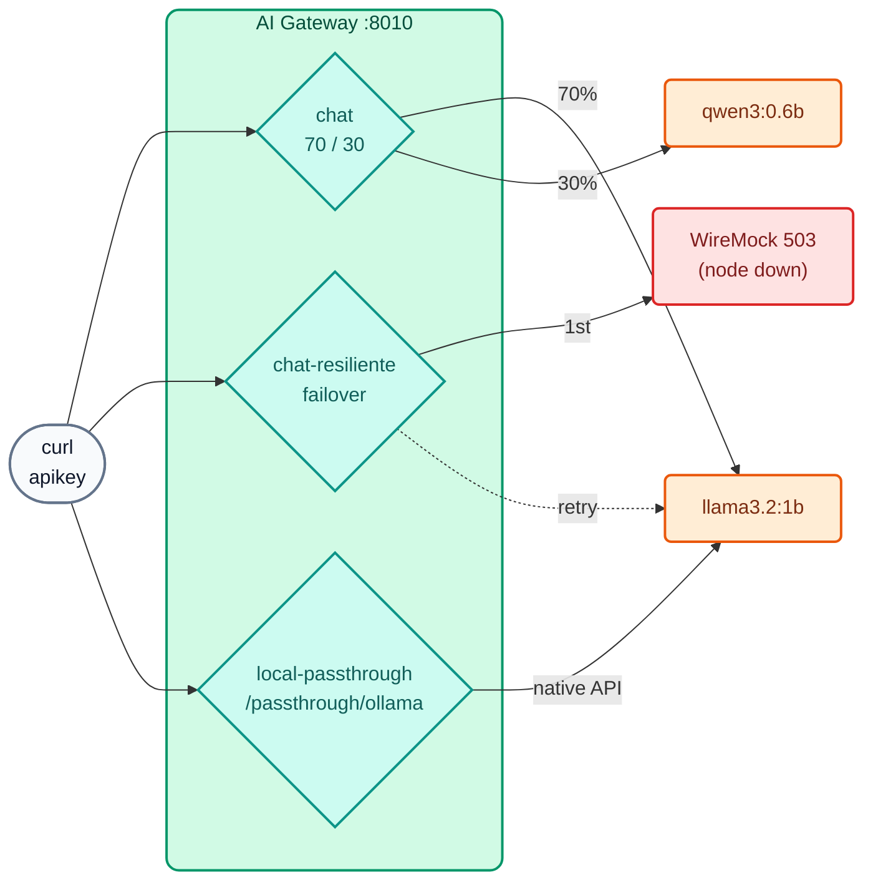

# AI Lab 01: One endpoint, many LLMs — load balancing, failover and passthrough

In this lab you will publish your first **virtual models**: a `chat` model that splits traffic between two open-weight models, a `chat-resiliente` model that survives the outage of its primary provider, and a `local-passthrough` model that exposes Ollama's **native** API under the gateway's governance.



## Objectives

- Understand virtual model, provider and target.
- Balance between two weighted models and see it in the `X-Kong-LLM-Model` header.
- Verify a transparent failover when a `503` occurs.
- Use **passthrough** mode (2.2) with Ollama's native API.
- Exercise: change the weights and add a second alias to the model.

---

## Step 1: Review the configuration

Open `workshop-assets/dia-4/config/lab_01_multi_llm.yaml`. Key points:

```yaml
config:
  route:
    paths: [/v1]
    methods: [POST]
    model: {body_param: model, values: [chat]}   # the alias the app sends in "model"
  model: {name_header: true}                     # returns X-Kong-LLM-Model
  balancer:
    algorithm: round-robin
    failover_criteria: [error, timeout, http_429, http_500, http_502, http_503]
    retries: 3
targets:
  - name: !env AIGW_MODELO_GENERAL                # llama3.2:1b
    provider: ollama
    weight: 70
    config: {type: ollama, upstream_url: !env AIGW_OLLAMA_CHAT_URL, max_tokens: 256, input_cost: 0.05, output_cost: 0.20}
  - name: !env AIGW_MODELO_CODIGO                 # qwen3:0.6b
    provider: ollama
    weight: 30
    ...
```

- `!env AIGW_MODELO_GENERAL` / `!env AIGW_OLLAMA_CHAT_URL`: kongctl takes the values from environment variables defined by `common.sh` (which is why you can switch models without editing the YAML).
- `input_cost` / `output_cost`: **illustrative** "internal cost" (USD per 1M tokens) used to see *chargeback* in Analytics in AI Lab 08.
- In `chat-resiliente` the primary target (weight 100) has `upstream_url: http://wiremock:8080/proveedor-caido/api/chat`, which always responds `503`.

## Step 2: Apply

```bash
./workshop-assets/dia-4/scripts/aplicar.sh 01 --diff     # you will see 3 models being created
./workshop-assets/dia-4/scripts/aplicar.sh 01
source ~/.kong-workshop/aigw-lab/.env.generated
```

In Konnect → **Models**: `chat`, `chat-resiliente` and `local-passthrough` appear with their targets.

## Step 3: No credential, no AI

```bash
curl -s -o /dev/null -w "%{http_code}\n" http://localhost:8010/v1/chat/completions \
  -H "Content-Type: application/json" -d '{"model":"chat","messages":[{"role":"user","content":"hola"}]}'
```

**Expected result:** `401`.

## Step 4: Weighted load balancing

```bash
for i in 1 2 3 4 5 6; do
  curl -s -D - -o /dev/null http://localhost:8010/v1/chat/completions \
    -H "apikey: $AIGW_KEY_EQUIPO_DATOS" -H "Content-Type: application/json" \
    -d '{"model":"chat","messages":[{"role":"user","content":"En una frase: ¿qué es una API?"}]}' \
    | grep -i x-kong-llm-model
done
```

**Expected result:** most responses with `x-kong-llm-model: ollama/llama3.2:1b` and some with `ollama/qwen3:0.6b` (≈70/30; with 6 samples the ratio is approximate).

!!! note "Slow first call"
    The first request to each model loads it into memory (it can take 10–30 s on CPU). The following ones are faster (`OLLAMA_KEEP_ALIVE=30m`).

Also look at the full body of a response: OpenAI format (`choices[0].message.content`) and `usage` with the tokens, even though the backend is Ollama.

```bash
curl -s http://localhost:8010/v1/chat/completions -H "apikey: $AIGW_KEY_EQUIPO_DATOS" -H "Content-Type: application/json" \
  -d '{"model":"chat","messages":[{"role":"user","content":"Di hola en una palabra"}]}' | jq '{model, usage, respuesta: .choices[0].message.content}'
```

## Step 5: Transparent failover

```bash
# The primary node is down (direct call to the mock):
curl -s -o /dev/null -w "%{http_code}\n" -X POST http://localhost:8089/proveedor-caido/api/chat -d '{}'
# 503

# The client still gets a response:
curl -s -D - http://localhost:8010/v1/chat/completions \
  -H "apikey: $AIGW_KEY_EQUIPO_DATOS" -H "Content-Type: application/json" \
  -d '{"model":"chat-resiliente","messages":[{"role":"user","content":"Responde solo: el servicio está disponible"}]}' \
  | grep -iE "^HTTP|x-kong-llm-model"
```

**Expected result:** `HTTP/1.1 200 OK` and `x-kong-llm-model: ollama/llama3.2:1b` (the backup target).

## Step 6: Passthrough (Ollama native API)

```bash
# Without apikey: governance still applies
curl -s -o /dev/null -w "%{http_code}\n" http://localhost:8010/passthrough/ollama/api/chat \
  -H "Content-Type: application/json" -d '{"model":"llama3.2:1b","stream":false,"messages":[{"role":"user","content":"hola"}]}'
# 401

# With apikey: response in Ollama's NATIVE format (.message, not .choices)
curl -s http://localhost:8010/passthrough/ollama/api/chat -H "apikey: $AIGW_KEY_EQUIPO_DATOS" \
  -H "Content-Type: application/json" \
  -d '{"model":"llama3.2:1b","stream":false,"messages":[{"role":"user","content":"Di hola en una palabra"}]}' | jq '.message'
```

**Expected result:** an object `{"role": "assistant", "content": "..."}`: the body was not transformed.

## Step 7: Exercise

Edit `workshop-assets/dia-4/config/lab_01_multi_llm.yaml`:

1. Change the `chat` split to **50/50**.
2. Add a second alias **`asistente-general`** to the `chat` model (since 2.1, `route.model.values` accepts multiple aliases).

Apply (`aplicar.sh 01`) and verify:

```bash
curl -s -D - -o /dev/null http://localhost:8010/v1/chat/completions -H "apikey: $AIGW_KEY_EQUIPO_DATOS" \
  -H "Content-Type: application/json" -d '{"model":"asistente-general","messages":[{"role":"user","content":"hola"}]}' | grep -iE "^HTTP|x-kong-llm-model"
```

**Expected result:** `200` with the new alias, and an even split between the two models when you repeat Step 4.

??? tip "Solution"
    `workshop-assets/dia-4/soluciones/lab_01_multi_llm.yaml`:
    ```yaml
    model: {body_param: model, values: [chat, asistente-general]}
    ...
    weight: 50
    ...
    weight: 50
    ```
    To apply it directly: `./workshop-assets/dia-4/scripts/aplicar.sh 01 --solucion`

---

## Conclusion

The application only knows one alias (`chat`). Which model answers, with what weight, and what happens if one goes down is decided by the gateway, and it is changed through a *pull request* on YAML. The same applies to commercial models (Gemini, OpenAI, Claude) or to local + cloud combinations. Theory: [AI Module 01](../dia-3-ai-gateway-teoria-y-demos/01-multi-llm/Guia_IA_01_Un_Endpoint_Muchos_LLMs.md). Next: [AI Lab 02 — Governance](Lab_IA_02_Gobierno_Cuotas.md).
