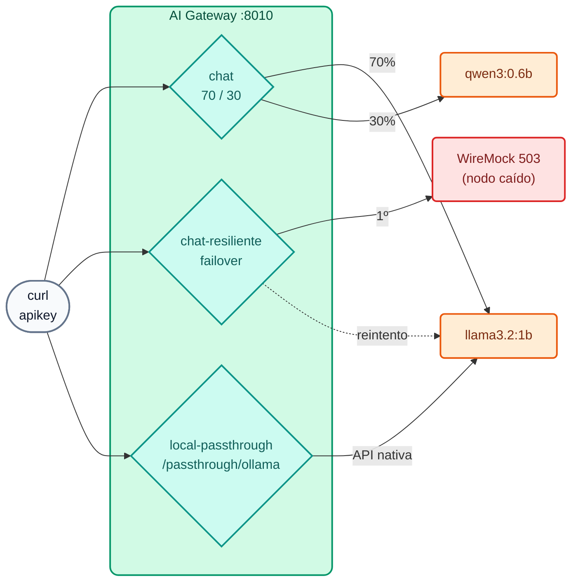

# Lab IA 01: Un endpoint, muchos LLMs — balanceo, failover y passthrough

En este laboratorio publicarás tus primeros **modelos virtuales**: un `chat` que reparte el tráfico entre dos modelos open-weight, un `chat-resiliente` que sobrevive a la caída de su proveedor principal y un `local-passthrough` que expone la API **nativa** de Ollama con el gobierno del gateway.



## Objetivos

- Entender modelo virtual, proveedor y target.
- Balancear entre dos modelos con pesos y verlo en el header `X-Kong-LLM-Model`.
- Comprobar un failover transparente ante un `503`.
- Usar el modo **passthrough** (2.2) con la API nativa de Ollama.
- Ejercicio: cambiar pesos y agregar un segundo alias al modelo.

---

## Paso 1: Revisar la configuración

Abre `workshop-assets/dia-4/config/lab_01_multi_llm.yaml`. Puntos clave:

```yaml
config:
  route:
    paths: [/v1]
    methods: [POST]
    model: {body_param: model, values: [chat]}   # el alias que envía la app en "model"
  model: {name_header: true}                     # devuelve X-Kong-LLM-Model
  balancer:
    algorithm: round-robin
    failover_criteria: [error, timeout, http_429, http_500, http_502, http_503]
    retries: 3
targets:
  - name: !env AIGW_MODELO_GENERAL                # llama3.2:1b
    provider: ollama
    weight: 70
    config: {type: ollama, upstream_url: !env AIGW_OLLAMA_CHAT_URL, max_tokens: 256, input_cost: 0.05, output_cost: 0.20}
  - name: !env AIGW_MODELO_CODIGO                 # qwen3:0.6b
    provider: ollama
    weight: 30
    ...
```

- `!env AIGW_MODELO_GENERAL` / `!env AIGW_OLLAMA_CHAT_URL`: kongctl toma los valores de variables de entorno que define `common.sh` (por eso puedes cambiar de modelo sin editar el YAML).
- `input_cost` / `output_cost`: "costo interno" **ilustrativo** (USD por 1M de tokens) para ver *chargeback* en Analytics en el Lab IA 08.
- En `chat-resiliente` el target principal (peso 100) tiene `upstream_url: http://wiremock:8080/proveedor-caido/api/chat`, que siempre responde `503`.

## Paso 2: Aplicar

```bash
./workshop-assets/dia-4/scripts/aplicar.sh 01 --diff     # verás la creación de 3 modelos
./workshop-assets/dia-4/scripts/aplicar.sh 01
source ~/.kong-workshop/aigw-lab/.env.generated
```

En Konnect → **Models**: aparecen `chat`, `chat-resiliente` y `local-passthrough` con sus targets.

## Paso 3: Sin credencial no hay IA

```bash
curl -s -o /dev/null -w "%{http_code}\n" http://localhost:8010/v1/chat/completions \
  -H "Content-Type: application/json" -d '{"model":"chat","messages":[{"role":"user","content":"hola"}]}'
```

**Resultado esperado:** `401`.

## Paso 4: Balanceo ponderado

```bash
for i in 1 2 3 4 5 6; do
  curl -s -D - -o /dev/null http://localhost:8010/v1/chat/completions \
    -H "apikey: $AIGW_KEY_EQUIPO_DATOS" -H "Content-Type: application/json" \
    -d '{"model":"chat","messages":[{"role":"user","content":"En una frase: ¿qué es una API?"}]}' \
    | grep -i x-kong-llm-model
done
```

**Resultado esperado:** la mayoría de las respuestas con `x-kong-llm-model: ollama/llama3.2:1b` y algunas con `ollama/qwen3:0.6b` (≈70/30; con 6 muestras la proporción es aproximada).

!!! note "Primera llamada lenta"
    La primera petición a cada modelo lo carga en memoria (puede tardar 10–30 s en CPU). Las siguientes son más rápidas (`OLLAMA_KEEP_ALIVE=30m`).

Mira también el cuerpo completo de una respuesta: formato OpenAI (`choices[0].message.content`) y `usage` con los tokens, aunque el backend sea Ollama.

```bash
curl -s http://localhost:8010/v1/chat/completions -H "apikey: $AIGW_KEY_EQUIPO_DATOS" -H "Content-Type: application/json" \
  -d '{"model":"chat","messages":[{"role":"user","content":"Di hola en una palabra"}]}' | jq '{model, usage, respuesta: .choices[0].message.content}'
```

## Paso 5: Failover transparente

```bash
# El nodo principal está caído (llamada directa al mock):
curl -s -o /dev/null -w "%{http_code}\n" -X POST http://localhost:8089/proveedor-caido/api/chat -d '{}'
# 503

# El cliente igual recibe respuesta:
curl -s -D - http://localhost:8010/v1/chat/completions \
  -H "apikey: $AIGW_KEY_EQUIPO_DATOS" -H "Content-Type: application/json" \
  -d '{"model":"chat-resiliente","messages":[{"role":"user","content":"Responde solo: el servicio está disponible"}]}' \
  | grep -iE "^HTTP|x-kong-llm-model"
```

**Resultado esperado:** `HTTP/1.1 200 OK` y `x-kong-llm-model: ollama/llama3.2:1b` (el target de respaldo).

## Paso 6: Passthrough (API nativa de Ollama)

```bash
# Sin apikey: el gobierno aplica igual
curl -s -o /dev/null -w "%{http_code}\n" http://localhost:8010/passthrough/ollama/api/chat \
  -H "Content-Type: application/json" -d '{"model":"llama3.2:1b","stream":false,"messages":[{"role":"user","content":"hola"}]}'
# 401

# Con apikey: respuesta en formato NATIVO de Ollama (.message, no .choices)
curl -s http://localhost:8010/passthrough/ollama/api/chat -H "apikey: $AIGW_KEY_EQUIPO_DATOS" \
  -H "Content-Type: application/json" \
  -d '{"model":"llama3.2:1b","stream":false,"messages":[{"role":"user","content":"Di hola en una palabra"}]}' | jq '.message'
```

**Resultado esperado:** un objeto `{"role": "assistant", "content": "..."}`: el body no se transformó.

## Paso 7: Ejercicio

Edita `workshop-assets/dia-4/config/lab_01_multi_llm.yaml`:

1. Cambia el reparto de `chat` a **50/50**.
2. Agrega un segundo alias **`asistente-general`** al modelo `chat` (desde 2.1, `route.model.values` admite varios alias).

Aplica (`aplicar.sh 01`) y verifica:

```bash
curl -s -D - -o /dev/null http://localhost:8010/v1/chat/completions -H "apikey: $AIGW_KEY_EQUIPO_DATOS" \
  -H "Content-Type: application/json" -d '{"model":"asistente-general","messages":[{"role":"user","content":"hola"}]}' | grep -iE "^HTTP|x-kong-llm-model"
```

**Resultado esperado:** `200` con el nuevo alias, y un reparto parejo entre los dos modelos al repetir el Paso 4.

??? tip "Solución"
    `workshop-assets/dia-4/soluciones/lab_01_multi_llm.yaml`:
    ```yaml
    model: {body_param: model, values: [chat, asistente-general]}
    ...
    weight: 50
    ...
    weight: 50
    ```
    Para aplicarla directamente: `./workshop-assets/dia-4/scripts/aplicar.sh 01 --solucion`

---

## Conclusión

La aplicación sólo conoce un alias (`chat`). Qué modelo responde, con qué peso y qué pasa si uno cae lo decide el gateway, y se cambia con un *pull request* sobre YAML. Lo mismo vale para modelos comerciales (Gemini, OpenAI, Claude) o para combinaciones locales + nube. Teoría: [Módulo IA 01](../dia-3-ai-gateway-teoria-y-demos/01-multi-llm/Guia_IA_01_Un_Endpoint_Muchos_LLMs.md). Siguiente: [Lab IA 02 — Gobierno](Lab_IA_02_Gobierno_Cuotas.md).
