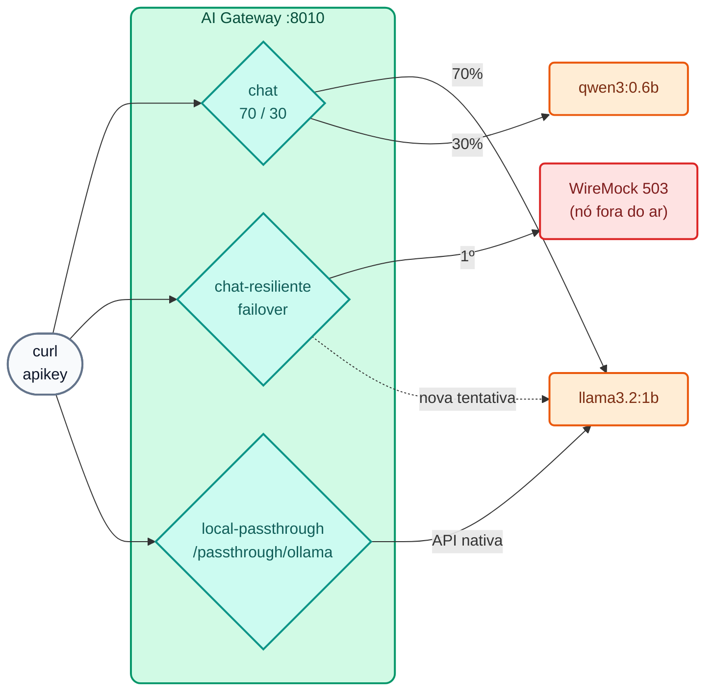

# Lab IA 01: Um endpoint, muitos LLMs — balanceamento, failover e passthrough

Neste laboratório você vai publicar os seus primeiros **modelos virtuais**: um `chat` que distribui o tráfego entre dois modelos open-weight, um `chat-resiliente` que sobrevive à queda do seu provedor principal e um `local-passthrough` que expõe a API **nativa** do Ollama com a governança do gateway.



## Objetivos

- Entender modelo virtual, provedor e target.
- Balancear entre dois modelos com pesos e ver isso no header `X-Kong-LLM-Model`.
- Comprovar um failover transparente diante de um `503`.
- Usar o modo **passthrough** (2.2) com a API nativa do Ollama.
- Exercício: alterar os pesos e adicionar um segundo alias ao modelo.

---

## Passo 1: Revisar a configuração

Abra `workshop-assets/dia-4/config/lab_01_multi_llm.yaml`. Pontos-chave:

```yaml
config:
  route:
    paths: [/v1]
    methods: [POST]
    model: {body_param: model, values: [chat]}   # o alias que a app envia em "model"
  model: {name_header: true}                     # devolve X-Kong-LLM-Model
  balancer:
    algorithm: round-robin
    failover_criteria: [error, timeout, http_429, http_500, http_502, http_503]
    retries: 3
targets:
  - name: !env AIGW_MODELO_GENERAL                # llama3.2:1b
    provider: ollama
    weight: 70
    config: {type: ollama, upstream_url: !env AIGW_OLLAMA_CHAT_URL, max_tokens: 256, input_cost: 0.05, output_cost: 0.20}
  - name: !env AIGW_MODELO_CODIGO                 # qwen3:0.6b
    provider: ollama
    weight: 30
    ...
```

- `!env AIGW_MODELO_GENERAL` / `!env AIGW_OLLAMA_CHAT_URL`: o kongctl obtém os valores de variáveis de ambiente definidas pelo `common.sh` (por isso você pode trocar de modelo sem editar o YAML).
- `input_cost` / `output_cost`: "custo interno" **ilustrativo** (USD por 1M de tokens) para ver o *chargeback* no Analytics no Lab IA 08.
- Em `chat-resiliente`, o target principal (peso 100) tem `upstream_url: http://wiremock:8080/proveedor-caido/api/chat`, que sempre responde `503`.

## Passo 2: Aplicar

```bash
./workshop-assets/dia-4/scripts/aplicar.sh 01 --diff     # você verá a criação de 3 modelos
./workshop-assets/dia-4/scripts/aplicar.sh 01
source ~/.kong-workshop/aigw-lab/.env.generated
```

No Konnect → **Models**: aparecem `chat`, `chat-resiliente` e `local-passthrough` com os seus targets.

## Passo 3: Sem credencial não há IA

```bash
curl -s -o /dev/null -w "%{http_code}\n" http://localhost:8010/v1/chat/completions \
  -H "Content-Type: application/json" -d '{"model":"chat","messages":[{"role":"user","content":"hola"}]}'
```

**Resultado esperado:** `401`.

## Passo 4: Balanceamento ponderado

```bash
for i in 1 2 3 4 5 6; do
  curl -s -D - -o /dev/null http://localhost:8010/v1/chat/completions \
    -H "apikey: $AIGW_KEY_EQUIPO_DATOS" -H "Content-Type: application/json" \
    -d '{"model":"chat","messages":[{"role":"user","content":"En una frase: ¿qué es una API?"}]}' \
    | grep -i x-kong-llm-model
done
```

**Resultado esperado:** a maioria das respostas com `x-kong-llm-model: ollama/llama3.2:1b` e algumas com `ollama/qwen3:0.6b` (≈70/30; com 6 amostras a proporção é aproximada).

!!! note "Primeira chamada lenta"
    A primeira requisição a cada modelo o carrega na memória (pode levar 10–30 s em CPU). As seguintes são mais rápidas (`OLLAMA_KEEP_ALIVE=30m`).

Veja também o corpo completo de uma resposta: formato OpenAI (`choices[0].message.content`) e `usage` com os tokens, mesmo que o backend seja o Ollama.

```bash
curl -s http://localhost:8010/v1/chat/completions -H "apikey: $AIGW_KEY_EQUIPO_DATOS" -H "Content-Type: application/json" \
  -d '{"model":"chat","messages":[{"role":"user","content":"Di hola en una palabra"}]}' | jq '{model, usage, respuesta: .choices[0].message.content}'
```

## Passo 5: Failover transparente

```bash
# O nó principal está fora do ar (chamada direta ao mock):
curl -s -o /dev/null -w "%{http_code}\n" -X POST http://localhost:8089/proveedor-caido/api/chat -d '{}'
# 503

# Mesmo assim, o cliente recebe resposta:
curl -s -D - http://localhost:8010/v1/chat/completions \
  -H "apikey: $AIGW_KEY_EQUIPO_DATOS" -H "Content-Type: application/json" \
  -d '{"model":"chat-resiliente","messages":[{"role":"user","content":"Responde solo: el servicio está disponible"}]}' \
  | grep -iE "^HTTP|x-kong-llm-model"
```

**Resultado esperado:** `HTTP/1.1 200 OK` e `x-kong-llm-model: ollama/llama3.2:1b` (o target de contingência).

## Passo 6: Passthrough (API nativa do Ollama)

```bash
# Sem apikey: a governança é aplicada do mesmo jeito
curl -s -o /dev/null -w "%{http_code}\n" http://localhost:8010/passthrough/ollama/api/chat \
  -H "Content-Type: application/json" -d '{"model":"llama3.2:1b","stream":false,"messages":[{"role":"user","content":"hola"}]}'
# 401

# Com apikey: resposta no formato NATIVO do Ollama (.message, não .choices)
curl -s http://localhost:8010/passthrough/ollama/api/chat -H "apikey: $AIGW_KEY_EQUIPO_DATOS" \
  -H "Content-Type: application/json" \
  -d '{"model":"llama3.2:1b","stream":false,"messages":[{"role":"user","content":"Di hola en una palabra"}]}' | jq '.message'
```

**Resultado esperado:** um objeto `{"role": "assistant", "content": "..."}`: o body não foi transformado.

## Passo 7: Exercício

Edite `workshop-assets/dia-4/config/lab_01_multi_llm.yaml`:

1. Altere a distribuição de `chat` para **50/50**.
2. Adicione um segundo alias **`asistente-general`** ao modelo `chat` (desde a 2.1, `route.model.values` aceita vários aliases).

Aplique (`aplicar.sh 01`) e verifique:

```bash
curl -s -D - -o /dev/null http://localhost:8010/v1/chat/completions -H "apikey: $AIGW_KEY_EQUIPO_DATOS" \
  -H "Content-Type: application/json" -d '{"model":"asistente-general","messages":[{"role":"user","content":"hola"}]}' | grep -iE "^HTTP|x-kong-llm-model"
```

**Resultado esperado:** `200` com o novo alias e uma distribuição equilibrada entre os dois modelos ao repetir o Passo 4.

??? tip "Solução"
    `workshop-assets/dia-4/soluciones/lab_01_multi_llm.yaml`:
    ```yaml
    model: {body_param: model, values: [chat, asistente-general]}
    ...
    weight: 50
    ...
    weight: 50
    ```
    Para aplicá-la diretamente: `./workshop-assets/dia-4/scripts/aplicar.sh 01 --solucion`

---

## Conclusão

A aplicação conhece apenas um alias (`chat`). Qual modelo responde, com qual peso e o que acontece se um deles cair é decidido pelo gateway, e muda-se com um *pull request* sobre YAML. O mesmo vale para modelos comerciais (Gemini, OpenAI, Claude) ou para combinações locais + nuvem. Teoria: [Módulo IA 01](../dia-3-ai-gateway-teoria-y-demos/01-multi-llm/Guia_IA_01_Un_Endpoint_Muchos_LLMs.md). Próximo: [Lab IA 02 — Governança](Lab_IA_02_Gobierno_Cuotas.md).
