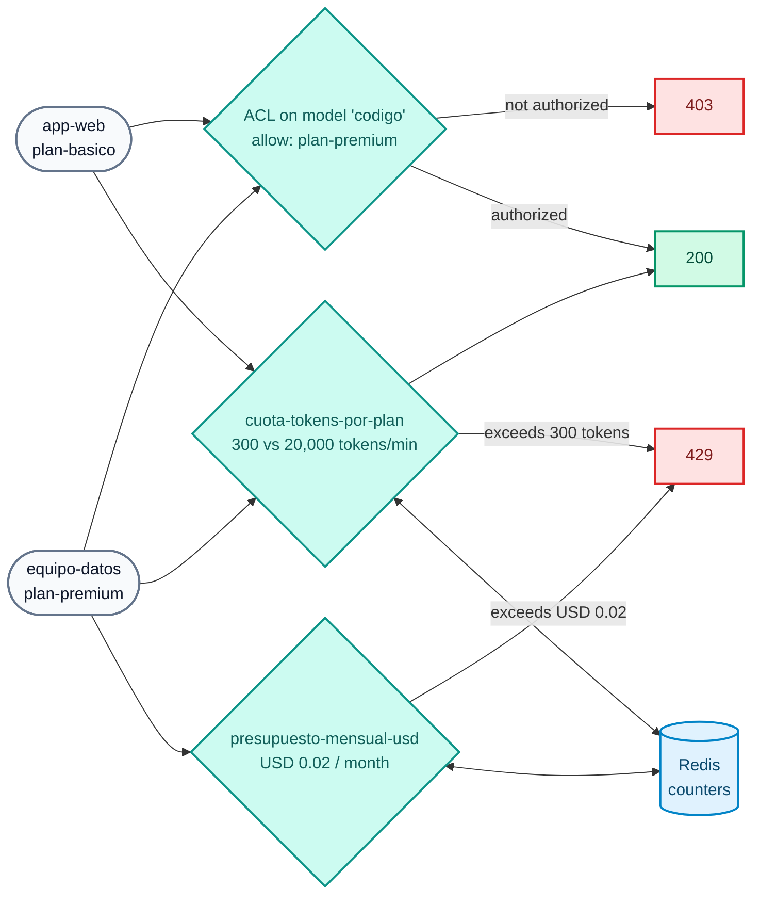

# AI Lab 02: Governance — per-model ACL, token quotas and USD budget

In this lab you will apply **identity and limits** to AI consumption: a premium model only for the premium plan, quotas measured in **tokens** (not requests) according to the consumer's plan, a per-**credential** quota (2.2) and a **monthly budget in dollars**.



## Objectives

- Restrict a model to a consumer group with `access.acls`.
- Limit consumption in **tokens** per plan with `ai-rate-limiting-advanced`.
- See the per-**credential** quota (`identifier: credential`, 2.2).
- Exhaust a **USD budget** (`tokens_count_strategy: cost`, monthly calendar window).
- Exercise: tighten the basic plan quota with two windows.

---

## Step 1: Review the configuration

`workshop-assets/dia-4/config/lab_02_gobierno_cuotas.yaml` declares 3 policies and 3 models:

| Model | ACL | Policies |
| :--- | :--- | :--- |
| `chat-cuotas` | everyone | `cuota-tokens-por-plan`, `cuota-tokens-por-credencial` |
| `codigo` | only `plan-premium` | `cuota-tokens-por-plan` |
| `chat-presupuesto` | everyone | `presupuesto-mensual-usd` |

Key fragments:

```yaml
# Per-plan quota: one counter per consumer (partition_by) within each group
policies:
  - match:
      - {type: consumer_group, values: [plan-basico]}
      - {type: consumer, partition_by: true}
    limits:
      - {limit: 300, window_size: 60}          # 300 tokens per minute (sliding window)

# Budget: the limit is MONEY, calculated with the target's input_cost/output_cost
tokens_count_strategy: cost
policies:
  - window_type: calendar
    timezone: America/Sao_Paulo
    match: [{type: consumer, partition_by: true}]
    limits:
      - {limit: 0.02, period: month, month_day: 1, tokens_count_strategy: cost}
```

!!! note "Why such a low budget?"
    `chat-presupuesto` declares an **illustrative** "frontier" model price (USD 20 / 80 per 1M input / output tokens) and a budget of **USD 0.02 per month**, so you can exhaust it in the lab with a couple of calls even though the real model is local and free.

## Step 2: Apply

```bash
./workshop-assets/dia-4/scripts/aplicar.sh 02
source ~/.kong-workshop/aigw-lab/.env.generated
```

## Step 3: Per-model ACL

```bash
for key in "$AIGW_KEY_APP_WEB" "$AIGW_KEY_EQUIPO_DATOS"; do
  curl -s -o /dev/null -w "%{http_code}\n" http://localhost:8010/v1/chat/completions \
    -H "apikey: $key" -H "Content-Type: application/json" \
    -d '{"model":"codigo","messages":[{"role":"user","content":"Escribe hola mundo en Python. Sólo el código."}]}'
done
```

**Expected result:** `403` for `app-web` (basic plan) and `200` for `equipo-datos` (premium plan).

## Step 4: Token quota per plan

Define a function to fire bursts of requests and inspect the rate limiting headers:

```bash
rafaga() {  # rafaga <apikey> <n>
  for i in $(seq 1 "$2"); do
    curl -s -D /tmp/h.txt -o /tmp/r.json http://localhost:8010/v1/chat/completions \
      -H "apikey: $1" -H "Content-Type: application/json" \
      -d '{"model":"chat-cuotas","messages":[{"role":"user","content":"Explica en 3 oraciones qué es una tasa de interés nominal anual."}]}'
    printf "#%s %s  tokens=%s\n" "$i" "$(head -1 /tmp/h.txt | tr -d '\r')" "$(jq -r '.usage.total_tokens // "-"' /tmp/r.json)"
    grep -i ratelimit /tmp/h.txt | tr -d '\r' | sed 's/^/     /'
  done
}
rafaga "$AIGW_KEY_APP_WEB" 6
```

**Expected result:**

- The first calls return `200` and consume ~100–300 tokens each.
- As soon as `app-web` exceeds **300 tokens in the last minute**, it receives `429` with the message `Cuota de tokens del plan agotada...` (plan token quota exhausted).
- The rate limiting headers show the limit and what remains **in tokens**.

Repeat with the premium plan:

```bash
rafaga "$AIGW_KEY_EQUIPO_DATOS" 6
```

**Expected result:** all `200` (limit 20,000 tokens/min).

!!! tip "The quota is per consumer within the plan"
    `partition_by: true` on `consumer` creates **one counter per consumer**. If there were two apps in `plan-basico`, each one would get its own 300 tokens/min.

## Step 5: Monthly budget in USD

```bash
for i in 1 2 3 4; do
  curl -s -o /tmp/r.json -w "#$i HTTP %{http_code}\n" http://localhost:8010/v1/chat/completions \
    -H "apikey: $AIGW_KEY_EQUIPO_DATOS" -H "Content-Type: application/json" \
    -d '{"model":"chat-presupuesto","messages":[{"role":"user","content":"Describe en 5 oraciones la diferencia entre TNA y TEA."}]}'
  jq -r '.error.message // .message // empty' /tmp/r.json
done
```

**Expected result:** the first 1–2 calls return `200`; after that, `429` with `Presupuesto mensual de IA agotado para: ...` (monthly AI budget exhausted for: ...). Even though `equipo-datos` has plenty of token quota left, **it ran out of money** for this model for the calendar month.

!!! warning "The budget stays exhausted until next month"
    It is a monthly **calendar** window. To reset the counters in your lab (in the lab only): `docker exec aigw-lab-redis redis-cli --scan | grep -viE 'kong_rag_injector|semantic|idx:'` lists the keys; you can delete them with `redis-cli DEL`.

## Step 6: Shared counters

```bash
docker exec aigw-lab-redis redis-cli --scan | grep -viE 'kong_rag_injector|semantic|idx:' | head
```

The counters live in Redis (`strategy: redis`, `sync_rate: 0`): with N Data Plane replicas, the quota is still a single one.

## Step 7: Exercise

Edit `lab_02_gobierno_cuotas.yaml`, policy `cuota-tokens-por-plan`, `plan-basico` block:

1. Lower the quota to **150 tokens per minute**.
2. Add a **second window** of **3,000 tokens per hour** (the `limits` list accepts multiple windows; the most restrictive one applies).

Apply and repeat `rafaga "$AIGW_KEY_APP_WEB" 4`: the `429` should arrive sooner.

??? tip "Solution"
    `workshop-assets/dia-4/soluciones/lab_02_gobierno_cuotas.yaml`:
    ```yaml
    limits:
      - {limit: 150, window_size: 60}
      - {limit: 3000, window_size: 3600}
    ```
    `./workshop-assets/dia-4/scripts/aplicar.sh 02 --solucion`

---

## Conclusion

With three declarative policies, each consumer has access only to the models in its plan, a cap on tokens per minute, a cap per API key and a monthly dollar budget. Theory: [AI Module 02](../dia-3-ai-gateway-teoria-y-demos/02-gobierno-y-cuotas/Guia_IA_02_Gobierno_Identidad_Cuotas.md). Next: [AI Lab 03 — Guardrails](Lab_IA_03_Guardrails.md).
