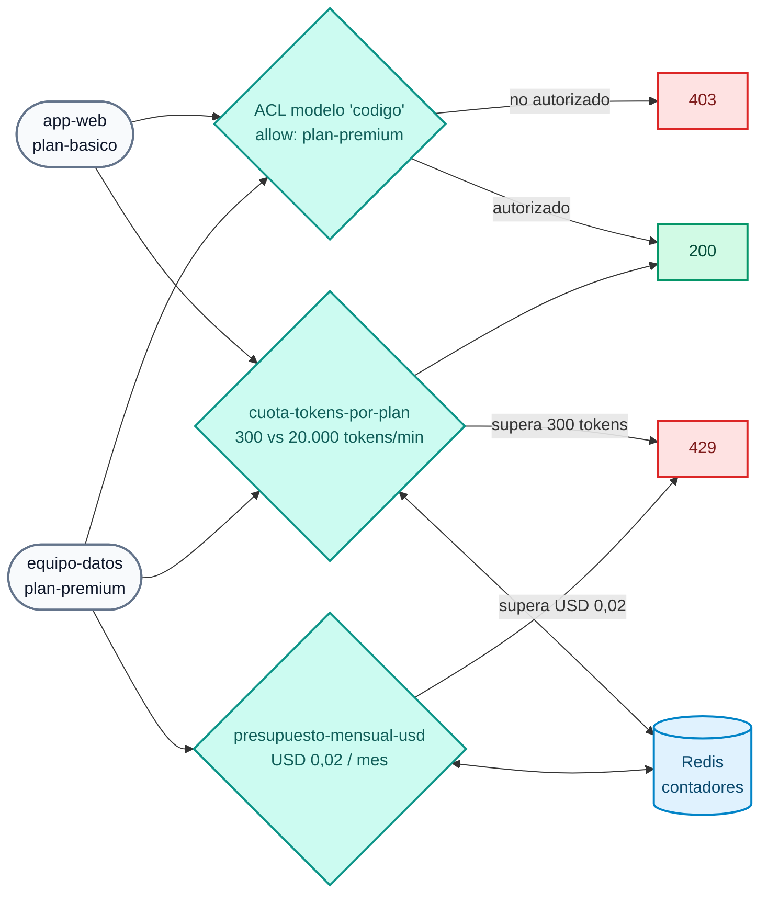

# Lab IA 02: Gobierno — ACL por modelo, cuotas de tokens y presupuesto en USD

En este laboratorio aplicarás **identidad y límites** al consumo de IA: un modelo premium sólo para el plan premium, cuotas medidas en **tokens** (no en peticiones) según el plan del consumidor, una cuota por **credencial** (2.2) y un **presupuesto mensual en dólares**.



## Objetivos

- Restringir un modelo a un consumer group con `access.acls`.
- Limitar el consumo en **tokens** por plan con `ai-rate-limiting-advanced`.
- Ver la cuota por **credencial** (`identifier: credential`, 2.2).
- Agotar un **presupuesto en USD** (`tokens_count_strategy: cost`, ventana calendario mensual).
- Ejercicio: endurecer la cuota del plan básico con dos ventanas.

---

## Paso 1: Revisar la configuración

`workshop-assets/dia-4/config/lab_02_gobierno_cuotas.yaml` declara 3 policies y 3 modelos:

| Modelo | ACL | Policies |
| :--- | :--- | :--- |
| `chat-cuotas` | todos | `cuota-tokens-por-plan`, `cuota-tokens-por-credencial` |
| `codigo` | sólo `plan-premium` | `cuota-tokens-por-plan` |
| `chat-presupuesto` | todos | `presupuesto-mensual-usd` |

Fragmentos clave:

```yaml
# Cuota por plan: un contador por consumer (partition_by) dentro de cada grupo
policies:
  - match:
      - {type: consumer_group, values: [plan-basico]}
      - {type: consumer, partition_by: true}
    limits:
      - {limit: 300, window_size: 60}          # 300 tokens por minuto (ventana deslizante)

# Presupuesto: el límite es DINERO, calculado con input_cost/output_cost del target
tokens_count_strategy: cost
policies:
  - window_type: calendar
    timezone: America/Sao_Paulo
    match: [{type: consumer, partition_by: true}]
    limits:
      - {limit: 0.02, period: month, month_day: 1, tokens_count_strategy: cost}
```

!!! note "¿Por qué un presupuesto tan bajo?"
    `chat-presupuesto` declara un precio **ilustrativo** de modelo "frontier" (USD 20 / 80 por 1M de tokens de entrada / salida) y un presupuesto de **USD 0,02 por mes**, para poder agotarlo en el lab con un par de llamadas aunque el modelo real sea local y gratuito.

## Paso 2: Aplicar

```bash
./workshop-assets/dia-4/scripts/aplicar.sh 02
source ~/.kong-workshop/aigw-lab/.env.generated
```

## Paso 3: ACL por modelo

```bash
for key in "$AIGW_KEY_APP_WEB" "$AIGW_KEY_EQUIPO_DATOS"; do
  curl -s -o /dev/null -w "%{http_code}\n" http://localhost:8010/v1/chat/completions \
    -H "apikey: $key" -H "Content-Type: application/json" \
    -d '{"model":"codigo","messages":[{"role":"user","content":"Escribe hola mundo en Python. Sólo el código."}]}'
done
```

**Resultado esperado:** `403` para `app-web` (plan básico) y `200` para `equipo-datos` (plan premium).

## Paso 4: Cuota de tokens por plan

Define una función para lanzar ráfagas y mirar las cabeceras de rate limiting:

```bash
rafaga() {  # rafaga <apikey> <n>
  for i in $(seq 1 "$2"); do
    curl -s -D /tmp/h.txt -o /tmp/r.json http://localhost:8010/v1/chat/completions \
      -H "apikey: $1" -H "Content-Type: application/json" \
      -d '{"model":"chat-cuotas","messages":[{"role":"user","content":"Explica en 3 oraciones qué es una tasa de interés nominal anual."}]}'
    printf "#%s %s  tokens=%s\n" "$i" "$(head -1 /tmp/h.txt | tr -d '\r')" "$(jq -r '.usage.total_tokens // "-"' /tmp/r.json)"
    grep -i ratelimit /tmp/h.txt | tr -d '\r' | sed 's/^/     /'
  done
}
rafaga "$AIGW_KEY_APP_WEB" 6
```

**Resultado esperado:**

- Las primeras llamadas devuelven `200` y consumen ~100–300 tokens cada una.
- En cuanto `app-web` supera **300 tokens en el último minuto**, recibe `429` con el mensaje `Cuota de tokens del plan agotada...`.
- Las cabeceras de rate limiting muestran el límite y lo que queda **en tokens**.

Repite con el plan premium:

```bash
rafaga "$AIGW_KEY_EQUIPO_DATOS" 6
```

**Resultado esperado:** todas `200` (límite 20.000 tokens/min).

!!! tip "La cuota es por consumer dentro del plan"
    `partition_by: true` sobre `consumer` crea **un contador por consumer**. Si hubiera dos apps en `plan-basico`, cada una tendría sus 300 tokens/min.

## Paso 5: Presupuesto mensual en USD

```bash
for i in 1 2 3 4; do
  curl -s -o /tmp/r.json -w "#$i HTTP %{http_code}\n" http://localhost:8010/v1/chat/completions \
    -H "apikey: $AIGW_KEY_EQUIPO_DATOS" -H "Content-Type: application/json" \
    -d '{"model":"chat-presupuesto","messages":[{"role":"user","content":"Describe en 5 oraciones la diferencia entre TNA y TEA."}]}'
  jq -r '.error.message // .message // empty' /tmp/r.json
done
```

**Resultado esperado:** las primeras 1–2 llamadas devuelven `200`; después `429` con `Presupuesto mensual de IA agotado para: ...`. Aunque `equipo-datos` tiene cuota de tokens de sobra, **se quedó sin dinero** para este modelo durante el mes calendario.

!!! warning "El presupuesto queda agotado hasta el próximo mes"
    Es una ventana **calendario** mensual. Para reiniciar los contadores en tu lab (sólo en el lab): `docker exec aigw-lab-redis redis-cli --scan | grep -viE 'kong_rag_injector|semantic|idx:'` muestra las claves; puedes borrarlas con `redis-cli DEL`.

## Paso 6: Contadores compartidos

```bash
docker exec aigw-lab-redis redis-cli --scan | grep -viE 'kong_rag_injector|semantic|idx:' | head
```

Los contadores viven en Redis (`strategy: redis`, `sync_rate: 0`): con N réplicas del Data Plane la cuota sigue siendo una sola.

## Paso 7: Ejercicio

Edita `lab_02_gobierno_cuotas.yaml`, policy `cuota-tokens-por-plan`, bloque del `plan-basico`:

1. Baja la cuota a **150 tokens por minuto**.
2. Agrega una **segunda ventana** de **3.000 tokens por hora** (la lista `limits` admite varias ventanas; se aplica la más restrictiva).

Aplica y repite `rafaga "$AIGW_KEY_APP_WEB" 4`: el `429` debe llegar antes.

??? tip "Solución"
    `workshop-assets/dia-4/soluciones/lab_02_gobierno_cuotas.yaml`:
    ```yaml
    limits:
      - {limit: 150, window_size: 60}
      - {limit: 3000, window_size: 3600}
    ```
    `./workshop-assets/dia-4/scripts/aplicar.sh 02 --solucion`

---

## Conclusión

Con tres policies declarativas cada consumidor tiene acceso sólo a los modelos de su plan, un tope de tokens por minuto, un tope por API key y un presupuesto en dólares por mes. Teoría: [Módulo IA 02](../dia-3-ai-gateway-teoria-y-demos/02-gobierno-y-cuotas/Guia_IA_02_Gobierno_Identidad_Cuotas.md). Siguiente: [Lab IA 03 — Guardrails](Lab_IA_03_Guardrails.md).
