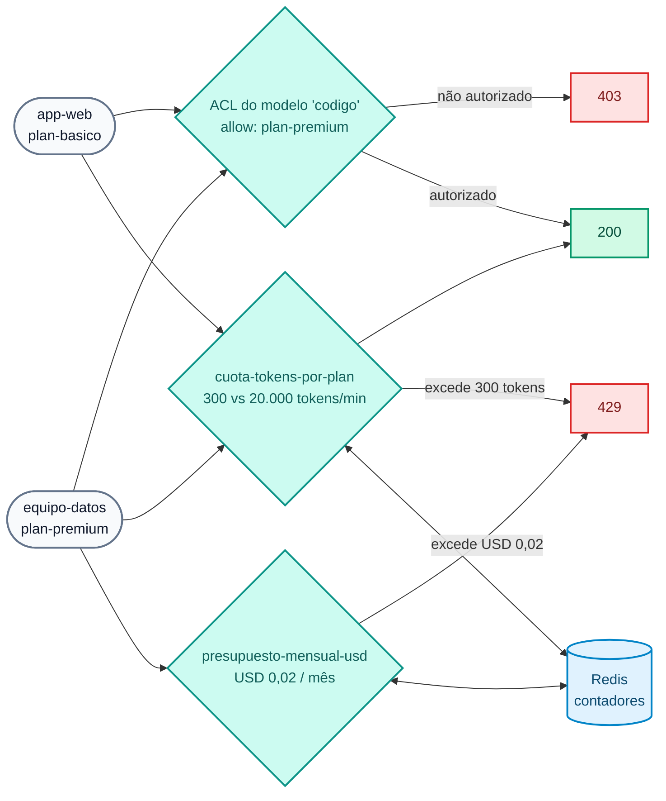

# Lab IA 02: Governança — ACL por modelo, cotas de tokens e orçamento em USD

Neste laboratório você vai aplicar **identidade e limites** ao consumo de IA: um modelo premium apenas para o plano premium, cotas medidas em **tokens** (não em requisições) de acordo com o plano do consumidor, uma cota por **credencial** (2.2) e um **orçamento mensal em dólares**.



## Objetivos

- Restringir um modelo a um consumer group com `access.acls`.
- Limitar o consumo em **tokens** por plano com `ai-rate-limiting-advanced`.
- Ver a cota por **credencial** (`identifier: credential`, 2.2).
- Esgotar um **orçamento em USD** (`tokens_count_strategy: cost`, janela de calendário mensal).
- Exercício: endurecer a cota do plano básico com duas janelas.

---

## Passo 1: Revisar a configuração

`workshop-assets/dia-4/config/lab_02_gobierno_cuotas.yaml` declara 3 policies e 3 modelos:

| Modelo | ACL | Policies |
| :--- | :--- | :--- |
| `chat-cuotas` | todos | `cuota-tokens-por-plan`, `cuota-tokens-por-credencial` |
| `codigo` | apenas `plan-premium` | `cuota-tokens-por-plan` |
| `chat-presupuesto` | todos | `presupuesto-mensual-usd` |

Trechos-chave:

```yaml
# Cota por plano: um contador por consumer (partition_by) dentro de cada grupo
policies:
  - match:
      - {type: consumer_group, values: [plan-basico]}
      - {type: consumer, partition_by: true}
    limits:
      - {limit: 300, window_size: 60}          # 300 tokens por minuto (janela deslizante)

# Orçamento: o limite é DINHEIRO, calculado com input_cost/output_cost do target
tokens_count_strategy: cost
policies:
  - window_type: calendar
    timezone: America/Sao_Paulo
    match: [{type: consumer, partition_by: true}]
    limits:
      - {limit: 0.02, period: month, month_day: 1, tokens_count_strategy: cost}
```

!!! note "Por que um orçamento tão baixo?"
    `chat-presupuesto` declara um preço **ilustrativo** de modelo "frontier" (USD 20 / 80 por 1M de tokens de entrada / saída) e um orçamento de **USD 0,02 por mês**, para que seja possível esgotá-lo no lab com algumas poucas chamadas, mesmo que o modelo real seja local e gratuito.

## Passo 2: Aplicar

```bash
./workshop-assets/dia-4/scripts/aplicar.sh 02
source ~/.kong-workshop/aigw-lab/.env.generated
```

## Passo 3: ACL por modelo

```bash
for key in "$AIGW_KEY_APP_WEB" "$AIGW_KEY_EQUIPO_DATOS"; do
  curl -s -o /dev/null -w "%{http_code}\n" http://localhost:8010/v1/chat/completions \
    -H "apikey: $key" -H "Content-Type: application/json" \
    -d '{"model":"codigo","messages":[{"role":"user","content":"Escribe hola mundo en Python. Sólo el código."}]}'
done
```

**Resultado esperado:** `403` para `app-web` (plano básico) e `200` para `equipo-datos` (plano premium).

## Passo 4: Cota de tokens por plano

Defina uma função para disparar rajadas e observar os cabeçalhos de rate limiting:

```bash
rafaga() {  # rafaga <apikey> <n>
  for i in $(seq 1 "$2"); do
    curl -s -D /tmp/h.txt -o /tmp/r.json http://localhost:8010/v1/chat/completions \
      -H "apikey: $1" -H "Content-Type: application/json" \
      -d '{"model":"chat-cuotas","messages":[{"role":"user","content":"Explica en 3 oraciones qué es una tasa de interés nominal anual."}]}'
    printf "#%s %s  tokens=%s\n" "$i" "$(head -1 /tmp/h.txt | tr -d '\r')" "$(jq -r '.usage.total_tokens // "-"' /tmp/r.json)"
    grep -i ratelimit /tmp/h.txt | tr -d '\r' | sed 's/^/     /'
  done
}
rafaga "$AIGW_KEY_APP_WEB" 6
```

**Resultado esperado:**

- As primeiras chamadas devolvem `200` e consomem ~100–300 tokens cada uma.
- Assim que `app-web` ultrapassa **300 tokens no último minuto**, recebe `429` com a mensagem `Cuota de tokens del plan agotada...` (cota de tokens do plano esgotada).
- Os cabeçalhos de rate limiting mostram o limite e o que resta **em tokens**.

Repita com o plano premium:

```bash
rafaga "$AIGW_KEY_EQUIPO_DATOS" 6
```

**Resultado esperado:** todas `200` (limite de 20.000 tokens/min).

!!! tip "A cota é por consumer dentro do plano"
    `partition_by: true` sobre `consumer` cria **um contador por consumer**. Se houvesse duas apps em `plan-basico`, cada uma teria os seus próprios 300 tokens/min.

## Passo 5: Orçamento mensal em USD

```bash
for i in 1 2 3 4; do
  curl -s -o /tmp/r.json -w "#$i HTTP %{http_code}\n" http://localhost:8010/v1/chat/completions \
    -H "apikey: $AIGW_KEY_EQUIPO_DATOS" -H "Content-Type: application/json" \
    -d '{"model":"chat-presupuesto","messages":[{"role":"user","content":"Describe en 5 oraciones la diferencia entre TNA y TEA."}]}'
  jq -r '.error.message // .message // empty' /tmp/r.json
done
```

**Resultado esperado:** as primeiras 1–2 chamadas devolvem `200`; depois, `429` com `Presupuesto mensual de IA agotado para: ...` (orçamento mensal de IA esgotado para: ...). Embora `equipo-datos` tenha cota de tokens de sobra, **ficou sem dinheiro** para este modelo durante o mês calendário.

!!! warning "O orçamento fica esgotado até o próximo mês"
    É uma janela de **calendário** mensal. Para reiniciar os contadores no seu lab (apenas no lab): `docker exec aigw-lab-redis redis-cli --scan | grep -viE 'kong_rag_injector|semantic|idx:'` mostra as chaves; você pode apagá-las com `redis-cli DEL`.

## Passo 6: Contadores compartilhados

```bash
docker exec aigw-lab-redis redis-cli --scan | grep -viE 'kong_rag_injector|semantic|idx:' | head
```

Os contadores ficam no Redis (`strategy: redis`, `sync_rate: 0`): com N réplicas do Data Plane, a cota continua sendo uma só.

## Passo 7: Exercício

Edite `lab_02_gobierno_cuotas.yaml`, policy `cuota-tokens-por-plan`, bloco do `plan-basico`:

1. Reduza a cota para **150 tokens por minuto**.
2. Adicione uma **segunda janela** de **3.000 tokens por hora** (a lista `limits` aceita várias janelas; aplica-se a mais restritiva).

Aplique e repita `rafaga "$AIGW_KEY_APP_WEB" 4`: o `429` deve chegar antes.

??? tip "Solução"
    `workshop-assets/dia-4/soluciones/lab_02_gobierno_cuotas.yaml`:
    ```yaml
    limits:
      - {limit: 150, window_size: 60}
      - {limit: 3000, window_size: 3600}
    ```
    `./workshop-assets/dia-4/scripts/aplicar.sh 02 --solucion`

---

## Conclusão

Com três policies declarativas, cada consumidor tem acesso apenas aos modelos do seu plano, um teto de tokens por minuto, um teto por API key e um orçamento em dólares por mês. Teoria: [Módulo IA 02](../dia-3-ai-gateway-teoria-y-demos/02-gobierno-y-cuotas/Guia_IA_02_Gobierno_Identidad_Cuotas.md). Próximo: [Lab IA 03 — Guardrails](Lab_IA_03_Guardrails.md).
