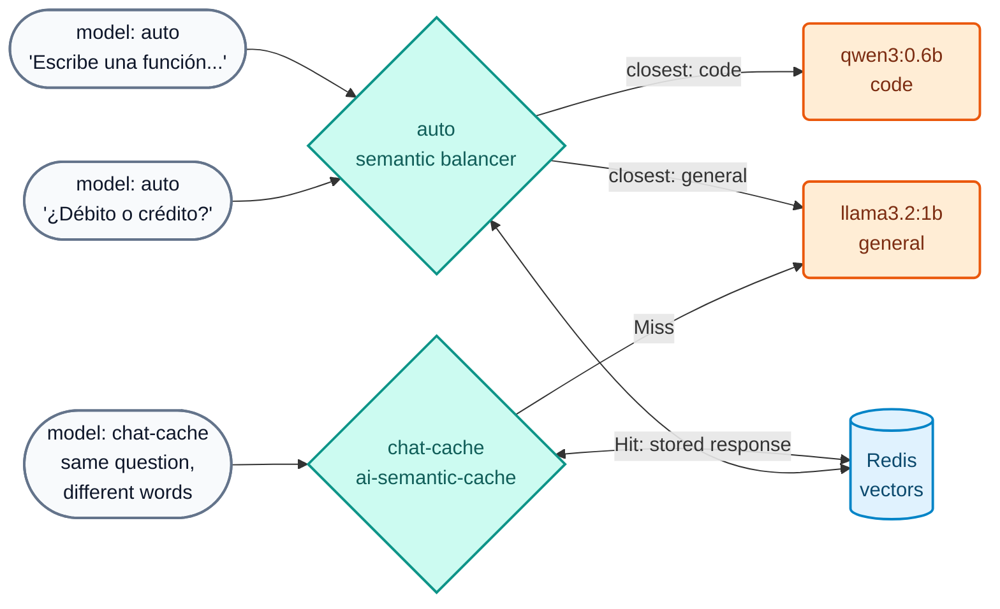

# AI Lab 04: Semantics — semantic routing and semantic cache

In this lab the gateway will use the **meaning** of prompts for two things: choosing the right model (`auto`) and answering equivalent questions from **cache** even when they are worded differently (`chat-cache`). All of it with local embeddings (`nomic-embed-text`) and Redis.



## Objectives

- Configure a model with `balancer.algorithm: semantic` and verify which target each prompt goes to.
- Configure `ai-semantic-cache` and observe `X-Cache-Status` (Miss / Hit) and the latency difference.
- Understand why vectors must be deleted when descriptions change.
- Exercise: adjust the TTL and enrich a `semantic_description`.

---

## Step 1: Review the configuration

`workshop-assets/dia-4/config/lab_04_semantica_cache.yaml`:

- Model **`auto`**: two targets with `semantic_description` (code → `AIGW_MODELO_CODIGO`; general banking questions → `AIGW_MODELO_GENERAL`). `nomic-embed-text` embeddings (768 dims), `threshold: 0.75`, vectors in Redis.
- Policy **`cache-semantica`** attached to the **`chat-cache`** model: `cache_ttl: 3600`, `threshold: 0.5`, `ignore_system_prompts: true`, `stop_on_failure: false`.

## Step 2: Apply

```bash
./workshop-assets/dia-4/scripts/aplicar.sh 04
source ~/.kong-workshop/aigw-lab/.env.generated
```

## Step 3: The prompt chooses the model

```bash
auto() {  # auto "<text>"
  curl -s -D - -o /tmp/r.json http://localhost:8010/v1/chat/completions \
    -H "apikey: $AIGW_KEY_EQUIPO_DATOS" -H "Content-Type: application/json" \
    -d "$(jq -cn --arg p "$1" '{model:"auto",messages:[{role:"user",content:$p}]}')" | grep -iE "^HTTP|x-kong-llm-model"
}
auto "Escribe una función en Python que valide un número de cuenta con dígito verificador módulo 11."
auto "¿Qué diferencia hay entre una tarjeta de débito y una de crédito? Responde breve."
auto "Genera una consulta SQL que sume los montos de transferencias por cliente."
auto "¿Qué es una transferencia inmediata?"
```

**Expected result:**

| Prompt | `X-Kong-LLM-Model` |
| :--- | :--- |
| Python function | `ollama/qwen3:0.6b` |
| Debit vs credit | `ollama/llama3.2:1b` |
| SQL query | `ollama/qwen3:0.6b` |
| Instant transfer | `ollama/llama3.2:1b` |

!!! note "Small models, gateway decision"
    The **routing decision** is made by the gateway using embeddings, not by the LLM: even though the models are small, routing works the same as with frontier models. In production the code target would be, for example, Claude, and the general one an inexpensive model (see `codigo-frontier` in the instructor demo).

Look at the routing vectors in Redis:

```bash
docker exec aigw-lab-redis redis-cli --scan --pattern 'semantic_routing:*' | head
```

## Step 4: Semantic cache

```bash
cache() {  # cache "<text>"
  curl -s -D - -o /dev/null -w "tiempo: %{time_total}s\n" http://localhost:8010/v1/chat/completions \
    -H "apikey: $AIGW_KEY_EQUIPO_DATOS" -H "Content-Type: application/json" \
    -d "$(jq -cn --arg p "$1" '{model:"chat-cache",messages:[{role:"user",content:$p}]}')" | grep -iE "x-cache-status|tiempo"
}
N=$(date +%s)   # makes this run's questions unique
cache "Ref $N. ¿Cuál es el puerto por defecto de PostgreSQL?"
sleep 2
cache "Ref $N. ¿Qué port usa por defecto una base de datos postgres?"
cache "Ref $N. ¿Cómo funciona el garbage collector de Java? Muy breve."
```

**Expected result:**

| # | `X-Cache-Status` | Time (`tiempo`) |
| :--- | :--- | :--- |
| 1 | `Miss` | seconds (went to the LLM) |
| 2 | `Hit` | milliseconds, **0 tokens** (different words, same meaning) |
| 3 | `Miss` | seconds (different question) |

## Step 5: Exercise

Edit `lab_04_semantica_cache.yaml`:

1. Reduce the cache TTL to **600 seconds**.
2. Enrich the `semantic_description` of the **code** target by adding: *"Expresiones regulares, COBOL, validación de CBU/IBAN."* (regular expressions, COBOL, CBU/IBAN validation).

Since you changed a description, **delete the routing vectors** (otherwise the DP would keep using the old ones):

```bash
./workshop-assets/dia-4/scripts/aplicar.sh 04
./workshop-assets/dia-4/scripts/reset_vectores.sh
auto "Dame una expresión regular que valide un IBAN español."
```

**Expected result:** `x-kong-llm-model: ollama/qwen3:0.6b`.

??? tip "Solution"
    `workshop-assets/dia-4/soluciones/lab_04_semantica_cache.yaml`:
    ```yaml
    cache_ttl: 600
    ...
    semantic_description: >-
      Escribir o corregir código. Generar una función, un script, una consulta SQL,
      endpoints REST, pruebas unitarias o la estructura de un proyecto. Write code.
      Expresiones regulares, COBOL, validación de CBU/IBAN.
    ```
    `./workshop-assets/dia-4/scripts/aplicar.sh 04 --solucion && ./workshop-assets/dia-4/scripts/reset_vectores.sh`

!!! warning "Cache and customer data"
    Do not attach the semantic cache to models that answer about a specific customer's data (balances, transactions): a cached response could be served to another user with a similar question. Use it for general information (fees, opening hours, procedures).

---

## Conclusion

With local embeddings the gateway chooses the model by meaning and avoids repeated calls to the LLM: lower cost and lower latency without changing the app. Prompt compression with Headroom (tech preview) completes this block in the instructor demo of [AI Module 04](../dia-3-ai-gateway-teoria-y-demos/04-semantica/Guia_IA_04_Ruteo_Semantico_Cache_Compresion.md). Next: [AI Lab 05 — RAG](Lab_IA_05_RAG.md).
