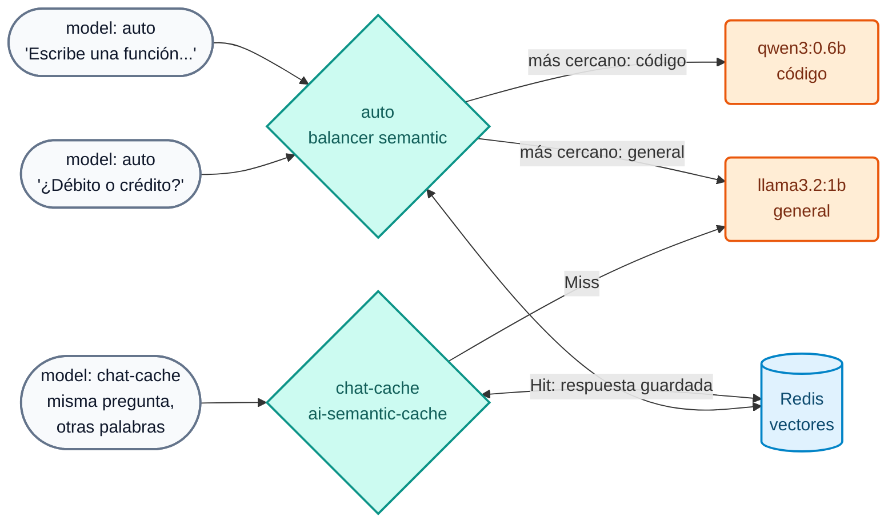

# Lab IA 04: Semántica — ruteo semántico y caché semántica

En este laboratorio el gateway usará el **significado** de los prompts para dos cosas: elegir el modelo adecuado (`auto`) y responder desde **caché** preguntas equivalentes aunque estén escritas con otras palabras (`chat-cache`). Todo con embeddings locales (`nomic-embed-text`) y Redis.



## Objetivos

- Configurar un modelo con `balancer.algorithm: semantic` y verificar a qué target va cada prompt.
- Configurar `ai-semantic-cache` y observar `X-Cache-Status` (Miss / Hit) y la diferencia de latencia.
- Entender por qué hay que borrar vectores al cambiar descripciones.
- Ejercicio: ajustar TTL y enriquecer una `semantic_description`.

---

## Paso 1: Revisar la configuración

`workshop-assets/dia-4/config/lab_04_semantica_cache.yaml`:

- Modelo **`auto`**: dos targets con `semantic_description` (código → `AIGW_MODELO_CODIGO`; preguntas generales de banca → `AIGW_MODELO_GENERAL`). Embeddings `nomic-embed-text` (768 dims), `threshold: 0.75`, vectores en Redis.
- Policy **`cache-semantica`** asociada al modelo **`chat-cache`**: `cache_ttl: 3600`, `threshold: 0.5`, `ignore_system_prompts: true`, `stop_on_failure: false`.

## Paso 2: Aplicar

```bash
./workshop-assets/dia-4/scripts/aplicar.sh 04
source ~/.kong-workshop/aigw-lab/.env.generated
```

## Paso 3: El prompt elige el modelo

```bash
auto() {  # auto "<texto>"
  curl -s -D - -o /tmp/r.json http://localhost:8010/v1/chat/completions \
    -H "apikey: $AIGW_KEY_EQUIPO_DATOS" -H "Content-Type: application/json" \
    -d "$(jq -cn --arg p "$1" '{model:"auto",messages:[{role:"user",content:$p}]}')" | grep -iE "^HTTP|x-kong-llm-model"
}
auto "Escribe una función en Python que valide un número de cuenta con dígito verificador módulo 11."
auto "¿Qué diferencia hay entre una tarjeta de débito y una de crédito? Responde breve."
auto "Genera una consulta SQL que sume los montos de transferencias por cliente."
auto "¿Qué es una transferencia inmediata?"
```

**Resultado esperado:**

| Prompt | `X-Kong-LLM-Model` |
| :--- | :--- |
| Función Python | `ollama/qwen3:0.6b` |
| Débito vs crédito | `ollama/llama3.2:1b` |
| Consulta SQL | `ollama/qwen3:0.6b` |
| Transferencia inmediata | `ollama/llama3.2:1b` |

!!! note "Modelos pequeños, decisión del gateway"
    La **decisión de ruteo** la toma el gateway con embeddings, no el LLM: aunque los modelos sean pequeños, el ruteo funciona igual que con modelos frontier. En producción el target de código sería, por ejemplo, Claude, y el general un modelo económico (ver `codigo-frontier` en la demo del instructor).

Mira los vectores de enrutamiento en Redis:

```bash
docker exec aigw-lab-redis redis-cli --scan --pattern 'semantic_routing:*' | head
```

## Paso 4: Caché semántica

```bash
cache() {  # cache "<texto>"
  curl -s -D - -o /dev/null -w "tiempo: %{time_total}s\n" http://localhost:8010/v1/chat/completions \
    -H "apikey: $AIGW_KEY_EQUIPO_DATOS" -H "Content-Type: application/json" \
    -d "$(jq -cn --arg p "$1" '{model:"chat-cache",messages:[{role:"user",content:$p}]}')" | grep -iE "x-cache-status|tiempo"
}
N=$(date +%s)   # hace únicas las preguntas de esta ejecución
cache "Ref $N. ¿Cuál es el puerto por defecto de PostgreSQL?"
sleep 2
cache "Ref $N. ¿Qué port usa por defecto una base de datos postgres?"
cache "Ref $N. ¿Cómo funciona el garbage collector de Java? Muy breve."
```

**Resultado esperado:**

| # | `X-Cache-Status` | Tiempo |
| :--- | :--- | :--- |
| 1 | `Miss` | segundos (fue al LLM) |
| 2 | `Hit` | milisegundos, **0 tokens** (otras palabras, mismo significado) |
| 3 | `Miss` | segundos (pregunta distinta) |

## Paso 5: Ejercicio

Edita `lab_04_semantica_cache.yaml`:

1. Reduce el TTL de la caché a **600 segundos**.
2. Enriquece la `semantic_description` del target de **código** agregando: *"Expresiones regulares, COBOL, validación de CBU/IBAN."*

Como cambiaste una descripción, **borra los vectores de enrutamiento** (si no, el DP seguiría usando los anteriores):

```bash
./workshop-assets/dia-4/scripts/aplicar.sh 04
./workshop-assets/dia-4/scripts/reset_vectores.sh
auto "Dame una expresión regular que valide un IBAN español."
```

**Resultado esperado:** `x-kong-llm-model: ollama/qwen3:0.6b`.

??? tip "Solución"
    `workshop-assets/dia-4/soluciones/lab_04_semantica_cache.yaml`:
    ```yaml
    cache_ttl: 600
    ...
    semantic_description: >-
      Escribir o corregir código. Generar una función, un script, una consulta SQL,
      endpoints REST, pruebas unitarias o la estructura de un proyecto. Write code.
      Expresiones regulares, COBOL, validación de CBU/IBAN.
    ```
    `./workshop-assets/dia-4/scripts/aplicar.sh 04 --solucion && ./workshop-assets/dia-4/scripts/reset_vectores.sh`

!!! warning "Caché y datos de clientes"
    No asocies la caché semántica a modelos que respondan sobre datos de un cliente concreto (saldos, movimientos): una respuesta cacheada podría servirse a otro usuario con una pregunta parecida. Úsala para información general (tarifas, horarios, procedimientos).

---

## Conclusión

Con embeddings locales el gateway decide el modelo por significado y evita llamadas repetidas al LLM: menos costo y menos latencia sin cambiar la app. La compresión de prompts con Headroom (tech preview) completa este bloque en la demo del instructor del [Módulo IA 04](../dia-3-ai-gateway-teoria-y-demos/04-semantica/Guia_IA_04_Ruteo_Semantico_Cache_Compresion.md). Siguiente: [Lab IA 05 — RAG](Lab_IA_05_RAG.md).
