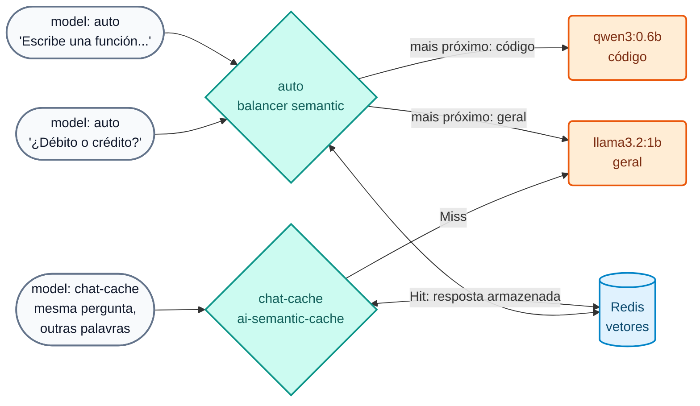

# Lab IA 04: Semântica — roteamento semântico e cache semântico

Neste laboratório, o gateway vai usar o **significado** dos prompts para duas coisas: escolher o modelo adequado (`auto`) e responder a partir do **cache** perguntas equivalentes, mesmo que escritas com outras palavras (`chat-cache`). Tudo com embeddings locais (`nomic-embed-text`) e Redis.



## Objetivos

- Configurar um modelo com `balancer.algorithm: semantic` e verificar para qual target vai cada prompt.
- Configurar `ai-semantic-cache` e observar `X-Cache-Status` (Miss / Hit) e a diferença de latência.
- Entender por que é preciso apagar os vetores ao alterar descrições.
- Exercício: ajustar o TTL e enriquecer uma `semantic_description`.

---

## Passo 1: Revisar a configuração

`workshop-assets/dia-4/config/lab_04_semantica_cache.yaml`:

- Modelo **`auto`**: dois targets com `semantic_description` (código → `AIGW_MODELO_CODIGO`; perguntas gerais de banco → `AIGW_MODELO_GENERAL`). Embeddings `nomic-embed-text` (768 dims), `threshold: 0.75`, vetores no Redis.
- Policy **`cache-semantica`** associada ao modelo **`chat-cache`**: `cache_ttl: 3600`, `threshold: 0.5`, `ignore_system_prompts: true`, `stop_on_failure: false`.

## Passo 2: Aplicar

```bash
./workshop-assets/dia-4/scripts/aplicar.sh 04
source ~/.kong-workshop/aigw-lab/.env.generated
```

## Passo 3: O prompt escolhe o modelo

```bash
auto() {  # auto "<texto>"
  curl -s -D - -o /tmp/r.json http://localhost:8010/v1/chat/completions \
    -H "apikey: $AIGW_KEY_EQUIPO_DATOS" -H "Content-Type: application/json" \
    -d "$(jq -cn --arg p "$1" '{model:"auto",messages:[{role:"user",content:$p}]}')" | grep -iE "^HTTP|x-kong-llm-model"
}
auto "Escribe una función en Python que valide un número de cuenta con dígito verificador módulo 11."
auto "¿Qué diferencia hay entre una tarjeta de débito y una de crédito? Responde breve."
auto "Genera una consulta SQL que sume los montos de transferencias por cliente."
auto "¿Qué es una transferencia inmediata?"
```

**Resultado esperado:**

| Prompt | `X-Kong-LLM-Model` |
| :--- | :--- |
| Função Python | `ollama/qwen3:0.6b` |
| Débito vs crédito | `ollama/llama3.2:1b` |
| Consulta SQL | `ollama/qwen3:0.6b` |
| Transferência imediata | `ollama/llama3.2:1b` |

!!! note "Modelos pequenos, decisão do gateway"
    A **decisão de roteamento** é tomada pelo gateway com embeddings, não pelo LLM: mesmo que os modelos sejam pequenos, o roteamento funciona igual ao de modelos frontier. Em produção, o target de código seria, por exemplo, o Claude, e o geral um modelo econômico (veja `codigo-frontier` na demo do instrutor).

Veja os vetores de roteamento no Redis:

```bash
docker exec aigw-lab-redis redis-cli --scan --pattern 'semantic_routing:*' | head
```

## Passo 4: Cache semântico

```bash
cache() {  # cache "<texto>"
  curl -s -D - -o /dev/null -w "tiempo: %{time_total}s\n" http://localhost:8010/v1/chat/completions \
    -H "apikey: $AIGW_KEY_EQUIPO_DATOS" -H "Content-Type: application/json" \
    -d "$(jq -cn --arg p "$1" '{model:"chat-cache",messages:[{role:"user",content:$p}]}')" | grep -iE "x-cache-status|tiempo"
}
N=$(date +%s)   # torna únicas as perguntas desta execução
cache "Ref $N. ¿Cuál es el puerto por defecto de PostgreSQL?"
sleep 2
cache "Ref $N. ¿Qué port usa por defecto una base de datos postgres?"
cache "Ref $N. ¿Cómo funciona el garbage collector de Java? Muy breve."
```

**Resultado esperado:**

| # | `X-Cache-Status` | Tempo |
| :--- | :--- | :--- |
| 1 | `Miss` | segundos (foi ao LLM) |
| 2 | `Hit` | milissegundos, **0 tokens** (outras palavras, mesmo significado) |
| 3 | `Miss` | segundos (pergunta diferente) |

## Passo 5: Exercício

Edite `lab_04_semantica_cache.yaml`:

1. Reduza o TTL do cache para **600 segundos**.
2. Enriqueça a `semantic_description` do target de **código** adicionando: *"Expresiones regulares, COBOL, validación de CBU/IBAN."* (expressões regulares, COBOL, validação de CBU/IBAN).

Como você alterou uma descrição, **apague os vetores de roteamento** (caso contrário, o DP continuaria usando os anteriores):

```bash
./workshop-assets/dia-4/scripts/aplicar.sh 04
./workshop-assets/dia-4/scripts/reset_vectores.sh
auto "Dame una expresión regular que valide un IBAN español."
```

**Resultado esperado:** `x-kong-llm-model: ollama/qwen3:0.6b`.

??? tip "Solução"
    `workshop-assets/dia-4/soluciones/lab_04_semantica_cache.yaml`:
    ```yaml
    cache_ttl: 600
    ...
    semantic_description: >-
      Escribir o corregir código. Generar una función, un script, una consulta SQL,
      endpoints REST, pruebas unitarias o la estructura de un proyecto. Write code.
      Expresiones regulares, COBOL, validación de CBU/IBAN.
    ```
    `./workshop-assets/dia-4/scripts/aplicar.sh 04 --solucion && ./workshop-assets/dia-4/scripts/reset_vectores.sh`

!!! warning "Cache e dados de clientes"
    Não associe o cache semântico a modelos que respondem sobre dados de um cliente específico (saldos, extratos): uma resposta em cache poderia ser servida a outro usuário com uma pergunta parecida. Use-o para informações gerais (tarifas, horários, procedimentos).

---

## Conclusão

Com embeddings locais, o gateway decide o modelo pelo significado e evita chamadas repetidas ao LLM: menos custo e menos latência sem alterar a app. A compressão de prompts com Headroom (tech preview) completa este bloco na demo do instrutor do [Módulo IA 04](../dia-3-ai-gateway-teoria-y-demos/04-semantica/Guia_IA_04_Ruteo_Semantico_Cache_Compresion.md). Próximo: [Lab IA 05 — RAG](Lab_IA_05_RAG.md).
